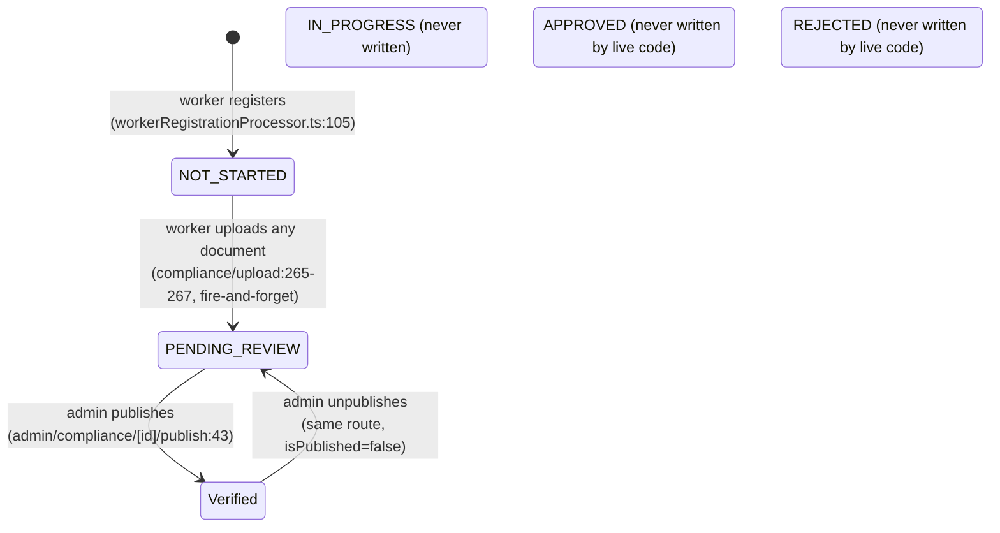
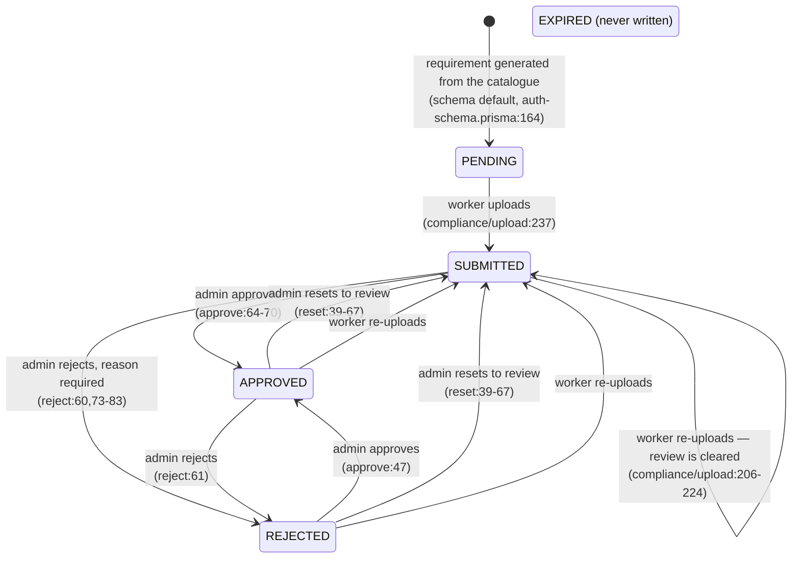
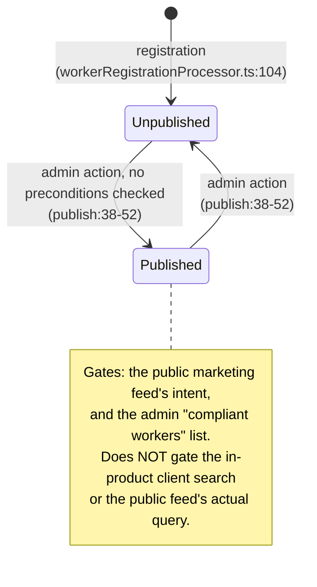
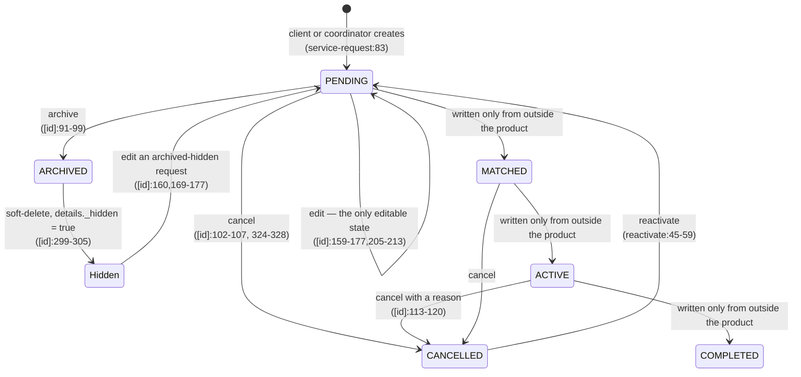
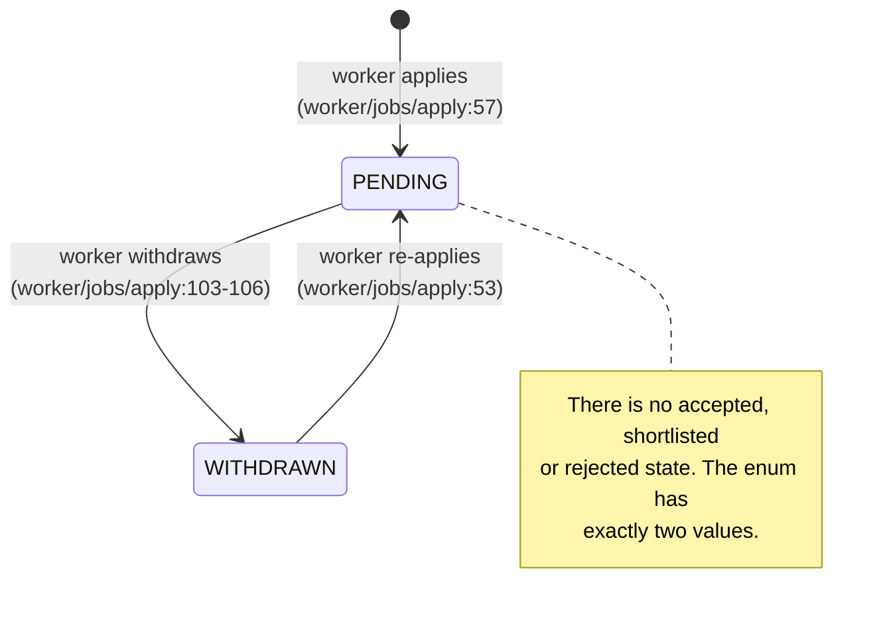
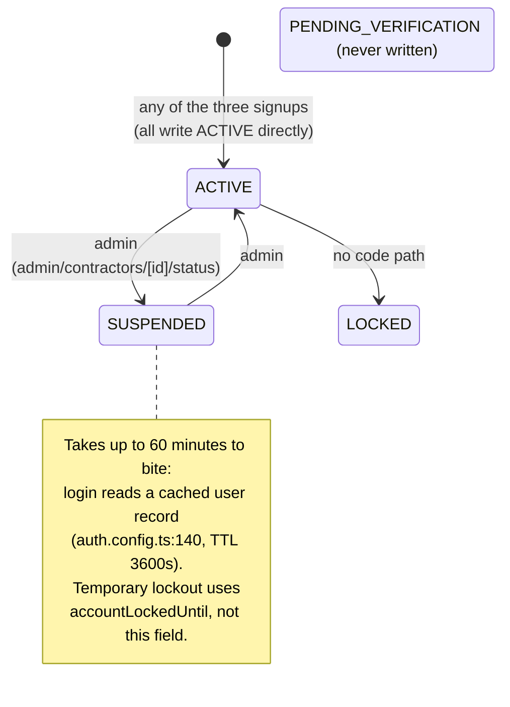

# Phase 4 — Business rules and workflows

Enforcement point: **C** = client (browser) only, **S** = server only, **C+S** = both,
**None** = declared but not enforced anywhere.

## 4.1 Identity, account and access rules

| Rule (plain English) | Where | Citation |
|---|---|---|
| A person may hold only one role. One account is either a worker, a client, a coordinator or an administrator — never two. | S (schema) | `prisma/auth-schema.prisma:129,142-144` |
| A password must be at least 8 characters and contain an uppercase letter, a lowercase letter and a digit. | C+S | `src/schema/registrationSchema.ts:25-29` (client & coordinator paths) |
| **Worker passwords are not subject to that rule.** The worker signup path checks only that a password is present. | S | `api/auth/register-async/route.ts:68-73`; `src/lib/workers/workerRegistrationProcessor.ts:38-40` |
| A mobile number must be a valid Australian mobile: 10 digits starting `04`, or 11 starting `614`, or `+61` followed by `614…`. | C+S | `src/schema/registrationSchema.ts:14-23` |
| **Worker mobile numbers are not validated** beyond being non-empty. | S | `workerRegistrationProcessor.ts:42-44` |
| Email addresses are stored lower-cased and trimmed, and are unique across all accounts. | S | `src/schema/registrationSchema.ts:31-34`; `prisma/auth-schema.prisma:127` |
| A user must explicitly agree to the terms to register (a checkbox that must be literally `true`). Worker signup instead requires consent to share the profile with clients. | C+S | `src/schema/registrationSchema.ts:69-71,111-113`; `Step7Photos.tsx` (worker) |
| Three consecutive failed sign-ins lock the account for 30 seconds. | S | `src/lib/auth.config.ts:120-129` |
| An expired lock resets the failure counter on the next attempt. | S | `src/lib/auth.config.ts:102-110` |
| A non-`ACTIVE` account cannot sign in. | S | `src/lib/auth.config.ts:140` — **reads a cache up to 60 minutes stale** (audit XC-06) |
| A session lasts 24 hours, or 7 days if "remember me" was ticked; the cookie itself lasts 30 days. | S | `src/lib/auth.config.ts:198,251` |
| A password-reset link is valid for one hour. | S | `api/auth/forgot-password/route.ts:79` |
| A forgotten-password request returns the same response whether or not the account exists. | S | `api/auth/forgot-password/route.ts:66-71` |
| **But an email-availability check and the OTP send endpoint both reveal whether an email is registered.** | S | `POST /api/auth/check-email`; `api/auth/send-otp` (409 vs 200, audit API-03) |
| An administrator may sign in as another user only if that user's account is `ACTIVE`. | S | `api/admin/impersonate/route.ts:61-66` |
| An impersonation token is single-use and expires after 60 seconds. | S | `api/admin/impersonate/route.ts:99,104-110`; consumed at `src/lib/auth.config.ts:57` |
| Both the administrator and the impersonated user get an audit record at start and at end. | S | `api/admin/impersonate/route.ts:69-95,178-200` |
| A worker may only read their own profile. | S | `api/worker/profile/[userId]/route.ts:78` |
| A client or coordinator may only act on participants and requests they own. | S | e.g. `api/client/service-request/route.ts:73-75`; `.../[id]/route.ts:155-157` |

## 4.2 Worker profile content rules

Every one of these is a deliberate quality bar on the listing, and every one is a reason a
worker abandons onboarding. They are the product's conversion levers.

| Rule | Where | Citation |
|---|---|---|
| First and last name are required; each at most 50 characters; letters, spaces, hyphens and apostrophes only. Middle name optional under the same character rule. | C+S | `src/schema/workerProfileSchema.ts:9-25` |
| **A bio must be at least 200 characters** and at most 2 000, counted after trimming. | C+S | `:64-71` |
| **A "fun fact about you" must be at least 50 characters** and at most 1 000, and at least one "unique service" must be selected. | C+S | `:384-392` |
| A worker must be at least 18 years old. | C+S | `:115-130` |
| A date of birth cannot be in the future and cannot imply an age over 120. | C+S | `:131-153` |
| Gender is required and is limited to **"Male" or "Female"** — no other option is accepted. | C+S | `:154-157` |
| Personality is required and is one of exactly two values: **"Outgoing and engaging"** or **"Calm and relaxed"**. Non-smoker and pet-friendly are both required booleans. | C+S | `:413-423` |
| City, state and postal code are required; postal code must be 3 or 4 digits. Street address is optional. | C+S | `:80-91` |
| One main profile photo, plus at most **two** additional photos. | C+S | `:49-51` |
| At least one work-history entry is required; an end date is mandatory unless "currently working". | C+S | `:229-261` |
| At least one education entry is required; an end date is mandatory unless "currently studying". | C+S | `:279-311` |
| A worker elects either an **ABN** or a **TFN** engagement and records that they have signed. The ABN or TFN value itself is deliberately **not stored** — only the type and the signature flag. | C+S | `:171-183` and its comment at `:172` |
| Bank details: account name and bank name each at most 100 characters; BSB exactly 6 digits (stored without the dash); account number 6–10 digits; the worker must tick an acknowledgement. | C+S | `:198-216` |
| A worker offers at most one record per service category. | S (schema) | `prisma/auth-schema.prisma:341` |
| A worker's date of birth is stored as **text**, and is range-filtered lexicographically for the admin age filter — correct only while every value is exactly `YYYY-MM-DD`, which nothing enforces at the database level. | S | `prisma/auth-schema.prisma:215`; `api/admin/contractors/route.ts:181-186` (audit DB-08) |

## 4.3 Compliance document rules

| Rule | Where | Citation |
|---|---|---|
| A worker's required documents are derived from the service categories and specialisations they have selected, grouped into base compliance, trainings, qualifications, insurance and transport. | S | `api/worker/requirements/route.ts:16-90` |
| Code of Conduct Part 1 and Part 2 are required of **every** worker regardless of service. | S | `api/worker/requirements/route.ts:23-26` |
| Uploads are limited to PDF, JPEG, PNG, WebP and HEIC/HEIF. | S | `api/compliance/upload/route.ts:78-86,131-136` |
| A single document may be at most **50 MB**. | S | `api/compliance/upload/route.ts:88,138-140` |
| Documents are classified as PRIMARY, SECONDARY or WORKING_RIGHTS identity evidence — the Australian 100-point check structure. Passport and birth certificate are PRIMARY; driver's licence, Medicare card, utility bill and bank statement are SECONDARY. | S | `api/compliance/upload/route.ts:51-76` |
| Mandatory for everyone: 100 points of ID, ABN/TFN election, NDIS Worker Screening Check, National Police Check, Working with Children Check, proof of working rights, Code of Conduct. | S | `api/compliance/upload/route.ts:53-74` (`isRequired: true`) |
| Uploading any document flips the worker's overall verification state to `PENDING_REVIEW`. | S | `api/compliance/upload/route.ts:265-267` — **fire-and-forget** (audit XC-02) |
| Re-uploading a document replaces the file and **resets the review**: status back to SUBMITTED, and the approval date, rejection date, rejection reason and reviewer all cleared. | S | `api/compliance/upload/route.ts:206-224` |
| Only an administrator may approve, reject, reset or re-date a document. | S | the four `api/admin/compliance/.../route.ts` files — but three authorise **after** reading and returning the record (audit API-01) |
| A rejection must carry a reason. | S | `.../reject/route.ts:28-31` |
| Resetting a document appends a timestamped note naming the administrator. | S | `.../reset/route.ts:63-65` |
| Only an administrator may publish a worker profile, and publication is what makes a worker "compliance verified". | S | `.../publish/route.ts:38-52`; `compliant/route.ts:16-19` |
| **Publication checks nothing.** No document must be approved, no required set must be complete, no expiry must be current. Publication is purely the administrator's judgement. | S | `.../publish/route.ts:38-52` |
| **A document's expiry date has no effect on anything.** | **None** | `RequirementStatus.EXPIRED` is never written; no scheduled job and no read-time check exist. Only the admin UI colours a past date red (`src/app/admin/compliance/[id]/page.tsx:409`) |
| Nothing prevents two rows for the same document type on the same worker. | **None** | `(workerProfileId, requirementType)` is a plain index, not a unique constraint (`prisma/auth-schema.prisma:186`); the upsert is a `findFirst`-then-`create` race (audit DB-07) |
| Deleting an identity document removes the database row but **leaves the file publicly reachable**. | S | `api/worker/identity-documents/route.ts:172-178`, deletion commented out (audit XC-05) |

### The catalogue's own rules — and a direct contradiction

The authoritative catalogue was checked in as `categories.json` on 2025-11-28 (`428d725`)
and **deleted on 2025-12-04** (`184aeb9`), together with its seeder `prisma/seed.ts`
(deleted 2025-12-11, `828ad7b`). Recovered from git, it declares 24 documents, 8 reusable
document sets and 7 service categories:

| Service category | Requires a qualification | Mandatory set |
|---|---|---|
| Support Worker | no | base compliance **with children check** + support-worker training + **public liability insurance (min $10M)**; transport documents **conditionally**, if the worker provides transport |
| Support Worker (High Intensity) | yes | the above **plus** a qualification certificate |
| Therapeutic Supports | yes | (no category-level set; 13 specialisations, of which occupational therapist, orthoptist, physiotherapist, podiatrist and psychologist require **AHPRA**) |
| Cleaning Services | no | base compliance + base training + public liability insurance |
| Home and Yard Maintenance | no | base compliance + base training + public liability insurance |
| Nursing Services | yes | base compliance with children + support-worker training + public liability **and professional indemnity** + manual handling + medication + behaviour support + **AHPRA** + professional association + qualification |
| Personal Trainer | yes | base compliance with children + base training + public liability and professional indemnity + **First Aid & CPR** + professional association + qualification |

Document sets: `baseCompliance` = 100 points of ID, ABN, police check, NDIS screening,
right to work. `baseComplianceWithChildren` adds the Working with Children Check.
`baseTraining` = resume, NDIS orientation, NDIS induction, effective communication,
infection control. `supportWorkerTraining` adds safe & enjoyable meals and First Aid & CPR.
`alliedHealthTraining` adds behaviour support. `transportDocuments` = driver's licence,
car registration, comprehensive/business car insurance. Of the 24 documents, **16 carry an
expiry date** (`hasExpiration: true`) — which is what makes §4.3's dead expiry rule matter.

**The contradiction.** `src/config/serviceDocumentRequirements.ts:28-45` states that a
Support Worker's qualification certificate and other training are both **optional** and
lists no mandatory documents at all. The recovered catalogue makes public liability
insurance, a Working with Children Check and seven training modules **mandatory** for the
same service line. Two rule sets for the same business question, and the one now in force
is whichever was loaded into the database, which the repository cannot tell us. Two further
divergences: the TypeScript config declares **nine** service lines including Home
Modifications and Fitness and Rehabilitation, which the catalogue does not have; and the
catalogue names a `personal-trainer` category that the TypeScript config treats as a
separate service. Logged in the gap register.

## 4.4 Search and visibility rules

| Rule | Where | Citation |
|---|---|---|
| A worker appears in the authenticated find-worker search only if their account is `ACTIVE` and both names are non-empty. | S | `api/client/workers/route.ts:352-357` |
| When a client browses without any search term, only workers who have written a bio are listed. | S | `api/client/workers/route.ts:359-364` |
| A search token that matches a known service or specialisation name is matched **only** against services and qualifications; any other token is matched **only** against bio, hobbies and personality. Every token must match. | S | `api/client/workers/route.ts:274-286,299-337,374-382` |
| A page of search results is at most 50 workers. | S | `api/client/workers/route.ts:151-154` |
| Search results are cached for 300 seconds; the profile cache is 300 s, completion status 60 s, geocodes 3 600 s, the active-vacancy list 7 200 s, and a user's login record 3 600 s. | S | `src/lib/redis.ts:29-38`; `api/client/workers/route.ts:660-666` |
| A search radius on the public feed is **uncapped**, so `within=99999` makes the bounding box global. | **None** | `api/public/workers/route.ts:201-203` (audit XC-04) |
| **Publication and verification status do not restrict search visibility on any live route.** | **None** | Phase 3 §3.2 |
| The CRM contractor directory returns at most 100 records per request. | S | `api/contractors/route.ts:16` |

## 4.5 Service-request rules

| Rule | Where | Citation |
|---|---|---|
| A request must name an existing participant, at least one service category, and a location. | C+S | `src/schema/serviceRequestSchema.ts:97-103` |
| The participant must belong to the requester. | S | `api/client/service-request/route.ts:66-75` |
| A new request starts `PENDING` with an empty worker shortlist. | S | `api/client/service-request/route.ts:83-84` |
| **Only a `PENDING` request may be edited** (or an archived one that was soft-deleted, which is restored to `PENDING` first). | S | `api/client/service-request/[id]/route.ts:159-177` |
| Cancelling clears the worker shortlist. | S | `.../[id]/route.ts:105`, `:326` |
| A `COMPLETED` or `CANCELLED` request cannot be cancelled again. | S | `.../[id]/route.ts:317-322` |
| **Only a `CANCELLED` request may be reactivated**, and reactivation clears the shortlist. | S | `.../reactivate/route.ts:45-59` |
| Deleting an archived request hides it by writing `_hidden: true` into the request's JSON details — nothing is ever physically deleted. | S | `.../[id]/route.ts:299-305` |
| Cancelling with a reason fires the "active request cancellation" CRM webhook; cancelling without one fires the cancel/archive webhook. | S | `.../[id]/route.ts:113-129` |
| Scheduling frequency is one of: one-time, weekly, fortnightly, monthly, ongoing, as-needed. | C+S | `src/schema/serviceRequestSchema.ts:63` |
| Funding type is one of NDIS, aged care, insurance, private or other. | C+S | `src/schema/serviceRequestSchema.ts:38,84` |
| NDIS plan details — management type, plan manager name, invoice email, CC email, NDIS number, plan start and end dates — are all **optional** and stored in an unindexed JSON blob. | C+S | `src/schema/serviceRequestSchema.ts:72-81`; `prisma/auth-schema.prisma:533` |
| A client may set their own request's status to `MATCHED`, `ACTIVE` or `COMPLETED`. | S (unintended) | `src/schema/serviceRequestSchema.ts:117` + `.../[id]/route.ts:211` |
| Any signed-in user may fire a Cancel or Archive CRM action against **any** request id. | S (unintended) | `.../action-webhook/route.ts:6-27` — no ownership check |

## 4.6 Recruitment rules

| Rule | Where | Citation |
|---|---|---|
| A vacancy exists only if a Zoho lead is in the stage the sync filters on; when the lead leaves that stage the vacancy is flagged inactive, never deleted. | S | `api/sync-jobs/route.ts:106-115`; `docs/Zoho_Jobs_To_DB.md:737` |
| Vacancies are keyed on the Zoho record id, so re-syncing updates rather than duplicates. | S | `prisma/auth-schema.prisma:351`; `docs/Zoho_Jobs_To_DB.md:735` |
| A worker may hold at most one application per vacancy; re-applying after withdrawal resets it to pending. | S | `prisma/auth-schema.prisma:402`; `api/worker/jobs/apply/route.ts:50-60` |
| A worker cannot apply to an inactive vacancy. | S | `api/worker/jobs/apply/route.ts:45-47` |
| A worker cannot withdraw an application twice. | S | `api/worker/jobs/apply/route.ts:98-100` |
| **A worker must have completed experience, fun fact, languages, interests and about-me before applying — unless their service is Cleaning or Yard Maintenance.** | **C only** | `src/utils/profileSections.ts:30-41`; `ApplyModal.tsx:93-95`; `JobCard.tsx:98-100`. The API applies no such check |
| An application does not require a verified or published profile. | — | `api/worker/jobs/apply/route.ts` — no such check exists |
| The sync claims a mutex before running and refuses a concurrent sync with HTTP 409. | S | `api/sync-jobs/route.ts:20-21,43-50` — **per-instance only**, and a timeout strands it permanently (audit API-08) |

## 4.7 Rate limits and other quantitative rules

| Rule | Citation |
|---|---|
| Registration, password reset and password setup: the strict limiter. | `api/auth/register-async/route.ts:27`, `forgot-password/route.ts:17`, etc. |
| Worker search, service requests and the contractor directory: the public-API limiter, 100 requests per minute per IP. | `api/client/workers/route.ts:593-600` (audit §6 Path C) |
| Compliance upload: 20 writes per minute, keyed on the **user id** — the only limiter in the system not keyed on IP. | `api/compliance/upload/route.ts:103` |
| Rate limiting reaches 10 of 86 routes, is keyed on a client-influenced header, and **fails open silently** when Redis is unreachable. | audit API-06 |
| Uploads get a 30-second function budget; nothing else has an explicit one. | `vercel.json:14-17` |
| Password hashing cost is 12 in one module and 10 in another. | `src/lib/password.ts:15` vs `src/services/user/account.service.ts:187` |
| Contract payment terms: contractor invoices are subject to a **four-week processing period**; casual employees are paid **weekly** after a valid timesheet. | `src/config/contractContent.ts:126,301` |
| Either party may terminate the contractor agreement on **14 days'** notice; casual employment may be terminated at any time without notice. | `src/config/contractContent.ts:68`, `:~404` |
| A contractor must not work directly with a Remonta-introduced client for **12 months** after termination. | `src/config/contractContent.ts:172-174` |

## 4.8 Defaults — unstated business decisions

| Default | What it decides | Citation |
|---|---|---|
| `status = ACTIVE` on every signup | Nobody is ever held pending. Registration is not a gate. | `workerRegistrationProcessor.ts:88`; `register/client/route.ts:65`; `register/coordinator/route.ts:109` |
| `isPublished = false` | A new worker is not listed **on the public feed** until an administrator acts. (Not on the in-product search — Phase 3 §3.2.) | `workerRegistrationProcessor.ts:104` |
| `verificationStatus = "NOT_STARTED"` | Compliance begins empty; the worker must initiate. | `workerRegistrationProcessor.ts:105` |
| `profileCompleted = false` | Completion is earned, not assumed. | `workerRegistrationProcessor.ts:103` |
| `RequirementStatus = PENDING` | A required document exists in an unmet state before anything is uploaded. | `prisma/auth-schema.prisma:164` |
| `isRequired = true` on a requirement | A document is mandatory unless the catalogue says otherwise. | `prisma/auth-schema.prisma:163` |
| `ServiceRequestStatus = PENDING` | A request waits for a human. | `prisma/auth-schema.prisma:538` |
| `JobApplicationStatus = PENDING` | An application waits for a human, and can only ever also be withdrawn. | `prisma/auth-schema.prisma:396` |
| `languages = []` at registration | Language is deliberately deferred to the additional-info step. | `workerRegistrationProcessor.ts:102` |
| `Participant.isSelfManaged = false` | Someone else is assumed to be arranging support unless the registrant said "self". | `prisma/auth-schema.prisma:93`; `register/client/route.ts:72,83` |
| `hasExpiration = false` on a document type | A document is assumed permanent unless the catalogue marks it otherwise. 16 of 24 are marked otherwise. | `prisma/auth-schema.prisma:267` |
| `Job.active = true` | A synced vacancy is live immediately, with no review. | `prisma/auth-schema.prisma:372` |
| `SMS_DEV_MODE` present in `.env` | SMS was never taken out of development mode as a concept. | `.env` |

## 4.9 State machines

### Worker verification status (`WorkerProfile.verificationStatus`)

Three of the five declared states are unreachable. The state actually written on
publication — `'Verified'` — is **not a member of the enum** (`prisma/auth-schema.prisma:502-508`);
the column is a plain `String` (`:233`), so it is accepted silently. `APPROVED` is written
only by the dead `src/lib/verification.ts:125`, and read only by the dead
`src/lib/feature-access.ts:76,114` and `src/lib/worker-search.ts`. **Net effect: the
worker's overall verification state is a two-value flag that mirrors `isPublished`, and no
live code branches on its value at all.**

### Compliance document status (`VerificationRequirement.status`)

Legal transitions are enforced server-side and correctly: approve requires SUBMITTED or
REJECTED (`approve:47-52`), reject requires SUBMITTED or APPROVED (`reject:60-65`), reset
requires APPROVED or REJECTED (`reset:39-45`). **`EXPIRED` has no inbound transition from
any code.** Side effects on transition: none. No email, no notification, no audit record
(Phase 2 §2.6, Phase 5).

### Worker publication (`WorkerProfile.isPublished`)

### Service request (`ServiceRequest.status`)

The three middle states — `MATCHED`, `ACTIVE`, `COMPLETED` — are read by the dashboards
(`dashboard/client/manage-request/page.tsx:34`,
`supportcoordinators/completed/page.tsx:57`) and written by no code in this repository.
Phase 3 §3.3.

### Job application (`JobApplication.status`)

### Account status (`User.status`)

## 4.10 Computed and derived values

| Value | Formula | Citation |
|---|---|---|
| **Worker age** | From date of birth: year difference, decremented if the birthday has not yet occurred this year. Computed identically in three places. | `src/schema/workerProfileSchema.ts:117-127,141-150`; `dashboard/supportcoordinators/page.tsx` |
| **Onboarding completion** | Five section flags — account details, compliance, trainings, services, additional credentials — read from `setupProgress`, but **recomputed from `verification_requirements` on every request** via a three-level `Category → CategoryDocument → Document` aggregation, because the stored value is not trusted. | `src/components/dashboard/Sidebar.tsx:139-145`; `src/services/worker/setupProgress.service.ts:1344,1445,1622` (audit FE-01) |
| **Profile completion percentage** | Drives an "Edit profile" highlight when below **80 %**. | `src/components/dashboard/Sidebar.tsx:100` |
| **Application eligibility** | `canApply = experience ∧ funFact ∧ languages ∧ interests ∧ uniqueService`, all non-empty; bypassed entirely for Cleaning and Yard Maintenance. Client-side only. | `src/utils/profileSections.ts:30-41,6` |
| **Distance** | Haversine on a great-circle radius of 6 371 km, with a bounding-box prefilter of `radiusKm / 111.32` degrees latitude and `radiusKm / (111.32 · cos lat)` degrees longitude. **Written out four times with two different formulas** (audit STR-02). | `api/public/workers/route.ts:65-85`; `src/lib/geocoding.ts:156-184,255-284` |
| **Compliance grouping** | Document `category` → group: IDENTITY/BUSINESS/COMPLIANCE → base compliance; TRAINING → trainings; QUALIFICATION/REGISTRATION → qualifications; INSURANCE → insurance; TRANSPORT → transport. Deduplicated by document id across all the worker's services. | `api/worker/requirements/route.ts:16-22,70-88` |
| **Search token classification** | A token is a "service token" if it appears as a substring of any known category or specialisation name, else a "text token". Cost is O(tokens × service terms). | `api/client/workers/route.ts:274-286` |
| **Display name** | Worker profile name, else client profile name, else coordinator profile name, else the local part of the email address. | `src/lib/auth.config.ts:14-22` |
| **Weekly report week boundaries** | Computed with `getDay()`/`setHours()` **in the function's timezone** against timezone-naive database values, for an Australian business running on UTC functions — off-by-one-day bucketing (audit DB-08). | `api/admin/reports/worker-statistics/route.ts:98-151` |

**There is no pricing, fee, commission, rate or score calculation anywhere in the
repository.** The only match "score" concept, `Match.matchScore`, is an unused type
(`src/types/index.ts:52`). The only rate UI is dead (Phase 3 §3.1).

## 4.11 Rules enforced on the client only — the product risks

| Rule | Why it matters |
|---|---|
| Profile completeness before applying to a vacancy (`src/utils/profileSections.ts` + `ApplyModal.tsx`) | The completeness bar exists to protect the quality of what Remonta forwards to the CRM. Any direct API call bypasses it. |
| All 14 worker profile-content rules in §4.2 | These are shared zod schemas, so they run on the server **only where the server action or route actually parses with them.** The worker signup path (`register-async`) parses with **no zod schema at all** (`route.ts:66-79`), which is why worker passwords and mobiles are unvalidated while client and coordinator ones are. |
| Search-radius options 5/10/20/50 km presented in the UI | The public API accepts any value, including one that scans every worker (audit XC-04). |
| Admin-only visibility of the contractor directory | The page and its API have no authentication (Phase 2 §2.4). |
