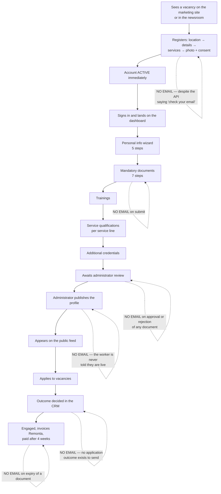
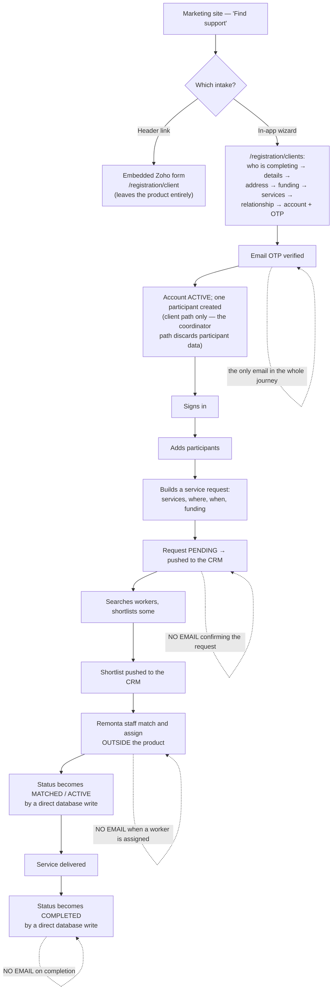

# Phase 5 — Lifecycle and communications

## 5.1 The complete inventory of outbound messages

Every template and every send site in the repository. There are **three** email templates,
one SMS path, and **no in-app notification mechanism of any kind** (no notification model,
no notification route, no bell component, no Pusher usage).

| # | Message | Trigger | Recipient | Purpose | Status |
|---|---|---|---|---|---|
| M1 | **"Your Remonta verification code"** — a 6-digit code | `POST /api/auth/send-otp` | The person registering | Prove control of the email address before an account is created | **Live**, but only on the **client/coordinator** signup path (`Step5AccountSetup.tsx:71`). No worker equivalent |
| M2 | **"Reset your Remonta password"** — a reset link | `POST /api/auth/forgot-password` | Any existing user | Password recovery | **Live** (`api/auth/forgot-password/route.ts:100`) |
| M3 | **"Welcome to Remonta! 🎉"** — headline *"🎉 Email Verified!"* | none | — | Confirm verification and welcome the user | **Dead** — `sendWelcomeEmail` has **zero callers** (`src/lib/email.ts:186`) |
| M4 | SMS: a 6-digit mobile verification code | `POST /api/sms/send-verification` | A registering worker | Prove control of the mobile number | **Dead** — the only consumers are two files with zero consumers of their own; the verify endpoint reads a **different in-memory map** than the send endpoint (audit XC-03) |

Sender configuration: Resend, `from = EMAIL_FROM` falling back to `onboarding@resend.dev`
(`src/lib/email.ts:13-18`). Twilio for SMS, with an `SMS_DEV_MODE` bypass
(`api/sms/send-verification/route.ts:60`).

Two copy/behaviour mismatches worth fixing because both are user-visible:
- The verification email states **"This code will expire in 15 minutes"**
  (`src/lib/email.ts:73`) while the code is generated with a **10-minute** validity
  (`api/auth/send-otp/route.ts:43`).
- Worker registration responds **"Registration successful! Please check your email to
  verify your account."** (`api/auth/register-async/route.ts:135`) — **no email is sent on
  that path at all**, and the account is already `ACTIVE`. The success page tells the truth
  ("Your worker application has been successfully submitted. You can now sign in with your
  credentials." — `src/app/registration/worker/success/page.tsx:47`); the API response does
  not.

## 5.2 Machine-to-machine notifications (not user communications, but business events)

These are the events the business decided mattered enough to notify a *system* about. The
contrast with §5.1 is the finding: **Remonta's CRM is told far more than Remonta's users
are.**

| Event | Destination | Citation |
|---|---|---|
| A worker registered | n8n → Zoho CRM (URL **hardcoded** in source) | `api/auth/register-async/route.ts:112-127` |
| A client or coordinator registered | `Client_Registration_Webhook` | `register/client/route.ts:108-124`; `register/coordinator/route.ts:163-179` |
| A service request was created | `Request_Service_Webhook` — payload includes the participant's date of birth, gender, funding type and **health conditions array** | `api/client/service-request/route.ts:105-127` |
| A service request was edited | `Request_Service_Webhook` with `action: 'edit'` and the same participant health payload | `.../[id]/route.ts:224-262` |
| Workers were shortlisted or a shortlist entry removed | `Select_Cancelling_Request_Webhook`, `action: 'confirmed' | 'cancelling'` | `.../select-worker/route.ts:18-31` |
| An active request was cancelled, with the stated reason | `Active_Request_Cancellation` | `.../[id]/route.ts:114-120` |
| A non-active request was cancelled, or archived | `Cancel_Archive_Webhook` | `.../[id]/route.ts:122-128`; `.../action-webhook/route.ts:22-26` |
| A worker submitted a recruitment application | `APPLY_WEBHOOK_URL` → n8n → Zoho | `api/apply/route.ts:51-64` |
| An administrator ran a natural-language worker search | `AI_SEARCH_WEBHOOK` | `api/admin/ai-search/route.ts:16-21` |
| An administrator sent a chat message | `N8N_WEBHOOK_URL`, falling back to a placeholder URL | `api/admin/chat/route.ts:26-36` |

All except the last two are **fire-and-forget with no timeout, no retry and no
dead-letter** (audit XC-02, API-05). A silently dropped webhook means a lead, a request or
a shortlist never reaches the people who act on it, and nothing anywhere records that.

## 5.3 The intended lifecycle mapped against the actual communications

### Worker lifecycle

**Communications sent to a worker across their entire lifecycle: zero**, other than a
password reset if they ask for one. A worker uploads a passport, a police check and an NDIS
screening clearance, and learns whether they were accepted only by signing back in and
looking.

### Client / coordinator lifecycle

## 5.4 Silent drop-off points — journey stages with no communication at all

Ranked by how much a message would plausibly change behaviour. Each is a product gap, not
a defect; the absence is uniform, which suggests it was never scoped rather than broken.

| # | Stage | What silence costs |
|---|---|---|
| 1 | **A document is approved or rejected** | The worker has no reason to return. A rejection with a mandatory reason is captured (`reject/route.ts:79-84`) and **never delivered to the person who must act on it.** This is the single highest-value missing message in the system. |
| 2 | **A profile is published** | The moment the worker becomes employable is invisible to them. |
| 3 | **A document expires** | 16 of 24 catalogue document types carry an expiry date; nothing detects expiry and nothing warns anyone (Phase 4 §4.3). For a registered NDIS provider this is a compliance exposure, not a UX gap. |
| 4 | **Onboarding is abandoned mid-wizard** | Five sections, dozens of steps, a 200-character bio and a 50-character fun fact stand between registration and being listed. There is no reminder of any kind. The only nudge is an in-app highlight when completion is below 80 % (`Sidebar.tsx:100`). |
| 5 | **A worker is shortlisted for a request** | Selection is pushed to the CRM; the worker is never told. |
| 6 | **An application outcome is decided** | There is no status to express an outcome (Phase 3 J6.10), so there is nothing to send. |
| 7 | **A service request is created** | No confirmation to the requester and no acknowledgement of expected timeframe. |
| 8 | **A worker is assigned to a request** | The client sees it only by revisiting the dashboard. |
| 9 | **An account is suspended** | The user discovers it at their next sign-in attempt — up to 60 minutes later (audit XC-06). |
| 10 | **Worker registration completes** | The API promises a verification email that is never sent. |
| 11 | **A password is changed** | `AuditAction.PASSWORD_CHANGE` is declared and never written; no confirmation email exists. |

## 5.5 Positioning language in the copy — how the business describes itself to users

Quoted sparingly; full extraction in Phase 7.

- The platform names itself a **"Care Matching Platform"** covering **"NDIS, Aged Care &
  Community Services"**, and its promise is **"Connecting NDIS participants with quality
  support workers across Australia"** (`src/app/layout.tsx:34-36`). Locale `en_AU`.
- To a worker asking for their bank details: *"To get you paid as soon as possible, enter
  your bank details below so that Remonta can process payments to you on behalf of your
  clients."* and *"Your bank details will not be displayed on your profile and only used to
  process your payments by the Remonta team."*
  (`src/components/profile-building/sections/BankAccountSection.tsx:102,108`). **Remonta
  pays the worker.** Money does not flow client→worker.
- On the profile photo: *"Upload a professional photo that clearly shows your face. This
  helps clients recognize you."* And the consent the worker must give: *"I understand and
  agree that my submitted profile information and photo will be shared with potential
  clients to help them choose the right worker for their needs"* … *"This is a necessary
  requirement to be considered for work opportunities."*
  (`src/components/forms/workerRegistration/Step7Photos.tsx`). **Consent to profile sharing
  is a condition of participation, not an option.**
- On the ABN step: *"Your ABN is required for payment processing and tax purposes. We
  verify this information to ensure compliance with Australian regulations."*
  (`src/components/account-setup/steps/Step6ABN.tsx:348`).
- On rates, in the one dead pricing component: *"Enter your preferred hourly rates. These
  are indicative only and can be negotiated with participants."*
  (`IndicativeRatesSection.tsx:31`) — a *negotiated, worker-set* pricing model that the
  shipped contract contradicts (Remonta sets the rate and pays the worker;
  `src/config/contractContent.ts:281-296`).
- The self-managed / representative / coordinator fork is put to the user as a question:
  *"We can help you create an account in a few easy steps. Who is this account for?"* with
  *"I am the Client / Participant"*, *"A person I'm assisting (e.g a friend or family
  member)"*, *"I am a Support Coordinator / Representative"*
  (`src/components/forms/clientRegistration/Step1WhoIsCompleting.tsx`).
- The code of conduct names the regulator: breaches *"may result in disciplinary action,
  termination of engagement, and mandatory reporting to the NDIS Quality and Safeguards
  Commission where required"* (`src/config/codeOfConductContent.ts:47`) — and ties payment
  to reporting: *"Failure to meet reporting obligations may result in delayed payment,
  suspension, or disciplinary action."* (`:182`).
- Workers are directed to the regulator's own training portal,
  `https://training.ndiscommission.gov.au/`
  (`src/components/requirements-setup/steps/Step4aNDISOrientation.tsx:61`) — Remonta does
  not deliver the training, it collects the evidence.
