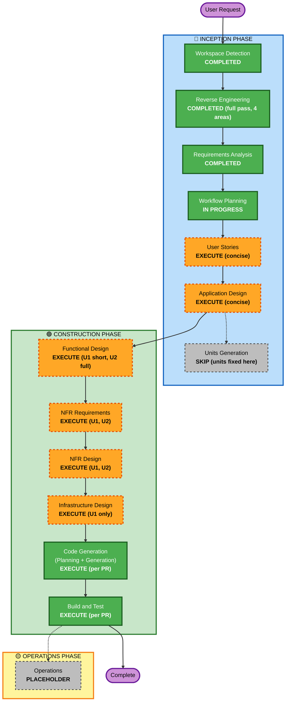

# Execution Plan -- admin worker search on `apps/api`

## Detailed Analysis Summary

### Transformation Scope
- **Transformation Type**: architectural, in two parts. (1) The api gains its first authenticated path: a
  short-lived token minted by `apps/app` and verified by a real authenticator in the pipeline. (2) Three admin
  endpoints migrate (amended 2026-10-08: the filter-options endpoint is dropped, D14) from Next.js route handlers to contract entries, and the worker search is rebuilt on
  `worker_locations` + PostGIS. No deployment-model change, no migration.
- **Primary Changes**: a shared token claims schema and a new `admin` contract area in `packages/api-contract`; a
  JWT authenticator, an admin module (filter registry as data, a parameterised geo statement, three list handlers)
  and one new config secret in `apps/api`; a token route, a client adapter and the admin pages onto the contract
  client in `apps/app`; a secret per stage and an auth-failure alert in `infra/`; four routes and one dead library
  deleted at the end.
- **Related Components**: `packages/api-contract` (new area, claims, `openapi.json`), `apps/api` (platform/auth,
  config, modules/admin, main), `apps/app` (`api/auth/...` token route, `lib/` or `features/` adapter,
  `app/admin/AdminDashboardClient.tsx`, `app/admin/impersonate/page.tsx`, the suburb box, URL state), `infra/`
  (stages table, bootstrap, monitoring JSON, README), `.github/workflows` (unchanged mechanics; `API Quality`
  already has PostGIS and the suburb list), `docs/admin/` (new), `docs/signup/03`, CLAUDE.md.

### Change Impact Assessment
- **User-facing changes**: Yes, administrators only. The suburb box keeps an id; "Within" is disabled until a
  suburb is picked; distances come from the suburb centroid; a count of unmapped workers and a way to list them;
  api error notices; nothing for workers, clients or the public.
- **Structural changes**: Yes. The api's `Authenticator` port gets its first real implementation; a second contract
  area; the first raw PostGIS statement; `apps/app` becomes a client of the api for signed-in admin reads.
- **Data model changes**: No. No migration, no column. One new secret per stage.
- **API changes**: Yes. Three role-restricted entries added to the api; four `apps/app` routes retired one release
  later (search, filters, users, inactive); a token route added to `apps/app`.
- **NFR impact**: Yes. Token security and lifetime, per-user limits, an auth-failure alert, a search latency target
  with a parity check, statement timeouts, no response cache on the api.

### Component Relationships
- **Primary Components**: `apps/api` (authenticator, admin module) and `packages/api-contract` (claims, admin area).
- **Infrastructure Components**: `infra/lib/stages.ts` (secret name), `bootstrap.sh`, `monitoring/auth-failed.json`,
  Secret Manager (two secrets), Vercel env (Production and Preview values of the same secret).
- **Shared Components**: `packages/api-contract` (both sides compile against the claims schema and the entries);
  `packages/db` (schema read, unchanged); `packages/schemas` (`types/auth` roles, unchanged).
- **Dependent Components**: `apps/app` admin dashboard and impersonation page (callers); `apps/app` `lib/auth`
  (the session the token is minted from); the api's pipeline (consumes the principal).
- **Supporting Components**: Cloud Logging and Monitoring (one new policy); `docs/admin`, CLAUDE.md; the parity
  script (a test-time tool under `apps/api/scripts` or `apps/app/scripts`).

| Component | Change type | Reason | Priority |
|---|---|---|---|
| `packages/api-contract` claims schema + `admin.contract.ts` + `openapi.json` | Major (new area) | both sides depend on it | Critical (first) |
| `apps/api` `platform/auth` authenticator, `config.ts` secret | Major (first real auth) | FR-ID-02 | Critical |
| `apps/api` `modules/admin` (filters as data, geo statement, three lists) | Major (new module) | FR-ADM, FR-GEO | Critical |
| `infra/` stages table secret, bootstrap, auth-failure alert, README | Configuration + one policy | FR-PLT-01/02 | Critical (before promotion) |
| `apps/app` token route + client adapter | Minor (new files) | FR-ID-01/04 | Critical |
| `apps/app` admin dashboard, impersonate page, suburb box, URL state | Major within one screen | FR-UI | Critical |
| `apps/app` four routes + `lib/worker-search.ts` deleted; Redis cache key gone | Removal | FR-UI-05 | Important (last) |
| `docs/admin`, `docs/signup/03`, CLAUDE.md, state follow-up 1 | Documentation | FR-PLT-04/05 | Important (same PRs) |

### Risk Assessment
- **Risk Level**: Medium-High. A new authentication mechanism across two deployments with different release paths;
  a live admin screen whose results must match the old ones; a hand-built SQL statement over a 15-filter registry.
  Mitigated by: additive api PRs promoted before the app switches; the parity script on staging; the pipeline's
  existing fail-closed behaviour (a bad token is 401 before any handler); rollback by promote at every step.
- **Rollback Complexity**: Moderate. Each PR rolls back by a promote; order matters (the app must never run ahead of
  the api); the routes-deletion PR is held until production has run on the new path.
- **Testing Complexity**: Complex. Property tests for the token and the geo statement (Haversine oracle), the filter
  parity oracle against today's registry, integration tests on PostGIS with generated workers, the staging
  checklist with forced error paths.

## Workflow Visualization

## Units of work (fixed here; Units Generation skipped)

| Unit | Name | Requirements | PRs | Design stages |
|---|---|---|---|---|
| **U1** | `api-identity` -- the token: claims schema, minting route, authenticator, client adapter, secret, alert | FR-ID-01..06, FR-PLT-01/02, NFR-03/04/06/07/09 | PR 1 (api side + infra), part of PR 3 (app side) | Functional Design (short), NFR Requirements, NFR Design, Infrastructure Design, Code Generation, Build and Test |
| **U2** | `admin-search` -- the four entries, the filter registry as data, the geo statement, the pages, the deletions | FR-ADM-01..08, FR-GEO-01..07, FR-UI-01..05, FR-PLT-03/04/05, NFR-01/02/05/08/10/11 | PR 2 (api side), part of PR 3 (app side), PR 4 (deletions) | Functional Design, NFR Requirements, NFR Design, Code Generation, Build and Test (Infrastructure Design skipped: nothing provisioned) |

U1's design precedes U2's code (U2's handlers run behind U1's principal), but U2's design can proceed in parallel
with U1's. Tests of U2 use the existing test-only header authenticator, so PR 2 does not wait for PR 1 to be
promoted; both must be on production before PR 3 merges.

## Phases to Execute

### 🔵 INCEPTION PHASE
- [x] Workspace Detection (COMPLETED 2026-10-08)
- [x] Reverse Engineering (COMPLETED 2026-10-08: full pass over the four areas, Q1 B, plus the targeted inventory)
- [x] Requirements Analysis (COMPLETED, approved 2026-10-08)
- [x] Execution Plan (this document)
- [ ] User Stories -- **EXECUTE, concise**
  - **Rationale**: a user-facing change to the administrators' main screen with new failure paths (expired token,
    api down, 429, unknown suburb, unmapped workers), a system actor (the api verifying tokens and ranking by
    distance) and acceptance criteria that become the staging checklist and the parity script's cases verbatim.
    The rule's "User Experience Changes" and "Security Enhancements affecting permissions" both apply. One
    persona (the administrator) plus the api as actor; one file, S1's format.
- [ ] Application Design -- **EXECUTE, concise**
  - **Rationale**: new components whose interfaces two deployments depend on: the claims schema and where it lives
    (OI-2), the authenticator and the adapter's refresh contract, the admin module's query builder (OI-1), the
    entry names and the array encoding (OI-3). Settling signatures once avoids the api and the app PRs disagreeing.
- [ ] Units Generation -- **SKIP**
  - **Rationale**: the two units and their order follow from the deployment constraint (api before app) and the
    requirement groups; the mandatory artifacts would restate the table above.

### 🟢 CONSTRUCTION PHASE
- [ ] Functional Design -- **EXECUTE for U1 (short) and U2 (full)**
  - **Rationale**: U1 holds the token's claims, lifetimes, verification rules and rejection cases; U2 holds the
    filter semantics, the geo predicate, the sort and pagination rules, the unplaced rules and the cut-over. PBT-01
    requires the property lists here.
- [ ] NFR Requirements -- **EXECUTE for U1 and U2**
  - **Rationale**: tech stack decisions: the token library (OI-2), the SQL building approach (OI-1), statement
    timeouts, per-user limit values, PBT-09 confirmation.
- [ ] NFR Design -- **EXECUTE for U1 and U2**
  - **Rationale**: timeouts and isolation (NFR-10), degraded mode (NFR-11), secret rotation, the RESILIENCY-14
    testing question, observability of auth failures and query timing.
- [ ] Infrastructure Design -- **EXECUTE for U1**; skip for U2
  - **Rationale**: U1 adds a secret per stage (table, bootstrap, YAML, Vercel) and a monitoring policy; U2
    provisions nothing (CI already has PostGIS and the suburb list).
- [ ] Code Generation -- EXECUTE (ALWAYS), one plan per unit covering its PRs
- [ ] Build and Test -- EXECUTE (ALWAYS), per PR: gates, CI, the staging checklist, merge, promotion

### 🟡 OPERATIONS PHASE
- [ ] Operations -- PLACEHOLDER (the production verification before PR 4 is recorded under U2's Build and Test)

## Package Change Sequence

The constraint, as in the previous cycles: Vercel previews call the **staging** api, which deploys from `main`;
production's api moves only by promotion; the app deploys to production on merge. So the api gains the entries and
the authenticator, is promoted, and only then does the app switch.

| PR | Unit | Packages | What it does | Live behaviour after merge |
|---|---|---|---|---|
| **1 identity, api side** | U1 | `packages/api-contract` (claims schema, exported for both sides), `apps/api` (JWT authenticator replacing `DenyAll`, `config.ts` secret required, tests incl. properties), `infra/` (secret in the table and bootstrap, `service.*.yaml` regenerated, auth-failure policy, README), `docs/admin/` (the token) | The user adds the secret to Secret Manager on both stages before merge; staging deploys; checklist: health 200, every existing public entry unchanged, a hand-minted token accepted, a tampered one 401 | Unchanged for users: no role-restricted entry exists yet |
| **2 admin, api side** | U2 | `packages/api-contract` (`admin` area, `openapi.json`), `apps/api` (`modules/admin`: filter registry, geo statement, three handlers, tests on PostGIS with generated workers, the parity script), `docs/admin/` | Staging deploys; checklist: the three entries with a staging admin's token; `EXPLAIN` shows the GiST index; the parity script passes against a preview's old route; then **promote** (PRs 1 and 2 together, one image) | Unchanged for users: nothing calls the entries |
| **3 app switch** | U1 + U2 | `apps/app` (token route, client adapter, admin dashboard and impersonate page on the contract client, suburb id and URL state, notices; Vercel Production and Preview get the secret first), CLAUDE.md reach line, `docs/signup/03` note | Preview against staging (which has 1 and 2): the full checklist incl. forced 401/429/503; merge deploys the app to production, whose api is already promoted | The admin dashboard searches through the api |
| **4 clean-up** | U2 | `apps/app` (the four routes, `lib/worker-search.ts`, the `admin:contractors:v1` cache usage), `docs`, state follow-up 1 | After production verification (requirements section 6 step 5) | No change for users |

Rollback at each step is a promote. PR 3 rolls back by a Vercel promote while PR 4 has not merged; PRs 1 and 2 roll
back by promoting the previous api image, after which PR 3's app must be rolled back too.

## Estimated Timeline
- **Total Phases**: 7 remaining stages (User Stories, Application Design, then per unit Functional / NFR /
  Infrastructure Design where marked, Code Generation, Build and Test)
- **Estimated Duration**: User Stories and Application Design one session; U1 design one session, U2 design one
  to two sessions; PRs 1 and 2 one to two sessions each with their staging checklists and the promotion; PR 3 one
  session with the preview checklist; PR 4 one short session after production verification

## Success Criteria
- **Primary Goal**: an administrator picks a suburb and a distance and gets every active worker whose home suburb
  is within that distance, nearest first, computed by PostGIS from our own locality table, through an api entry
  that only an authenticated admin can call
- **Key Deliverables**: the token mechanism live on both sides; the four entries live and the old routes gone; the
  parity report and the `EXPLAIN` recorded in the construction notes; `docs/admin/`; the auth-failure alert applied
- **Quality Gates**: every package's quality gate; `API Quality` with PostGIS; both Vercel previews; the staging
  checklist of requirements section 6 passed and recorded before each production step; property-based tests
  present for the properties named in the stories and designs
- **Integration Testing**: a staging admin's full search session after PR 2; the preview checklist after PR 3; a
  production search after PR 3
- **Operational Readiness**: auth failures alert; admin requests logged with principal and request id; search
  timing visible in logs

## Amendment 2026-10-08

Per `requirements.md`'s amendment: every filter combines with the location in one statement (D12); no schema
change (D13); the document filters and the filter-options entry are dropped, so U2 has three entries and PR 3 also
removes the page's dead options fetch (D14). Units, PR order and stages are unchanged.

## Amendment 2026-10-08 (instant repeats)

Q1 C: private HTTP caching with ETag/304, an api-side response memo, canonical URLs and a freshness line. All in
U2: PR 2 carries the contract field, the pipeline cache step and the memo (with their tests); PR 3 carries the
client's canonical URLs, `cache: 'reload'` and the freshness line. Units, order and stages unchanged.
