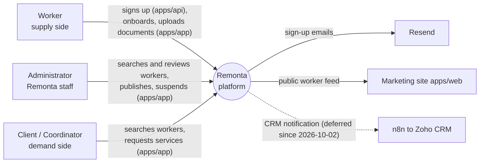

# Business Overview (refresh, 2026-10-08)

The business view lives in `.brd/phase-0` to `phase-8` (2026-09-23) and is not repeated. The S1 archive's
reverse engineering (2026-09-25, `aidlc-docs/archive/s1-worker-registration/inception/reverse-engineering/`) stays
the reference for `apps/app`, `apps/web`, `packages/schemas`, `packages/config` and `packages/db`. This refresh
covers what postdates it: `apps/api`, `packages/api-contract`, `packages/form-engine`, `infra/` and the workflows
(user decision Q1 = B, 2026-10-08), and what this cycle needs: the admin worker search and the radius.

## Business Context Diagram

## Business Description

- **What the system does:** Remonta is an NDIS support marketplace. Workers register, build a profile and prove
  compliance; administrators verify documents, find and publish workers; clients and coordinators find published
  workers near them and request services.
- **Business transactions implemented in the four areas under review:**
  - **J1 Worker registration on `apps/api`** (live since 2026-10-02): email availability, a 6-digit email code,
    a photo uploaded straight to Cloud Storage with a ticket and a confirmation, the sign-up transaction (account,
    profile, services, HOME location at the suburb's centroid, onboarding marker, audit row, outbox events), the
    confirmation email, the "someone used your email" notice, the clean photo copy and thumbnail, the daily purge
    of unclaimed photos.
  - **Suburb directory:** every Australian suburb-postcode pair (`au_localities`, G-NAF), served to the sign-up
    autocomplete by the api and to every other suburb box by `apps/app`.
  - **Onboarding marker reconciliation:** a job that derives each worker's onboarding stage from the documents
    `apps/app` records, and places workers whose address changed.
  - **Two one-off backfills** that gave every existing worker a HOME location and an onboarding marker.
- **Business transaction this cycle changes: J7.1 admin worker search.** Today it runs in `apps/app`
  (`GET /api/admin/contractors`) on the legacy location columns with Google geocoding; the cycle moves it, with the
  filter option lists, the user picker and the suspended list, onto `apps/api` on `worker_locations` + PostGIS
  (`inception/requirements/admin-search-inventory.md`).
- **Business dictionary** (`.brd/phase-1`): *locality* = a suburb-postcode pair with a centroid; *HOME location* =
  where a worker lives, one per worker, carrying their *travel radius* (50 km by default, never edited yet);
  *placed / unplaced* = whether a worker has a HOME row; *published* (`isPublished`) = visible to the demand side;
  *onboarding stage* = SIGNED_UP, DOCUMENTS_IN_PROGRESS, DOCUMENTS_SUBMITTED, ACTION_REQUIRED, VERIFIED, PUBLISHED;
  *contract entry* = one endpoint declared once in `packages/api-contract`.

## Component Level Business Descriptions

### apps/api
- **Purpose:** the backend for the worker sign-up and the background work around it; the intended home of every
  future endpoint ("dynamic by default", CLAUDE.md).
- **Responsibilities:** validate and rate-limit every request through one pipeline; create accounts; keep the
  outbox, the scheduled jobs and the onboarding markers; sign photo uploads and clean the photos.

### packages/api-contract
- **Purpose:** the single declaration of every api endpoint: paths, schemas, security metadata, the public
  allow-list, the OpenAPI document, the typed client.

### packages/form-engine
- **Purpose:** the logic of every multi-step form that submits to the api: validation from the contract, drafts on
  the device, retries, the photo staging. No React, no server.

### infra
- **Purpose:** the description of the two Cloud Run services (staging, prod), their alerts, buckets and the
  bootstrap of a Google Cloud project, plus the deploy and promotion workflow.

### apps/app (unchanged since the S1 analysis, in scope only as the caller)
- **Purpose:** every journey's screens; still the owner of the admin search until this cycle moves it.
