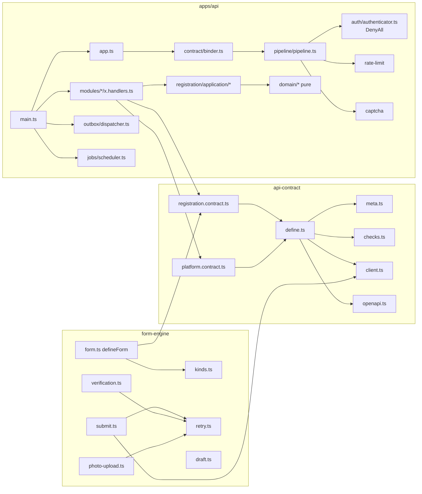

# Code Structure (refresh, 2026-10-08)

## Build System

- **Type:** pnpm 9.15.9 workspaces (`apps/*`, `packages/*`, `infra`) + Turborepo. Node >= 20.9 (CI runs 20 and 22;
  the api image runs node 22.23.3 pinned by digest).
- **Key settings:** `.npmrc` `node-linker=hoisted` (Vercel failed under isolated); `turbo.json` `envMode: loose`
  (strict broke Vercel builds), `build` depends on `^build`, `quality`/`test`/`type-check` depend on `^build`.
- **Per-package `quality`:** api = prisma:generate + lint + typecheck + vitest; api-contract and form-engine = lint +
  typecheck + vitest; infra = lint + typecheck + vitest + `render:check`. Task names are inconsistent (`typecheck`
  vs `type-check` vs `typecheck:strict`), so `turbo run type-check` misses half the packages.
- **apps/api build:** `tsup` (ESM, node20 target, two entries `main` and `hash-worker`, `@remonta/*` bundled, `#db`
  external); the Prisma client is generated into `apps/api/generated/db` (gitignored) from a copy of
  `packages/db/prisma/schema.prisma` made by `scripts/prisma-schema.mjs`.
- **Vercel:** `apps/app/vercel.json` carries its own `buildCommand` (two `prisma generate` + `next build`), which
  overrides `package.json`; the two must move together (CLAUDE.md trap).

## Key Modules

## Existing Files Inventory

Line counts from `wc -l` on 2026-10-08. Candidates for modification in this cycle are marked **(cycle)**.

### apps/api/src (4,109 lines)

| File | Lines | Purpose |
|---|---|---|
| `main.ts` | 117 | Boot: config, db, adapters, handler sets, outbox handlers, shedder, `createApp`, dispatcher, scheduler (4 jobs), shutdown, listen **(cycle: add the admin handler set and the real authenticator)** |
| `app.ts` | 128 | Fastify + Nest shell: `ContractOnlyAdapter`, onRequest hook (request id, headers, shedding, HTTPS), CORS (`allowedHeaders` incl. `authorization`, `credentials:false`), multipart, error/not-found handlers, `bindContracts`, `verifyRoutes` |
| `config/config.ts` | 117 | Zod env schema (`loadConfig`), 30 variables, derived `requireHttps` and `outboundHosts` **(cycle: the token secret/issuer/audience)** |
| `config/hosts.ts` | 79 | Host/origin patterns with one wildcard label |
| `platform/pipeline/pipeline.ts` | 143 | `buildRouteHandler`: the ordered security steps per entry |
| `platform/contract/binder.ts` | 96 | `planBindings`, `bindContracts`, `recordRoutes`, `verifyRoutes`; `BootError` |
| `platform/contract/handlers.ts` | 48 | `defineHandlers`, `Handler`, `HandlerContext` |
| `platform/auth/authenticator.ts` | 20 | `Principal {userId, role}`, `Authenticator`, `DenyAllAuthenticator` **(cycle: a JWT authenticator)** |
| `platform/rate-limit/rate-limiter.ts` | 42 | Postgres fixed-window counter (`rate_limit_buckets`), atomic upsert |
| `platform/captcha/captcha.ts` | 46 | reCAPTCHA v3 siteverify, fails closed |
| `platform/load/load-shedder.ts`, `bulkhead.ts` | 66, 73 | In-flight + event-loop shedding; bounded concurrency |
| `platform/outbox/outbox.ts`, `dispatcher.ts`, `retention.ts` | 66, 106, 19 | Enqueue in tx; SKIP LOCKED claim, 15 s handler timeout, 6 attempts, DEAD + alert log; 30-day retention |
| `platform/jobs/scheduler.ts` | 96 | Lease-based single-instance jobs on `scheduled_jobs` |
| `platform/persistence/db.ts` | 30 | `createDb` (pool size/timeout on the URL), `unitOfWork` (ReadCommitted, 10 s) |
| `platform/audit.ts` | 45 | `AuditRecorder` writing `audit_logs` in the tx; `satisfies` |
| `platform/errors.ts` | 61 | `ApiError`, `PermanentFailure`, `errorBody`, `statusOf`, P2024 -> 503 |
| `platform/http/safe-http-client.ts` | 133 | Outbound https client: host allow-list, no redirects, 3 s, 256 KB, Zod-parsed |
| `platform/email/mailer.ts` | 50 | Resend with idempotency keys |
| `platform/security/password-hasher.ts`, `hash-worker.js` | 101, 14 | bcrypt cost 12 in worker threads behind a bulkhead |
| `platform/logging.ts`, `clock.ts` | 32, 6 | Pino options, redaction paths, `genReqId`; injectable clock |
| `modules/platform/platform.handlers.ts` | 17 | `health`: `SELECT 1` |
| `modules/registration/registration.handlers.ts` | 43 | One handler per registration entry |
| `modules/registration/application/*.ts` (10 files) | 589 | email code, availability, existing-account notice, photo ticket/confirm/claim/process, `register-worker.ts` (the sign-up transaction), service resolution, categories |
| `modules/registration/domain/*.ts` (3) | 130 | HMAC email codes; event names; photo keys and windows |
| `modules/registration/adapters/*.ts` (3) | 223 | GCS signed POST policies and inspect; Vercel Blob; HIBP |
| `modules/registration/jobs/purge-photos.ts`, `persistence/users.ts` | 50, 15 | Daily purge; `lower(email)` lookup |
| `modules/localities/locality-directory.ts` | 95 | In-memory `au_localities` (hourly reload), prefix + later-word ranking, 10 results **(cycle: the free-text resolver can reuse its ranking)** |
| `modules/locations/domain/home.ts`, `legacy-match.ts` | 83, 139 | `placeHome` (centroid, radius 1-500, legacy columns); deterministic legacy address matcher |
| `modules/locations/backfill.ts`, `candidates.ts` | 152, 40 | The HOME backfill; candidates by postcode |
| `modules/onboarding/*` (6 files) | 657 | Stage derivation (pure), edges, initial marker, markers, the 5-minute reconciler (also moves HOME rows), backfill |
| `modules/notifications/*.ts` (2) | 142 | Outbox email handlers; HTML/text templates |

### apps/api other

| File | Lines | Purpose |
|---|---|---|
| `test/*` (31 files) | 4,363 | See code-quality-assessment.md |
| `scripts/backfill-*.ts`, `backfill-cli.ts`, `prisma-schema.mjs` | 86 | CLI entry points; schema copy |
| `load/harness.ts`, `burst.js` | 90 | Load harness (k6-style burst) |
| `Dockerfile` | 111 | 4 stages, `pnpm deploy --prod`, `USER node`, HEALTHCHECK |
| `prisma/schema.prisma` | -- | Generated copy of `packages/db`'s schema (output path rewritten) |

### packages/api-contract (692 src + 328 test)

| File | Lines | Purpose |
|---|---|---|
| `src/define.ts` | 73 | `defineContract`, `EntryDef`, request/response type inference |
| `src/meta.ts` | 75 | `Meta`, `meta()`, `ROLES`, `RATE_WINDOWS` |
| `src/checks.ts` | 83 | `checkContracts`: 17 checks incl. strict inputs (P9), no pass-through outputs (P10), public allow-list |
| `src/client.ts` | 83 | `createClient`: typed fetch, per-client and per-call headers, errors as data, `retryAfterSeconds` |
| `src/errors.ts` | 32 | `ERROR_CODES` (10 statuses), the strict error envelope |
| `src/openapi.ts` | 96 | OpenAPI 3.1 from the contracts; bearer `session` scheme declared |
| `src/platform.contract.ts` | 21 | `health` (probe) |
| `src/registration.contract.ts` | 204 | 8 entries + `localitySchema`, `serviceCategorySchema`, photo schemas |
| `src/index.ts` | 25 | `contracts = [platformContract, registrationContract]` **(cycle: + an admin contract)** |
| `public-endpoints.json`, `openapi.json` | 38, 1,228 | Allow-list with reasons; committed OpenAPI (drift-tested) |

### packages/form-engine (844 src + 744 test)

| File | Lines | Purpose |
|---|---|---|
| `src/types.ts` | 106 | `FormDefinition`, `FieldDef` union, `Uploader` port, `SubmitResult` |
| `src/form.ts` | 104 | `defineForm` (throws on keys outside the contract body), `formSchemaFor`, `toRequestBody`, `stepOfKey` |
| `src/kinds.ts` | 117 | `KINDS`: text, email, password, phone, locality, services, photo, consent, emailCode |
| `src/submit.ts`, `retry.ts` | 67, 83 | `submitToApi` (fresh captcha per attempt, 20 s timeout); `withRetry` (5 attempts, backoff, `Retry-After`, offline pause) |
| `src/draft.ts` | 67 | Device draft, 23 h, `neverSaved` stripped |
| `src/verification.ts` | 117 | Email availability and code calls; wording constants |
| `src/photo-upload.ts` | 166 | `stagePhoto`: ticket, upload, confirm, same-ticket retries, fresh ticket |

### infra (223 lib + 31 scripts + 286 test + 768 cloudrun)

| File | Lines | Purpose |
|---|---|---|
| `lib/stages.ts` | 114 | The stage table (names, scaling, env, secrets, origins, buckets) |
| `lib/render.ts`, `scripts/render.ts` | 109, 31 | Knative Service YAML; `--check` drift gate |
| `cloudrun/service.{staging,prod}.yaml` | 126 each | Generated; placeholders `__PROJECT_ID__`, `__IMAGE_TAG__`, `__DEPLOY_ID__` |
| `cloudrun/bootstrap.sh`, `apply-alerts.sh`, `lib.sh` | 151, 127, 31 | One-time project setup; alert reconciliation; shell copy of the table |
| `cloudrun/monitoring/*.json` (6) | 25-38 | Alert policies |
| `cloudrun/registry-cleanup.json`, `storage/*.json` (3) | 17, 8 each | Registry retention; bucket lifecycle and CORS |

### .github/workflows (8)

`ci-api.yml` (PostGIS + fake GCS service, migrations, suburb load, contract/form-engine/api gates), `ci-app.yml`,
`ci-web.yml`, `ci-infra.yml`, `ci-supply-chain.yml` (report-only), `codeql.yml`, `semgrep.yml` (`--test` blocks),
`deploy-api.yml` (staging on merge, prod by dispatch).

## Design Patterns

### Contract-first endpoints
- **Location:** `packages/api-contract/src/define.ts`, `apps/api/src/platform/contract/binder.ts`.
- **Purpose:** one declaration drives the route, validation, security, OpenAPI, the client and the form engine.
- **Implementation:** `defineContract` + `meta()`; `bindContracts` refuses to boot on an unbound entry or an
  undeclared route; three guards against hand-written routes (boot check, ESLint, Semgrep).

### Central pipeline, nothing in handlers
- **Location:** `pipeline.ts`. **Purpose:** no handler can forget a limit, a CAPTCHA or an audit row.
- **Implementation:** fixed step order; `meta()` only parameterises; Semgrep forbids `limiter.hit` / `captcha.verify`
  in modules.

### Ports and adapters with fakes
- `Authenticator`, `RateLimiter`, `CaptchaVerifier`, `Mailer`, `PasswordHasher`, `PhotoStore`, `Clock`;
  `test/helpers.ts` and `test/registration/fakes.ts` hold the fakes (a header-based fake authenticator exists for
  tests: `x-test-principal`).

### Transactional outbox and leased jobs
- `unitOfWork` commits the change, the audit row and the outbox event together; `OutboxDispatcher` claims with
  `FOR UPDATE SKIP LOCKED`; `Scheduler` leases `scheduled_jobs` rows so one instance runs a job.

### Pure domain with property tests
- `locations/domain`, `onboarding/domain`, `registration/domain`: no I/O; fast-check properties (`stage.test.ts` up
  to 5,000 runs).

### Table-rendered infrastructure
- `stages.ts` -> `render.ts` -> YAML, with a drift gate and tests that cross-check `lib.sh` and the workflow's `sed`.

## Critical Dependencies

| Dependency | Version | Usage | Purpose |
|---|---|---|---|
| fastify | 5.11.3 (pinned) | apps/api | HTTP server; Nest 11.1 adapter |
| @nestjs/core, common, platform-fastify | ^11.1.6 | apps/api | Lifecycle only |
| @prisma/client / prisma | ^6.16.2 | apps/api, packages/db, apps/app | ORM; raw SQL via tagged templates |
| zod | ^4.1.11 | all four areas | Schemas, env, OpenAPI (`z.toJSONSchema`) |
| @google-cloud/storage | ^7 | apps/api | Signed POST policies, inspect, delete |
| sharp | ^0.34 | apps/api | Photo re-encode (no HEIC decoder) |
| @vercel/blob | ^2.8.0 | apps/api | Clean photo copies |
| bcryptjs | ^3.0.3 | apps/api | Password hashing (cost 12), compatible with apps/app |
| pino | ^10.3.1 (dev) | apps/api | JSON logging (Fastify bundles its own at runtime) |
| vitest, fast-check | ^2.1.9, ^4.9.0 | tests | Unit, integration, property tests |
| tsup, @swc/core | ^8.5.0, ^1.13.5 | apps/api | Bundling, test transform |
| yaml | ^2.8.1 | infra | Render |
| postgis/postgis:16-3.4, fsouza/fake-gcs-server:1.52.2 | images | CI, local | Database and bucket for tests |
