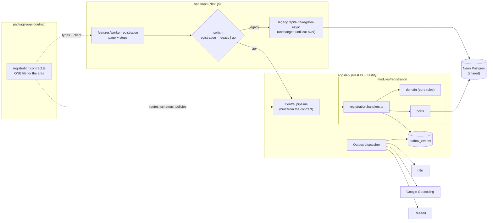
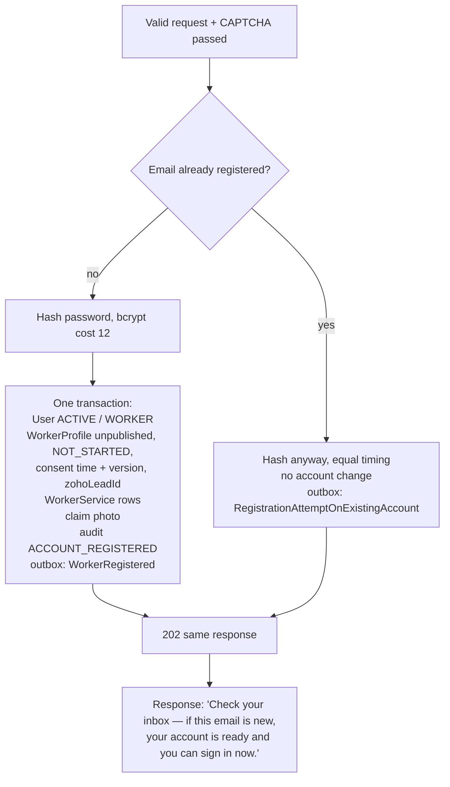

# Slice 1 — Worker Registration: Design

**Status:** draft for approval · **Date:** 2026-09-25
**Stage:** compressed Application Design + Functional Design for one vertical slice (workflow change, audit 2026-09-25)
**Stories:** US-REG-01 register · US-REG-02 CAPTCHA · US-REG-03 no enumeration · US-REG-04 lead attribution · US-REG-05 background geocoding · US-REG-06 CRM notification · US-NOT-01 truthful confirmation · (enablers: US-NOT-03 reliable delivery, US-AUD-01 audit, US-MIG-01 switch, US-MIG-07 retire unsafe endpoints)
**Architecture decisions applied:** NFR-ARCH-01 (deny by default, Q3 A + P1–P10) · NFR-ARCH-02 (one contract per area, Q1 A) · NFR-ARCH-03 (modular monolith, hexagonal, outbox, Q2 A)
**Slice decisions (2026-09-25):**
- **Hosting:** `apps/api` runs locally and in CI; the `apps/app` switch stays `legacy` until AWS Sydney exists.
- **Scope in `apps/app`:** group the sign-up code into one feature folder, remove dead or unsafe code, and switch the calls.
- **Registration photo:** stays on current public storage, but is uploaded only through `apps/api`.

---

## 1. What this slice delivers

Two things, in this order:

1. **The backend core.** Every later area reuses it unchanged: the `apps/api` service, the contract system, the central security pipeline, the outbox, database access, configuration, logging and the test harness. **Most of the architecture you asked for lands here.**
2. **The Registration module** on top of that core, plus the `apps/app` sign-up code reorganised and wired to it behind a switch.



---

## 2. The backend core

### 2.1 Workspace layout (new)

```
apps/api/                         NestJS 11 on Fastify
  src/
    main.ts                       boot: config check → contract check → listen
    platform/                     the core, shared by every module
      contract/                   binds contracts to handlers, startup checks
      pipeline/                   the security pipeline (§2.3)
      policy/                     policy engine (role + ownership + state)
      outbox/                     outbox writer + dispatcher + retry/dead-letter
      persistence/                Prisma client + unit-of-work (transactions)
      http-clients/               safe outbound client (allow-list, timeouts, schema-checked)
      config/                     Zod-validated environment
      observability/              structured logs (PII redacted), request IDs
      errors/                     error model → safe client responses
    modules/
      registration/
        registration.handlers.ts  one function per contract entry
        domain/                   pure rules: no Nest, no Prisma, no HTTP
        application/              use cases (orchestrate domain + ports)
        adapters/                 Prisma repos, CAPTCHA, photo store, event handlers
        registration.module.ts
  test/                           contract, pipeline, security and PBT suites
packages/api-contract/            NEW: all area contracts (Zod + ts-rest), importable by apps/app
```

**Adding an endpoint later** means one entry in the area's `*.contract.ts` plus one function in its `*.handlers.ts`, with no new files (NFR-ARCH-02). A new **area** means one contract file plus one module folder.

### 2.2 Contract system (NFR-ARCH-02, P7 inventory)

- **Library:** ts-rest (`@ts-rest/core`, `@ts-rest/nest`, `@ts-rest/open-api`). It is Zod-based, so it reuses `packages/schemas`. It gives typed server handlers, a typed `apps/app` client and OpenAPI from one declaration. Our own **security metadata** is added to each entry:

```ts
// packages/api-contract/src/registration.contract.ts  (illustrative)
export const registrationContract = c.router({
  submitWorkerRegistration: {
    method: 'POST',
    path: '/v1/registrations/worker',
    body: WorkerRegistrationRequest,            // strict Zod: unknown fields rejected
    responses: { 202: RegistrationAccepted },   // output schema: anything else is stripped
    metadata: meta({
      access: 'public',                         // explicit; there is no default
      bot: 'captcha',                           // CAPTCHA required, fails closed
      rateLimit: [{ per: 'ip', limit: 5, window: '1h' }, { per: 'global', limit: 500, window: '1h' }],
      audit: 'ACCOUNT_REGISTERED',
      maxBodyKb: 16,
    }),
  },
  uploadRegistrationPhoto: { /* POST /v1/registrations/worker/photo … access: 'public', rateLimit 10/h/ip, maxBodyKb 5120 */ },
});
```

- **Startup check (refuses to boot) and CI check (fails the build):**
  - every contract entry has a handler;
  - every entry declares `access` and `rateLimit`;
  - no route is registered outside a contract;
  - every `public` entry is on the reviewed allow-list `public-endpoints.json`.
- **Inventory:** `openapi.json` is generated from the contracts and committed. CI fails if it drifts, so the file is the API inventory (P7).

### 2.3 Central security pipeline (NFR-ARCH-01, P1–P10)

Every request passes these steps **in order**. Endpoints can't skip or reorder them; they can only declare their parameters in the contract.

| # | Step | Principle | Behaviour |
|---|---|---|---|
| 1 | Request ID, security headers, CORS allow-list, TLS-only | P6 | Only the `apps/app` origins are allowed; no wildcard |
| 2 | Body size limit (from `maxBodyKb`) | P8 | Rejected before parsing |
| 3 | Rate limit (from `rateLimit`) | P8 | Per IP / user / global; **fails closed**. Store: Postgres for local/CI now, Redis once OI-08 is decided (a port) |
| 4 | Bot check (from `bot`) | P3, P4 | reCAPTCHA v3: token required, action and hostname checked, score ≥ threshold, response schema-validated; provider unreachable → **reject** |
| 5 | Authentication (skipped only when `access: 'public'`) | P1 | Signed short-lived token + session check (built in slice 2, Identity) |
| 6 | Policy (from `access`) | P2 | Role + ownership + record state, before any data is read. Registration is `public`; nothing to check |
| 7 | Input validation (contract body/query/params) | P9 | Strict Zod; unknown fields rejected; strings trimmed and normalised; length-bounded |
| 8 | Handler → application → domain | P3 | Journey rules live in the domain (§3) |
| 9 | Output shaping (contract response schema) | P10 | The response is re-parsed through its schema and extra fields stripped, so a handler can't leak a field by accident |
| 10 | Audit (from `audit`) | — | Written in the **same transaction** as the change (§2.4) |
| 11 | Error mapping | P6, P10 | 400/401/403/404/409/429 with a generic message and request ID; details go to logs only; no stack traces, no internal messages |

**Automated proof (CI):**
- a route-security test enumerates **every** contract entry and asserts:
  - an anonymous call gets 401 (unless public);
  - a wrong role gets 403;
  - an oversized body gets 413;
  - the rate limit gives 429;
  - unknown fields give 400;
- a dependency scan (`pnpm audit`, already in CI);
- a DAST scan (OWASP ZAP baseline) against the preview, added when `apps/api` has a deployed preview (Infrastructure Design).

### 2.4 Outbox (NFR-ARCH-03, P4, US-NOT-03)

- The table `outbox_events` (id, type, payload JSON, status, attempts, next_attempt_at, last_error, created_at) is written **in the same transaction** as the business change. A side effect therefore never happens for a change that rolled back, and is never lost for one that committed.
- The **dispatcher** (inside `apps/api` for now; it can become its own process later):
  - claims due events with `FOR UPDATE SKIP LOCKED`;
  - runs the handler with a timeout;
  - retries with exponential back-off (6 attempts over about 1 h);
  - after the last attempt, marks the event `dead` and logs an alert.
- Every handler is **idempotent**, keyed by event ID (e.g. the email provider's idempotency key; the n8n payload carries the event ID).
- This needs **no queue technology yet** (OI-08 stays open). SQS or BullMQ can replace the dispatcher's claim step later without touching modules.

### 2.5 Outbound calls (P4, P5)

All external calls go through one `SafeHttpClient`:
- a **host allow-list from configuration** (Google, reCAPTCHA, Resend, the n8n host, HIBP), with no caller-supplied URLs (SSRF, P5);
- HTTPS only, redirects not followed, timeout 3 s, bounded response size;
- **every response parsed with a Zod schema** before use (P4);
- failures are typed, never thrown raw.

### 2.6 Persistence

- `packages/db` stays the only schema and migration source. A **second Prisma generator** outputs a client for `apps/api` (`apps/api/src/generated/db`, **gitignored**, generated at build; unlike `apps/app`, the client isn't committed).
- Connection: the same database as `apps/app` (`AUTH_DATABASE_URL`), with its own pool settings.
- **Unit-of-work:** the handler's DB writes, audit record and outbox events commit in one `$transaction`.

### 2.7 Configuration and secrets (P6)

- The environment is parsed with a Zod schema at boot. **A missing secret stops the service** (the opposite of today's fail-open CAPTCHA).
- Locally: `apps/api/.env` (gitignored). On AWS later: Secrets Manager.
- The n8n URL moves into configuration (FR-INT-02).

### 2.8 Observability

- Pino JSON logs with a request ID on every line.
- **Redaction list:** `password`, `email`, `mobile`, `photo`, `token`, `authorization`, `cookie`, bank fields. Logs carry IDs, not personal data (C8 A).

---

## 3. Registration module (functional design)

### 3.1 Endpoints (all in `registration.contract.ts`)

| Entry | Method + path | Access | Bot | Rate limit | Body limit |
|---|---|---|---|---|---|
| `uploadRegistrationPhoto` | `POST /v1/registrations/worker/photo` (multipart) | public | — | 10/h per IP; 300/h global | 5 MB |
| `submitWorkerRegistration` | `POST /v1/registrations/worker` | public | reCAPTCHA v3, action `worker_register` | 5/h per IP; 500/h global | 16 KB |

The service list for step 3 still comes from `apps/app` `GET /api/categories`, which is public, cached and out of this slice.

### 3.2 Photo upload (replaces the sign-up use of `/api/upload/worker-photo`)

1. The file must be JPEG, PNG, WebP or HEIC, ≤ 5 MB. It is checked by **file signature (magic bytes)**, not just the declared type.
2. It is stored under a **server-generated name** (random ID). The email field no longer builds the filename.
3. It is recorded as a **staged upload** (`registration_photo_uploads`: id, blob key, created_at, claimed_at, IP hash). The response is `{ photoUploadId }`, **never a URL**. The registration request can reference only a staged ID, never a URL (P5 SSRF, P1).
4. Unclaimed uploads older than 24 h are deleted by a scheduled outbox job.
5. Storage stays on current Vercel Blob, public, as decided. It is behind a `PhotoStore` port, so AU private storage (OI-07) is an adapter swap.

`/api/upload/worker-photo` itself stays for now: onboarding, profile preview and admin screens use it. Its missing auth (M2) is fixed when onboarding moves (slice 3).

### 3.3 Registration request (strict)

The shared schema lives in `packages/schemas` as `workerRegistrationSchema`. The page and `apps/api` import the **same** schema, which replaces `contractorFormSchema` for this form.

| Field | Rule |
|---|---|
| `location` | 3–120 chars; parsed server-side into suburb / state / postcode with the existing parser (ported into the domain); postcode 4 digits, state one of the 8 AU codes |
| `firstName`, `lastName` | 1–50 chars; letters, spaces, `'` and `-` only |
| `email` | RFC-valid, ≤ 254 chars; **normalised** (trim + lower-case) |
| `mobile` | Australian mobile; normalised to E.164 (`+614XXXXXXXX`) |
| `password` | 8–128 chars; upper, lower, digit and special character (today's live rule, kept; stricter than the story minimum) **+ not in the breached-password list** (HIBP range API, k-anonymity: only 5 hash characters leave the server) |
| `services` | 1–10 entries, each an existing Category; unknown values rejected |
| `supportWorkerCategories` | optional; each must be a Subcategory of a chosen service |
| `photoUploadId` | a staged, unclaimed upload ≤ 24 h old |
| `consentProfileShare` | must be `true` |
| `consentWordingVersion` | must equal the version currently shown (`worker-profile-share-v1`) |
| `zohoLeadId` | optional; digits only, ≤ 32; malformed → dropped with a warning, registration continues (US-REG-04) |
| `captchaToken` | required (pipeline step 4) |

`availability` and `startDate` are optional today and unused by the processor. They are **dropped** from the form.

### 3.4 Journey rules (the domain)



- **R1, no enumeration (US-REG-03):** new and existing emails get the **same status, body and similar timing** (the hash is computed in both branches). The existing owner receives an email: "Someone tried to create a Remonta account with this email. If it was you, sign in or reset your password."
- **R2, truthful next step (FR-REG-06):** the account is usable immediately, as today. The response and emails say "you can sign in now". The false "verify your email" text is gone.
- **R3, atomicity:** today WorkerService errors are swallowed, leaving half-registered workers. Now either everything commits or nothing does.
- **R4, the photo is claimed once:** claiming an already-claimed or expired upload rejects the request (400, "please upload your photo again").
- **R5, idempotent resubmission:** the browser retries up to 3 times today (`fetchWithRetry`). A retry after a commit hits R1 (existing email): the same 202, plus one "existing account" email that can be deduplicated within 10 minutes of the registration.

### 3.5 Events and their handlers (outbox)

| Event | Handler | Behaviour |
|---|---|---|
| `WorkerRegistered` | `GeocodeWorkerLocation` | Google Geocoding through `SafeHttpClient`; response schema-checked; stores lat/long. Failure → retries → dead; **registration unaffected** (US-REG-05) |
| `WorkerRegistered` | `NotifyCrmOfRegistration` | Sends the n8n payload(s) exactly as today (see Q1), URL from config, 5 s timeout, retries, dead-letter + alert (US-REG-06) |
| `WorkerRegistered` | `SendRegistrationConfirmation` | Resend, idempotency key = event ID; truthful wording (US-NOT-01) |
| `RegistrationAttemptOnExistingAccount` | `SendExistingAccountNotice` | As R1; at most one per email per 10 min |
| (scheduled) | `PurgeUnclaimedRegistrationPhotos` | Daily; deletes staged photos > 24 h |

### 3.6 Data changes (expand only; `packages/db` migration)

| Change | Why | Old `apps/app` impact |
|---|---|---|
| `worker_profiles` + `consent_profile_share_at timestamptz NULL`, `consent_wording_version text NULL` | FR-REG-04 | None (nullable, unread) |
| `worker_profiles` + `zoho_lead_id text NULL` | FR-REG-05 | None |
| New table `outbox_events` + index on (status, next_attempt_at) | §2.4 | None |
| New table `registration_photo_uploads` | §3.2 | None |
| New table `rate_limit_buckets` (until OI-08) | §2.3 | None |
| `AuditAction` enum + `ACCOUNT_REGISTERED` | Stop logging registrations as `LOGIN_SUCCESS` | None (additive enum value) |

Legacy registrations keep working and leave the new columns `NULL`. Nothing is backfilled.

---

## 4. `apps/app` changes

### 4.1 Organise (one feature folder)

```
apps/app/src/features/worker-registration/
  WorkerRegistrationPage.tsx      (from app/registration/worker/page.tsx)
  steps/                          Step1Location, Step1PersonalInfo, Step3Services, Step7Photos,
                                  CategorySubcategoriesDialog, SupportWorkerDialog
                                  (from components/forms/workerRegistration/)
  registrationSteps.ts            (from utils/registrationUtils.ts)
  submitRegistration.ts           the only place that knows legacy vs api
  useRecaptcha.ts                 loads reCAPTCHA v3, returns a token per submit
app/registration/worker/page.tsx  thin server component: reads the switch, renders the feature
```

- `Step7Verification.tsx` is **not imported anywhere** in the registration flow; it is removed if nothing else imports it (checked during code generation).
- `login/page.tsx`, `setup-password/page.tsx`, `Header.tsx` and `usePhoneVerification.ts` reference the `/registration/worker` **URL** only; the URL doesn't change. Every import of a moved file is re-checked during code generation. Anything also used outside sign-up stays in `components/`.

### 4.2 Remove (dead or unsafe)

| Remove | Why |
|---|---|
| `app/api/auth/register/route.ts` (498 lines) | Legacy duplicate; no caller |
| `app/api/auth/check-email/route.ts` + its step-2 call | Email-enumeration oracle (M9, US-REG-03). The early "email already exists" message goes; that email's owner is notified instead |
| The hard-coded n8n URL in `register-async` | Moved to configuration (FR-INT-02). The legacy route reads the same variable |

The legacy `register-async` route itself stays until cut-over is complete, then is removed (US-MIG-01).

### 4.3 The switch (US-MIG-01)

- `registration` = `legacy` | `api`. It is read **at request time** by the server page: Upstash key `switch:registration`, falling back to the env var `REGISTRATION_BACKEND`, default `legacy`. Flipping it needs no deploy.
- In `api` mode the page calls `apps/api` directly through the typed ts-rest client (`NEXT_PUBLIC_API_URL`). The backend then sees the real client IP for rate limiting, with no proxy hop to trust.
- **Rollback** = flip back to `legacy`. Both paths write the same tables, so nothing is lost.

---

## 5. Tests

| Kind | What |
|---|---|
| **PBT (fast-check)** | (1) the page and server accept and reject exactly the same inputs (the shared schema, fuzzed); (2) email normalisation is idempotent; (3) mobile normalisation: any accepted input → valid E.164, stable; (4) for any request, the response for an existing email is byte-identical to the one for a new email; (5) outbox retry schedule: attempts are monotonic, bounded, and the event ends `done` or `dead` |
| **Pipeline / security** | Route-security enumeration (§2.3); CAPTCHA missing, invalid or low score, provider down → rejected; rate limit → 429; unknown field → 400; oversized → 413; photo with a mismatched signature → 400; `photoUploadId` reuse → 400 |
| **Integration** | Against a real Postgres (CI: a GitHub Actions service container; locally: Docker if available, else a Neon branch): the full registration writes one User, one Profile, N services, one audit record and one outbox event in a single transaction; a forced failure writes nothing |
| **Contract** | `openapi.json` drift check; the `apps/app` client compiles against the contract |
| **Existing gates** | `apps/app` / `apps/web` / `schemas` quality stay green; new `@remonta/api` quality (strict tsc, lint, tests); `turbo run build` |

---

## 6. Security checklist: this slice against P1–P10

| P | How this slice meets it |
|---|---|
| P1 | Nothing from the client decides identity or role; the account is always created as WORKER / ACTIVE / unpublished server-side |
| P2 | Both endpoints are explicitly `public` and on the reviewed public allow-list; everything else is denied by default |
| P3 | The CAPTCHA can't be skipped; the photo must be staged first and claimed once; retries can't create duplicates; the same response for existing emails |
| P4 | CAPTCHA, HIBP, Google and n8n responses are schema-validated; timeouts; the CAPTCHA fails closed |
| P5 | No user-supplied URL is ever fetched; the photo is referenced by server-issued ID; outbound host allow-list |
| P6 | Env validated at boot; secrets not in code (the n8n URL moves out); generic errors; security headers; CORS allow-list |
| P7 | The contract is the inventory; OpenAPI drift check; the unsafe endpoints are removed |
| P8 | Per-IP and global limits on both endpoints; body limits; they fail closed |
| P9 | Strict shared schema, bounded lengths, normalisation, file signature check |
| P10 | The output schema strips everything except `{ status, message }`; logs redact personal data |

---

## 7. Decisions needed before code

### Question 1 — Which n8n notifications should a registration send?
Today **two different webhooks** fire for every sign-up:
- the **hard-coded one** in `register-async` (payload: profile ID, name, email, mobile, location, services, categories, zohoLeadId);
- a second one from `N8N_WEBHOOK_URL` in the processor (payload: user ID, role, registered-at, geo fields, statuses).

It isn't set in the local `.env`, so it may or may not be configured in production.

A) **Keep both, exactly as they are today,** each moved to configuration (`N8N_REGISTRATION_WEBHOOK_URL`, `N8N_WEBHOOK_URL`). This is zero risk to whatever the CRM workflows expect (Recommended)

B) Keep only the hard-coded one (I'll check with you what the second feeds before removing it)

X) Other (please describe after [Answer]: tag below)

[Answer]: A (2026-09-25)

### Question 2 — If the breached-password service (HIBP) is unreachable during a sign-up, what should happen?

A) **Accept the password,** record that the check was skipped, and log a warning. An outage at a third party shouldn't stop workers signing up; the other password rules still apply (Recommended)

B) Reject the sign-up and ask the worker to try again later

X) Other (please describe after [Answer]: tag below)

[Answer]: A (2026-09-25)

### Question 3 — Running the tests locally that need a database: is Docker available on your machine?

A) **Yes, Docker Desktop is installed or can be installed.** Tests use a throw-away local Postgres (Recommended)

B) No Docker. Use a separate **Neon branch** of the database for tests (I'll need you to create it and give me its connection string in `apps/api/.env`, never pasted in chat)

X) Other (please describe after [Answer]: tag below)

[Answer]: A (2026-09-25). Note: Docker is not installed yet on this machine; it must be installed before the database tests can run locally.

---

## 8. Build order (code generation plan, after approval)

1. `packages/db`: the expand migration (§3.6) + the `apps/api` generator
2. `packages/schemas`: `workerRegistrationSchema` + PBT parity tests
3. `packages/api-contract`: new package, `registration.contract.ts`, metadata types, boundary rule (no Nest/Prisma imports, P-5 style)
4. `apps/api` platform core: config, observability, errors, pipeline, policy, rate limit, CAPTCHA, SafeHttpClient, persistence, outbox + dispatcher, startup and route-security checks
5. `apps/api` registration module: domain, application, adapters, handlers, events
6. `apps/app`: feature folder, reCAPTCHA hook, switch, typed client; remove the legacy `register` route and `check-email`; n8n URL to config
7. CI: `ci-api.yml` (quality + Postgres service + OpenAPI drift); turbo tasks; CLAUDE.md updated with the `apps/api` commands
8. Build & Test: all gates, then a local end-to-end run with the switch on `api`

Each step is its own commit, on branch `s1/worker-registration`.
