# Execution Plan — Remonta Backend (`apps/api`), first release

**Inputs:** `requirements.md` (approved 2026-09-25), `user-stories/stories.md` + `personas.md` (approved 2026-09-25), `.brd/phase-0..8` (2026-09-23), archived reverse engineering (`aidlc-docs/archive/monorepo-migration/inception/reverse-engineering/`, 2026-09-09).

---

## Detailed Analysis Summary

### Transformation Scope (brownfield)
- **Transformation type:** Architectural. A new deployable service (`apps/api`, NestJS on Fastify, AWS ECS Fargate in Sydney) takes over six domains from a Next.js monolith (`apps/app`, on Vercel) through a strangler, sharing one live database
- **Primary changes:** new `apps/api` service; auth hardening and a per-domain switch in `apps/app`; expand/contract schema cleanup in `packages/db`; shared validation in `packages/schemas`; new AWS infrastructure (Fargate, load balancer, S3 in AU, queue, Redis in AU, secrets); new CI/CD for container deploys with canary
- **Not changed:** `apps/web` (marketing). It must not gain database access (P-1, P-2)

### Change Impact Assessment
| Area | Impact | Description |
|---|---|---|
| User-facing | **Yes** | Truthful registration messages, new notifications, document expiry, publication rules, immediate suspension, admin MFA, gender options, masked bank details |
| Structural | **Yes** | A second runtime and deployment target; `apps/app` becomes a client of `apps/api` for six domains |
| Data model | **Yes** | Session records, audit store (append-only), versioned catalogue, unique constraint on requirements, DOB text → date, verification-status enum cleanup, gender widening, consent version, encrypted bank fields. All expand/contract |
| API | **Yes** | New REST + OpenAPI surface with a generated TypeScript client; retired `apps/app` endpoints (fix-qualifications, upload-token, indicative rates) |
| NFR | **Yes** | Three blocking extensions (Security, Resiliency, PBT); SLA 99.9 %, RTO ≤ 30 min, RPO ≤ 5 min; AU data residency; observability stack |

### Component Relationships
- **Primary component:** `apps/api` (new): major
- **Infrastructure components:** AWS (Fargate, ALB, S3, SQS or ElastiCache, Secrets Manager, CloudWatch) as infrastructure-as-code (tool chosen in Infrastructure Design): major, new
- **Shared components:**
  - `packages/db` (Prisma schema + migrations): major, expand/contract. **Note:** three schema files exist today (`packages/db/prisma/schema.prisma` 24 models; `apps/app/prisma/schema.prisma` 3; `apps/app/prisma/schema.target.prisma` 32). Which one is the source of truth must be settled in Reverse Engineering before any migration
  - `packages/schemas` (Zod): minor → major. Shared validators for registration, onboarding and documents (PBT property: server and client accept the same inputs)
  - `packages/config`: minor. NestJS lint/tsconfig presets; P-rules extended so `apps/web` can't import `apps/api` internals
- **Dependent components:** `apps/app`: major for auth (token issuance, session store, revocation) and per-domain switches; minor per domain afterwards (call the generated client)
- **Supporting components:** GitHub Actions (`ci-app.yml`, `ci-web.yml`, `ci-supply-chain.yml`, plus a new `ci-api.yml` and deploy pipeline); observability SaaS (PII removed); Resend; n8n

| Component | Change type | Reason | Priority |
|---|---|---|---|
| `packages/db` | Major | Data-model changes; every domain depends on it | Critical |
| `apps/api` | Major (new) | The service itself | Critical |
| AWS infrastructure | Major (new) | Deployment target | Critical |
| `apps/app` auth | Major | Token exchange + session revocation (E1) | Critical |
| `packages/schemas` | Major | Shared validation | Important |
| `apps/app` per-domain switches | Minor, repeated | Strangler cut-over (E8) | Important |
| CI/CD | Major | Container build, canary deploy, rollback | Important |
| `packages/config` | Minor | Presets + boundary rules | Optional |
| `apps/web` | None | Guarded by P-1/P-2 | — |

### Risk Assessment
- **Risk level:** **High.** A shared production database, auth changes touching every user, regulated data (NDIS, identity documents), and a fixed 1–2 month date. It is not Critical because the strangler lets each domain be switched back without a deploy (FR-MIG-01)
- **Rollback complexity:** Moderate. App rollback = redeploy the previous pinned image; domain rollback = flip the switch; schema = forward-only expand/contract (contract steps ship separately after a backup)
- **Testing complexity:** Complex. PBT under full enforcement (15 named properties), contract tests between `apps/app` and `apps/api`, migration-script tests, and preview checks per CLAUDE.md step 5

### Scope vs. date (flagged for Units Generation)
55 stories, new infrastructure and three blocking extensions is a lot for 1–2 months with 1–2 developers. Clarification 10 = A says the date holds and scope narrows. The plan therefore **orders units so each one ships and can be switched on independently**, and the release can stop cleanly at any unit boundary. Units Generation will propose where the cut line falls.

---

## Workflow Visualization

```mermaid
flowchart TD
    Start(["User Request"])

    subgraph INCEPTION["🔵 INCEPTION PHASE"]
        WD["Workspace Detection<br/><b>COMPLETED</b>"]
        RE["Reverse Engineering<br/>(targeted refresh)<br/><b>EXECUTE</b>"]
        RA["Requirements Analysis<br/><b>COMPLETED</b>"]
        US["User Stories<br/><b>COMPLETED</b>"]
        WP["Workflow Planning<br/><b>COMPLETED</b>"]
        AD["Application Design<br/><b>EXECUTE</b>"]
        UG["Units Generation<br/>(Planning + Generation)<br/><b>EXECUTE</b>"]
    end

    subgraph CONSTRUCTION["🟢 CONSTRUCTION PHASE (per unit)"]
        FD["Functional Design<br/><b>EXECUTE</b>"]
        NFRA["NFR Requirements<br/><b>EXECUTE</b>"]
        NFRD["NFR Design<br/><b>EXECUTE</b>"]
        ID["Infrastructure Design<br/><b>EXECUTE</b>"]
        CG["Code Generation<br/>(Planning + Generation)<br/><b>EXECUTE</b>"]
        BT["Build and Test<br/><b>EXECUTE</b>"]
    end

    subgraph OPERATIONS["🟡 OPERATIONS PHASE"]
        OPS["Operations<br/><b>PLACEHOLDER</b>"]
    end

    Start --> WD
    WD --> RA
    RA --> US
    US --> WP
    WP --> RE
    RE --> AD
    AD --> UG
    UG --> FD
    FD --> NFRA
    NFRA --> NFRD
    NFRD --> ID
    ID --> CG
    CG --> BT
    BT -.->|next unit| FD
    BT --> OPS
    OPS --> End(["Complete"])

    style WD fill:#4CAF50,stroke:#1B5E20,stroke-width:3px,color:#fff
    style RA fill:#4CAF50,stroke:#1B5E20,stroke-width:3px,color:#fff
    style US fill:#4CAF50,stroke:#1B5E20,stroke-width:3px,color:#fff
    style WP fill:#4CAF50,stroke:#1B5E20,stroke-width:3px,color:#fff
    style RE fill:#FFA726,stroke:#E65100,stroke-width:3px,stroke-dasharray: 5 5,color:#000
    style AD fill:#FFA726,stroke:#E65100,stroke-width:3px,stroke-dasharray: 5 5,color:#000
    style UG fill:#FFA726,stroke:#E65100,stroke-width:3px,stroke-dasharray: 5 5,color:#000
    style FD fill:#FFA726,stroke:#E65100,stroke-width:3px,stroke-dasharray: 5 5,color:#000
    style NFRA fill:#FFA726,stroke:#E65100,stroke-width:3px,stroke-dasharray: 5 5,color:#000
    style NFRD fill:#FFA726,stroke:#E65100,stroke-width:3px,stroke-dasharray: 5 5,color:#000
    style ID fill:#FFA726,stroke:#E65100,stroke-width:3px,stroke-dasharray: 5 5,color:#000
    style CG fill:#4CAF50,stroke:#1B5E20,stroke-width:3px,color:#fff
    style BT fill:#4CAF50,stroke:#1B5E20,stroke-width:3px,color:#fff
    style OPS fill:#BDBDBD,stroke:#424242,stroke-width:2px,stroke-dasharray: 5 5,color:#000
    style Start fill:#CE93D8,stroke:#6A1B9A,stroke-width:3px,color:#000
    style End fill:#CE93D8,stroke:#6A1B9A,stroke-width:3px,color:#000
    style INCEPTION fill:#BBDEFB
    style CONSTRUCTION fill:#C8E6C9
    style OPERATIONS fill:#FFF59D

    linkStyle default stroke:#333,stroke-width:2px
```

Reverse Engineering runs **after** Workflow Planning here because its scope (OI-09) is decided in this stage.

---

## Phases to Execute

### 🔵 INCEPTION PHASE
- [x] Workspace Detection (COMPLETED)
- [ ] Reverse Engineering — **EXECUTE (targeted refresh)**. Resolves OI-09
  - **Rationale:** the archived technical RE (2026-09-09, HEAD `c541580`) predates the monorepo migration; 186 commits have landed since and every code path it cites has moved (`src/…` → `apps/app/src/…`). `.brd` covers business behaviour only. Application Design needs a current technical map of the **in-scope domains only**
  - **Scope:**
    1. A code map per in-scope domain (identity/auth, registration, onboarding, compliance, account & access, notifications): route handlers, server actions, `lib/` services, Prisma models, current monorepo paths
    2. The NextAuth flow as it runs today (callbacks, the 60-minute login cache, cookie lifetimes)
    3. **Which Prisma schema is the source of truth** (three files exist) and what the live Neon schema actually is
    4. Everything `apps/app` calls across the six domains, which becomes the switch-over surface for FR-MIG-01
    5. Out-of-scope code that reads in-scope tables (a regression risk for FR-MIG-03)
  - **Not in scope:** out-of-scope domains beyond item 5, and re-deriving business rules already in `.brd`
- [x] Requirements Analysis (COMPLETED 2026-09-25)
- [x] User Stories (COMPLETED 2026-09-25)
- [x] Workflow Planning (this document)
- [ ] Application Design — **EXECUTE**
  - **Rationale:** an entirely new service. NestJS modules and boundaries, the token-exchange contract, the session store, the audit store, the queue abstraction, the storage abstraction, the catalogue/requirements engine, and where each `apps/app` call is redirected. RESILIENCY-01 is confirmed here
- [ ] Units Generation — **EXECUTE**
  - **Rationale:** six domains plus a platform foundation must ship as independent strangler slices, each switchable on its own, in an order that lets the fixed date cut at a unit boundary

### 🟢 CONSTRUCTION PHASE (per unit)
- [ ] Functional Design — **EXECUTE**
  - **Rationale:** four state machines, the requirements engine, the publication rule (always-required vs. override), expiry behaviour, verification-status derivation, and data-correction logic. These are the PBT targets
- [ ] NFR Requirements — **EXECUTE**
  - **Rationale:** values the stories defer ("set in NFR Requirements"): session lifetime, rate limits, lockout threshold, audit retention, export deadline. Also OI-08 (queue technology, Redis residency) and the extension rules
- [ ] NFR Design — **EXECUTE**
  - **Rationale:** resiliency patterns (retries, DLQ, timeouts, idempotency, circuit breakers), canary + auto-rollback, observability with PII removed, field-level encryption; RESILIENCY-14 is asked here
- [ ] Infrastructure Design — **EXECUTE**
  - **Rationale:** new AWS footprint in `ap-southeast-2`: Fargate multi-AZ, ALB, S3 (OI-07), queue, Redis, secrets, networking to Neon, IaC tool choice, CI/CD deploy pipeline
- [ ] Code Generation — **EXECUTE (always)**
- [ ] Build and Test — **EXECUTE (always)**

### 🟡 OPERATIONS PHASE
- [ ] Operations — PLACEHOLDER. The lightweight incident process (C2.3 B) is drafted in NFR Design and finalised here

---

## Package Change Sequence

Hybrid: **sequential on the critical path, parallel within a unit.**

| Order | Package | Change | Why this position |
|---|---|---|---|
| 1 | `packages/db` | Expand migrations only | Every consumer depends on it; expand-only keeps old `apps/app` working |
| 2 | `packages/schemas` | Shared validators | `apps/api` and `apps/app` both import them |
| 3 | `packages/config` | NestJS presets, boundary rules | Needed before `apps/api` lints |
| 4 | Infrastructure + CI/CD | Foundation environment, pipeline | `apps/api` needs somewhere to deploy |
| 5 | `apps/api` | Domain modules, per unit | — |
| 6 | `apps/app` | Token issuance first (E1), then one domain switch per unit | Can only switch to what exists |
| 7 | `packages/db` | Contract migrations | Only after a domain is declared complete (FR-MIG-02) |

- **Critical path:** `packages/db` expand → foundation infra → Identity & Sessions (token exchange) → every other domain
- **Coordination points:** the OpenAPI contract (generated client, versioned); the Prisma schema (single source, settled in RE); the per-domain switch configuration
- **Testing checkpoints:** after each unit: CI quality gates, the preview check (sign in, a database-backed dashboard, a form submit), and a switch → switch-back rehearsal on the preview before production

---

## Estimated Timeline
- **Stages remaining:** 3 inception (RE, Application Design, Units Generation) + 6 construction stages per unit
- **Duration:** constrained to the fixed 1–2 month date (C10 A). Units Generation proposes the cut line, with any units past it becoming the next release

## Success Criteria
- **Primary goal:** the six first-release domains served by `apps/api` in production, with `apps/app` switched over and no regression in out-of-scope domains
- **Key deliverables:** `apps/api` service; AWS infrastructure as code; CI/CD with canary and rollback; expand/contract migrations; generated API client; audit trail; notifications through the queue
- **Quality gates:** the existing baselines (`app` / `web` / `schemas` quality, `turbo build`); a new `apps/api` quality gate; 15 PBT properties passing; Security, Resiliency and PBT extension compliance at each stage; CLAUDE.md preview and production checks per unit
- **Integration testing:** `apps/app` ↔ `apps/api` contract tests; switch and switch-back per domain on the preview
- **Operational readiness:** logs, metrics, traces, alerts and the dead-letter-queue alarm working before the first domain is switched in production
