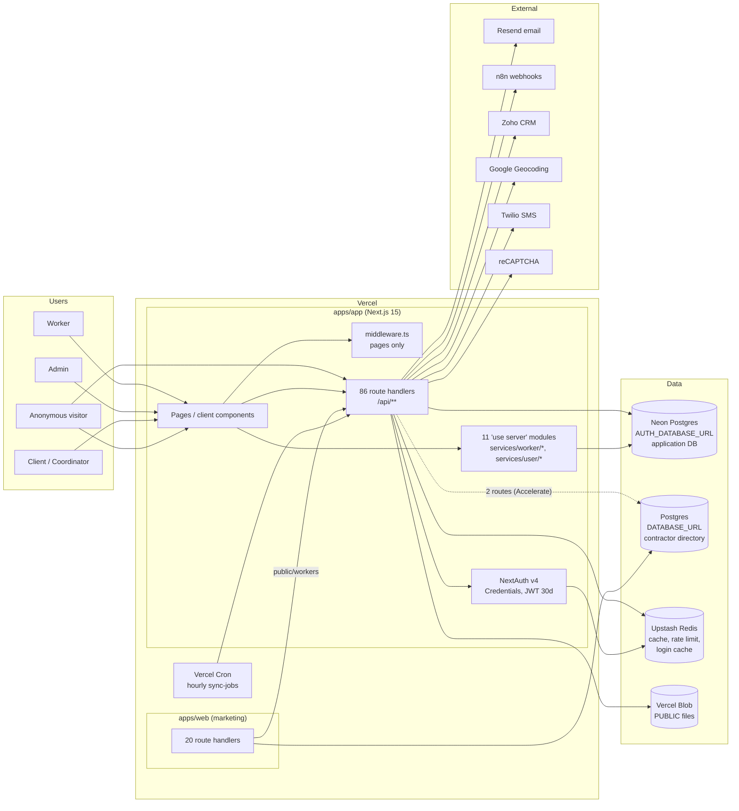
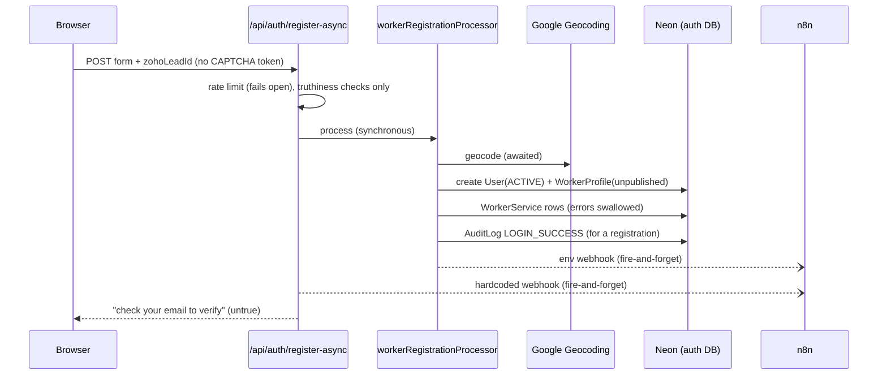
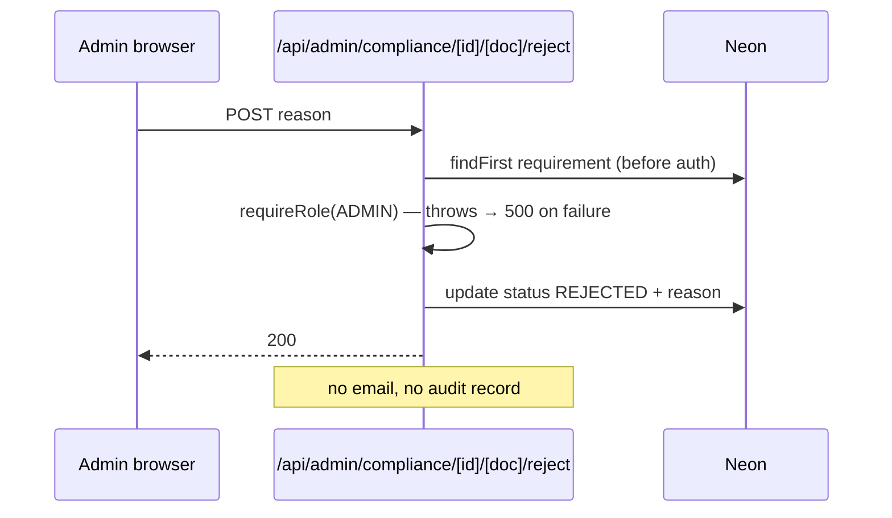

# System Architecture — current state (targeted refresh, 2026-09-25)

Scope: the six first-release domains plus the platform they run on (OI-09). Business behaviour is in `.brd/`; this document covers the technical picture at HEAD `8e530c1`.

## System Overview
- **One Next.js 15 monolith (`apps/app`)** on Vercel serves the whole application: pages, 86 API route handlers and 11 server-action modules.
- **A second Next.js app (`apps/web`)** serves the marketing site and reads a separate contractor database.
- **Business logic** is spread across route handlers, `"use server"` services and client components. No domain or service layer is shared between routes and actions.
- **Security** is per-endpoint and opt-in: middleware covers pages only (`/dashboard`, `/admin`, `/apply`) and never `/api/*` or server actions.

## Architecture Diagram

## Component Descriptions

### apps/app
- **Purpose:** the application: worker, client, coordinator and admin journeys.
- **Responsibilities:** everything in scope today, including auth (`lib/auth.config.ts`), registration (`api/auth/register-async`, `lib/workers/workerRegistrationProcessor.ts`), onboarding (`services/worker/*`), compliance (`api/admin/compliance/*`, `api/compliance/upload`, `api/upload/*`), notifications (`lib/email.ts`).
- **Dependencies:** `packages/db` (schema → generated `auth-client`), `packages/schemas` (Zod), Upstash, Vercel Blob, Resend, n8n, Google, Twilio, reCAPTCHA.
- **Type:** Application.

### apps/web
- **Purpose:** the marketing site.
- **Responsibilities:** content, worker search (through `apps/app` `GET /api/public/workers`), and contractor-directory sync from Zoho into its own DB.
- **Dependencies:** its own Prisma schema/client (`DATABASE_URL`), `packages/schemas`, `packages/config`.
- **Type:** Application. **Out of scope**; guarded by P-1/P-2.

### packages/db
- **Purpose:** single source of truth for the **application database** schema and migrations.
- **Responsibilities:** `prisma/schema.prisma` (24 models, 12 enums); `prisma/migrations/` (`0_init` baseline + 4 W1 migrations with `down.sql`); README rules (no `db push`, `CREATE INDEX CONCURRENTLY`).
- **Dependencies:** prisma ^6.16.2. **No runtime exports.** Its generator writes the client into `apps/app/src/generated/auth-client`.
- **Type:** Model.

### packages/schemas
- **Purpose:** shared Zod schemas and types.
- **Responsibilities:** `contractorFormSchema` (worker registration, used client-side only), `workerProfileSchema` (used server-side by onboarding actions), `registrationSchema` (client/coordinator), types (`UserRole`, `setupProgress`).
- **Dependencies:** zod ^4.1.11 only (P-5).
- **Type:** Model.

### packages/config
- **Purpose:** shared tsconfig, ESLint (incl. P-1..P-5 in `eslint.boundaries.mjs`), Prettier.
- **Type:** Configuration. **Note:** `apps/app` applies none of the P-rules.

## Data Flow — worker registration today

## Data Flow — admin rejects a document today

## Integration Points
- **External APIs:**
  - Resend: OTP and password-reset email.
  - n8n: registration (hardcoded URL plus env URL), apply, admin chat.
  - Zoho CRM: `lib/zoho.ts`, the recruitment-lead sync.
  - Google Geocoding: `lib/geocoding.ts`.
  - Nominatim: `/api/geocode`.
  - Twilio: raw REST; unreachable from the UI.
  - reCAPTCHA: `lib/recaptcha.ts`; effectively never runs.
- **Databases:**
  - The application DB (`AUTH_DATABASE_URL`, pooled, `connection_limit=1`, `pgbouncer=true`; `DIRECT_DATABASE_URL` for migrations).
  - The contractor-directory DB (`DATABASE_URL`, used by `apps/web` and by 2 `apps/app` routes via Accelerate). Consolidating the two was decided in the previous cycle (D-34/D-35) but hasn't been done.
  - **Unverified risk:** the fallback order of `lib/prisma.ts` (`ACCELERATE_DATABASE_URL || AUTH_DATABASE_URL || DATABASE_URL`) may point the legacy client at the auth DB.
- **Third-party services:**
  - Upstash Redis: cache (TTL table in `lib/redis.ts:28-39`), rate limit (`lib/ratelimit.ts`) and the login cache.
  - Vercel Blob: every file stored as public.
  - Vercel Cron: 1 job, `/api/cron/sync-jobs` hourly.

## Infrastructure Components
- **IaC:** **none.** No Terraform, CDK, Dockerfile or compose file anywhere.
- **Deployment model:** Vercel serverless (two projects). `vercel.json` `buildCommand` overrides `package.json` `build` (CLAUDE.md trap).
- **Networking:** managed by Vercel / Neon / Upstash; no VPC.
- **CI:** GitHub Actions run quality checks only (`ci-app.yml`, `ci-web.yml`, `ci-supply-chain.yml`); nothing builds, deploys or migrates. Migrations are applied by hand.

## Architectural observations that shape the new design
1. **No central enforcement point.** Security, validation and audit are per endpoint, and each gap in `security-findings.md` traces back to that. This is evidence for NFR-ARCH-01/02.
2. **Two code paths per capability.** Route handlers and server actions do the same job in different ways (e.g. 8 separate upload routes; two requirement engines; two n8n webhooks for one registration). The strangler must redirect **both**.
3. **The domain rules have no single home.** The catalogue lives in a DB table (no seeder), in `serviceDocumentRequirements.ts`, and in hardcoded lists inside `api/admin/compliance/[id]/route.ts:13-56`.
4. **Side effects are fire-and-forget.** Webhooks, status updates and audit writes are unawaited or have their errors swallowed. That's evidence for the outbox pattern.
5. **The database is shared across three consumers.** `apps/app`, the new `apps/api`, and (indirectly, through `public/workers`) `apps/web`. Expand/contract is required.
