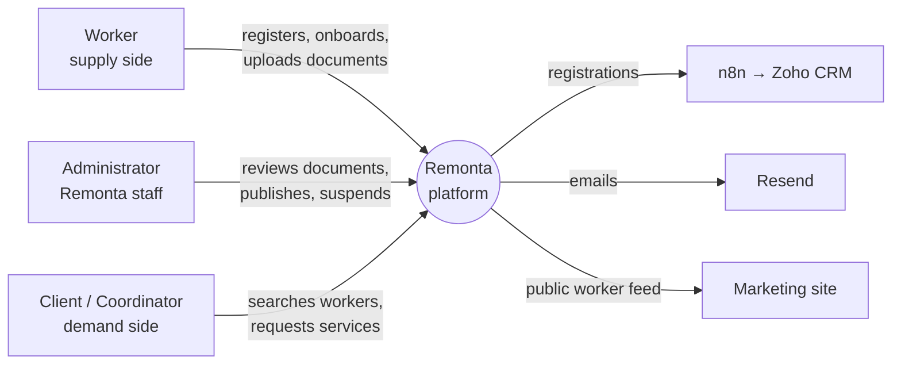

# Business Overview

The full business reverse engineering is in `.brd/phase-0` … `phase-8` (2026-09-23) and isn't repeated here (OI-09: targeted refresh). This file summarises it for the in-scope domains and links the technical artifacts.

## Business Context Diagram

## Business Description
- **What the system does:** Remonta is an NDIS support marketplace. Workers register, build a profile and prove compliance; administrators verify documents and publish profiles; clients and coordinators find published workers and request services.
- **Business transactions in scope** (the first release):
  - **J1 Registration:** a worker creates an account in four steps.
  - **J2 Onboarding:** the worker completes their profile, declares services, and uploads the documents their services require.
  - **J3 Compliance verification:** an admin approves, rejects, resets or re-dates documents and publishes or unpublishes the profile.
  - **J7.4 Suspend / reactivate an account.**
  - **J7.7 Impersonation:** an admin signs in as a user to troubleshoot.
  - **J8 Account and access:** sign-in, password reset/setup, OTP, lockout.
  - **Worker-lifecycle notifications** (phase-5 §5.3–5.4).
- **Business dictionary:** see `.brd/phase-1-domain-vocabulary.md`. Key terms: *requirement* (a document obligation, row in `verification_requirements`), *publication* (`isPublished`, what makes a worker visible), *catalogue* (the document types and sets per service category), *always-required document* (the F2a list decided in User Stories).

## Component-level business descriptions

### apps/app
- **Purpose:** serves every journey above for workers, admins, clients and coordinators.
- **Responsibilities:** identity, onboarding, compliance decisions, and the public worker feed used by the marketing site.

### apps/web
- **Purpose:** marketing and public worker search.
- **Responsibilities:** reads published workers through `apps/app`, and today also reads unpublished ones (H3).

### packages/db
- **Purpose:** the shape of the business records: users, worker profiles, requirements, the catalogue, and the audit log.

## Technical artifacts (this refresh)
- `architecture.md`, `code-structure.md`, `api-documentation.md` (the switch-over map), `component-inventory.md`, `technology-stack.md`, `dependencies.md`, `code-quality-assessment.md`
- **`security-findings.md`:** live production exposures, 4 recommended for immediate hotfix
