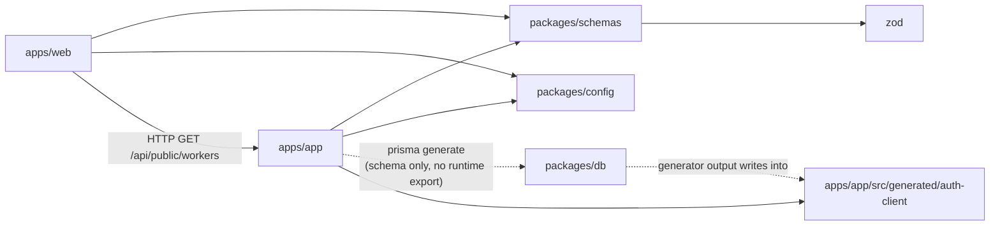

# Dependencies

## Internal Dependencies

### apps/app depends on packages/db
- **Type:** build time (Prisma generate) → runtime (the generated client is committed into `apps/app/src/generated/auth-client`)
- **Reason:** the application DB schema. `packages/db` has **no runtime export**; where the client should live is an open question from the previous cycle (U9 options in `packages/db/README.md`). `apps/api` makes this a live decision, because both apps need the same client.

### apps/app depends on packages/schemas
- **Type:** compile / runtime
- **Reason:** Zod schemas (`contractorFormSchema`, `workerProfileSchema`, `registrationSchema`) and the types `UserRole` and `setupProgress`

### apps/app, apps/web depend on packages/config
- **Type:** dev (tsconfig, ESLint, Prettier). P-rules are applied in `apps/web` and `packages/schemas` only.

### apps/web depends on apps/app
- **Type:** runtime HTTP. `apps/web/src/app/api/public/workers/route.ts:17` proxies `apps/app` `GET /api/public/workers`. **This is the only link from marketing to application data**, and it currently exposes unpublished workers (H3).

## External Dependencies (in-scope, `apps/app`)

| Dependency | Version | Purpose | License |
|---|---|---|---|
| next | 15.5.7 | Framework | MIT |
| react / react-dom | 19.1.0 | UI | MIT |
| next-auth | ^4.24.11 | Auth | ISC |
| @auth/prisma-adapter | ^2.10.0 | Declared; unused with the JWT strategy | ISC |
| prisma / @prisma/client | ^6.16.2 | ORM | Apache-2.0 |
| @prisma/extension-accelerate | — | Legacy-DB client | Apache-2.0 |
| zod | ^4.1.11 | Validation | MIT |
| @vercel/blob | ^2.0.0 | File storage | Apache-2.0 |
| @upstash/redis | ^1.35.6 | Cache | MIT |
| @upstash/ratelimit | ^2.0.6 | Rate limiting | MIT |
| resend | ^6.1.2 | Email | MIT |
| bcryptjs | ^3.0.2 | Password hashing | MIT |
| nodemailer | — | Declared; Resend is used | MIT-0 |
| pg | — | Raw SQL | MIT |
| @tanstack/react-query | — | Client data | MIT |
| vitest | ^2.1.9 | Tests | MIT |
| fast-check | ^4.9.0 | PBT | MIT |

Licenses are from the packages' usual published licenses; confirm them from the SBOM (`ci-supply-chain.yml` artifact) before relying on them.
