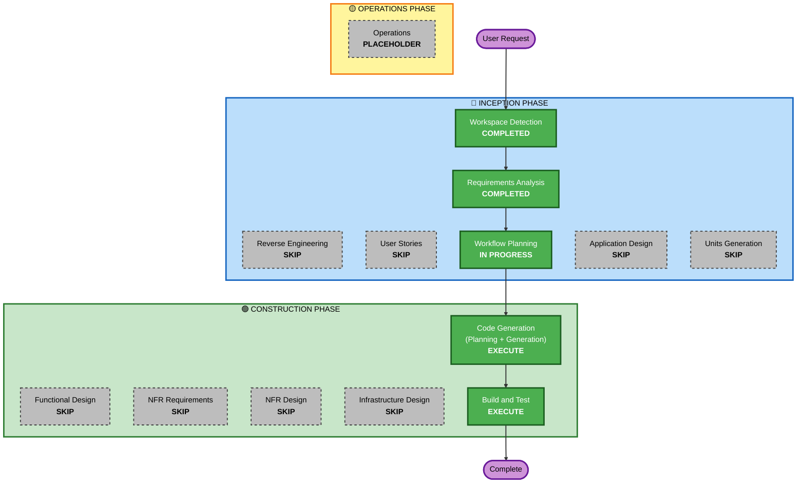

# Execution Plan -- Worker sign-up draft: nothing kept on the device between visits

## Detailed Analysis Summary

### Transformation Scope (brownfield)
- **Transformation Type**: Single component change, application layer only.
- **Primary Changes**: the browser adapter of the form engine supplies `sessionStorage` instead of `localStorage`
  and removes any entry left under the old `localStorage` key; tests and the sign-up documentation follow.
- **Related Components**: `packages/form-engine` (module comment and tests only; the engine's logic is unchanged),
  `docs/signup/01-flow.md`.

### Change Impact Assessment
- **User-facing changes**: Yes. A worker who closes the browser mid sign-up starts again next time; a refresh in the
  same tab still restores progress. Requested behaviour.
- **Structural changes**: No.
- **Data model changes**: No.
- **API changes**: No (no contract, endpoint or request change).
- **NFR impact**: Privacy improves (less data at rest on the device). No performance, security-posture or
  scalability change.

### Component Relationships
- **Primary Component**: `apps/app/src/features/forms/adapters/browser.ts` (Minor; direct change).
- **Shared Component**: `packages/form-engine/src/draft.ts` (Configuration-only: comment; tests gain a PBT
  round-trip). Consumed only by `apps/app`.
- **Dependent Components**: `useFormWizard.ts` (no change: it already takes whatever store the adapter returns);
  the worker registration definition (no change).
- **Supporting Components**: `docs/signup/01-flow.md` (doc); CI (`App Quality`, `Web Quality`, `API Quality`, which
  also runs the form-engine gate); Vercel preview.

### Risk Assessment
- **Risk Level**: Low. Isolated, well understood, no server or data change. The one behavioural risk is a worker
  losing progress on a closed tab, which is the requested behaviour.
- **Rollback Complexity**: Easy. One-line revert, or promote the previous Vercel deployment.
- **Testing Complexity**: Simple. Unit tests, one property-based round-trip, and a manual refresh/close check on
  the preview.

## Workflow Visualization

## Phases to Execute

### 🔵 INCEPTION PHASE
- [x] Workspace Detection (COMPLETED 2026-10-02)
- [x] Reverse Engineering (SKIPPED) -- the five files involved were read during Requirements Analysis; the archived
  S1 analysis stays the reference for the rest (kick-off Q2 = C)
- [x] Requirements Analysis (COMPLETED 2026-10-02, minimal depth)
- [x] User Stories (SKIPPED) -- one persona (the worker signing up), one behaviour, acceptance written in
  `requirements.md` §8
- [x] Execution Plan (IN PROGRESS)
- [ ] Application Design -- SKIP
  - **Rationale**: no new component or method; the adapter already exists and the engine already takes the store as
    a parameter
- [ ] Units Generation -- SKIP
  - **Rationale**: one unit of work, one package changed in substance

### 🟢 CONSTRUCTION PHASE
- [ ] Functional Design -- SKIP
  - **Rationale**: the behaviour is fully specified by FR-01..07; no business rules to design
- [ ] NFR Requirements -- SKIP
  - **Rationale**: NFR-01..05 in `requirements.md`; no tech-stack choice to make
- [ ] NFR Design -- SKIP
  - **Rationale**: no new resiliency or security pattern; the extension assessments are in `requirements.md` §6
- [ ] Infrastructure Design -- SKIP
  - **Rationale**: no infrastructure change
- [ ] Code Generation -- EXECUTE (ALWAYS)
  - Part 1 plan: `aidlc-docs/construction/plans/draft-storage-code-generation-plan.md`, then generation
- [ ] Build and Test -- EXECUTE (ALWAYS)
  - Quality gates, then the preview checklist in `requirements.md` §8

### 🟡 OPERATIONS PHASE
- [ ] Operations -- PLACEHOLDER (production check after merge is part of Build and Test here, as in CLAUDE.md step 7)

## Package Change Sequence
1. **Pre-step (D3)**: merge `aidlc/archive-s1` by its own PR, then branch `fix/signup-draft-session-storage` from
   `main`.
2. `packages/form-engine`: module comment in `draft.ts`; property-based round-trip and invariant tests in
   `test/engine.test.ts` (PBT-02, PBT-03). No logic change.
3. `apps/app`: `adapters/browser.ts` returns `sessionStorage` and removes the old `localStorage` key once; a unit
   test for the adapter; `docs/signup/01-flow.md` updated.
4. One PR for 2 and 3 (they are one change; no cross-package version coordination is needed inside the monorepo).

## Amendment 2026-10-02 -- second unit, `recaptcha-badge`

After unit `draft-storage` was merged (PR #30) and verified on the live domain by the user ("It works now!"), the
user asked to remove the reCAPTCHA badge shown at the bottom corner of the sign-up page. Same page, same risk class
(Low, browser-only, one-line rollback), no server change, so it joins this cycle as a second unit rather than a new
cycle. Google's terms allow hiding the badge only when the reCAPTCHA branding text is shown in the user flow, so the
unit hides the badge with CSS and shows the one-line notice under the wizard's buttons in api mode. Plan:
`aidlc-docs/construction/plans/recaptcha-badge-code-generation-plan.md`. Stages for the unit: Code Generation and
Build and Test; all design stages skipped for the same reasons as unit 1.

## Estimated Timeline
- **Total Phases**: 5 executed (3 Inception done, Code Generation, Build and Test).
- **Estimated Duration**: one session for code and gates; the preview check and merge depend on the user.

## Success Criteria
- **Primary Goal**: no sign-up answer remains on the device after the browser or tab is closed (FR-01), while a
  refresh in the same tab still restores progress (FR-02).
- **Key Deliverables**: the adapter change, the one-time clean-up, tests (example-based and property-based), the
  doc update, a merged PR, production verified.
- **Quality Gates**: `pnpm --filter @remonta/form-engine run quality`, `pnpm --filter @remonta/app run quality`,
  `npx turbo run build`, CI green, the preview checklist (`requirements.md` §8) recorded in `audit.md`.
