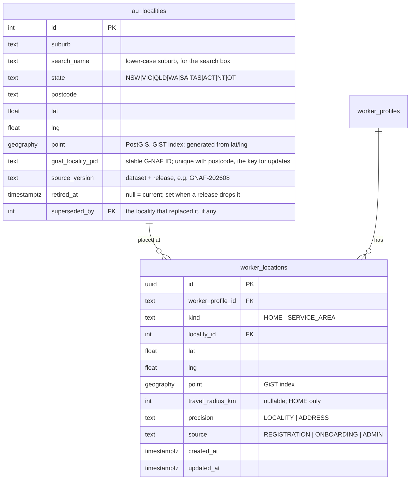

# Slice 1 — Data Model: Location and Onboarding Pipeline

**Status:** decisions complete 2026-09-25 (G-NAF; radius only, 50 km; refresh every 6 months; profile sections as progress within a stage; default stuck thresholds) · **Date:** 2026-09-25
**Why:** the user asked, before code (audit 2026-09-25):
1. Location is the primary requirement for a match. Should it live in its own table?
2. Sign-up is only the first step of a worker pipeline. What marker shows who is stuck in pipeline 1, who is in progress in pipeline 2 (documents), and who has completed it? The database may be restructured.

This extends `S1-design.md` §3.6. It is designed now because registration **creates** both records, but it serves the whole platform: matching (J4, a later release), onboarding (slice 3), compliance (slice 4) and admin reporting.

---

## 1. Where things are today (from Reverse Engineering)

| Concern | Where it lives | Problem |
|---|---|---|
| Location | `worker_profiles.location` (free text), `city`, `state`, `postalCode`, `latitude`, `longitude` (Float) | One location per worker; the text and parsed fields can disagree; coordinates only arrive if geocoding succeeds, otherwise the worker is **invisible to distance search**. The Step 1 autocomplete already fetches coordinates from Google and **throws them away**; registration then geocodes the same suburb again |
| Service area | Nothing (the `LocationsSection` UI is a stub with no save) | You can't say "I travel up to 20 km" or "I cover these suburbs" |
| Suburb reference data | `packages/schemas/src/data/australianPostcodes.ts`: **244 rows, no coordinates** | Incomplete; can't validate or place a suburb |
| Distance search | Bounding box on `latitude/longitude` + Haversine in code (`api/client/workers/route.ts:518-533`) | Works at today's size, but can't honour a per-worker travel radius efficiently |
| Where a worker is in onboarding | Spread over `verificationStatus` (free string, overwritten on every upload, includes the stray `'Verified'`), `setupProgress` JSON (client-settable), `profileCompleted`, `isPublished`, and each `verification_requirements.status` | **No single marker**; nothing records *when* a worker entered a stage, so nobody can see who is stuck or for how long |

---

## 2. Location: its own tables

### 2.1 Proposed structure



- **`au_localities`**: one row per Australian **suburb–postcode pair** with its centroid. A suburb that spans two postcodes has two rows, because the worker picks "Parramatta 2150", not "Parramatta". The unique key is `(gnaf_locality_pid, postcode)` (corrected in the code generation plan, 2026-09-25). It is seeded from an **open official dataset**: **Geoscape G-NAF + Administrative Boundaries (Localities)** from data.gov.au (open G-NAF EULA, based on CC BY 4.0; commercial use allowed; quarterly releases). Suburb–postcode pairs and centroids are derived from the real addresses in each locality; ABS SAL 2021 (CC BY 4.0) is the fallback. Attribution recorded. *(Source confirmed by the user 2026-09-25.)* It is versioned (`source_version`) and refreshed by a reviewed script (§2.1a).
- **`worker_locations`**:
  - **Exactly one `HOME` row** per worker (partial unique index), which carries the travel radius.
  - **Zero or more `SERVICE_AREA` rows**, which are extra suburbs they cover.
  - **Coordinates are always present:** from the locality centroid at registration (`precision = LOCALITY`), optionally refined later from the full address in onboarding (`precision = ADDRESS`).
- **PostGIS** (supported on Neon; `CREATE EXTENSION postgis` as an expand migration) with a GiST index. A match becomes one indexed query: *workers whose HOME is within their own travel radius of the client, or who list the client's suburb as a service area.* Prisma sees the geography column as `Unsupported`, and matching queries live in one repository adapter using parameterised raw SQL.
- **Service areas (decided 2026-09-25): option A, radius only.** Workers set one travel radius on their HOME row, **default 50 km**. The `SERVICE_AREA` kind stays in the schema, unused, so extra suburbs (option B) can be added later without a migration.

### 2.1a Keeping `au_localities` current

Suburbs change rarely (new estates, renames, boundary changes), so the table is refreshed **every six months** from the latest G-NAF release, plus on request. It is a reviewed script, not a scheduled job:

1. `pnpm --filter @remonta/db localities:refresh --release=YYYYMM` downloads the release and loads it into a **staging table**. Production is untouched.
2. It prints a **diff report**: added, renamed, moved centroid, dropped. For each dropped locality it gives the number of workers placed there.
3. After the report is approved, one transaction applies it:
   - **Added:** inserted.
   - **Changed:** updated in place, matched on `gnaf_locality_pid`, so the `id` and every worker's link stay the same.
   - **Dropped:** **never deleted**. `retired_at` is set, and `superseded_by` is set when G-NAF names a successor. Retired rows disappear from the search but stay valid for workers already placed there, and those workers are listed for review.
4. `source_version` records the release. The run is audited.

The script is idempotent, so re-running the same release changes nothing. Before a refresh is applied, PBT and fixture tests prove that no worker's HOME location is ever orphaned.

### 2.2 What it changes in Slice 1

1. **Step 1 autocomplete reads our own `au_localities`** through a public, rate-limited `GET /v1/localities?q=` contract entry, instead of two Google calls per keystroke (Places autocomplete + geocode). This removes an external dependency and a cost from the most-used public screen (P4, P8). The worker picks a locality, and the form sends `localityId` instead of free text.
2. **Registration writes the `HOME` location immediately, from the centroid.** The worker is placeable from the first second, and **no geocoding call is needed at registration**. US-REG-05 (background geocoding) moves to onboarding's full-address step, where it adds precision; a geocoding failure there never makes a worker unplaceable.
3. **During the transition,** `apps/api` also writes the old `worker_profiles` columns (`location`, `city`, `state`, `postalCode`, `latitude`, `longitude`) **in the same transaction**, so today's search and every legacy reader keep working unchanged (expand/contract). The old columns are dropped only after search moves to `worker_locations` (contract step, later).
4. Workers registered through the **legacy** path, or who change their address in legacy onboarding, are copied into `worker_locations` by the reconciler (§3.4) until those paths are retired. Existing workers are **backfilled** once: their postcode + suburb are matched to `au_localities`; the unmatched ones are listed for manual review, never guessed.

---

## 3. The onboarding pipeline: one marker per worker

### 3.1 The stages

Your description, as a state machine. **Pipeline 1** is sign-up and completes at registration. **Pipeline 2** is documents: it starts when the worker signs in and ends when every mandatory document is approved. **Publication** is the admin step that follows.

```mermaid
stateDiagram-v2
    [*] --> SIGNED_UP : registration (pipeline 1 complete)
    SIGNED_UP --> DOCUMENTS_IN_PROGRESS : first mandatory document uploaded
    DOCUMENTS_IN_PROGRESS --> DOCUMENTS_SUBMITTED : every mandatory document uploaded
    DOCUMENTS_SUBMITTED --> ACTION_REQUIRED : a mandatory document rejected
    DOCUMENTS_IN_PROGRESS --> ACTION_REQUIRED : a mandatory document rejected
    ACTION_REQUIRED --> DOCUMENTS_SUBMITTED : replaced; nothing rejected or missing
    DOCUMENTS_SUBMITTED --> VERIFIED : every mandatory document approved and current
    VERIFIED --> PUBLISHED : admin publishes
    VERIFIED --> ACTION_REQUIRED : mandatory document expires or new obligation added
    PUBLISHED --> ACTION_REQUIRED : mandatory document expires (profile flagged; offline if always-required, F2b)
    PUBLISHED --> VERIFIED : admin unpublishes
```

| Stage | Pipeline | Meaning | "Stuck" when (defaults, configurable) |
|---|---|---|---|
| `SIGNED_UP` | 1 done, 2 not started | Account exists; no mandatory document uploaded. Split by the sub-marker **`first_sign_in_at`**: *never signed in* vs *signed in but uploaded nothing* | > 7 days |
| `DOCUMENTS_IN_PROGRESS` | 2 in progress | At least one mandatory document uploaded, some still missing | > 14 days with no activity |
| `DOCUMENTS_SUBMITTED` | 2 waiting on **Remonta** | Everything uploaded; waiting for admin review | > 3 business days (**this is the admin backlog**) |
| `ACTION_REQUIRED` | 2, waiting on the **worker** | A mandatory document was rejected or expired, or a new obligation appeared | > 7 days |
| `VERIFIED` | 2 complete | Every mandatory document approved and current; not published | > 3 business days (admin hasn't published) |
| `PUBLISHED` | done | Live to clients | — |

The account status (`ACTIVE` / `SUSPENDED`) stays **separate**. A suspended worker keeps their stage, and reports filter on both.

### 3.2 The tables

```mermaid
erDiagram
    worker_profiles ||--|| worker_onboarding : "current marker"
    worker_profiles ||--o{ worker_onboarding_transitions : "history"
    worker_onboarding {
      text worker_profile_id PK_FK
      text stage "enum OnboardingStage"
      timestamptz stage_entered_at "how long in this stage"
      timestamptz signed_up_at
      timestamptz first_sign_in_at "null = never came back"
      timestamptz first_document_at
      timestamptz documents_submitted_at
      timestamptz verified_at
      timestamptz published_at
      timestamptz last_activity_at
      int mandatory_total
      int mandatory_uploaded
      int mandatory_approved
      int catalogue_version "which rules the counts use"
      int version "optimistic lock"
    }
    worker_onboarding_transitions {
      bigint id PK
      text worker_profile_id FK
      text from_stage
      text to_stage
      timestamptz at
      text cause "event, e.g. DocumentRejected"
      text actor_id "nullable"
      text source "API | RECONCILER | BACKFILL"
    }
```

- **`worker_onboarding`** is the marker: **one row per worker, one indexed `stage` column**, plus the milestone timestamps and counts. The dashboard queries are trivial:
  - *Stuck in pipeline 1:* `stage = 'SIGNED_UP' AND stage_entered_at < now() - interval '7 days'`, split by `first_sign_in_at IS NULL`.
  - *In progress in pipeline 2:* `stage IN ('DOCUMENTS_IN_PROGRESS','ACTION_REQUIRED')`.
  - *Completed pipeline 2:* `stage IN ('VERIFIED','PUBLISHED')`.
  - *Admin backlog:* `stage = 'DOCUMENTS_SUBMITTED'` ordered by `stage_entered_at`.
- **`worker_onboarding_transitions`** is append-only history. It answers funnel questions: "median days from sign-up to verified", "how many dropped at documents last month", "which step do workers abandon".
- **Indexes:** `(stage, stage_entered_at)` and `(stage, last_activity_at)`.

### 3.3 How the marker stays correct

- **One pure rule:** `deriveStage(facts)` in the domain. Facts: the worker's mandatory obligations (from the catalogue, US-CMP-12), each one's document status and expiry, publication, and sign-in. The stage is **never set by a client** (P1), unlike today's `setupProgress`.
- **In `apps/api`:** every change to a fact (registration, upload, approve, reject, expire, publish) recomputes the stage **in the same transaction** and writes a transition row if it changed.
- **PBT:**
  - `deriveStage` is total and deterministic;
  - every transition it produces is an edge of the diagram above;
  - replaying any history of facts gives the same final stage as computing from the final facts.
- **It replaces:**
  - the free-string `verificationStatus` (FR-CMP-06; kept, but unread by new code, until its contract step);
  - the client-settable, recomputed-on-read `setupProgress` (FR-ONB-11).

Profile-section completion (bio, services, availability…) is tracked as **progress within** a stage, not as a separate stage (decided 2026-09-25). The "stuck" thresholds in §3.1 are confirmed as defaults and live in configuration, so changing them needs no migration.

### 3.4 While `apps/app` still owns documents and sign-in

Uploads, reviews and sign-in stay in `apps/app` until slices 2–4. So that the marker is right from day one anyway:

- **The reconciler** (a scheduled outbox job in `apps/api`, every 5 minutes) finds workers whose source rows changed since its last watermark:
  - `worker_profiles.updatedAt`,
  - `verification_requirements` (`submittedAt`, `reviewedAt`, `updatedAt`),
  - `users.lastLoginAt`, which sign-in already writes (`lib/auth.config.ts:145`).

  It recomputes each one's stage with the same `deriveStage` and writes a transition with `source = RECONCILER`. Timestamps are accurate to about 5 minutes, which is enough for "stuck" reporting.
- **The backfill:** a one-off, idempotent migration script computes the stage for **every existing worker** (`source = BACKFILL`), using the best available timestamps (`createdAt`, the earliest `documentUploadedAt`, `approvedAt`). This gives a correct funnel of today's workers on the first run.
- As each domain moves to `apps/api`, its facts start updating the marker transactionally. The reconciler stays as a safety net and alerts if it ever finds a stage that the transactional path got wrong.

No database triggers are used: the rule stays in one tested place in code (NFR-ARCH-03).

---

## 4. Slice 1 registration transaction, updated

One transaction writes:
1. `users` (ACTIVE, WORKER)
2. `worker_profiles` (unpublished; consent; `zohoLeadId`; **legacy location columns filled from the locality**)
3. `worker_services` rows
4. `worker_locations` HOME (centroid, `precision = LOCALITY`, `travel_radius_km` = **50** (decided 2026-09-25))
5. `worker_onboarding` (stage `SIGNED_UP`, `signed_up_at`, `stage_entered_at`)
6. `worker_onboarding_transitions` (`null → SIGNED_UP`, cause `WorkerRegistered`, source `API`)
7. `audit_logs` (`ACCOUNT_REGISTERED`)
8. `outbox_events` (`WorkerRegistered`)

**Events after commit:** CRM notification, confirmation email. There is no geocoding at registration any more.

## 5. Expand-only migrations added to Slice 1

| Migration | Contents |
|---|---|
| `s1_postgis` | `CREATE EXTENSION IF NOT EXISTS postgis` |
| `s1_localities` | `au_localities` table + GiST index; data load script (separate, idempotent, versioned) |
| `s1_worker_locations` | table, partial unique HOME index, GiST index |
| `s1_onboarding` | `OnboardingStage` enum, `worker_onboarding`, `worker_onboarding_transitions`, indexes |
| (from S1-design §3.6) | consent + `zoho_lead_id` columns, `outbox_events`, `registration_photo_uploads`, `rate_limit_buckets`, `AuditAction` + `ACCOUNT_REGISTERED` |
| Backfill scripts | `worker_locations` from existing profiles; `worker_onboarding` for every existing worker. Run separately, after review, with a dry-run report first |

Nothing is dropped or renamed; old `apps/app` code is unaffected.
