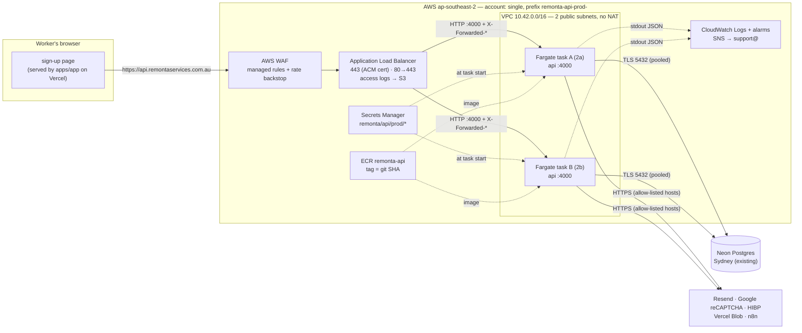
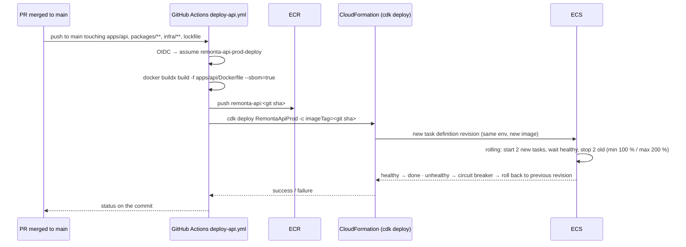

# S1 — Deployment architecture: `apps/api` on AWS

**Unit:** S1-registration. **Date:** 2026-09-28. **Status:** for the user's review.
Read with `infrastructure-design.md` (the components, sizes, IAM, alarms, NFR mapping).

## 1. Runtime topology



**Request path.** Browser → DNS (Vercel DNS: `api` CNAME → the ALB's name) → WAF → ALB (TLS ends here) → one healthy task over HTTP with `X-Forwarded-Proto: https` and `X-Forwarded-For` → the service's pipeline (`TRUST_PROXY=1` makes it read those headers; the HTTPS check passes; rate limits key on the real client IP).

**Health path.** ALB node → `GET /v1/health` on each task every 15 s, plain HTTP, no forwarded headers → served because the entry is a `probe` (infrastructure-design §4) → 200 only if `SELECT 1` answers.

**Background work.** Both tasks poll the outbox every 2 s and tick the scheduler; the lease rows make each event and each job run on one task at a time. Nothing else is needed for this; there is no leader.

## 2. Build → registry → deploy



- **Trigger (Q7.2 A):** `push` to `main` with path filters `apps/api/**`, `packages/**`, `infra/**`, `pnpm-lock.yaml`, `.github/workflows/deploy-api.yml`. Concurrency group `deploy-api`, no cancel (a deploy in flight finishes; the next waits).
- **Gate:** the workflow runs only when the same commit's `API Quality` check has passed (`workflow_run` on CI (api) completed with success, or a `needs` on a job that re-runs the quality gate; the design chooses **re-running `pnpm --filter @remonta/api run quality` inside the deploy workflow**, because `workflow_run` cannot use path filters and quality takes ~3 min). No deploy without green quality.
- **Image:** built once, on `ubuntu-latest`, `linux/amd64`, with `--sbom=true --provenance=true`; tag `<git sha>`; ECR **immutable tags** so a tag can never be re-pointed; scan on push; lifecycle keeps the last 20.
- **Deploy:** `cdk deploy --require-approval never -c imageTag=<sha>`. The task definition's image is the only thing that changes on a code-only deploy; `cdk diff` in PRs (a separate job, read-only role) shows infrastructure changes before merge.
- **ECS deployment settings:** rolling, minimum healthy 100 %, maximum 200 %, **deployment circuit breaker on with rollback**, health check grace period 60 s, `stopTimeout` 30 s (the service drains in well under that).
- **Migrations** are not in the pipeline (Q4.3 A). Expand-only migrations mean a new image never depends on a migration that has not run; the runbook orders them.

## 3. Rollback

| Situation | Action | Time |
|---|---|---|
| New tasks fail health | Nothing: the circuit breaker restores the previous task definition | ~3 min, automatic; alarm `deployment-rolled-back` |
| New version is healthy but wrong | Re-run the deploy workflow with the previous commit's SHA (`workflow_dispatch` input `imageTag`); or in the console: ECS → service → update → previous task definition revision | ~3 min |
| Api-mode sign-ups misbehave (any cause) | Flip the switch back: Upstash key `switch:registration` = `legacy`. No deploy; takes effect on the next page load | seconds |
| Infrastructure change is wrong | `cdk deploy` of the previous `infra/` commit; CloudFormation rolls back failed stack updates on its own | minutes |
| Database | Not this unit: `S1-production-run.md` "Rollback" |

The image for any previous commit stays in ECR (last 20) — rollback is a redeploy of an existing image, never a rebuild (the same rule CLAUDE.md sets for Vercel).

## 4. Repository changes this unit adds

| Path | Content |
|---|---|
| `infra/` (`@remonta/infra`) | CDK app: `bin/remonta-api.ts`, `lib/api-stack.ts` (VPC, ALB, WAF, ECR, ECS, secrets references, logs, alarms, dashboard), `lib/github-oidc.ts` (provider + deploy role), `cdk.json`, tests (`cdk assertions`: the api security group admits only the ALB; every secret name is in the allowed list; log retention 90 days; tags immutable). Its own `quality` script (lint, tsc, tests, `cdk synth`) |
| `.github/workflows/deploy-api.yml` | §2 |
| `.github/workflows/ci-infra.yml` | `pnpm --filter @remonta/infra run quality` + `cdk diff` (read-only role) on PRs touching `infra/**` |
| `packages/api-contract/src/meta.ts`, `apps/api/src/platform/contract/binder.ts`, `apps/api/src/app.ts`, `packages/api-contract/src/platform.contract.ts` | `probe: true` replacing `loadShedding: 'exempt'` (infrastructure-design §4) |
| `apps/api/Dockerfile`, `.dockerignore` | Already written and verified (2026-09-28) |
| `CLAUDE.md` | A short "apps/api on AWS" section: how to see logs, how to roll back, the switch |

## 5. First-deploy runbook

Order matters. Steps marked **(user)** need the user's credentials or accounts; the rest is done from the repository.

**0. Before AWS (user)**
- Neon console: note the plan; set history retention to the plan's maximum (Q4.1). Copy the **pooled** connection string for a later step (not into chat).
- Resend: verify the `remontaservices.com.au` sender domain (SPF/DKIM records in Vercel DNS). Until done, `EMAIL_FROM` can only deliver to the account owner.
- Confirm the list of origins the sign-up page is served from (infrastructure-design §6, open point).
- Step 2 of the path (`S1-production-run.md`) must have run: the api's reconciler and suburb lookups expect the S1 tables.

**1. AWS account bootstrap (user, once, ~20 min)**
- An IAM identity with administrator access for the bootstrap only (not used afterwards).
- `cdk bootstrap aws://<account>/ap-southeast-2` from the repo (`pnpm --filter @remonta/infra exec cdk bootstrap`).
- Deploy the OIDC stack first: `cdk deploy RemontaGithubOidc` (creates the provider and `remonta-api-prod-deploy`). Add the role ARN to GitHub as a repository **variable** (`AWS_DEPLOY_ROLE_ARN`; it is not a secret).

**2. Certificate and DNS (user, in Vercel DNS, ~15 min incl. validation)**
- The stack requests an ACM certificate for `api.remontaservices.com.au` with DNS validation; the first `cdk deploy` prints the validation CNAME (name + value). Add it in Vercel → Domains → `remontaservices.com.au` → DNS records. The deploy waits until ACM sees it (typically 5–10 min).
- After the stack completes, add `api` **CNAME** → the ALB DNS name the stack outputs (`ApiLoadBalancerDns`). TTL 60 for the first day.

**3. Secrets (user, Secrets Manager console, ~10 min)**
- Create the six secrets from infrastructure-design §6 with exactly those names, plain-text values. The stack references them by name; a task fails to start (and the deploy rolls back) if one is missing, which is the intended behaviour.

**4. First deploy (from the repository)**
- Merge the PR containing `infra/`, the workflow and the `probe` change. The workflow builds and deploys. Watch: Actions → deploy-api; ECS → service events; the target group's targets turn `healthy`.
- Confirm the SNS subscription email at `support@remontaservices.com.au` **(user)**; alarms are silent until then.

**5. Verify with the switch OFF (nothing user-facing changes yet)**
- `curl -i https://api.remontaservices.com.au/v1/health` → 200 `{"status":"ok"}`, `x-request-id`, HSTS, security headers.
- `curl -i http://api.remontaservices.com.au/v1/health` → 301 to https.
- `curl -s "https://api.remontaservices.com.au/v1/localities?q=parra"` → suburbs with ids (proves the database and the S1 tables).
- A photo upload with a real reCAPTCHA token from the app's preview, or the test harness's multipart request → 201 and an object in Vercel Blob.
- CloudWatch: logs arriving; the reconciler's first run logged (`scheduled job finished`, job `onboarding-reconciler`); no `request failed`.
- WAF: sampled requests show `ALLOW`; send a request with a 20 KB body to `/v1/registrations/worker` → 413 from the service, not a WAF block (proves the `SizeRestrictions_BODY` override).
- Kill one task in the console → the ALB stops routing to it within 45 s; ECS starts a replacement; `healthy-hosts` alarm fires and clears (proves the alarm path end to end).

**6. Turn the switch on (user, canary)**
- Vercel → `remonta-app` → environment variables: `NEXT_PUBLIC_API_URL=https://api.remontaservices.com.au`, `NEXT_PUBLIC_RECAPTCHA_SITE_KEY=<the v3 site key>`; redeploy the app (a promote of the current build with the new variables).
- Upstash: `switch:registration` = `api`. Do one real sign-up with a test email; confirm: the confirmation email arrives, the audit row `ACCOUNT_REGISTERED` exists, the outbox event is `DONE`, the worker appears in the admin list. Note: until step 5 of the path (CRM notification) ships, api-mode sign-ups do **not** reach Zoho; keep the canary short or hold the flip until it ships — the user's call at that point.
- Rollback at any time: `switch:registration` = `legacy`.

**7. Afterwards**
- Record in CLAUDE.md: the ECR repository, the ECS service name, "rollback = redeploy the previous SHA", and re-record the Vercel known-good deployment ids (they predate 2026-09-28).
- Delete the bootstrap admin access key if one was created.

## 6. Operations reference (goes into CLAUDE.md when approved)

```
Logs:      CloudWatch → /remonta/api/prod  (filter: { $.reqId = "<x-request-id>" })
Health:    https://api.remontaservices.com.au/v1/health
Deploy:    merge to main (apps/api, packages, infra) → Actions "deploy-api"
Rollback:  Actions → deploy-api → Run workflow → imageTag=<previous sha>
           or ECS → remonta-api-prod → Update → previous task definition
Switch:    Upstash key switch:registration = api | legacy   (no deploy needed)
Secrets:   Secrets Manager remonta/api/prod/*  (changing one: update value, then
           ECS → Update service → Force new deployment; tasks read secrets at start)
Alarms:    SNS remonta-api-prod-alerts → support@remontaservices.com.au
```
