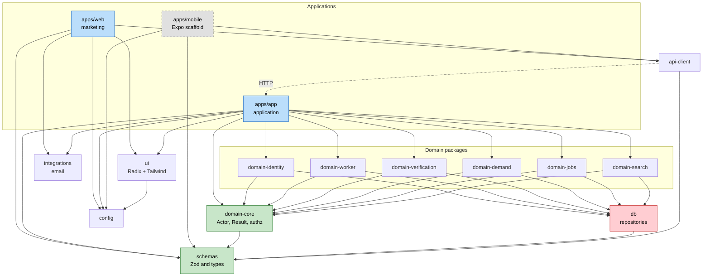
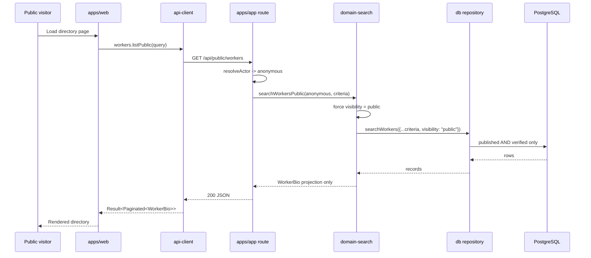
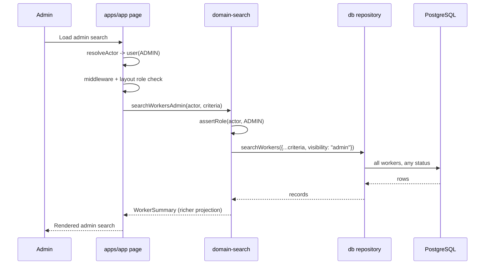
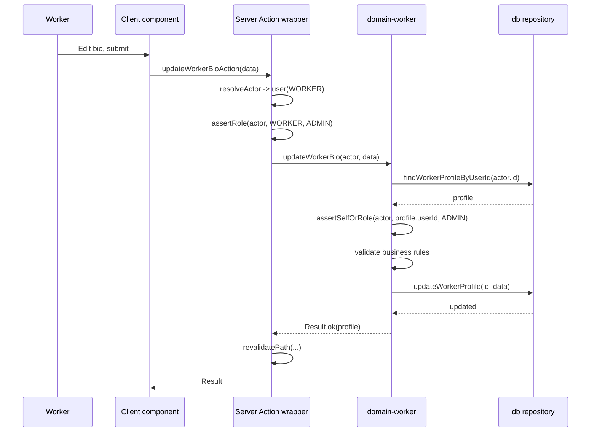

# Component Dependencies

**Stage**: INCEPTION — Application Design
**Date**: 2026-09-09

Dependency matrix, communication patterns and data flow. The rules here are enforced by manifest
omission plus a CI boundary check (AD-10, AD-11).

---

## Dependency Graph



### Text Alternative

`apps/web` depends on `api-client`, `ui`, `schemas`, `integrations` and `config` — and on nothing
else. It reaches the application over HTTP through `api-client`.

`apps/app` depends on all six domain packages, plus `domain-core`, `ui`, `schemas`,
`integrations` and `config`.

`apps/mobile` depends on `api-client`, `schemas` and `config` only.

Each of the six domain packages depends on `domain-core` and `db`, and on **no other domain
package**. `domain-core`, `db` and `api-client` each depend on `schemas`. `ui` depends on
`config`. `schemas` and `config` depend on nothing.

---

## Dependency Matrix

Rows may import columns. **`—` means forbidden**, and forbidden entries are enforced, not
conventional.

| ↓ imports → | config | schemas | domain-core | db | integrations | ui | api-client | domain-* | apps/app |
|---|---|---|---|---|---|---|---|---|---|
| **apps/web** | ✅ | ✅ | — | **—** | ✅ | ✅ | ✅ | **—** | HTTP only |
| **apps/app** | ✅ | ✅ | ✅ | via domain | ✅ | ✅ | — | ✅ | — |
| **apps/mobile** | ✅ | ✅ | — | **—** | — | **—** | ✅ | **—** | HTTP only |
| **domain-\*** | ✅ | ✅ | ✅ | ✅ | — | — | — | **—** | — |
| **domain-core** | ✅ | ✅ | — | — | — | — | — | — | — |
| **db** | ✅ | ✅ | — | — | — | — | — | — | — |
| **api-client** | ✅ | ✅ | — | — | — | — | — | — | — |
| **ui** | ✅ | ✅ | — | — | — | — | — | — | — |
| **integrations** | ✅ | ✅ | — | — | — | — | — | — | — |
| **schemas** | ✅ | — | — | — | — | — | — | — | — |
| **config** | — | — | — | — | — | — | — | — | — |

### The five critical prohibitions

| # | Rule | Why | Enforced by |
|---|---|---|---|
| **P-1** | `apps/web` must not import `db` | D-35 — marketing holds no database access. This is the isolation the whole consolidation rests on. | Manifest omission + CI check + no connection string in its Vercel env |
| **P-2** | `apps/web` must not import any `domain-*` | Same reason — domain packages import `db` transitively | Manifest omission + CI check |
| **P-3** | `apps/mobile` must not import `db` or `domain-*` | AD-11 — a mobile client reaches data over HTTP only | Manifest omission + CI check |
| **P-4** | No `domain-*` may import another `domain-*` | Prevents dependency cycles; cross-domain work is orchestrated in transport (see `services.md`) | CI check |
| **P-5** | `schemas` must not import Next.js, React, the DOM or Prisma | It is the contract Expo consumes; any of these breaks that | CI check + dependency audit |

P-4 deserves emphasis. Without it, `domain-worker` would import `domain-verification` for
requirement derivation, and `domain-verification` would import `domain-worker` to read profiles —
an immediate cycle. Orchestration in transport is what avoids it, and is the main reason AD-01's
package split is workable at all.

---

## Communication Patterns

### In-process function calls
Everything within `apps/app`. Transport calls domain; domain calls repositories. Synchronous,
typed, no serialisation.

### Next.js Server Actions
Client components in `apps/app` to its own transport layer. Next's RPC protocol. **This is
`apps/app`-internal and never crosses a package boundary** — the wrapper is in the app, and only
the wrapper calls the domain.

### HTTP — `apps/web` to `apps/app`
The only cross-application communication. Public endpoints only, through `api-client`.

| Property | Value |
|---|---|
| Direction | `apps/web` → `apps/app`, one-way |
| Transport | HTTPS |
| Authentication | None — public endpoints only |
| Surface | `/api/public/workers` and successors |
| Failure mode | Degrade gracefully; must not error the marketing page |
| Rate limiting | Required (SECURITY-11) |

### HTTP — `apps/mobile` to `apps/app`
Future. Same client, authenticated with bearer tokens once mobile authentication exists. The
`getToken` hook on `createApiClient` reserves the seam.

### External service calls
`apps/app` to Zoho, Blob, Redis, geocoding, SMS and reCAPTCHA. Both apps to Resend for email via
`packages/integrations`. All initiated from transport, never from domain packages.

---

## Data Flow — Worker Search

The flow that carries the RISK-2 / FR-10.7 security boundary, shown for both audiences.





### Text Alternative

**Public path**: a visitor loads a marketing directory page. `apps/web` calls `api-client`, which
issues an HTTPS GET to `apps/app`'s `/api/public/workers`. The route resolves an anonymous actor
and calls `searchWorkersPublic`, which forces `visibility: "public"` internally before calling the
repository. The database returns only published, verified workers, and only the `WorkerBio`
projection reaches the visitor.

**Admin path**: an admin loads the admin search inside `apps/app`. Middleware and the layout
enforce the ADMIN role, then `searchWorkersAdmin` asserts it again in the domain before calling
the repository with `visibility: "admin"`. All workers are returned regardless of status, in the
richer `WorkerSummary` projection.

**Why two functions rather than one with a parameter**: the dangerous capability has no
anonymous-reachable code path. `PublicSearchCriteria` has no visibility field to set,
`searchWorkersAdmin` asserts ADMIN as its first statement, and `api-client` exposes no method
that reaches it. A mistake in one layer does not expose unverified worker profiles.

---

## Data Flow — Worker Profile Update



### Text Alternative

The worker submits a bio edit from a client component, which invokes a Server Action wrapper. The
wrapper resolves the session into an Actor and applies the coarse role check, then calls
`updateWorkerBio` with the actor. The domain loads the profile, performs the object-level
ownership check (the worker owns it, or the actor is an admin), validates business rules, and
writes through the repository. On success the wrapper revalidates the Next.js cache and returns
the Result.

**The two authorization checks are the point** (AD-05). The transport check is coarse and could be
forgotten in a new route. The domain check cannot be, because it lives inside the function that
performs the mutation — which is precisely the protection missing from the current codebase, where
TD-1's endpoint had no check at all and TD-4's role check silently never fired.

---

## Migration Sequence Implied by These Dependencies

Because packages may only depend on packages below them, extraction must proceed bottom-up:

```
1. config            no dependencies
2. schemas           config only
3. domain-core       schemas
4. db                schemas
5. integrations      schemas
6. ui                config
7. domain-*  (six)   domain-core, db
8. api-client        schemas
9. apps/app          rewire to packages
10. apps/web         rewire to api-client; remove DB access
11. apps/mobile      scaffold
```

This ordering maps onto the Units Generation stage. Steps 1–2 fall inside U1/U2, steps 3–8 in
U3–U6, and steps 9–11 in U7–U10.

**Under incremental delivery (D-40) each step must leave both apps deployable.** Temporary
re-export shims are expected: for instance, `apps/app/src/lib/auth.ts` becomes a re-export of
`packages/domain-identity` until every call site is updated, then is deleted by the unit that
completes the move.
