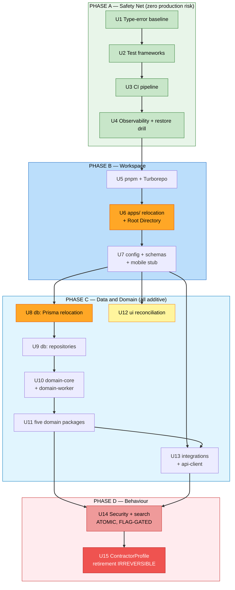

# Unit Dependencies

**Stage**: INCEPTION — Units Generation (Part 2)
**Date**: 2026-09-10

---

## Dependency Graph

### Text Alternative

Phase A runs strictly in sequence: U1 type-error baseline, then U2 test frameworks, then U3 CI
pipeline, then U4 observability and restore drill. None of these change the runtime path.

Phase B follows: U5 pnpm and Turborepo, then U6 the apps relocation and Root Directory change
(highest deployment risk, shown in orange), then U7 config and schemas plus the mobile stub.

Phase C branches from U7. The main chain is U8 Prisma relocation (also orange — most likely build
break), then U9 repositories, then U10 domain-core with domain-worker, then U11 the remaining five
domain packages. Two units branch off U7 independently and can run in parallel: U12 UI
reconciliation (yellow — visual risk) and U13 integrations and api-client, though U13 also needs
U11.

Phase D: U14 security fixes and search re-point (red, atomic and flag-gated) requires both U11 and
U13. U15 ContractorProfile retirement (dark red, irreversible) requires U14.

---

## Dependency Matrix

| Unit | Depends on | Blocks | Parallelisable with |
|---|---|---|---|
| U1 | — | U2 | — |
| U2 | U1 | U3 | — |
| U3 | U2 | U4 | — |
| U4 | U3 | U5 | — |
| U5 | U4 | U6 | — |
| U6 | U5 | U7 | — |
| U7 | U6 | U8, U12, U13 | — |
| U8 | U7 | U9 | U12 |
| U9 | U8 | U10 | U12 |
| U10 | U9 | U11 | U12 |
| U11 | U10 | U13, U14 | U12 |
| U12 | U7 | — | U8–U11, U13 |
| U13 | U7, U11 | U14 | U12 |
| U14 | U11, U13 | U15 | — |
| U15 | U14 | — | — |

**Critical path**: U1 → U2 → U3 → U4 → U5 → U6 → U7 → U8 → U9 → U10 → U11 → U13 → U14 → U15
(14 of 15 units). Only **U12** sits off it.

That the critical path is nearly the whole set is a direct consequence of the production-safety
constraint: each unit must land, deploy and be verified before the next begins (P3=A, D2=A).
Parallelism was traded for attributability — if production breaks after a deploy, exactly one
unit is responsible.

---

## Why Each Dependency Exists

| Edge | Reason |
|---|---|
| U1 → U2 | Test config must type-check under the restored compiler |
| U2 → U3 | CI cannot run tests that do not exist |
| U3 → U4 | Alerting and health checks belong under the same gate as everything else |
| U4 → U5 | **Ordering choice, not technical necessity.** With P3=A every unit deploys to production, so observability must exist before the first structural change. Answer P7 drove this. |
| U5 → U6 | Directories cannot move into a workspace that does not exist |
| U6 → U7 | Packages live beside `apps/`, which U6 creates |
| U7 → U8 | `packages/db` depends on `packages/schemas` |
| U8 → U9 | Repositories need the relocated Prisma client |
| U9 → U10 | Domain packages call repositories (AD-07) |
| U10 → U11 | The `Actor` pattern is proven on one domain before five more repeat it |
| U7 → U12 | `packages/ui` needs the shared Tailwind theme from `packages/config` |
| U11 → U13 | `api-client` types mirror endpoints that domain packages now back |
| U11 + U13 → U14 | `domain-search` supplies both search functions; `api-client` gives marketing its route |
| U14 → U15 | Nothing may still read `ContractorProfile` when it is retired |

---

## Risk Profile by Unit

| Unit | Production risk | Failure mode | Recovery |
|---|---|---|---|
| U1–U4 | **None** | Runtime path untouched | `git revert` |
| U5 | Low | pnpm surfaces a phantom dependency; build fails | `git revert` |
| **U6** | **High** | Build succeeds, runtime broken | **Promote recorded deployment ID — seconds** |
| U7 | Low | Import path missed; build fails | `git revert` |
| **U8** | **High** | **Build succeeds, Prisma engine unbundled, all queries 500** | `git revert` |
| U9 | **None** | Purely additive; nothing calls it | `git revert` |
| U10 | Medium | Behaviour drift during refactor | `git revert` |
| U11 | Medium | Same, across five packages | `git revert` |
| U12 | Medium | **Visual regression** — the type system cannot catch it | `git revert` |
| U13 | Low | Email or client misconfiguration | `git revert` |
| **U14** | **High** | **Wrong workers exposed, or admins locked out** | **Disable feature flag — no redeploy** |
| **U15** | **High** | Forgotten dependency on a dropped table | **Restore from backup** (static table, lossless) |

### The four units needing the most care

**U6** and **U8** share a failure mode that ordinary verification misses: *the build succeeds and
the runtime fails.* Preview verification for both **must exercise a database-backed page**, not
merely load a static one. A green build proves nothing here.

**U12** is the only unit whose regression the type system cannot catch. Sixteen primitive pairs
drifted independently for eleven months; reconciling them wrongly changes one product's appearance
silently. Verification must include visual comparison against pre-change screenshots of key pages
in both apps.

**U14** is the only unit that changes behaviour by design, and it carries the RISK-2 security
boundary. The feature flag makes its rollback a switch rather than a deploy.

---

## Sequencing Notes

**U12 is the only parallelisation opportunity.** It branches from U7 and blocks nothing. Running
it alongside U8–U11 saves roughly 2–3 weeks. With a solo developer (D-20) that means interleaving
rather than true concurrency — reasonable, since UI reconciliation is a different kind of work
from domain extraction and provides a change of pace, but it does mean two open branches. If that
feels risky, run it after U11 and accept the extra weeks.

**U11 may be split.** If U10 shows the `Actor` conversion is harder than expected, split U11 into
five units — one per domain package. Doing so needs no re-planning: the dependencies stay the
same, and the smaller units are strictly safer.

**Phase A must not be compressed.** It is tempting to merge U1–U4 since none carries production
risk. Don't: each is separately verifiable, and U4 in particular is what makes the following
eleven production deploys observable. Merging them saves days and costs the safety net's clarity.

**U15 waits for real elapsed time.** The 1-day dormancy is calendar time, not effort. Do not
compress it by working through — the point is that a scheduled process gets a chance to fail
loudly before the table disappears.
