# Execution Plan — Monorepo Consolidation

**Project**: Remonta Marketplace
**Stage**: INCEPTION — Workflow Planning
**Date**: 2026-09-09
**Status**: Awaiting approval — delivery model confirmed incremental (D-40)

---

## 1. Detailed Analysis Summary

### Transformation Scope

- **Transformation Type**: **Architectural** — repository restructure plus data-store consolidation. Not an infrastructure migration (the runtime stays Vercel serverless on Neon PostgreSQL) and not a single-component change.
- **Primary Changes**:
  1. Two products currently maintained as two divergent git branches become two apps in one monorepo
  2. Shared code extracted into six packages
  3. Two databases consolidate to one; the marketing product loses direct database access entirely
  4. `ContractorProfile` and its live Zoho sync are retired; `WorkerProfile` becomes the single worker record
  5. Quality gates (type checking, CI, test frameworks) established from nothing
- **Related Components**: all 691 source files across both products, both Prisma schemas, both Vercel projects, and the Zoho, Blob and Redis integrations.

### Change Impact Assessment

| Area | Impact | Detail |
|---|---|---|
| **User-facing changes** | **Yes** | Marketing's public worker directory changes data source (`ContractorProfile` → `WorkerProfile` via `/api/public/workers`). The app's contractor search changes source and visibility rules. Coordinator dashboard gains role enforcement it currently lacks. |
| **Structural changes** | **Yes — the core of the work** | Monolithic per-branch products become a Turborepo workspace with 3 apps and 6 packages. |
| **Data model changes** | **Yes** | `ContractorProfile`, `ContractorsbyArea` and the legacy `Job` retired. Five dead model declarations removed from the app's `schema.prisma`. Marketing database decommissioned. |
| **API changes** | **Yes** | Six routes retired (`/api/contractors`, `/api/contractors/[id]`, `/api/contractors-by-area`, `/api/sync-contractors`, `/api/webhooks/zoho-contractor`, and marketing's duplicate `/api/sync-jobs`). One new worker-search endpoint. One route removed for security (`/api/admin/fix-qualifications`). Nine drifted shared endpoints reconciled to one implementation each. |
| **NFR impact** | **Yes — substantial** | 40 blocking extension rules now apply. Security headers, structured logging, alerting, health checks, SBOM and vulnerability scanning must be introduced; none exist today. |

### Component Relationships

- **Primary Components**: `apps/web` (marketing, from `main`), `apps/app` (application, from `app/main`)
- **New Shared Components**: `packages/db`, `packages/schemas`, `packages/domain`, `packages/api-client`, `packages/ui`, `packages/config`
- **Infrastructure Components**: `vercel.json` ×2, `next.config.ts` ×2, Turborepo config, pnpm workspace, CI pipeline (new)
- **Dependent Components**: `apps/mobile` (scaffold only, consumes `api-client` and `schemas`)
- **Supporting Components**: Prisma generate pipeline, the committed generated client, Zoho/Blob/Redis integration clients

| Component | Change Type | Change Reason | Priority |
|---|---|---|---|
| `apps/app` | Major | Source of most extracted code; loses 2 routes, gains 1 | Critical |
| `apps/web` | Major | Loses all database access; directory re-pointed to API | Critical |
| `packages/domain` | Major (new) | Server Action split required — see RISK-7 | Critical |
| `packages/db` | Major (new) | Single consolidated schema, generated client relocation | Critical |
| `packages/schemas` | Minor (new) | Move of existing Zod schemas and types | Important |
| `packages/api-client` | Minor (new) | New typed client over existing endpoints | Important |
| `packages/ui` | Major (new) | Single-stack primitives serving both web apps | Important |
| `packages/config` | Configuration (new) | Shared lint/ts/prettier/tailwind | Important |
| Prisma bundling config | Configuration | Paths break when the client moves — see R-5 | Critical |
| `apps/mobile` | Minor (new) | Expo scaffold only | Optional |

### Risk Assessment

- **Risk Level**: **HIGH**
- **Rollback Complexity**: **Difficult** — D-24 requires database-aware rollback, and the `ContractorProfile` retirement crosses a data boundary. Mitigated by FR-10.6's verify-then-drop sequence.
- **Testing Complexity**: **Complex** — no correctness tests exist today, so the safety net must be built before it can be relied upon.

**Principal risk drivers**:
1. Both products are live in production throughout
2. **149 existing TypeScript errors** (measured 2026-09-09) currently suppressed by `ignoreBuildErrors`
3. Zero unit or integration tests
4. A live Zoho integration being retired against unverified population overlap (RISK-10)
5. Solo developer (D-20) — mitigated by the move to incremental delivery (D-40), see §7

---

## 2. Measured Type-Error Backlog

`npx tsc --noEmit` was run against `app/main` to size the first unit. **149 errors.**

| Location | Errors |
|---|---|
| `src/app/dashboard` | 37 |
| `src/app/api` | 30 |
| `src/components/pdf` | 20 |
| `src/schema` | 15 |
| `src/lib` | 14 |
| `src/components/dashboard` | 14 |
| `src/services/worker` | 8 |
| `src/components/requirements-setup` | 5 |
| `src/components/services-setup` | 4 |
| other | 2 |

| Error code | Count | Meaning |
|---|---|---|
| TS2339 | 57 | Property does not exist on type |
| TS2322 | 25 | Type not assignable |
| TS7006 | 14 | Implicit `any` parameter |
| TS2345 | 13 | Argument type mismatch |
| TS2304 | 11 | Cannot find name |
| TS2769 | 10 | No overload matches |

**This matters more than the count suggests.** 14 errors sit in `src/lib` and 8 in
`src/services/worker` — precisely the code destined for `packages/domain` and `packages/db`.
Moving code with unresolved type errors into shared packages propagates them to every consumer.
Errors in `src/schema` (15) affect `packages/schemas`, which mobile will depend on.

Sample errors indicate real defects, not merely missing annotations — for example
`setupProgress.service.ts:1572` compares a `RequirementStatus` against `"PENDING_REVIEW"`, a value
that enum does not contain, so the comparison is always false.

---

## 3. Workflow Visualization

```mermaid
flowchart TD
    Start(["Monorepo Consolidation Request"])

    subgraph INCEPTION["INCEPTION PHASE"]
        WD["Workspace Detection<br/><b>COMPLETED</b>"]
        RE["Reverse Engineering<br/><b>COMPLETED</b>"]
        RA["Requirements Analysis<br/><b>COMPLETED</b>"]
        US["User Stories<br/><b>SKIPPED</b>"]
        WP["Workflow Planning<br/><b>IN PROGRESS</b>"]
        AD["Application Design<br/><b>EXECUTE</b>"]
        UG["Units Generation<br/><b>EXECUTE</b>"]
    end

    subgraph CONSTRUCTION["CONSTRUCTION PHASE"]
        FD["Functional Design<br/>per unit<br/><b>EXECUTE</b>"]
        NFRA["NFR Requirements<br/>per unit<br/><b>EXECUTE</b>"]
        NFRD["NFR Design<br/>per unit<br/><b>EXECUTE</b>"]
        ID["Infrastructure Design<br/>per unit<br/><b>EXECUTE</b>"]
        CG["Code Generation<br/>per unit<br/><b>EXECUTE</b>"]
        BT["Build and Test<br/><b>EXECUTE</b>"]
    end

    subgraph OPERATIONS["OPERATIONS PHASE"]
        OPS["Operations<br/><b>PLACEHOLDER</b>"]
    end

    Start --> WD
    WD --> RE
    RE --> RA
    RA --> US
    US --> WP
    WP --> AD
    AD --> UG
    UG --> FD
    FD --> NFRA
    NFRA --> NFRD
    NFRD --> ID
    ID --> CG
    CG -->|Next Unit| FD
    CG --> BT
    BT --> OPS
    BT --> Done(["Complete"])

    style WD fill:#4CAF50,stroke:#1B5E20,stroke-width:3px,color:#fff
    style RE fill:#4CAF50,stroke:#1B5E20,stroke-width:3px,color:#fff
    style RA fill:#4CAF50,stroke:#1B5E20,stroke-width:3px,color:#fff
    style WP fill:#4CAF50,stroke:#1B5E20,stroke-width:3px,color:#fff
    style CG fill:#4CAF50,stroke:#1B5E20,stroke-width:3px,color:#fff
    style BT fill:#4CAF50,stroke:#1B5E20,stroke-width:3px,color:#fff
    style US fill:#BDBDBD,stroke:#424242,stroke-width:2px,stroke-dasharray: 5 5,color:#000
    style AD fill:#FFA726,stroke:#E65100,stroke-width:3px,stroke-dasharray: 5 5,color:#000
    style UG fill:#FFA726,stroke:#E65100,stroke-width:3px,stroke-dasharray: 5 5,color:#000
    style FD fill:#FFA726,stroke:#E65100,stroke-width:3px,stroke-dasharray: 5 5,color:#000
    style NFRA fill:#FFA726,stroke:#E65100,stroke-width:3px,stroke-dasharray: 5 5,color:#000
    style NFRD fill:#FFA726,stroke:#E65100,stroke-width:3px,stroke-dasharray: 5 5,color:#000
    style ID fill:#FFA726,stroke:#E65100,stroke-width:3px,stroke-dasharray: 5 5,color:#000
    style OPS fill:#BDBDBD,stroke:#424242,stroke-width:2px,stroke-dasharray: 5 5,color:#000
    style INCEPTION fill:#BBDEFB,stroke:#1565C0,stroke-width:3px,color:#000
    style CONSTRUCTION fill:#C8E6C9,stroke:#2E7D32,stroke-width:3px,color:#000
    style OPERATIONS fill:#FFF59D,stroke:#F57F17,stroke-width:3px,color:#000
    style Start fill:#CE93D8,stroke:#6A1B9A,stroke-width:3px,color:#000
    style Done fill:#CE93D8,stroke:#6A1B9A,stroke-width:3px,color:#000

    linkStyle default stroke:#333,stroke-width:2px
```



### Text Alternative

**INCEPTION PHASE**: Workspace Detection (COMPLETED) → Reverse Engineering (COMPLETED) →
Requirements Analysis (COMPLETED) → User Stories (SKIPPED at user request) → Workflow Planning
(IN PROGRESS) → Application Design (EXECUTE) → Units Generation (EXECUTE).

**CONSTRUCTION PHASE**, looping per unit: Functional Design (EXECUTE) → NFR Requirements
(EXECUTE) → NFR Design (EXECUTE) → Infrastructure Design (EXECUTE) → Code Generation (EXECUTE),
then back to Functional Design for the next unit. After all units complete: Build and Test
(EXECUTE).

**OPERATIONS PHASE**: Operations (PLACEHOLDER, not implemented).

---

## 4. Phases to Execute

### INCEPTION PHASE

- [x] **Workspace Detection** — COMPLETED
- [x] **Reverse Engineering** — COMPLETED (10 artifacts)
- [x] **Requirements Analysis** — COMPLETED (39 decisions, FR-1..FR-10, NFR-1..NFR-7, 10 risks)
- [x] **User Stories** — **SKIPPED**
  - **Rationale**: Skipped at explicit user request. My assessment recommended executing it, because the migration changes user-visible behaviour across four personas and the search-visibility rules (FR-4.2, FR-10.7) form the RISK-2 security boundary. **Consequence**: acceptance criteria for those visibility rules must be captured during Functional Design instead. Recorded so the gap is deliberate rather than accidental.
- [x] **Workflow Planning** — IN PROGRESS
- [ ] **Application Design** — **EXECUTE**
  - **Rationale**: Six new packages must have their boundaries, public interfaces and dependency directions defined before any code moves. Specifically: which of the 24 `src/lib` modules belong in `packages/domain`; how the 56 Server Actions split into framework-neutral functions plus thin wrappers (RISK-7); what `packages/api-client` exposes; and how `packages/db` is consumed without leaking to `apps/web` (D-35). This is the single highest-value design stage for this work.
- [ ] **Units Generation** — **EXECUTE**
  - **Rationale**: The work spans 3 apps and 6 packages with real ordering constraints. Decomposition into units with an explicit dependency graph is required to sequence safely and to keep both products deployable throughout (NFR-2.1).

### CONSTRUCTION PHASE (per unit)

- [ ] **Functional Design** — **EXECUTE** (selectively per unit)
  - **Rationale**: Execute for units that change behaviour — worker search re-pointing and its visibility rules, `ContractorProfile` retirement sequencing, the Server Action split. Skip for pure-move units where behaviour is unchanged. Also carries the acceptance criteria displaced by skipping User Stories.
- [ ] **NFR Requirements** — **EXECUTE**
  - **Rationale**: All three extensions are enabled with 40 blocking rules. Security (headers, authorization, rate limiting, supply chain), resiliency (RTO/RPO hours, backup and restore, health checks) and PBT (framework selection, property identification) requirements must be stated per unit.
- [ ] **NFR Design** — **EXECUTE**
  - **Rationale**: NFR Requirements executes, so its patterns must be designed. Includes structured logging, alerting, CSP and HSTS, and the property-based testing approach — none of which exist today.
- [ ] **Infrastructure Design** — **EXECUTE**
  - **Rationale**: Deployment topology changes materially — two Vercel projects targeting app directories in one repo, Turborepo remote caching, blue/green semantics, database-aware rollback (D-24), and the Prisma generated-client bundling problem (R-5) which is already the most fragile part of the current deployment.
- [ ] **Code Generation** — **EXECUTE** (always)
- [ ] **Build and Test** — **EXECUTE** (always)

### OPERATIONS PHASE

- [ ] **Operations** — PLACEHOLDER

---

## 5. Proposed Unit Decomposition

Provisional — Units Generation will finalise this. Presented now so the sequence can be reviewed.

| Unit | Name | Scope | Depends on |
|---|---|---|---|
| **U1** | Quality Foundation | Remove `ignoreBuildErrors`/`ignoreDuringBuilds`, baseline the 149 errors, establish test runner + PBT framework, CI pipeline, `packages/config` | — |
| **U2** | Monorepo Scaffold | Turborepo + pnpm workspace, import both products as snapshots (D-09), empty package shells | U1 |
| **U3** | Data and Contracts | `packages/db` (consolidated Prisma), `packages/schemas` (Zod + types, dependency-free) | U2 |
| **U4** | Domain Extraction | `packages/domain` — Server Action split (RISK-7); thin wrappers remain in `apps/app` | U3 |
| **U5** | Shared UI | `packages/ui` — single-stack tokens and primitives, consumed by both web apps | U2 |
| **U6** | API Client | `packages/api-client` — typed client over `apps/app` endpoints | U3 |
| **U7** | Search Re-point + Security | FR-4 (worker search on `WorkerProfile`), FR-5 (four security fixes), FR-10.7 (endpoint segregation). **U7 is atomic — RISK-2 forbids shipping FR-4.2 without FR-5.2** | U3, U6 |
| **U8** | ContractorProfile Retirement | FR-10.4 and FR-10.6 verify-then-drop sequence, including the mandatory population comparison | U7 |
| **U9** | Deployment and Process | Vercel project config, Prisma bundling (R-5), blue/green, database-aware rollback, process artifacts (FR-8). **No cutover event** under D-40 | U4, U5, U7 |
| **U10** | Mobile Scaffold | `apps/mobile` Expo shell only — no features (D-29) | U6 |

### Dependency graph

```
U1 → U2 → U3 → U4 ─┐
          │  └→ U6 ─┼→ U7 → U8
          └→ U5 ────┤
                    └→ U9
              U6 → U10
```

**Critical path**: U1 → U2 → U3 → U4 → U9
**Parallelisable**: U5 alongside U3/U4; U10 any time after U6
**Atomic**: U7 must ship as one change (RISK-2)

---

## 6. Module Update Strategy

- **Update Approach**: **Hybrid** — sequential on the critical path, parallel for U5 and U10
- **Critical Path**: U1 (quality gates) blocks everything. U3 (`packages/db`, `packages/schemas`) blocks U4, U6, U7
- **Coordination Points**:
  - `packages/schemas` is consumed by `apps/app`, `packages/api-client` and eventually `apps/mobile` — breaking changes ripple to three consumers
  - `packages/db` must never be imported by `apps/web` (D-35); enforce with lint rule or package boundary check
  - The Prisma generated client is force-bundled by both `next.config.ts` and `vercel.json`; U3 and U9 must coordinate on this
- **Testing Checkpoints**: after U1 (gates function), after U3 (both apps build against shared packages), after U7 (search behaves correctly and is properly guarded), and at every unit boundary (full k6 regression before U9 completes)
- **Rollback Strategy**: per-unit revert while both products remain deployable (NFR-2.1) — under D-40 incremental delivery this is the ONLY rollback path, since no parallel copy exists. U8 is the exception — its rollback is the dormancy period, and it becomes irreversible only at step 5

---

## 7. Delivery Model — CONFIRMED: Incremental

**Decision (user, 2026-09-09): incremental delivery** — D-40, revising D4=C. RISK-3 resolved.

The existing repository is restructured progressively, one unit at a time. There is one codebase
throughout, no second copy to keep in sync, and no cutover event.

| | Parallel (original D-17) | **Incremental (confirmed)** |
|---|---|---|
| Working tree | Two copies of both products until cutover | **One tree, restructured progressively** |
| Feature work during migration | Lands **twice** | **Lands once** |
| Cutover | Single high-stakes event | **No cutover event** |
| Drift risk | High — the mechanism that produced the current branch divergence | **Low** |
| Fit with solo developer (D-20) | Poor | **Good** |

### What this changes in execution

1. **U2 (Monorepo Scaffold) restructures the live repository** rather than creating a separate
   tree. `apps/` and `packages/` directories are introduced and code is moved into them in place.
2. **Every unit must leave both products deployable** (NFR-2.1). This is now a hard per-unit exit
   criterion, not merely a goal — there is no parallel copy to fall back on.
3. **Temporary shims are expected and legitimate.** Some units need path aliases or re-export
   files so old and new import paths both resolve while a move is in progress. These are tracked
   as deliberate, time-boxed artifacts and removed by the unit that completes the move.
4. **U9 is no longer a cutover unit.** It becomes deployment configuration and process artifacts
   only — the Vercel projects are re-pointed at app directories as part of U2, then refined.
5. **Feature work can continue on the same tree** without double-landing, which matters given
   D-20 (solo) and D-18 (no deadline).

### Accepted cost

The repository holds a mixed structure mid-migration — partly the old layout, partly packages.
This is visually untidy and can feel slow because there is no dramatic finish line. In exchange,
nothing is ever broken and work can stop at any unit boundary with a working system.

---

## 8. Estimated Timeline

Rough, for a solo developer with this as main focus (D-20, D-18). Ranges are wide because the
149-error backlog contains real defects whose fixes are not yet scoped.

| Unit | Estimate | Notes |
|---|---|---|
| U1 Quality Foundation | 2–4 weeks | Dominated by the type-error backlog and standing up test infrastructure from zero |
| U2 Monorepo Scaffold | 1 week | |
| U3 Data and Contracts | 1–2 weeks | |
| U4 Domain Extraction | 3–5 weeks | **Largest unit** — 56 Server Actions to split |
| U5 Shared UI | 2–3 weeks | Single-stack primitives; full consolidation deferred by D-14 |
| U6 API Client | 1–2 weeks | |
| U7 Search + Security | 1–2 weeks | Atomic |
| U8 Retirement | 1 week + dormancy | Dormancy is calendar time, not effort |
| U9 Deployment and Process | 1–2 weeks | R-5 is the risk here |
| U10 Mobile Scaffold | 1 week | Parallelisable |

- **Total active effort**: approximately **14–23 weeks**, less if U5 and U10 run in parallel
- **Total stages to execute**: 6 (2 INCEPTION + 4 CONSTRUCTION per-unit, plus Code Generation and Build and Test)

**Treat these as planning ranges, not commitments.** The largest uncertainties are the true cost
of the 149 type errors and the Server Action split in U4.

---

## 9. Success Criteria

**Primary Goal**: both products live in one repository as independently deployable apps, sharing
code through packages, with product ownership expressed by directory rather than branch name.

**Key Deliverables**
1. Turborepo + pnpm monorepo: 3 apps, 6 packages
2. Both products deploying independently from that repository
3. One database; the marketing product holding no database credential
4. `ContractorProfile` retired, `WorkerProfile` the single worker record
5. Four security findings resolved
6. Type checking, CI and test frameworks operational
7. `packages/schemas` and `packages/api-client` consumable by Expo
8. Process artifacts: change management, CI/CD, rollback, DR testing, incident response

**Quality Gates**
- [ ] `tsc --noEmit` passes, or fails only on baselined errors (FR-6.2)
- [ ] CI can block a merge (FR-6.3)
- [ ] Unit, integration and property-based tests run in CI
- [ ] No package imports `packages/db` except `apps/app` and `packages/domain`
- [ ] `apps/web` has no database connection string in its environment
- [ ] Security compliance summary clean for all applicable SECURITY rules
- [ ] Resiliency compliance summary clean for all applicable RESILIENCY rules
- [ ] PBT compliance summary clean for all applicable PBT rules
- [ ] k6 load tests show no regression against current production
- [ ] Both products deployable at every unit boundary (NFR-2.1)

**Integration Testing**: marketing directory renders correctly from `/api/public/workers`; the
app's search returns correct results under ADMIN authorization; the job sync continues
uninterrupted; no cross-package boundary violations.

**Operational Readiness**: structured logging with correlation IDs, alerting on authentication and
authorization failures, health checks for both apps, 90-day log retention, verified backup and
restore for the consolidated database.

---

## 10. Open Items Carried Into Construction

| Item | Source | Required by |
|---|---|---|
| Verify `ContractorProfile` / `WorkerProfile` population overlap | RISK-10, FR-10.6 step 1 | Before U8 |
| Confirm or decline `apps/marketing` + `apps/web` rename | RISK-9 | Before U2 |
| ~~Confirm delivery model~~ — **RESOLVED: incremental** (D-40) | RISK-3, §7 | Done 2026-09-09 |
| Confirm build-then-replace rather than deliberate marketing downtime (D-40 incremental makes this the default; RISK-1 statement still stands unretracted) | RISK-1 | Before U7 |
| Narrow D-02 to state the application owns the live Zoho integration | Requirements §2 note | Before U8 |
| Rotate the exposed Neon credential | RISK-6, NFR-3.5 | Immediately |
| Capture search-visibility acceptance criteria displaced by skipping User Stories | §4 | During U7 Functional Design |
