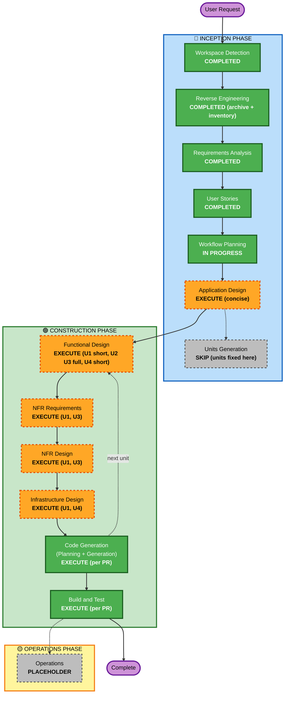

# Execution Plan -- the worker profile on `apps/api`

## Detailed Analysis Summary

### Transformation Scope
- **Transformation Type**: architectural. The worker dashboard's data layer (53 server actions, 14 routes, 3
  Prisma-reading pages, about 11,000 lines in `apps/app`) is replaced by a `worker` contract area on `apps/api`;
  the pages are rebuilt on the form engine; one expand-only migration (the home address); the upload path
  generalised from the sign-up photo; an outbox handler reaches the CRM; the api's capacity ceiling is raised and
  proven. No deployment-model change.
- **Primary Changes**: `packages/api-contract` (a `worker` area: the profile read, section writes, services,
  documents, tickets and confirmations, jobs and applications); `apps/api` (`modules/worker/` with application,
  domain and persistence layers; the completion-status port; the upload generalisation; the n8n outbox handler;
  the probe exemption); `packages/db` (two columns + a foreign key); `packages/form-engine` (field kinds the sections
  need, replace semantics); `apps/app` (form definitions per section, the sidebar declaration, the dashboard and
  my-jobs as client pages, the admin page's home-address and masked-bank-account reads; the actions, routes, hooks
  and Upstash keys deleted); `infra/` (the stages table: instance ceiling, `MAX_IN_FLIGHT`, pool; one secret per
  stage; README); `apps/api/scripts` (the load test); `docs/worker/`.
- **Related Components**: the admin module (reads the home address and the masked bank account; the search finds
  self-placed workers), the registration module (the photo ticket code reused), `platform/outbox` (one more
  handler), `platform/rate-limit` (the health exemption), the client search and share page (must not change:
  negative tests), `apps/web` (unchanged).

### Change Impact Assessment
- **User-facing changes**: Yes, every worker: every dashboard page's data path, two pages rebuilt, a home address
  and a service-area editor, uploads by ticket, the sidebar reordered. Administrators: the home address and the
  masked bank account on the worker page. Clients: none visible by design (R-PRIVATE, the search point unchanged).
- **Structural changes**: Yes. The first non-admin authenticated area of the api; the app's worker dashboard stops
  touching the database; the form engine gains replace semantics and field kinds; the outbox gains an outbound
  HTTP handler.
- **Data model changes**: Yes, expand-only: `worker_profiles.homeStreetLine`, `homeLocalityId` (FK to
  `au_localities`, `Restrict`). `documentUrl` carries two kinds of location (OI-2). No column dropped.
- **API changes**: Yes. About 20 role-restricted entries added; 14 worker routes, 6 upload routes, `compliance/
  upload`, `blob/upload-token` and the no-caller routes retired unit by unit; the shared routes untouched (D13).
- **NFR impact**: Yes. The capacity target (D6) with a load test as a promotion gate; ownership by token; masked
  financial data; per-user limits; statement timeouts; private caching on reads; shedding tuned so it can fire.

### Component Relationships

| Component | Change type | Reason | Priority |
|---|---|---|---|
| `packages/api-contract` `worker.contract.ts`, `openapi.json` | Major (new area) | every other change depends on it | Critical (first) |
| `apps/api` `modules/worker` (profile read, sections, completion, services, documents, tickets, jobs) | Major (new module) | FR-WRK, FR-PI, FR-EP, FR-SVC, FR-DOC, FR-UPL, FR-JOB | Critical |
| `apps/api` outbox handler → n8n, config secret | Minor (one handler) | FR-JOB-02 | Important |
| `apps/api` `platform/rate-limit` health exemption, `scripts/load-worker.ts` | Minor | FR-PLT-02/06 | Critical (gates promotion) |
| `infra/lib/stages.ts` ceiling, `MAX_IN_FLIGHT`, pool; secret; README | Configuration | FR-PLT-01/03 | Critical (before the first promotion) |
| `packages/db` migration (home address) | Minor, expand-only | FR-PI-04 | Critical (before U2's api PR) |
| `packages/form-engine` replace semantics, field kinds | Minor-Major | D5, OI-5 | Critical (before U2's app PR) |
| `apps/app` form definitions, the sidebar declaration, the dashboard pages, the api client | Major (13 pages) | FR-PI, FR-EP, FR-NAV, FR-HOME | Critical |
| `apps/app` deletions (actions, routes, hooks, Upstash keys) | Removal | FR-PLT-05 | Important (last of each unit) |
| `apps/app` admin worker page (home address, masked bank) | Minor | FR-PI-04, FR-EP-05 | Important |
| `docs/worker/`, CLAUDE.md, `docs/admin/`, state follow-ups | Documentation | FR-PLT-04/05 | Important (same PRs) |

### Risk Assessment
- **Risk Level**: High. The largest surface moved so far on the pages every worker uses daily; personal and
  financial data behind a new ownership rule; a document path whose old and new stores must both keep working for
  admins; a capacity claim to prove. Mitigated by: additive api PRs promoted before any page switches (D12); one
  page group per PR with a promote-only rollback; the load test as a gate; negative tests that the client search
  and the share page never change; the completion-status oracle against today's function.
- **Rollback Complexity**: Moderate. Every step is a promote; the migration is expand-only; the clean-up PR of a
  unit waits for production verification, so the old path exists while the new one is proven.
- **Testing Complexity**: Complex. Ownership properties per entry, section round-trips, the completion oracle, a
  stateful upload model, the load test at the stated rate and at 3×, the staging checklist per unit, negative
  tests on client-facing responses.

## Workflow Visualization

```mermaid
flowchart TD
    Start(["User Request"])

    subgraph INCEPTION["🔵 INCEPTION PHASE"]
        WD["Workspace Detection<br/><b>COMPLETED</b>"]
        RE["Reverse Engineering<br/><b>COMPLETED (archive + inventory)</b>"]
        RA["Requirements Analysis<br/><b>COMPLETED</b>"]
        US["User Stories<br/><b>COMPLETED</b>"]
        WP["Workflow Planning<br/><b>IN PROGRESS</b>"]
        AD["Application Design<br/><b>EXECUTE (concise)</b>"]
        UG["Units Generation<br/><b>SKIP (units fixed here)</b>"]
    end

    subgraph CONSTRUCTION["🟢 CONSTRUCTION PHASE"]
        FD["Functional Design<br/><b>EXECUTE (U1 short, U2 U3 full, U4 short)</b>"]
        NFRA["NFR Requirements<br/><b>EXECUTE (U1, U3)</b>"]
        NFRD["NFR Design<br/><b>EXECUTE (U1, U3)</b>"]
        ID["Infrastructure Design<br/><b>EXECUTE (U1, U4)</b>"]
        CG["Code Generation<br/>(Planning + Generation)<br/><b>EXECUTE (per PR)</b>"]
        BT["Build and Test<br/><b>EXECUTE (per PR)</b>"]
    end

    subgraph OPERATIONS["🟡 OPERATIONS PHASE"]
        OPS["Operations<br/><b>PLACEHOLDER</b>"]
    end

    Start --> WD --> RE --> RA --> US --> WP --> AD --> FD
    AD -.-> UG
    FD --> NFRA --> NFRD --> ID --> CG --> BT
    CG -.->|next unit| FD
    BT -.-> OPS
    BT --> End(["Complete"])

    style WD fill:#4CAF50,stroke:#1B5E20,stroke-width:3px,color:#fff
    style RE fill:#4CAF50,stroke:#1B5E20,stroke-width:3px,color:#fff
    style RA fill:#4CAF50,stroke:#1B5E20,stroke-width:3px,color:#fff
    style US fill:#4CAF50,stroke:#1B5E20,stroke-width:3px,color:#fff
    style WP fill:#4CAF50,stroke:#1B5E20,stroke-width:3px,color:#fff
    style AD fill:#FFA726,stroke:#E65100,stroke-width:3px,stroke-dasharray: 5 5,color:#000
    style UG fill:#BDBDBD,stroke:#424242,stroke-width:2px,stroke-dasharray: 5 5,color:#000
    style FD fill:#FFA726,stroke:#E65100,stroke-width:3px,stroke-dasharray: 5 5,color:#000
    style NFRA fill:#FFA726,stroke:#E65100,stroke-width:3px,stroke-dasharray: 5 5,color:#000
    style NFRD fill:#FFA726,stroke:#E65100,stroke-width:3px,stroke-dasharray: 5 5,color:#000
    style ID fill:#FFA726,stroke:#E65100,stroke-width:3px,stroke-dasharray: 5 5,color:#000
    style CG fill:#4CAF50,stroke:#1B5E20,stroke-width:3px,color:#fff
    style BT fill:#4CAF50,stroke:#1B5E20,stroke-width:3px,color:#fff
    style OPS fill:#BDBDBD,stroke:#424242,stroke-width:2px,stroke-dasharray: 5 5,color:#000
    style Start fill:#CE93D8,stroke:#6A1B9A,stroke-width:3px,color:#000
    style End fill:#CE93D8,stroke:#6A1B9A,stroke-width:3px,color:#000
    style INCEPTION fill:#BBDEFB,stroke:#1565C0,stroke-width:3px,color:#000
    style CONSTRUCTION fill:#C8E6C9,stroke:#2E7D32,stroke-width:3px,color:#000
    style OPERATIONS fill:#FFF59D,stroke:#F57F17,stroke-width:3px,color:#000

    linkStyle default stroke:#333,stroke-width:2px
```

## Units of work (fixed here; Units Generation skipped)

| Unit | Name | Scope | Stories | PRs | Design stages |
|---|---|---|---|---|---|
| **U1** | `worker-area` -- the foundation and the capacity gate | the `worker` contract area and module skeleton; ownership by token; the profile read with the completion status ported (FR-WRK-01..04, 06, 08); the stages table (ceiling, `MAX_IN_FLIGHT`, pool), the pooler verification, the health exemption, the load-test script and its first run (FR-PLT-01/02/06) | US-WP-26, 27 (read half), 28, 30, 31, 32 | PR 1 (api + infra + script) → promote | Functional Design (short), NFR Requirements, NFR Design, Infrastructure Design, Code Generation, Build and Test |
| **U2** | `edit-profile` -- what the user asked to start with | the migration (home address); the section entries: name, photo (ticket reuse), bio, home address, service area via `placeHome`, personal info, ABN (FR-PI-01..08 with D17); hours, experience, job history, education, the detail groups, the bank account masked (FR-EP-01..06); the form definitions and the field kinds they need; the sidebar declaration (FR-NAV); the admin page's two reads; the clean-up of the profile actions and `update-step` | US-WP-01..16, 25, 27 (write half), 33 | PR 2 (db + api) → promote; PR 3 (form-engine + app); PR 4 (clean-up) | Functional Design (full), Code Generation, Build and Test (NFR stages inherit U1's; no infrastructure) |
| **U3** | `services-documents` | services against the catalogue (FR-SVC-01); per-service requirements (FR-SVC-02, closes D1); documents with typed metadata and the allowed-type rule, replace/delete, signed reads (FR-DOC-01/02); the generalised tickets and confirmations and the purge (FR-UPL-01..03); the admin's dual-store reads (OI-2); the clean-up of the document routes, the Blob routes and `compliance/upload`; `/api/upload/worker-photo` gets auth + a limit for the admin picker | US-WP-17..21, 29 | PR 5 (api) → promote; PR 6 (app); PR 7 (clean-up) | Functional Design (full), NFR Requirements, NFR Design (uploads, antivirus/size, signed URLs), Code Generation, Build and Test |
| **U4** | `dashboard-jobs` | the home page and my-jobs as client pages from the profile read and a jobs entry (FR-HOME-01/02); apply/withdraw (FR-JOB-01); the n8n outbox handler and its secret, also wired to `WorkerRegistered` (FR-JOB-02); the clean-up of the Prisma-reading pages, the Upstash keys, `/api/worker/jobs*` and `/api/geocode`'s worker caller | US-WP-22, 23, 24 | PR 8 (api + infra secret) → promote; PR 9 (app); PR 10 (clean-up) | Functional Design (short), Infrastructure Design (the secret, the allow-listed host), Code Generation, Build and Test |

U1 first: U2's entries run behind U1's ownership rule and profile read, and U1's load test is the gate every later
promotion reuses. U2, U3 and U4 are sequential by default (one page group live at a time, as D12 asks); U3's and
U4's designs may be written while U2 is in construction.

## Phases to Execute

### 🔵 INCEPTION PHASE
- [x] Workspace Detection (COMPLETED 2026-10-09)
- [x] Reverse Engineering (COMPLETED: the 2026-10-08 archive pass plus the targeted inventory, Q2 A)
- [x] Requirements Analysis (COMPLETED, approved 2026-10-09; amendment D17)
- [x] User Stories (COMPLETED, approved 2026-10-09)
- [x] Execution Plan (this document)
- [ ] Application Design -- **EXECUTE, concise**
  - **Rationale**: new components whose interfaces several PRs depend on: the entry list and paths (OI-1), the
    worker module's layout and the completion-status port, the upload generalisation out of the registration
    module, the `documentUrl` scheme (OI-2), the form engine's replace semantics and the field kinds (OI-5), the
    sidebar declaration's shape, the client's data layer (React Query keys replaced by one profile read). Settling
    signatures once keeps PRs 1-10 from disagreeing.
- [ ] Units Generation -- **SKIP**
  - **Rationale**: the four units and their order follow from the deployment constraint (api before app) and the
    user's "start with Edit Profile"; the table above is the artifact.

### 🟢 CONSTRUCTION PHASE
- [ ] Functional Design -- **EXECUTE** (U1 short; U2 and U3 full; U4 short)
  - **Rationale**: U1 holds the ownership rule, the profile read's shape and the completion rules; U2 every
    section's fields, rules and the two addresses; U3 the document kinds, the allowed-type rule, the ticket model;
    U4 the jobs list, idempotent apply, the handler payload. PBT-01 needs the property lists here.
- [ ] NFR Requirements -- **EXECUTE for U1 and U3**
  - **Rationale**: U1: the capacity arithmetic (OI-4), limit values, the load tool, statement timeouts, caching;
    U3: file kinds and sizes, the scan question, signed-URL lifetimes. U2 and U4 inherit.
- [ ] NFR Design -- **EXECUTE for U1 and U3**
  - **Rationale**: U1: shedding and pool behaviour under the 3× burst, the resiliency test scenarios (RESILIENCY-14),
    observability of the worker entries; U3: upload isolation, purge, the dual-store read.
- [ ] Infrastructure Design -- **EXECUTE for U1 and U4**; skip for U2 and U3
  - **Rationale**: U1 changes the stages table and verifies the pooler; U4 adds a secret per stage and an outbound
    host. U2 provisions nothing but a migration (its design covers it); U3 reuses the sign-up bucket.
- [ ] Code Generation -- EXECUTE (ALWAYS), one plan per unit covering its PRs
- [ ] Build and Test -- EXECUTE (ALWAYS), per PR: gates, CI, the staging checklist with the load test where
  entries are added, merge, promotion, production verification before each clean-up PR

### 🟡 OPERATIONS PHASE
- [ ] Operations -- PLACEHOLDER (production verification is recorded under each unit's Build and Test)

## Package Change Sequence

The constraint, as in every cycle since S1: Vercel previews call the **staging** api, which deploys from `main`;
production's api moves only by promotion; the app deploys to production on merge. So each unit's api PR merges,
runs the staging checklist (and the load test), is promoted, and only then does the unit's app PR merge.

| PR | Unit | Packages | What it does | Live behaviour after merge |
|---|---|---|---|---|
| **1 worker area** | U1 | `packages/api-contract` (the `worker` area: the profile read; the shared shapes the later entries reuse), `apps/api` (`modules/worker` skeleton, ownership, the profile read, the completion port with its oracle test, the health exemption, `scripts/load-worker.ts`), `infra/` (stages table: ceiling, `MAX_IN_FLIGHT`, pool; README: the pooler check), `docs/worker/` | Staging: the checklist with a staging worker's token; the pooler verified; the load test at the stated rate and at 3×, recorded; then **promote** | Unchanged for users: nothing calls the entry |
| **2 profile entries** | U2 | `packages/db` (the migration), `packages/api-contract` (the section entries), `apps/api` (section handlers incl. `placeHome` for the service area, the masked bank account, the photo ticket reuse), `docs/worker/` | Staging: every section round-trips; the home address absent from client paths; the service area moves the worker in the admin search; the load test re-run; **promote** | Unchanged for users |
| **3 Edit Profile pages** | U2 | `packages/form-engine` (replace semantics, field kinds), `apps/app` (the form definitions, the Edit Profile and Personal Info pages, the sidebar declaration and order, the admin page's two reads, the api client) | Preview against staging: the full page checklist incl. draft, offline and 503 paths; merge deploys the app | Workers edit their profile through the api; the sidebar is in the new order |
| **4 profile clean-up** | U2 | `apps/app` (the profile actions, `update-step`, the old hooks and components, the Step6ABN TFN branch) | After production verification by an internal worker | No change for users |
| **5 services and documents entries** | U3 | `packages/api-contract`, `apps/api` (services, requirements per service, documents with typed metadata, the generalised tickets/confirmations, signed reads, the admin dual-store read), `docs/worker/` | Staging: upload by ticket for each kind; a disallowed type refused; the admin opens both stores; load test re-run; **promote** | Unchanged for users |
| **6 services and documents pages** | U3 | `apps/app` (Edit Services, My Services, Mandatory, Trainings, Additional Credentials on the api; `/api/upload/worker-photo` gets auth + a limit) | Preview checklist; merge | Workers manage services and documents through the api |
| **7 documents clean-up** | U3 | `apps/app` (the document routes incl. the two public-cache routes of D1, the Blob upload routes, `compliance/upload`, `blob/upload-token`, the no-caller routes) | After production verification; the `s-maxage` grep empty | No change for users |
| **8 jobs entries and the CRM handler** | U4 | `packages/api-contract`, `apps/api` (jobs list, applications, the n8n outbox handler also wired to `WorkerRegistered`), `infra/` (the secret per stage, bootstrap, YAML, README) | The secret set on both stages first; staging: apply → the staging webhook/sink receives the post; n8n unreachable → retries and a dead letter; **promote** | Sign-ups start notifying the CRM through the outbox (follow-up 2) |
| **9 dashboard pages** | U4 | `apps/app` (home page and my-jobs as client pages; apply/withdraw through the api; the geocode call removed) | Preview checklist; merge | The dashboard reads the api; the browser no longer calls n8n |
| **10 dashboard clean-up** | U4 | `apps/app` (the Prisma-reading pages' server code, `NewsSliderAsync`, the Upstash keys and `lib/cache-invalidation` usage, `/api/worker/jobs*`), state follow-ups | After production verification | No change for users |

Rollback at each step is a promote. An app PR rolls back by a Vercel promote while its clean-up PR has not merged;
an api PR rolls back by promoting the previous image, after which the unit's app must be rolled back too. The
migration (PR 2) is expand-only and never rolled back.

## Estimated Timeline
- **Total Phases**: Application Design, then per unit the marked design stages, Code Generation and Build and Test
- **Estimated Duration**: Application Design one session; U1 design one session, PR 1 with its load test one to two
  sessions; U2 design one to two sessions, PRs 2-4 three to four sessions; U3 design one session, PRs 5-7 two to
  three sessions; U4 design short, PRs 8-10 two sessions

## Success Criteria
- **Primary Goal**: a worker edits every part of their profile, sets where they live and where they work, uploads
  documents and applies to jobs through `apps/api` alone, with the sidebar in the agreed order, and the api proven
  at 10,000 active workers an hour
- **Key Deliverables**: the `worker` area live; the Edit Profile pages on the form engine; the home address and the
  service-area editor; documents by ticket; the CRM handler; the sidebar declaration; the server actions, routes
  and Upstash keys gone; `docs/worker/`; the load-test numbers recorded per promotion
- **Quality Gates**: every package's quality gate; `API Quality` with PostGIS; both Vercel previews; the staging
  checklist of requirements section 6 before each production step; property tests for the properties named in the
  stories and designs; negative tests that client-facing responses never carry the home address or the bank account
- **Integration Testing**: a staging worker's full session per unit; the preview checklist per app PR; an internal
  worker's edits on production before each clean-up
- **Operational Readiness**: shedding and limits observable; the outbox dead-letter alert covers the CRM handler;
  worker requests logged with principal, impersonator and request id
