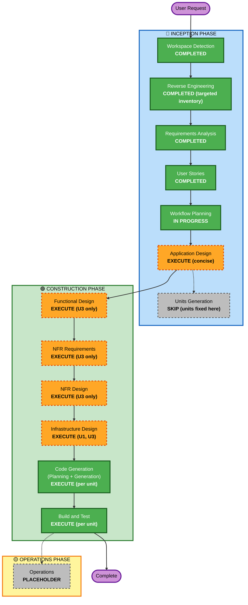

# Execution Plan -- sign-up photo on Google Cloud Storage

## Detailed Analysis Summary

### Transformation Scope
- **Transformation Type**: one feature re-architected with new infrastructure. The storage of the sign-up photo
  moves from an api-proxied upload to Vercel Blob onto a direct browser upload to a Google Cloud Storage bucket in
  Sydney, with server-side verification and asynchronous processing; plus an independent alert correction and an
  independent browser-side HEIC change.
- **Primary Changes**: two new public contract entries (ticket, confirm) and the retirement of the multipart
  entry; a new storage adapter and ticket signer in `apps/api`; an outbox handler using `sharp`; upload-row states
  and a store column in `packages/db`; the form engine's photo kind uploading in three steps with progress; the
  shared upload component's accept list; buckets, IAM, CORS, lifecycle and a policy-apply step in `infra/`; a
  fake storage container in CI.
- **Related Components**: `packages/api-contract` (entries, `public-endpoints.json`), `apps/api`
  (registration module, outbox, jobs, config, main), `packages/db` (schema, one additive migration),
  `packages/form-engine` (kinds, submit, types), `apps/app` (wizard field, shrink and HEIC detection, shared
  `PhotoUpload`, `next.config` image hosts), `infra/` (stages table, bootstrap, monitoring JSON, apply step),
  `.github/workflows` (`API Quality` container, `deploy-api` unchanged), `docs/signup`, CLAUDE.md.

### Change Impact Assessment
- **User-facing changes**: Yes. Progress indicator, retry behaviour, the HEIC message, faster uploads; the
  accept list on dashboard screens (own PR).
- **Structural changes**: Yes. A new managed service in the sign-up path; the api leaves the byte path; a new
  asynchronous processing step.
- **Data model changes**: Yes, additive. Upload row gains a state (`PENDING`, `STAGED`, `REJECTED`, `CLAIMED`), a
  store name, and the processed and thumbnail URLs (or a profile column, OI-3); no column dropped.
- **API changes**: Yes. Two public entries added; the multipart entry retired one release later.
- **NFR impact**: Yes. Latency, least privilege on a new resource, a documented public-read exception, residency,
  new dependencies (`sharp`, the Storage client), a new container in CI.

### Component Relationships
- **Primary Component**: `apps/api` registration module (ticket, confirm, claim, processing, purge).
- **Infrastructure Components**: `infra/lib/stages.ts`, `infra/cloudrun/bootstrap.sh`,
  `infra/cloudrun/monitoring/*`, the new apply step; Google Cloud: two buckets, two IAM bindings per stage.
- **Shared Components**: `packages/api-contract` (both sides compile against it), `packages/db` (schema shared by
  api and app's Prisma clients), `packages/form-engine` (used only by `apps/app`).
- **Dependent Components**: `apps/app` wizard (calls the new entries), every photo reader in `apps/app`
  (unchanged, reads URLs; needs the new host allowed).
- **Supporting Components**: Cloud Logging and Monitoring (unchanged mechanisms, one corrected policy),
  `docs/signup`, CLAUDE.md.

| Component | Change type | Reason | Priority |
|---|---|---|---|
| `infra/` monitoring + apply step | Configuration | the alert unit | Critical (first) |
| `infra/` buckets, IAM, stages table, bootstrap | Major (new resources) | the storage move | Critical (before any api promotion) |
| `packages/db` | Minor, additive migration | row states, store, processed URLs | Critical |
| `packages/api-contract` | Major (new entries) | ticket, confirm | Critical |
| `apps/api` | Major | adapter, signer, handlers, outbox handler, purge, config | Critical |
| `.github/workflows/api-quality` | Configuration | fake storage container | Critical (gate) |
| `packages/form-engine` | Major within the photo kind | three-step upload, progress, HEIC detection hook | Critical |
| `apps/app` wizard field, `next.config` | Minor | progress UI, allowed host | Critical |
| `docs/signup`, CLAUDE.md | Documentation | same PRs | Important |

### Risk Assessment
- **Risk Level**: Medium-High. New infrastructure and a native image library on the api; a contract change that
  the app and the api must straddle across a promotion; a cut-over with a 24 h overlap of two stores. Mitigated by
  the additive-first sequence below, the preview checklist on staging before every production step, and a
  rollback that is a promote on each side.
- **Rollback Complexity**: Moderate. Each PR is a promote to roll back, but the order matters: the app must never
  run ahead of the api (§Package Change Sequence).
- **Testing Complexity**: Complex. New tests against the fake bucket, property-based tests for the sniffer, key
  derivation, policy round-trip and processing idempotence, and a phone-in-hand preview checklist.

## Workflow Visualization

```mermaid
flowchart TD
    Start(["User Request"])

    subgraph INCEPTION["🔵 INCEPTION PHASE"]
        WD["Workspace Detection<br/><b>COMPLETED</b>"]
        RE["Reverse Engineering<br/><b>COMPLETED (targeted inventory)</b>"]
        RA["Requirements Analysis<br/><b>COMPLETED</b>"]
        US["User Stories<br/><b>COMPLETED</b>"]
        WP["Workflow Planning<br/><b>IN PROGRESS</b>"]
        AD["Application Design<br/><b>EXECUTE (concise)</b>"]
        UG["Units Generation<br/><b>SKIP (units fixed here)</b>"]
    end

    subgraph CONSTRUCTION["🟢 CONSTRUCTION PHASE"]
        FD["Functional Design<br/><b>EXECUTE (U3 only)</b>"]
        NFRA["NFR Requirements<br/><b>EXECUTE (U3 only)</b>"]
        NFRD["NFR Design<br/><b>EXECUTE (U3 only)</b>"]
        ID["Infrastructure Design<br/><b>EXECUTE (U1, U3)</b>"]
        CG["Code Generation<br/>(Planning + Generation)<br/><b>EXECUTE (per unit)</b>"]
        BT["Build and Test<br/><b>EXECUTE (per unit)</b>"]
    end

    subgraph OPERATIONS["🟡 OPERATIONS PHASE"]
        OPS["Operations<br/><b>PLACEHOLDER</b>"]
    end

    Start --> WD --> RE --> RA --> US --> WP --> AD --> FD
    AD -.-> UG
    FD --> NFRA --> NFRD --> ID --> CG --> BT
    BT -.-> OPS
    BT --> End(["Complete"])

    style WD fill:#4CAF50,stroke:#1B5E20,stroke-width:3px,color:#fff
    style RE fill:#4CAF50,stroke:#1B5E20,stroke-width:3px,color:#fff
    style RA fill:#4CAF50,stroke:#1B5E20,stroke-width:3px,color:#fff
    style US fill:#4CAF50,stroke:#1B5E20,stroke-width:3px,color:#fff
    style WP fill:#4CAF50,stroke:#1B5E20,stroke-width:3px,color:#fff
    style AD fill:#FFA726,stroke:#E65100,stroke-width:3px,stroke-dasharray: 5 5,color:#000
    style UG fill:#BDBDBD,stroke:#424242,stroke-width:2px,stroke-dasharray: 5 5,color:#000
    style FD fill:#FFA726,stroke:#E65100,stroke-width:3px,stroke-dasharray: 5 5,color:#000
    style NFRA fill:#FFA726,stroke:#E65100,stroke-width:3px,stroke-dasharray: 5 5,color:#000
    style NFRD fill:#FFA726,stroke:#E65100,stroke-width:3px,stroke-dasharray: 5 5,color:#000
    style ID fill:#FFA726,stroke:#E65100,stroke-width:3px,stroke-dasharray: 5 5,color:#000
    style CG fill:#4CAF50,stroke:#1B5E20,stroke-width:3px,color:#fff
    style BT fill:#4CAF50,stroke:#1B5E20,stroke-width:3px,color:#fff
    style OPS fill:#BDBDBD,stroke:#424242,stroke-width:2px,stroke-dasharray: 5 5,color:#000
    style Start fill:#CE93D8,stroke:#6A1B9A,stroke-width:3px,color:#000
    style End fill:#CE93D8,stroke:#6A1B9A,stroke-width:3px,color:#000
    style INCEPTION fill:#BBDEFB,stroke:#1565C0,stroke-width:3px,color:#000
    style CONSTRUCTION fill:#C8E6C9,stroke:#2E7D32,stroke-width:3px,color:#000
    style OPERATIONS fill:#FFF59D,stroke:#F57F17,stroke-width:3px,color:#000

    linkStyle default stroke:#333,stroke-width:2px
```

## Units of work (fixed here; Units Generation skipped)

| Unit | Name | Stories | PRs | Design stages |
|---|---|---|---|---|
| **U1** | `alert-policy` -- the corrected latency policy and the apply step | US-PH-17, US-PH-18 | 1 (infra only), **first** | Infrastructure Design (short), Code Generation, Build and Test |
| **U3** | `photo-gcs` -- the storage move | US-PH-01..16 | 3, in order (below) | Functional Design, NFR Requirements, NFR Design, Infrastructure Design, Code Generation, Build and Test |

U1 can proceed in parallel with U3's design. U3's three PRs are sequential. (U2 `heic-accept` was removed on 2026-10-05 when the scope was narrowed to the sign-up: the wizard-only accept list lives in PR 3b.)

## Phases to Execute

### 🔵 INCEPTION PHASE
- [x] Workspace Detection (COMPLETED 2026-10-05)
- [x] Reverse Engineering (COMPLETED as the targeted inventory, Q1 A)
- [x] Requirements Analysis (COMPLETED, approved 2026-10-05)
- [x] User Stories (COMPLETED, approved 2026-10-05: 18 stories)
- [x] Execution Plan (this document)
- [ ] Application Design -- **EXECUTE, concise**
  - **Rationale**: new components with interfaces that two sides depend on: the storage port's new shape
    (ticket, inspect, read-prefix, delete, write), the ticket signer, the confirm and processing services, the
    engine's three-step upload, the HEIC detector. Settling their boundaries and method signatures once avoids
    three PRs disagreeing. One file set, no new questions expected beyond OI-2 and OI-3 of the requirements.
- [ ] Units Generation -- **SKIP**
  - **Rationale**: the units and their order fall out of the story epics and the deployment constraint
    (§Package Change Sequence); the three mandatory artifacts would restate the table above.

### 🟢 CONSTRUCTION PHASE
- [ ] Functional Design -- **EXECUTE for U3**; skip for U1
  - **Rationale**: U3 holds the business rules (row state machine, ticket constraints, confirm decisions,
    processing idempotence, purge across two stores, cut-over) and PBT-01 requires the property list here. U1 is
    configuration.
- [ ] NFR Requirements -- **EXECUTE for U3**; skip for U1
  - **Rationale**: tech stack decisions: `sharp`, the Storage client, `fake-gcs-server`, signing method (OI-2),
    timeouts; PBT-09 framework confirmation.
- [ ] NFR Design -- **EXECUTE for U3**; skip for U1
  - **Rationale**: timeouts and isolation (NFR-10), degraded mode (NFR-11), the RESILIENCY-14 testing question,
    observability of each stage.
- [ ] Infrastructure Design -- **EXECUTE for U1 and U3**
  - **Rationale**: U1 is the policy and the apply step; U3 is buckets, IAM, CORS, lifecycle, soft delete, the
    stages table, bootstrap, secrets, the CI container.
- [ ] Code Generation -- EXECUTE (ALWAYS), one plan per unit (U3: one plan covering its three PRs)
- [ ] Build and Test -- EXECUTE (ALWAYS), per PR: gates, CI, preview checklist, merge, staging, promotion

### 🟡 OPERATIONS PHASE
- [ ] Operations -- PLACEHOLDER (the cut-over window and the Blob token removal are recorded under U3's Build
  and Test)

## Package Change Sequence

The constraint: Vercel previews call the **staging** api, which deploys from `main`; production's api moves only by
promotion; the app deploys to production on merge. Therefore the api must gain the new entries, be promoted, and
keep the old entry, before the app switches to them.

**U1 `alert-policy` (PR 1, first):** `infra/cloudrun/monitoring/latency-p95.json`, the apply step
(`infra/` script or workflow step), `bootstrap.sh` calling it, `infra/README.md`, CLAUDE.md alert line. Apply to
staging and production policies. No api image change.

**U3 `photo-gcs`:**

| PR | Packages | What it does | Live behaviour after merge |
|---|---|---|---|
| **3a backend, additive** | `infra/` (stages table: bucket names and public base URL; bootstrap: buckets, IAM, CORS, lifecycle, soft delete, Storage API; secrets unchanged), `packages/db` (migration: state, store, processed and thumbnail URLs; existing rows backfilled `STAGED`/`vercel-blob`), `packages/api-contract` (ticket and confirm entries, `public-endpoints.json`; multipart entry **kept**), `apps/api` (GCS adapter, signer, ticket and confirm handlers, outbox handler, purge over both stores, config `PHOTO_STORE=gcs` + Blob token optional), `.github/workflows` (fake storage container in `API Quality`), `docs/signup` | Buckets created on both stages by the user running bootstrap before merge; staging deploys on merge; preview checklist on staging exercises the new entries with curl and the existing wizard still on multipart; then **promote to production** | Unchanged for users: the live wizard still uses the multipart entry, which now stores to the bucket too (adapter swap) or stays on Blob until 3b -- decided at Functional Design |
| **3b wizard switch** | `packages/form-engine` (photo kind: ticket, direct upload with progress, confirm; HEIC detection hook), `apps/app` (wizard field progress UI, HEIC message, `next.config` host), tests, `docs/signup` | Preview against staging (which has 3a): the full checklist including a phone and the HEIC paths; merge deploys the app to production, whose api already has 3a | The direct upload is live |
| **3c clean-up** | `packages/api-contract` (multipart entry removed), `apps/api` (handler and Blob adapter removed once no Blob-era rows remain), `infra/` (Blob token out of the stages table), Secret Manager (user), docs | After the cut-over window (a few days) with the purge log showing no Blob rows; staging, then promotion | No change for users |

Rollback at each step is a promote (api image or Vercel deployment); 3a is additive so rolling it back after 3b
requires rolling 3b back first.

## Estimated Timeline
- **Total Phases**: 5 remaining stages (Application Design, then per unit Functional / NFR / Infrastructure
  Design where marked, Code Generation, Build and Test)
- **Estimated Duration**: U1 one session including verification; U3 design two sessions, 3a and 3b
  one to two sessions each with their preview checklists, 3c one short session after the cut-over window

## Success Criteria
- **Primary Goal**: a sign-up photo uploaded from a phone goes straight to the Sydney bucket with visible progress,
  is verified by the api, processed in the background into a clean copy and a thumbnail, and the api's photo
  route no longer appears among slow requests
- **Key Deliverables**: the corrected alert policy applied live; the three U3
  PRs merged and promoted; docs updated; the Blob token removed from the api
- **Quality Gates**: every package's quality gate; `API Quality` with PostGIS and the fake bucket; both Vercel
  previews; the preview checklist of requirements §6 passed and recorded in the construction notes before each
  production step; property-based tests present for the properties named in the stories
- **Integration Testing**: a full sign-up on staging after 3a (old wizard) and after 3b (new wizard); an old
  Blob photo displayed after 3b; the purge log after 3c
- **Operational Readiness**: the dead-letter alert covers processing; per-stage timing in logs; no single-upload
  latency emails after U1
