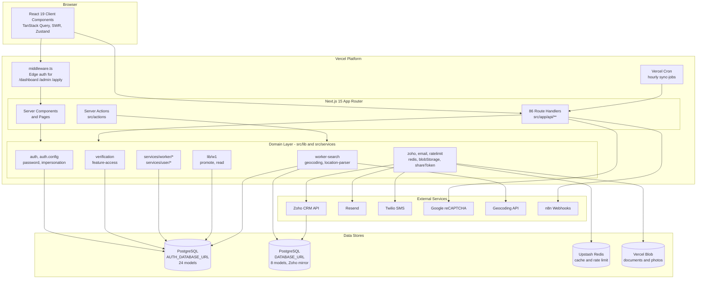
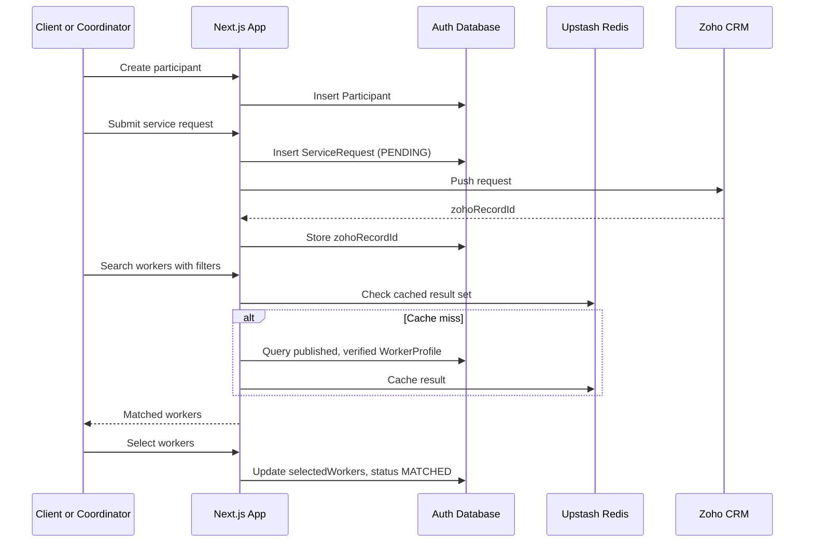
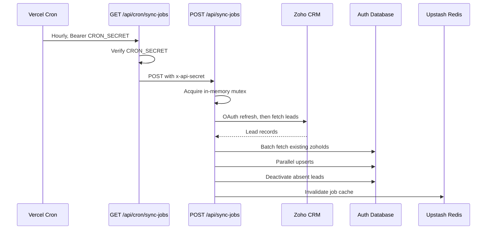

# System Architecture

**System**: Remonta Marketplace
**Analysis Date**: 2026-09-09T02:12:02Z

---

## System Overview

Remonta Marketplace is a **single-deployment modular monolith** built on Next.js 15 App Router
and deployed to Vercel. There are no separate services, no container definitions and no
infrastructure-as-code in the repository — the entire system is one Next.js application whose
server-side surface is 86 route handlers plus React Server Components.

The architecture has three characteristics worth stating up front, because they shape every
other decision in the system:

1. **Two separate PostgreSQL databases with two separate Prisma clients.** `AUTH_DATABASE_URL`
   backs the live application domain (24 models) through a generated client at
   `src/generated/auth-client`. `DATABASE_URL` backs a legacy Zoho-mirror database (8 models)
   through the default Prisma client. They are not joined at the database level; any correlation
   happens in application code.
2. **Zoho CRM is the system of record for placement.** The marketplace captures and qualifies
   supply and demand, but the actual job placement and deal lifecycle live in Zoho. The app
   syncs leads inbound hourly and pushes service requests outbound.
3. **Authorization is enforced primarily in API route handlers, not at the edge.** The
   middleware covers three page prefixes and never runs on `/api/*`. Route handlers call
   `requireRole` / `requireAnyRole` individually. This is workable but places the entire
   authorization burden on per-file discipline — see `code-quality-assessment.md` for the two
   places where that discipline has slipped.

---

## Architecture Diagram

### Text Alternative

The browser runs React 19 client components using TanStack Query, SWR and Zustand. Requests for
`/dashboard`, `/admin` and `/apply` pages pass through `middleware.ts` at the Vercel edge, which
checks the NextAuth JWT and role. API requests bypass the middleware entirely and go straight to
one of 86 route handlers. Both route handlers and server components call into a domain layer in
`src/lib` and `src/services`, which is organised into auth, verification and feature access,
worker search and geocoding, worker services, the W1 promotion helpers, and integration clients.
That domain layer reads and writes two separate PostgreSQL databases (the auth/application
database with 24 models and the legacy Zoho-mirror database with 8 models), Upstash Redis for
caching and rate limiting, and Vercel Blob for files. It calls out to Zoho CRM, Resend, Twilio,
Google reCAPTCHA, a geocoding API, and n8n webhooks. A Vercel cron job invokes the sync-jobs API
hourly to pull Zoho leads.

---

## Component Descriptions

### `src/app` — Presentation and HTTP Surface
- **Purpose**: All routing, pages, layouts and HTTP endpoints.
- **Responsibilities**: 54 pages across four role areas (worker, client, supportcoordinators, admin) plus public registration, login, recovery and share routes; 86 API route handlers; 7 layouts.
- **Dependencies**: `src/components`, `src/lib`, `src/services`, `src/hooks`.
- **Type**: Application.

### `src/components` — UI Component Library
- **Purpose**: 163 React components.
- **Responsibilities**: Domain component groups for account setup, admin, contracts, dashboard, forms, modals, PDF rendering, profile and profile-building, requirements setup, services setup, plus a shadcn-style primitive set under `ui/` and providers under `providers/`.
- **Dependencies**: Radix UI, MUI, Headless UI, Tailwind, `src/hooks`, `src/lib`.
- **Type**: Application.

### `src/lib` — Domain and Integration Layer
- **Purpose**: The functional core: 24 modules, roughly 4,150 lines.
- **Responsibilities**: Authentication (`auth.ts`, `auth.config.ts`, `auth-prisma.ts`, `password.ts`, `impersonation.ts`), compliance (`verification.ts`, `feature-access.ts`), search (`worker-search.ts`, `geocoding.ts`, `location-parser.ts`), integrations (`zoho.ts`, `email.ts`, `blobStorage.ts`, `redis.ts`, `ratelimit.ts`, `recaptcha.ts`), cross-cutting (`logger.ts`, `cache-invalidation.ts`, `api-interceptor.ts`, `shareToken.ts`, `reports.ts`, `backgroundUploadQueue.ts`), and the W1 migration helpers (`w1/promote.ts`, `w1/read.ts`).
- **Dependencies**: Prisma clients, external SDKs.
- **Type**: Application / Shared.

### `src/services` — Worker Domain Services
- **Purpose**: Worker-profile business operations extracted from route handlers.
- **Responsibilities**: Nine worker services (`profile`, `profilePreview`, `availability`, `compliance`, `experience`, `additionalInfo`, `serviceDocuments`, `setupProgress`, `workerServices`) and one user service (`account`).
- **Dependencies**: `src/lib` (auth-prisma, w1).
- **Type**: Application.
- **Note**: This layer is applied only to the worker domain. Client, coordinator and admin logic still lives inline in route handlers — an inconsistency noted in `code-quality-assessment.md`.

### `prisma` — Data Model and Migrations
- **Purpose**: Two schemas and their migration history.
- **Responsibilities**: `auth-schema.prisma` (24 models, 10 enums, generates to `src/generated/auth-client`); `schema.prisma` (8 models, default client); 5 migrations including the four-step W1 sequence; `schema.target.prisma` retained as a design reference; `legacy-sql/`.
- **Type**: Model.

### `src/generated/auth-client` — Generated Prisma Client
- **Purpose**: Checked-in generated client for the auth database.
- **Type**: Generated artefact. Has its own `package.json`. Regenerated by `npm run db:generate` and by `postinstall`.

### `middleware.ts` — Edge Authorization
- **Purpose**: Route-level authentication and role gating.
- **Responsibilities**: Validates the NextAuth JWT, redirects unauthenticated users to login with a callback URL, and enforces role for worker, client, coordinator and admin page prefixes.
- **Scope**: Matches `/dashboard/:path*`, `/admin/:path*`, `/apply/:path*` only. Does not run on `/api/*`.
- **Type**: Application / Infrastructure.

### `tests/load` — Load Testing
- **Purpose**: k6 performance scripts.
- **Responsibilities**: `smoke.test.js`, `load.test.js`, `stress.test.js`, `edit-profile.test.js`, shared `config.js`.
- **Type**: Test. This is the **only** automated test asset in the repository.

### `scripts` and `src/scripts` — Operational Scripts
- **Purpose**: Maintenance and seeding utilities run with `tsx`.
- **Type**: Infrastructure / Tooling.

---

## Data Flow

### Service Request and Worker Selection

#### Text Alternative

The client or coordinator creates a participant record, then submits a service request, which is
inserted as PENDING and pushed to Zoho CRM; Zoho returns a record id that is stored back on the
request. The requester then searches for workers with filters. The app checks Upstash Redis for a
cached result set and, on a miss, queries published and verified worker profiles from the auth
database and caches the result. Matched workers are returned. The requester selects workers,
which updates `selectedWorkers` and moves the request to MATCHED.

### Zoho Job Lead Sync

#### Text Alternative

Vercel Cron calls the cron endpoint hourly with a bearer CRON_SECRET. That endpoint verifies the
secret and calls the sync endpoint over HTTP with an `x-api-secret` header. The sync endpoint
acquires an in-process mutex, refreshes its Zoho OAuth token, fetches leads, batch-fetches
existing `zohoId` values, performs upserts in parallel, deactivates leads no longer present, and
invalidates the Redis job cache.

---

## Integration Points

### External APIs
| Service | Purpose | Auth mechanism | Code |
|---|---|---|---|
| **Zoho CRM** | Pull recruitment leads; push service requests | OAuth 2 refresh-token grant | `src/lib/zoho.ts`, `src/app/api/zoho/leads` |
| **Resend** | Transactional email | `RESEND_API_KEY` | `src/lib/email.ts` |
| **Twilio** | SMS OTP verification | Account SID and auth token | `src/app/api/sms/**` |
| **Google reCAPTCHA** | Registration bot protection | Site and secret key | `src/lib/recaptcha.ts` |
| **Geocoding (`GEOMAP_API`)** | Suburb and address to coordinates | API key | `src/lib/geocoding.ts` |
| **n8n** | AI-assisted admin search, application routing | Webhook URLs | `admin/ai-search`, `admin/chat`, `apply` |

### Databases
| Store | Purpose |
|---|---|
| **Auth PostgreSQL** (`AUTH_DATABASE_URL`) | The live application domain: users, profiles, participants, services, verification, jobs, applications, service requests, W1 typed tables. Pooled through PgBouncer; migrations use `DIRECT_DATABASE_URL`. |
| **Legacy PostgreSQL** (`DATABASE_URL`) | Zoho mirror: `ContractorProfile`, `Job`, `ContractorsbyArea`, plus a duplicate document taxonomy. Optionally accelerated via `ACCELERATE_DATABASE_URL`. |
| **Upstash Redis** | Response caching and rate limiting. |

### Third-party Services
- **Vercel Blob** — worker photos, identity documents, certificates, service documents, vehicle photos. Server Actions accept up to 50 MB; the upload route has a 30-second max duration.
- **Pusher** — declared as a dependency for realtime messaging; no active server usage was found in this analysis.

---

## Infrastructure Components

- **CDK Stacks**: None. No CDK, Terraform, CloudFormation, Dockerfile or compose file exists in the repository.
- **Deployment Model**: Vercel. `vercel.json` defines the build command (dual Prisma generate then `next build`), one hourly cron (`/api/cron/sync-jobs`), and function-level `includeFiles` rules ensuring Prisma engine binaries and the generated auth client are bundled. `next.config.ts` reinforces this with `outputFileTracingIncludes` and `serverExternalPackages`.
- **Networking**: Managed entirely by Vercel. No VPC, subnet or security-group configuration is present. The database is reached over the public internet through a PgBouncer pooler.
- **Security headers**: Applied in `next.config.ts` to `/dashboard/:path*` only — `no-store` caching, `X-Frame-Options: DENY`, `X-Content-Type-Options: nosniff`, `Referrer-Policy: strict-origin-when-cross-origin`. Admin routes do not receive these headers.
- **Image optimisation**: AVIF then WebP, 30-day CDN TTL, with six allowed remote host patterns.

---

## Architectural Observations

These are structural facts relevant to future design work. Severity-ranked defects appear in
`code-quality-assessment.md`.

1. **The two-database split is the dominant structural constraint.** `Job`, `Document`,
   `Category`, `Subcategory`, `CategoryDocument` and `SubcategoryDocument` exist as *distinct
   models in both schemas* with different shapes. `Job` in particular differs materially: the
   legacy version carries participant-matching fields (disabilities, cultural considerations,
   religion, behavioural concerns), the auth version carries recruitment fields. Any work
   touching jobs or the document taxonomy must first establish which database is authoritative.
2. **Authorization is per-handler, not layered.** The middleware never sees `/api/*`, so an
   omitted `requireRole` in a route handler is an unguarded endpoint with nothing behind it.
3. **The W1 migration is complete.** Migrations through `20260907160000_w1_drop_json_columns`
   have dropped the four Json columns; the typed tables `worker_availability`,
   `worker_job_history`, `worker_education` and `worker_experience` are the source of truth. The
   explanatory comment block still in `auth-schema.prisma` describing dual-write is now stale.
4. **The service layer is half-built.** Nine worker services exist; the client, coordinator and
   admin domains have no equivalent and keep their logic in route handlers.
5. **Type and lint safety are disabled at build time.** `next.config.ts` sets both
   `typescript.ignoreBuildErrors` and `eslint.ignoreDuringBuilds` to true, so neither the
   compiler nor the linter can fail a deployment.
