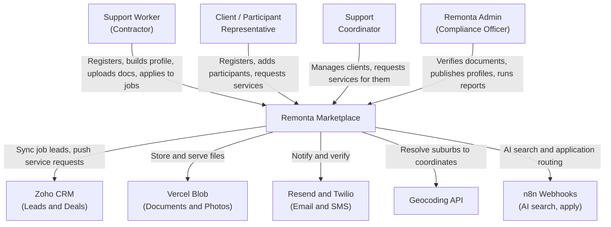
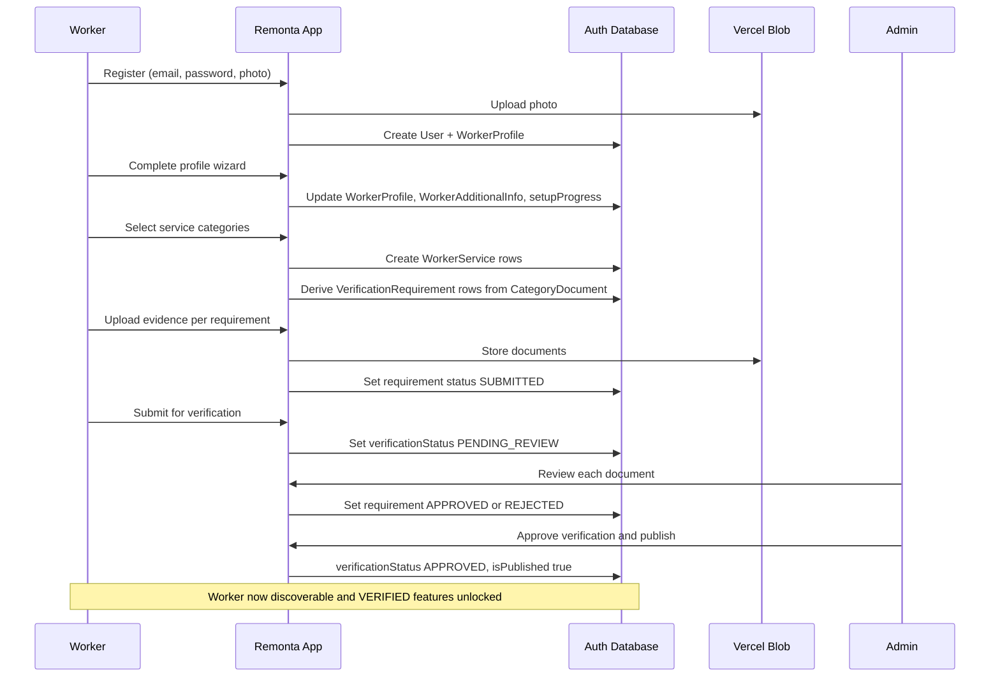

# Business Overview

**System**: Remonta Marketplace (`remonta`)
**Analysis Date**: 2026-09-09T02:12:02Z
**Domain**: Australian NDIS / disability and aged-care support services marketplace

---

## Business Context Diagram

### Text Alternative

Four human actors interact with the Remonta Marketplace: Support Workers (register, build
profiles, upload compliance documents, apply to jobs), Clients / Participant Representatives
(register, add participants, request services, select workers), Support Coordinators (manage
multiple clients and request services for them), and Remonta Admins (verify documents, publish
profiles, run reports). The system integrates outbound with Zoho CRM (job lead sync and service
request push), Vercel Blob (document and photo storage), Resend and Twilio (email and SMS), a
geocoding API (suburb to coordinates), and n8n webhooks (AI search and application routing).

---

## Business Description

### What the system does

Remonta Marketplace is a two-sided marketplace connecting NDIS participants — and the clients or
support coordinators acting on their behalf — with vetted disability and aged-care support
workers in Australia.

The platform's central value is **compliance-gated supply**. A support worker cannot simply list
themselves. They must complete a multi-stage onboarding that captures identity, qualifications,
service categories, availability and care experience, and must upload evidence documents that a
Remonta admin reviews individually. Only when an admin approves the worker's verification and
publishes the profile does that worker become discoverable and bookable. This gate exists because
NDIS service delivery carries statutory screening obligations: police checks, Working With
Children checks, NDIS Worker Screening, and AHPRA registration for therapeutic supports.

The demand side lets a client or coordinator register participants, describe the support needed,
browse matched workers, and submit a service request that is pushed into Zoho CRM, where
Remonta's operations team continues the placement.

Separately, the system syncs recruitment leads from Zoho CRM into a local job board that verified
workers can browse and apply to.

**Business model context**: `docs/business-plan.md` and the `.brd/` phase documents hold the
business requirements discovery. Those pre-existing documents were treated as input to this
analysis, not as a substitute for reading the code.

---

## Business Transactions

| # | Transaction | Actors | Description |
|---|---|---|---|
| BT-1 | Worker Registration | Worker | Creates a `User` (role WORKER) plus `WorkerProfile`. Captures identity, contact and photo. The photo may be uploaded pre-registration to Vercel Blob. Includes reCAPTCHA and optional SMS OTP verification. |
| BT-2 | Worker Profile Building | Worker | Multi-step wizard populating `WorkerProfile` and `WorkerAdditionalInfo`: introduction, qualifications, languages, hobbies, cultural background, work preferences, personality, bank and ABN details. Progress tracked in `setupProgress` (Json). |
| BT-3 | Worker Service Selection | Worker | Worker selects service `Category` records and their `Subcategory` records, persisted as `WorkerService`. The selection determines which documents become required. |
| BT-4 | Compliance Document Submission | Worker | Worker uploads evidence per `VerificationRequirement`. Requirements derive from selected categories via `CategoryDocument` and `SubcategoryDocument`, including CONDITIONAL documents keyed on flags such as `providesTransport`. Files land in Vercel Blob. |
| BT-5 | Admin Document Review | Admin | Admin approves, rejects, resets, or sets expiry on each individual `VerificationRequirement`. Status moves PENDING to SUBMITTED to APPROVED / REJECTED / EXPIRED. |
| BT-6 | Worker Verification and Publication | Admin | Once requirements are satisfied, the admin approves overall verification and publishes the profile (`isPublished = true`). This unlocks VERIFIED-level features (`src/lib/feature-access.ts`) and makes the worker discoverable. |
| BT-7 | Client Registration | Client | Creates `User` (role CLIENT) plus `ClientProfile`, including whether the client is NDIS self-managed. |
| BT-8 | Coordinator Registration | Coordinator | Creates `User` (role COORDINATOR) plus `CoordinatorProfile`, including organisation and the client types served. |
| BT-9 | Participant Management | Client, Coordinator | Creates and maintains `Participant` records — the person actually receiving support. Captures conditions, funding type, self-managed status, and relationship to the requester. |
| BT-10 | Service Request Submission | Client, Coordinator | Creates a `ServiceRequest` against a participant describing services and details. Assigned a `zohoRecordId` when pushed to Zoho CRM. |
| BT-11 | Worker Discovery and Selection | Client, Coordinator, Admin | Faceted search over published workers by location and radius, service category, gender, language, age, vehicle access, experience domain and document status. Chosen workers recorded in `ServiceRequest.selectedWorkers`. |
| BT-12 | Service Request Lifecycle | Client, Coordinator | Request moves PENDING to MATCHED to ACTIVE to COMPLETED, or CANCELLED / ARCHIVED, with reactivation supported. |
| BT-13 | Job Lead Sync | System (cron) | Hourly Vercel cron pulls recruitment leads from Zoho CRM into the `jobs` table, upserting on `zohoId` and deactivating leads no longer present. |
| BT-14 | Job Application | Worker | A worker applies to a synced `Job`, creating a `JobApplication` (PENDING or WITHDRAWN), unique per job and worker. |
| BT-15 | Profile Sharing | Worker, Admin | Generates a tokenised public link (`/share/profile/[token]`) exposing a worker profile without login. |
| BT-16 | Admin Reporting | Admin | Daily, weekly and worker-statistics reports, plus PDF generation of contractor profiles and service agreements. |
| BT-17 | Admin Impersonation | Admin | An admin assumes another user's session for support purposes. Recorded on `Session.impersonatedBy` and in `AuditLog` (IMPERSONATION_START / END). |
| BT-18 | Authentication and Account Recovery | All | Credentials login with bcrypt, failed-attempt counting and account lockout, password reset by token, SMS OTP, and a setup-password flow for provisioned accounts. |

---

## Business Dictionary

| Term | Meaning in this system |
|---|---|
| **NDIS** | National Disability Insurance Scheme — the Australian funding scheme underwriting most participants' support. |
| **Participant** | The person who receives support. Modelled by `Participant`. May or may not be the account holder. |
| **Client** | The account holder requesting support, often a parent, guardian or family member of the participant. Modelled by `ClientProfile`. |
| **Support Coordinator** | A professional who arranges services for multiple participants. Modelled by `CoordinatorProfile`. Note the route tree is `/dashboard/supportcoordinators` while the role enum value is `COORDINATOR`. |
| **Worker / Contractor** | The support professional supplying services. Modelled by `WorkerProfile`. "Contractor" appears in admin-facing and Zoho-facing surfaces, "Worker" in the auth domain. Both refer to the same actor. |
| **Self-managed** | A participant who administers their own NDIS funding and so can contract workers directly. A flag on both `ClientProfile` and `Participant`. |
| **Category / Subcategory** | The service taxonomy, for example category "Support Worker" with subcategory "Personal care", or "Therapeutic Supports" with subcategory "Art Therapist". Drives required documents. |
| **Verification Requirement** | One evidence item a worker must supply, for example "100 Points of ID" or "Police Check". Carries its own status and optional expiry. |
| **Document Category** | Classification of evidence: PRIMARY, SECONDARY, WORKING_RIGHTS, SERVICE_QUALIFICATION. |
| **Conditional Document** | A requirement that applies only when a flag is set, expressed by `CategoryDocument.conditionKey` and `requiredIfTrue`. |
| **Published** | `WorkerProfile.isPublished` — the profile is visible in search. Distinct from verification status. |
| **AHPRA** | Australian Health Practitioner Regulation Agency. Some therapeutic subcategories require registration, via `Subcategory.requiresRegistration`. |
| **Care Domain** | One of five experience areas: DISABILITY, AGED_CARE, WORKING_WITH_CHILDREN, MENTAL_HEALTH, CHRONIC_MEDICAL. Modelled by `WorkerExperience`. |
| **Job** | A recruitment lead synced from Zoho CRM, not a booked shift. Workers apply; placement completes in Zoho. |
| **Service Request** | A client's or coordinator's request for support for a participant. The demand-side artefact. |
| **W1** | The internal name of the completed migration that promoted four Json columns on `worker_additional_info` into typed tables. |

---

## Key Business Flow: Worker Onboarding to Publication

### Text Alternative

The worker registers, which uploads their photo to Vercel Blob and creates a User and
WorkerProfile. They complete the profile wizard, which updates the profile, additional info and
setup progress. They select service categories, which creates WorkerService rows and derives
VerificationRequirement rows from the CategoryDocument mapping. They upload evidence for each
requirement into Blob storage, moving each requirement to SUBMITTED, then submit for
verification, which sets the profile to PENDING_REVIEW. An admin reviews each document
individually, approving or rejecting it, then approves the overall verification and publishes the
profile. The worker is then discoverable in search and VERIFIED-level features are unlocked.

---

## Component Level Business Descriptions

### Authentication and Account Management
*(`src/lib/auth*.ts`, `src/app/api/auth/**`, `middleware.ts`)*
- **Purpose**: Establish and enforce who the user is and which of the four roles they hold.
- **Responsibilities**: Credentials login, bcrypt password handling, failed-login lockout, password reset, SMS OTP, session issuance via NextAuth, route-level role gating, admin impersonation, audit logging.

### Worker Onboarding
*(`src/app/dashboard/worker/**`, `src/services/worker/**`, `src/components/profile-building`, `services-setup`, `requirements-setup`)*
- **Purpose**: Take a registered worker from empty profile to publishable, compliant listing.
- **Responsibilities**: Staged wizard with persisted progress, service category selection, document requirement derivation, evidence upload, and capture of availability, education, job history and care experience.

### Compliance and Verification
*(`src/lib/verification.ts`, `src/app/api/admin/compliance/**`, `src/app/admin/compliance`)*
- **Purpose**: The regulatory gate that makes supply trustworthy.
- **Responsibilities**: Per-document approve, reject, reset and expiry; the overall verification decision; profile publication; verification statistics; feature unlocking.

### Worker Discovery
*(`src/lib/worker-search.ts`, `src/components/SearchSupport.tsx`, `src/app/api/admin/contractors`, `client/workers`, `public/workers`)*
- **Purpose**: Let demand find suitable, compliant supply.
- **Responsibilities**: Faceted and geospatial filtering, pagination, Redis-cached result sets, profile preview and PDF export, tokenised public sharing.

### Demand Management
*(`src/app/dashboard/client/**`, `src/app/dashboard/supportcoordinators/**`, `src/app/api/client/**`)*
- **Purpose**: Capture and steward the client side of the marketplace.
- **Responsibilities**: Participant CRUD, service request creation and editing, worker shortlisting and selection, request lifecycle including archive and reactivate.

### Job Board and Zoho Sync
*(`src/lib/zoho.ts`, `src/app/api/sync-jobs`, `src/app/api/cron/sync-jobs`, `src/app/api/worker/jobs`)*
- **Purpose**: Surface Remonta's own recruitment pipeline to the worker base.
- **Responsibilities**: OAuth refresh-token flow against Zoho CRM, hourly lead pull, upsert and deactivation, worker-facing job list and application capture.

### Admin Operations
*(`src/app/admin/**`, `src/app/api/admin/**`, `src/lib/reports.ts`)*
- **Purpose**: Give Remonta staff operational control.
- **Responsibilities**: Contractor management, compliance queues, reporting, PDF service agreements, user impersonation, and AI-assisted search via an n8n webhook.
