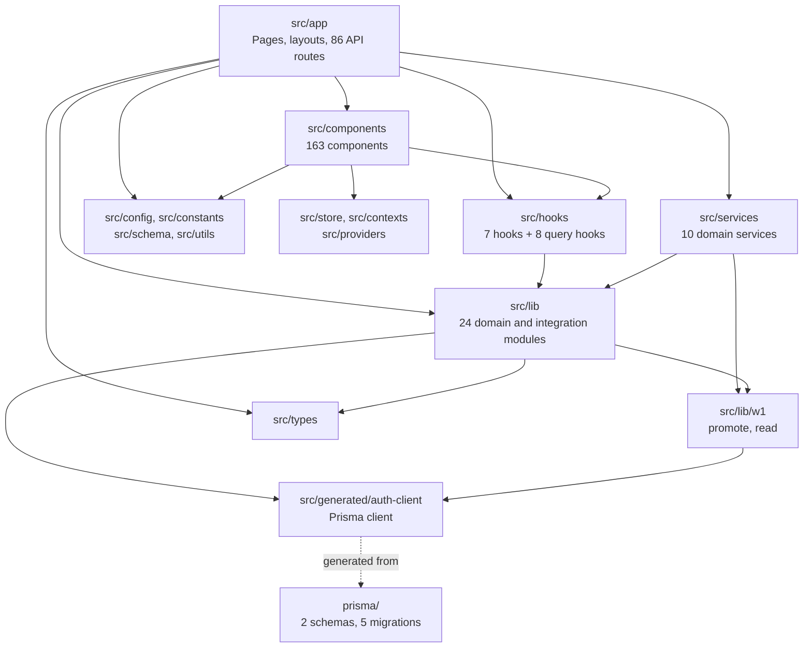

# Code Structure

**System**: Remonta Marketplace
**Analysis Date**: 2026-09-09T02:12:02Z

---

## Build System

- **Type**: npm (single package, not a workspace or monorepo)
- **Package**: `remonta` v0.1.0, private
- **Bundler**: Next.js 15.5.7 with Turbopack in development, standard Next build in production

### Key build files

| File | Role |
|---|---|
| `package.json` | Single manifest. 55 runtime dependencies, 19 dev dependencies. |
| `next.config.ts` | Prisma bundling rules, image optimisation, security headers, 50 MB Server Action body limit. **Disables TypeScript and ESLint build failures.** |
| `vercel.json` | Build command, hourly cron, per-function `includeFiles` for Prisma engines. |
| `tsconfig.json` | TypeScript configuration with the `@/*` path alias to `src/*`. |
| `eslint.config.mjs` | Flat ESLint config extending `eslint-config-next`. |
| `postcss.config.mjs` | Tailwind 4 via `@tailwindcss/postcss`. |
| `.husky/` | Git hooks; `lint-staged` with Prettier and the Tailwind class-sorting plugin. |
| `prisma/migrations/migration_lock.toml` | PostgreSQL migration provider lock. |

### Scripts of note

| Script | Purpose |
|---|---|
| `dev` | Regenerates both Prisma clients, then `next dev --turbopack`. |
| `build` | Generates both Prisma clients, then `next build`. |
| `postinstall` | Regenerates both Prisma clients — required because the auth client is emitted into `src/generated`. |
| `db:migrate` | Runs against `auth-schema.prisma` only. The legacy `schema.prisma` has no migrate script. |
| `test:smoke` / `test:load` / `test:stress` | k6 load tests. **The only test commands in the project.** |

---

## Module Hierarchy

### Text Alternative

`src/app` sits at the top and depends on components, hooks, services, lib and config. Components
depend on hooks, state stores and config. Hooks and services depend on `src/lib`. Services and
lib both use the W1 helpers. Lib and W1 use the generated auth Prisma client, which is generated
from the `prisma/` schemas. Types are shared by app and lib.

---

## Existing Files Inventory

Candidates for modification in brownfield work, grouped by responsibility.

### Data model

- `prisma/auth-schema.prisma` — **the live domain**: 24 models, 10 enums, generates to `src/generated/auth-client`.
- `prisma/schema.prisma` — legacy Zoho-mirror: 8 models, default Prisma client.
- `prisma/schema.target.prisma` — retained design reference only, not generated from.
- `prisma/migrations/0_init` — baseline.
- `prisma/migrations/20260906140000_w1_json_promotion` — created the four typed tables.
- `prisma/migrations/20260907080000_w1_fix_value_types` — corrected three column types.
- `prisma/migrations/20260907140000_w1_rekey_children_to_profile` — rekeyed job history and education onto `workerProfileId`.
- `prisma/migrations/20260907160000_w1_drop_json_columns` — dropped the four Json columns. **W1 is complete.**
- `prisma/legacy-sql/` — legacy SQL assets.

### Authentication and authorization

- `middleware.ts` — edge auth and role gating for `/dashboard`, `/admin`, `/apply`.
- `src/lib/auth.ts` — guard helpers: `getSession`, `getCurrentUser`, `isAuthenticated`, `hasRole`, `hasAnyRole`, `requireAuth`, `requireRole`, `requireAnyRole`.
- `src/lib/auth.config.ts` — NextAuth configuration (321 lines): credentials provider, callbacks, session and JWT shaping, lockout logic.
- `src/lib/auth-prisma.ts` — the auth-database Prisma client singleton.
- `src/lib/prisma.ts` — the legacy-database Prisma client singleton.
- `src/lib/password.ts` — bcrypt hashing, strength rules.
- `src/lib/impersonation.ts` — admin impersonation start and end.
- `src/hooks/useRequireAuth.ts` — client-side auth gate used by the four dashboard layouts.
- `src/types/auth.ts`, `src/types/next-auth.d.ts` — role enum and NextAuth type augmentation.

### Compliance and verification

- `src/lib/verification.ts` — the verification lifecycle: queues by status, worker detail, approve, reject, statistics, submit for review.
- `src/lib/feature-access.ts` — BASIC / VERIFIED / PREMIUM feature gating keyed to verification status.
- `src/services/worker/compliance.service.ts` — worker-side compliance operations.
- `src/config/complianceDocumentMapping.ts`, `serviceDocumentRequirements.ts`, `serviceQualificationRequirements.ts` — the static requirement taxonomy.
- `src/utils/dynamicComplianceSteps.ts`, `dynamicTrainingSteps.ts`, `qualificationMapping.ts` — requirement derivation from selected services.

### Worker domain services (`src/services/worker/`)

`profile.service.ts`, `profilePreview.service.ts`, `availability.service.ts`,
`compliance.service.ts`, `experience.service.ts`, `additionalInfo.service.ts`,
`serviceDocuments.service.ts`, `setupProgress.service.ts`, `workerServices.service.ts`.
Plus `src/services/user/account.service.ts`.

### W1 promotion helpers

- `src/lib/w1/promote.ts` (13.5 KB) — Json-to-typed-table promotion, `SLUG_TO_DOMAIN` mapping. Still imported by `src/app/api/admin/contractors/route.ts`.
- `src/lib/w1/read.ts` (5.6 KB) — typed-table read helpers.

### Search and geography

- `src/lib/worker-search.ts` (363 lines) — the largest lib module; faceted and geospatial worker query construction.
- `src/lib/geocoding.ts` (284 lines) — address and suburb geocoding.
- `src/lib/location-parser.ts` (158 lines) — location string parsing.
- `src/lib/data/australianPostcodes.ts` — postcode reference data.
- `src/components/SearchSupport.tsx` — the main search UI, used by both admin and the unguarded `/remontaadmin/findsupport` page.

### Integrations

- `src/lib/zoho.ts` (211 lines) — `ZohoService` class: OAuth token refresh, `getLeadsByStage`, `getRawLeads`.
- `src/lib/email.ts` (253 lines) — Resend and Nodemailer templates.
- `src/lib/blobStorage.ts` — Vercel Blob upload, filename generation, image validation.
- `src/lib/redis.ts` — Upstash cache helpers, `CACHE_KEYS`, `invalidateCache`.
- `src/lib/ratelimit.ts` (191 lines) — Upstash rate limiters.
- `src/lib/recaptcha.ts` — reCAPTCHA verification.
- `src/lib/shareToken.ts` — tokenised public profile links.
- `src/lib/backgroundUploadQueue.ts` — deferred upload processing.

### Cross-cutting

- `src/lib/logger.ts`, `src/lib/api-interceptor.ts`, `src/lib/cache-invalidation.ts`, `src/lib/profileData.ts`, `src/lib/reports.ts`.

### Configuration and reference data

- `src/config/` — 10 modules: setup step definitions, contract and code-of-conduct content, service offerings, skills, document and qualification requirements.
- `src/constants/` — 8 modules: services, languages, onboarding questions, profile answers, unique services.
- `src/schema/` — 5 Zod schemas: client form, contractor form, registration, service request, worker profile.
- `src/lib/validations/contractor.ts` — contractor validation.
- `src/utils/` — 10 helpers including `apiRetry.ts`, `serviceSlugMapping.ts`, `profileSections.ts`, `imageCrop.ts`.

### State management

- `src/store/onboardingStore.ts` — Zustand onboarding state.
- `src/contexts/ProgressContext.tsx` — progress context.
- `src/providers/QueryProvider.tsx`, `src/components/providers/QueryClientProvider.tsx`, `SessionProvider.tsx`.
- `src/hooks/queries/` — 8 TanStack Query hooks: categories, compliance documents, identity documents, service documents, service subcategories, worker profile, worker requirements, workers.

### Components (163 files)

| Group | Count | Contents |
|---|---|---|
| `ui/` | 27 | shadcn-style primitives plus `Loader`, `ProgressBar`, `WorkerAvatar`, `ConfirmDialog`, `ErrorModal`, selects for language, location and service. |
| `dashboard/` | 14 | Layout, sidebar, header, job cards and sections, news slider, profile card and completion reminder, apply and withdraw. |
| `modals/` | 7 | Image crop, additional photos, admin photo picker, and four selection modals. |
| `admin/` | 4 | Sidebar, chatbot, floating chatbot, impersonation button. |
| `contracts/` | 4 | Contract page, viewer, signature pad. |
| `profile-building/` | 4 | Edit layout, detail menus, `sections/`. |
| `services-setup/` | 3 | Add-service and service-documents dialogs, `steps/`. |
| `forms/` | 3 | Client registration, worker registration, shared fields. |
| `pdf/` | 2 | Worker profile PDF, code-of-conduct PDF. |
| `providers/` | 2 | Query client and session providers. |
| `account-setup/`, `requirements-setup/`, `profile/` | 4 | Step and shared subtrees, worker profile view. |
| root | 2 | `SearchSupport.tsx`, `ApiInterceptorSetup.tsx`. |

### Operational scripts

- `scripts/create-admin-user.ts`, `promote-to-admin.ts`, `verify-user-manually.ts`, `debug-document-filters.ts`
- `src/scripts/fixQualificationNames.ts` — the script counterpart of the unguarded `/api/admin/fix-qualifications` endpoint.

### Tests

- `tests/load/config.js`, `smoke.test.js`, `load.test.js`, `stress.test.js`, `edit-profile.test.js`

---

## Design Patterns

### Route Handler as Controller
- **Location**: All 86 files under `src/app/api/**/route.ts`.
- **Purpose**: Map HTTP to domain operations.
- **Implementation**: Each handler calls a guard (`requireRole` / `requireAnyRole`), parses input, calls Prisma or a service, and returns `NextResponse.json`. Response shape is commonly `{ success, data, pagination }`.

### Guard Helper
- **Location**: `src/lib/auth.ts`.
- **Purpose**: Centralise session and role assertion.
- **Implementation**: `requireRole(role)` and `requireAnyRole(roles)` throw when the session is absent or the role does not match. **Applied per handler — nothing enforces that a handler calls one.**

### Prisma Client Singleton
- **Location**: `src/lib/auth-prisma.ts`, `src/lib/prisma.ts`.
- **Purpose**: Avoid connection exhaustion under serverless hot reload.
- **Implementation**: Global-cached instance, the standard Next.js pattern, once per database.

### Service Layer (partial)
- **Location**: `src/services/worker/**`, `src/services/user/**`.
- **Purpose**: Lift worker business logic out of route handlers.
- **Implementation**: Ten modules of exported async functions. **Applied to the worker domain only** — client, coordinator and admin logic remains in handlers.

### Server Cache with Explicit Invalidation
- **Location**: `src/lib/redis.ts`, `src/lib/cache-invalidation.ts`.
- **Purpose**: Cut database load on expensive faceted searches.
- **Implementation**: `getCached` / `setCached` around query results, keyed by `CACHE_KEYS`, with `invalidateCache` called after mutating operations such as job sync.

### Step-Driven Wizard
- **Location**: `src/config/*Steps.ts`, `src/components/*-setup/steps/`, `src/utils/dynamic*Steps.ts`.
- **Purpose**: Drive multi-stage onboarding from declarative configuration.
- **Implementation**: Static step definitions in config, dynamically extended based on the worker's selected services; progress persisted to `WorkerProfile.setupProgress`.

### Client-Side Layout Auth Gate
- **Location**: The four dashboard and admin layouts via `useRequireAuth`.
- **Purpose**: Prevent unauthenticated render.
- **Implementation**: `"use client"` layouts that render a loader, then null, then children. **Checks authentication only, never role** — see `code-quality-assessment.md`.

### Generated Client Committed to Source
- **Location**: `src/generated/auth-client/`.
- **Purpose**: Guarantee the Prisma client is present in the Vercel bundle.
- **Implementation**: Emitted by the `output` directive in `auth-schema.prisma`, regenerated on `postinstall`, and force-included via `next.config.ts` and `vercel.json`.

---

## Critical Dependencies

| Dependency | Version | Usage | Purpose |
|---|---|---|---|
| `next` | 15.5.7 | Whole application | App Router framework, routing, SSR, API handlers, middleware |
| `react` / `react-dom` | 19.1.0 | Whole UI | Rendering |
| `prisma` / `@prisma/client` | ^6.16.2 | Both databases | ORM, migrations, generated clients |
| `@prisma/extension-accelerate` | ^3.0.1 | Legacy DB | Optional query acceleration |
| `next-auth` | ^4.24.11 | Auth | Session and JWT. Note: v4 with Next 15, not the v5 line |
| `@auth/prisma-adapter` | ^2.10.0 | Auth | Persists accounts and sessions |
| `bcryptjs` | ^3.0.2 | Auth | Password hashing |
| `zod` | ^4.1.11 | Validation | Request and form schemas |
| `react-hook-form` + `@hookform/resolvers` | ^7.63 / ^5.2.2 | Forms | Form state bound to Zod |
| `@tanstack/react-query` | ^5.90.5 | Data fetching | Server-state cache — **coexists with `swr`** |
| `swr` | ^2.3.6 | Data fetching | Second server-state library |
| `zustand` | ^5.0.8 | State | Onboarding store |
| `tailwindcss` | ^4 | Styling | Utility CSS |
| `@radix-ui/*` | various | UI | Accessible primitives behind `components/ui` |
| `@mui/material` + `@mui/x-date-pickers` | ^7.3.6 / ^8.23.0 | UI | **Third UI system** alongside Radix and Headless UI |
| `@headlessui/react` | ^2.2.8 | UI | Fourth UI primitive set |
| `styled-components` + `@emotion/*` | ^6.1.19 / ^11 | Styling | **Two CSS-in-JS runtimes** alongside Tailwind |
| `@upstash/redis` + `@upstash/ratelimit` | ^1.35.6 / ^2.0.6 | Cache | Caching and rate limiting |
| `@vercel/blob` | ^2.0.0 | Storage | File storage |
| `resend` + `nodemailer` | ^6.1.2 / ^6.10.1 | Email | **Two email transports** |
| `pusher` + `pusher-js` | ^5.3.2 / ^8.4.0 | Realtime | Declared; no active server usage found |
| `@react-pdf/renderer` + `jspdf` + `html-to-image` | ^4.3.1 / ^3.0.4 | PDF | **Two PDF generation paths** |
| `axios` | ^1.13.2 | HTTP | Coexists with native `fetch` |
| `date-fns` + `dayjs` | ^4.1.0 / ^1.11.19 | Dates | **Two date libraries** |
| `pg` + `@types/pg` | ^8.20.0 | Database | Raw client alongside Prisma |
| `tsx` | ^4.23.13 | Tooling | Runs the operational scripts |
| `k6` | external | Testing | Load tests, not an npm dependency |

**Dependency observation**: the manifest carries duplicate capability in six areas — UI
primitives (Radix, MUI, Headless UI), styling runtimes (Tailwind, styled-components, Emotion),
server state (TanStack Query, SWR), email (Resend, Nodemailer), PDF (react-pdf, jsPDF), and dates
(date-fns, dayjs). This is catalogued as technical debt in `code-quality-assessment.md`.
