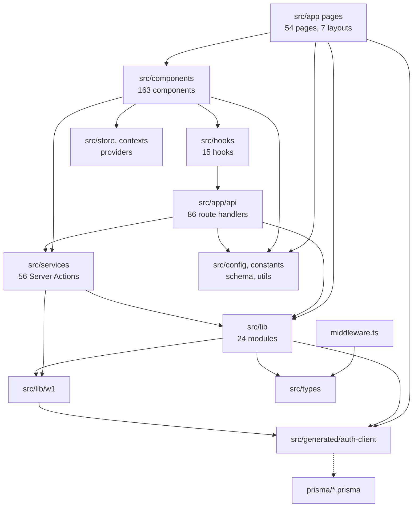

# Dependencies

**System**: Remonta Marketplace
**Analysis Date**: 2026-09-09T02:12:02Z

---

## Internal Dependencies

### Text Alternative

Middleware depends only on types. Pages depend on components, lib, config and — in 15 cases —
directly on the generated Prisma client. Components depend on hooks, client state, config and
Server Actions. Hooks call API routes over HTTP. API routes depend on lib, services and config.
Server Actions depend on lib and the W1 helpers. Lib depends on W1, the generated client and
types. The generated client derives from the Prisma schemas.

---

### Layer dependency detail

| From | To | Type | Reason |
|---|---|---|---|
| `src/app/api/**` | `src/lib` | Runtime | Guards, Prisma clients, integrations, caching |
| `src/app/api/**` | `src/services` | Runtime | Worker domain operations |
| `src/services/**` | `src/lib` | Runtime | `auth-prisma`, `auth.config`, W1 helpers |
| `src/services/**` | `src/lib/w1` | Runtime | Reads and writes the typed W1 tables |
| `src/lib/**` | `src/generated/auth-client` | Runtime | All auth-database access |
| `src/lib/w1/promote.ts` | `src/generated/auth-client` | Runtime | Typed-table writes and `SLUG_TO_DOMAIN` |
| `src/app/api/admin/contractors` | `src/lib/w1/promote` | Runtime | Imports `SLUG_TO_DOMAIN` for experience filtering |
| `src/components/**` | `src/services/**` | Runtime | Direct Server Action invocation from client components |
| `src/hooks/queries/**` | `src/app/api/**` | Runtime (HTTP) | TanStack Query fetches API routes |
| **15 pages + 2 components** | `src/lib/auth-prisma` | Runtime | **Direct database access bypassing the API layer** |
| `middleware.ts` | `src/types/auth` | Compile | `UserRole` enum |
| `src/generated/auth-client` | `prisma/auth-schema.prisma` | Build | Regenerated by `postinstall` and `db:generate` |

---

## Client / Server Boundary Analysis

This section exists because the stated goal is to split backend from frontend and add a mobile
application. The boundary below is the thing that split has to cut through.

### Measurements

| Metric | Count |
|---|---|
| Files marked `"use client"` | 185 |
| Pages that are Server Components | 21 of 54 |
| Pages that are Client Components | 33 of 54 |
| API route handlers (HTTP-reachable) | 86 |
| Server Actions (Next.js RPC only) | 56 across 10 modules |
| Files importing Prisma **outside** the API layer | 17 (15 pages, 2 components) |
| `src/lib` modules imported by client components | 2 of 24 (`impersonation`, `api-interceptor`) |
| Modules marked with the `server-only` package | 0 |

### What this means for a backend split

**Favourable — the domain layer is already server-clean.**
Only 2 of 24 `src/lib` modules are reachable from client components. The functional core
(auth, verification, feature access, search, geocoding, Zoho, email, Blob, Redis, rate limiting,
reports) has effectively no client coupling and can move to a backend package largely intact.
`src/services` and `src/lib/w1` are likewise server-only.

**Obstacle 1 — 56 Server Actions have no HTTP surface.**
Every module in `src/services/**` begins with `"use server"`. These 56 functions are invoked
through the Next.js Server Action RPC protocol, directly from client components, and are not
routable HTTP endpoints. The distribution:

| Module | Actions |
|---|---|
| `additionalInfo.service.ts` | 12 |
| `setupProgress.service.ts` | 11 |
| `profile.service.ts` | 8 |
| `workerServices.service.ts` | 7 |
| `compliance.service.ts` | 4 |
| `serviceDocuments.service.ts` | 3 |
| `experience.service.ts` | 3 |
| `availability.service.ts` | 3 |
| `account.service.ts` | 3 |
| `profilePreview.service.ts` | 2 |

A React Native client cannot call a Server Action. The entire worker profile and onboarding
domain — the largest and most business-critical flow in the product — is therefore **not
reachable by a mobile app today**. Exposing it requires either promoting these 56 actions to HTTP
endpoints or building an equivalent API surface.

**Obstacle 2 — 17 files query the database directly from React Server Components.**
These pages and components import `authPrisma` and query Prisma inline, with no API endpoint
behind them:

| File | Prisma calls |
|---|---|
| `src/components/dashboard/NewsSliderAsync.tsx` | 2 |
| `src/app/dashboard/worker/my-jobs/page.tsx` | 2 |
| `src/app/dashboard/supportcoordinators/manage-request/page.tsx` | 2 |
| `src/app/dashboard/client/request-service/page.tsx` | 2 |
| `src/app/dashboard/client/manage-request/page.tsx` | 2 |
| `src/components/dashboard/JobsSectionAsync.tsx` | 1 |
| `src/app/dashboard/worker/page.tsx` | 1 |
| `src/app/dashboard/supportcoordinators/{page,account,archived,completed,find-worker,request-service}.tsx` | 1 each |
| `src/app/dashboard/client/{page,account,archived,find-worker}.tsx` | 1 each |

The data these pages render exists only as an inline query. A mobile app has no way to obtain it
without new endpoints.

**Obstacle 3 — authentication is Next-coupled.**
NextAuth v4 with JWT cookie sessions, plus `middleware.ts` reading the token via
`next-auth/jwt`, is a browser-cookie model. Mobile clients need token-based authentication
(bearer tokens with refresh), which NextAuth v4 does not provide natively. The `UserRole` enum
and guard helpers are portable; the session transport is not.

**Obstacle 4 — no shared contract layer.**
Types live in `src/types` and Zod schemas in `src/schema`, but neither is packaged for
consumption by a separate client. Response shapes are constructed ad hoc per handler
(`{ success, data, pagination }` by convention, not by a shared type). A monorepo split will
need an extracted contract package to keep web, mobile and backend in agreement.

### Coupling summary

| Layer | Server-only | Mobile-reachable today | Split difficulty |
|---|---|---|---|
| `src/lib` (24 modules) | Yes, 22 of 24 | via API routes | **Low** |
| `src/lib/w1` | Yes | via API routes | **Low** |
| `prisma/` schemas | Yes | n/a | **Low** |
| `src/app/api` (86 routes) | Yes | Yes | **Low** — already HTTP |
| `src/services` (56 actions) | Yes | **No** | **High** — needs an HTTP surface |
| 17 direct-Prisma pages | Yes | **No** | **High** — needs new endpoints |
| Auth and session | Partly | **No** | **High** — needs token auth |
| `src/components` (163) | No | n/a | Medium — web-specific, not reusable in React Native |
| `src/types`, `src/schema` | Shared | Not packaged | **Medium** — extract to a contract package |

---

## External Dependencies

### Runtime — Framework and Core

| Package | Version | Purpose | License |
|---|---|---|---|
| `next` | 15.5.7 | Application framework | MIT |
| `react`, `react-dom` | 19.1.0 | UI rendering | MIT |
| `typescript` | ^5 | Language | Apache-2.0 |

### Runtime — Data

| Package | Version | Purpose | License |
|---|---|---|---|
| `prisma`, `@prisma/client` | ^6.16.2 | ORM and migrations | Apache-2.0 |
| `@prisma/extension-accelerate` | ^3.0.1 | Query acceleration | Apache-2.0 |
| `pg`, `@types/pg` | ^8.20.0 | PostgreSQL driver | MIT |
| `@upstash/redis` | ^1.35.6 | Serverless Redis | MIT |
| `@upstash/ratelimit` | ^2.0.6 | Rate limiting | MIT |
| `@vercel/blob` | ^2.0.0 | Object storage | Apache-2.0 |

### Runtime — Auth and Security

| Package | Version | Purpose | License |
|---|---|---|---|
| `next-auth` | ^4.24.11 | Authentication | ISC |
| `@auth/prisma-adapter` | ^2.10.0 | Session persistence | ISC |
| `bcryptjs` | ^3.0.2 | Password hashing | MIT |
| `zod` | ^4.1.11 | Runtime validation | MIT |

### Runtime — UI

| Package | Version | Purpose | License |
|---|---|---|---|
| `@radix-ui/react-*` (10 packages) | various | Headless primitives | MIT |
| `@mui/material`, `@mui/x-date-pickers` | ^7.3.6 / ^8.23.0 | Component system | MIT |
| `@headlessui/react` | ^2.2.8 | Headless primitives | MIT |
| `@heroicons/react`, `lucide-react` | ^2.2.0 / ^0.544.0 | Icons | MIT |
| `tailwindcss`, `@tailwindcss/postcss` | ^4 | Utility CSS | MIT |
| `styled-components` | ^6.1.19 | CSS-in-JS | MIT |
| `@emotion/react`, `@emotion/styled` | ^11 | CSS-in-JS (MUI peer) | MIT |
| `class-variance-authority`, `clsx`, `tailwind-merge` | — | Class composition | MIT |
| `cmdk`, `react-day-picker`, `react-easy-crop`, `tw-animate-css` | various | Widgets | MIT |
| `@chatscope/chat-ui-kit-react` | ^2.1.1 | Chat UI | MIT |

### Runtime — State and Forms

| Package | Version | Purpose | License |
|---|---|---|---|
| `@tanstack/react-query` | ^5.90.5 | Server state | MIT |
| `swr` | ^2.3.6 | Server state (duplicate capability) | MIT |
| `zustand` | ^5.0.8 | Client state | MIT |
| `react-hook-form`, `@hookform/resolvers` | ^7.63.0 / ^5.2.2 | Forms | MIT |

### Runtime — Integrations and Output

| Package | Version | Purpose | License |
|---|---|---|---|
| `resend` | ^6.1.2 | Email delivery | MIT |
| `nodemailer`, `@types/nodemailer` | ^6.10.1 | Email (duplicate capability) | MIT |
| `@react-email/render` | ^1.3.1 | Email templates | MIT |
| `pusher`, `pusher-js` | ^5.3.2 / ^8.4.0 | Realtime — **no active usage found** | MIT |
| `axios` | ^1.13.2 | HTTP client | MIT |
| `@react-pdf/renderer` | ^4.3.1 | PDF generation | MIT |
| `jspdf`, `html-to-image` | ^3.0.4 / ^1.11.13 | PDF (duplicate capability) | MIT |
| `date-fns` | ^4.1.0 | Dates | MIT |
| `dayjs` | ^1.11.19 | Dates (MUI peer) | MIT |

### Development

| Package | Version | Purpose | License |
|---|---|---|---|
| `eslint` ^9, `@eslint/eslintrc` ^3, `eslint-config-next` 15.5.4 | — | Linting | MIT |
| `prettier` ^3.6.2, `prettier-plugin-tailwindcss` ^0.6.14 | — | Formatting | MIT |
| `husky` ^9.1.7, `lint-staged` ^16.2.0 | — | Git hooks | MIT |
| `tsx` ^4.23.13 | — | Script execution | MIT |
| `@types/node` ^20, `@types/react` ^19, `@types/react-dom` ^19 | — | Type definitions | MIT |

**Totals**: 55 runtime dependencies, 19 dev dependencies. All are permissively licensed (MIT,
Apache-2.0, ISC) with no copyleft obligations. Licenses are stated from package convention and
have not been machine-verified.

---

## Duplicate Capability

Six areas carry two or more libraries doing the same job. Each is a decision the monorepo split
should settle rather than propagate into new packages.

| Capability | Libraries | Note |
|---|---|---|
| Server state | TanStack Query, SWR | Both actively imported |
| Styling runtime | Tailwind, styled-components, Emotion | Emotion is required by MUI |
| UI primitives | Radix, MUI, Headless UI, chatscope | Four systems |
| Email transport | Resend, Nodemailer | |
| PDF generation | `@react-pdf/renderer`, jsPDF + html-to-image | |
| Dates | date-fns, dayjs | dayjs is required by MUI date pickers |
| HTTP | axios, native fetch | |
| Icons | Heroicons, Lucide | |

`pusher` and `pusher-js` are declared but no server-side usage was found, making them candidates
for removal.

---

## Version Risks

| Risk | Detail |
|---|---|
| **NextAuth v4 with Next 15** | The v4 line predates the App Router. Migration to Auth.js v5 is likely required for mobile token auth, and is a breaking change touching `auth.config.ts`, `middleware.ts` and every `getServerSession` call site (31 route handlers plus 10 service modules). |
| **React 19 peer support** | React 19 is recent; MUI 7, styled-components 6 and chatscope may lag on peer ranges. |
| **Zod 4** | Zod 4 has breaking changes from v3. `@hookform/resolvers` ^5.2.2 must stay aligned. |
| **Prisma dual generate** | Every install and build generates two clients. The auth client is emitted into `src/generated` and committed, so a stale commit can diverge from the schema. |
| **Caret ranges throughout** | All dependencies use `^`. There is a `package-lock.json`, but no CI to verify a clean install reproduces. |
