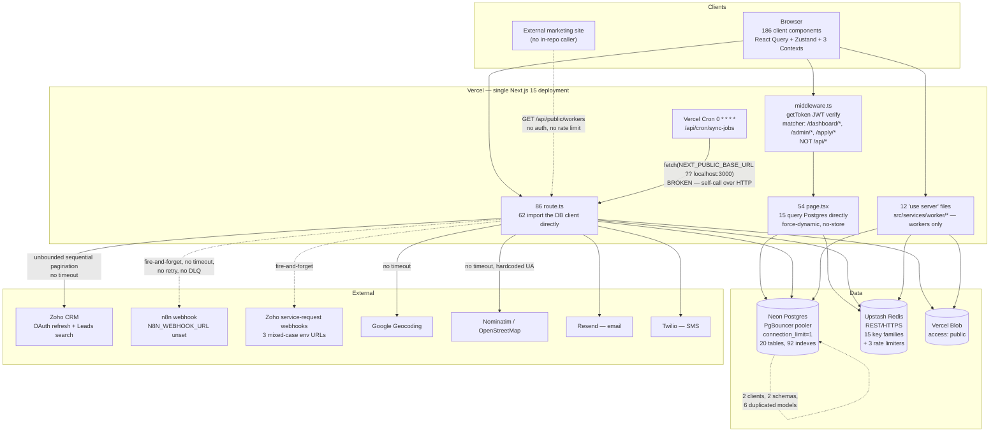

# Remonta Marketplace — Scaling-Readiness Architecture Audit

**Date:** 2026-08-28 · **Commit:** `72d698f` · **Branch:** `app/main`
**Method:** static read-only analysis of the repository. No database, no production
environment, no network calls. Every claim below cites a file and line.

---

## 1. Executive summary

Remonta is a single Next.js 15 App Router application on Vercel — 86 serverless API routes,
54 pages, ~87 000 lines of hand-written TypeScript — backed by Neon Postgres (reached through
two Prisma clients over two overlapping schemas, see [DB-03]) and Upstash Redis, integrated
with Zoho CRM, Google Geocoding, Vercel Blob, Resend and Twilio. It
is an NDIS care marketplace: support workers upload identity and compliance documents,
administrators verify them, and clients and support coordinators search for workers. There is
no service layer for two of the three user roles, no test suite, no CI, and no observability.

The single most important thing to fix: **`connection_limit=1`** on the Prisma pool
(`src/lib/auth-prisma.ts:29`). This is not a theoretical limit — the team has already hit it
and worked around it by *deleting transactions*, documented in code at
`src/app/api/compliance/upload/route.ts:190-195`: four concurrent uploads from one user
saturate the pool. Every multi-write operation in the system is now non-atomic as a direct
consequence, and `withRetry` (`src/lib/auth-prisma.ts:85`) treats pool exhaustion as a
database cold start and sleeps 7 seconds before retrying on the same saturated slot — a
positive feedback loop with no circuit breaker and no backpressure.

Top five scaling risks:

1. **Pool of 1 + retry-on-exhaustion** — the binding constraint; already forcing correctness
   compromises. (`src/lib/auth-prisma.ts:29,85`)
2. **Worker search cannot use an index.** Every text search is a leading-wildcard `ILIKE`
   across up to 45 predicates, and there is no trigram or full-text index in either schema.
   The `count` and the `findMany` each pay a sequential scan.
   (`src/app/api/client/workers/route.ts:319-337,448`)
3. **Unbounded queries on growth tables.** The client-facing distance search loads every
   worker in the bounding box *with joins* into function memory and paginates in JavaScript
   (`src/app/api/client/workers/route.ts:532-567`); the worker dashboard ships the entire
   active-jobs table to every worker on every render
   (`src/components/dashboard/NewsSliderAsync.tsx:16-30`); two admin compliance endpoints
   have no pagination parameter at all.
4. **No migrations.** `prisma/migrations/` contains no Prisma migrations — only six
   hand-written SQL files. Schema is applied with `prisma db push`, and
   `prisma/auth-schema.prisma` is the most-churned file in the repo (49 of 443 commits). There
   is no history, no reversibility, and no way to verify the deployed schema from the repo.
5. **Nothing is observable and nothing is tested.** The structured logger exists with every
   method body empty (`src/lib/logger.ts:54-78`) and is imported by nothing; there are 110
   `console.error` calls, no request IDs, no metrics, no tracing, no error reporting, and zero
   unit or integration tests. Roughly twenty `catch` blocks are empty. You would learn about
   an outage from a user.

Separately and urgently: three admin compliance routes read and return a worker's
verification record — including the public Blob URL of their passport or police check —
**before** calling `requireRole`. See [API-01].

---

## 2. Audit scope and confidence

### Examined

The full repository at `72d698f`: `package.json` + `package-lock.json` (878 locked packages),
both Prisma schemas, `middleware.ts`, `next.config.ts`, `vercel.json`, all 86 `route.ts`
files (matrix-scanned; ~25 read in full), all 12 `"use server"` files, the 25 largest source
files, `src/lib/*` in full, the k6 load suite, and git history (443 commits, 2025-09-24 →
2026-08-27). Env var **names** only were read; no values.

### Not verified — no access

| Gap | What would close it |
|---|---|
| Row counts on every table | `SELECT relname, n_live_tup FROM pg_stat_user_tables ORDER BY n_live_tup DESC` |
| Whether the deployed schema matches the repo | `prisma db pull` or `pg_dump --schema-only`, diffed |
| Whether `contractor_profiles` exists in the auth DB | `\dt` on `AUTH_DATABASE_URL` |
| Neon plan, compute size, `max_connections`, auto-suspend | Neon console |
| Vercel plan → function `maxDuration` and body limit | Vercel project settings |
| Whether `CRON_SECRET` / `NEXT_PUBLIC_BASE_URL` are set in Vercel | Vercel env vars + cron logs |
| Traffic volume and per-route RPS | Vercel Analytics |
| Production bundle size | `next build` output |
| bcrypt cost in ms on the production runtime | benchmark |
| Upstash plan and payload ceiling | Upstash console |
| Whether external CI exists | VCS provider checks |

### Confidence

- **High** — schema, indexes, route inventory, auth placement, query shapes, dependency
  tree, statefulness, absence of tests/observability/migrations. All directly readable.
- **Medium** — the volume at which each break-point triggers. Mechanisms are certain;
  thresholds depend on the unknowns above.
- **Low** — bundle size (the `.next/` on disk is a Turbopack *dev* build from 2025-07-09,
  not representative), and any claim about production runtime configuration.

One structural caveat: **development has effectively stopped.** 14 commits in the last five
months versus 389 in the preceding seven. Some findings may describe features that were
abandoned mid-flight rather than shipped.

---

## 3. Verified stack inventory

`declared` from `package.json`; `resolved` from `package-lock.json`; `sites` = files under
`src/`, `middleware.ts`, `scripts/` importing it, excluding `src/generated/`. Latest-stable
was **not** resolved — no registry was queried; version gaps below are derived from repo
evidence only.

| Component | Declared | Resolved | Sites | Scale relevance |
|---|---|---|---|---|
| `next` | `15.5.7` | 15.5.7 | — | All 86 routes are Vercel serverless functions; defines the whole concurrency model |
| `react` / `react-dom` | `19.1.0` | 19.1.0 | — | One minor behind: `@types/react` resolves to **19.2.7**, which only exists for a released 19.2 line |
| `typescript` | `^5` | 5.9.3 | — | `strict: true` (`tsconfig.json:12`) but **cannot fail a build** (`next.config.ts:7-9`) |
| `@prisma/client` / `prisma` | `^6.16.2` | 6.19.1 | 1 / — | 74 MB installed. Primary scale lever |
| `@prisma/extension-accelerate` | `^3.0.1` | 3.0.1 | 1 | Gated on `ACCELERATE_DATABASE_URL`, set in **no** env file → **inert** |
| `next-auth` | `^4.24.11` | 4.24.13 | **110** | v4 is the legacy major; `@auth/prisma-adapter@2.11.1` (the v5 adapter) is installed and never imported. Highest-fan-in dependency = largest migration liability |
| `bcryptjs` | `^3.0.2` | 3.0.3 | 4 | **Pure-JS** bcrypt. Cost 12 (`src/lib/password.ts:15`) vs cost 10 (`src/services/user/account.service.ts:187`) — two cost factors in one codebase |
| `zod` | `^4.1.11` | 4.3.5 | 10 | Only 8 of 86 routes validate |
| `@upstash/redis` | `^1.35.6` | 1.36.1 | 2 | REST-over-HTTPS — every cache op is a network round trip |
| `@upstash/ratelimit` | `^2.0.6` | 2.0.7 | 1 | Reaches 10 of 86 routes |
| `@vercel/blob` | `^2.0.0` | 2.0.0 | 12 | All uploads `access: 'public'` |
| `@tanstack/react-query` | `^5.90.5` | 5.90.16 | 27 | Caching **disabled** on the hottest query (`useWorkerProfile.ts:206-211`) |
| `axios` | `^1.13.2` | 1.13.2 | 3 | Second HTTP client alongside native `fetch` |
| `lucide-react` | `^0.544.0` | 0.544.0 | **66** | 42 MB installed — icon set #1 |
| `@heroicons/react` | `^2.2.0` | 2.2.0 | **36** | 15 MB — icon set #2, both genuinely used |
| `@mui/x-date-pickers` | `^8.23.0` | 8.24.0 | **1** | 7 MB, and drags `@mui/material` (11 MB) + Emotion (3 MB) for one component: `PreferredHoursSection.tsx:5-7` |
| `date-fns` + `dayjs` | `^4.1.0` / `^1.11.19` | 4.1.0 / 1.11.19 | 1 / 1 | **34 MB installed for two files** |
| `@react-pdf/renderer` + `jspdf` | `^4.3.1` / `^3.0.4` | 4.3.2 / 3.0.4 | 4 / 4 | Two PDF engines; `jspdf` 29 MB and used **server-side** at `worker-statistics/route.ts:154` |
| `resend` | `^6.1.2` | 6.7.0 | 1 | Outbound email |
| `pusher` + `pusher-js` | `^5.3.2` / `^8.4.0` | 5.3.2 / 8.4.0 | **0 / 0** | 8 MB. Six `PUSHER_*` vars configured in `.env`; **real-time is not implemented** |
| `swr` | `^2.3.6` | 2.3.8 | **0** | Second client cache, dead |
| `styled-components` | `^6.1.19` | 6.2.0 | **0** | Third CSS-in-JS runtime, dead |
| `nodemailer` (+types) | `^6.10.1` | 6.10.1 | **0** | Second email sender, dead |
| `pg` (+types) | `^8.20.0` | 8.20.0 | **0** | **A second raw Postgres driver.** Unused — but its presence is why a reader assumes a `pg` pool exists. There is none |
| `@auth/prisma-adapter` | `^2.10.0` | 2.11.1 | **0** | v5 adapter on a v4 install |
| `@react-email/render` | `^1.3.1` | 1.4.0 | **0** | `src/lib/email.ts` hand-builds HTML instead |
| `@emotion/react` / `styled` | `^11.14.x` | 11.14.x | **0 / 0** | MUI peers only |

**12 declared packages have zero import sites.** ~14 MB of unambiguously dead
`node_modules`. Ten distinct jobs are served by two-or-more libraries each (data cache, HTTP
client, date lib, date picker, CSS-in-JS, component kit, icons, PDF, email, Postgres driver).

### Runtime and toolchain, determined from the repo

| Thing | Value | Evidence |
|---|---|---|
| Node engine constraint | **none declared** | no `engines`, no `.nvmrc`, no `.tool-versions`, no Dockerfile |
| Production Node version | UNKNOWN | requires Vercel settings |
| DB | PostgreSQL on **Neon** with PgBouncer | `src/lib/prisma.ts:5-6`, `src/lib/auth-prisma.ts:23-24,67` |
| Prisma binary targets | `native`, `rhel-openssl-3.0.x` | confirms AWS-Lambda-family Linux |
| TS target / module | ES2017 / esnext, `moduleResolution: bundler` | `tsconfig.json:3,9-10` |
| Dev vs prod bundler | **Turbopack (dev) vs webpack (prod)** | `package.json:6` vs `:8` |
| npm | `legacy-peer-deps=true` | `.npmrc:1` — peer conflicts silenced repo-wide |

### Quality gates — measured

| Gate | State | Evidence |
|---|---|---|
| TypeScript blocks build | **NO** | `next.config.ts:7-9` |
| ESLint blocks build | **NO** | `next.config.ts:4-6` |
| Pre-commit hook | **NO** | `.husky/` contains only husky's own `_/`; no `pre-commit` file; `lint-staged@16.2.7` installed with **no config** |
| CI | **none in repo** | no `.github/`, `.gitlab-ci.yml`, `.circleci/` |
| Unit / integration / E2E tests | **ZERO** | no test runner in `package.json`; `tests/` holds only k6 scripts |

Nothing mechanical prevents a type-broken, lint-broken, untested change from reaching
production. This is the enabling condition for most findings below — e.g. [API-02], a
reference to a non-existent enum member that compiles and ships.

---

## 4. Architecture as-built



### The real request lifecycle

**Authenticated page (`GET /dashboard/worker`).** The edge middleware verifies the NextAuth
JWT locally — no database, no network (`middleware.ts:20`) — and checks the role against the
path prefix (`:34-56`). The page is a Server Component with
`export const dynamic = 'force-dynamic'; export const revalidate = 0`
(`src/app/dashboard/worker/page.tsx:23-24`), and `next.config.ts:82-86` stamps
`no-store, no-cache, must-revalidate, private` on all of `/dashboard/*`. **Nothing is
cacheable at the page or CDN layer; every load is a function invocation.** The page calls
`getServerSession` (0 queries — `strategy: 'jwt'`, `auth.config.ts:250`), then two
`getOrFetch` calls in parallel against Upstash, then streams a Suspense child that performs
two more reads. Warm: 1 query, 3 Upstash GETs. Cold: up to 6 queries including a 3-level
nested aggregate and a full-table read of `jobs`.

**API request.** `/api/*` is **not** covered by middleware — the matcher is
`/dashboard/:path*`, `/admin/:path*`, `/apply/:path*` (`middleware.ts:64-68`), which does not
match `/api/admin/...`. So each of the 86 handlers enforces authentication itself, in five
different ways: `getServerSession` inline, a shared in-file helper, `requireRole` /
`requireAnyRole` (which **throw**, landing in the generic `catch` and returning **HTTP 500**
rather than 403), an `x-api-secret` header, or nothing at all. 62 handlers then import the
Prisma client directly — the `src/services/` layer covers only the worker role.

**Writes.** No transaction, in most cases deliberately. `connection_limit=1` makes interactive
transactions unreliable, documented at `src/app/api/compliance/upload/route.ts:190-195` and
`src/app/api/client/service-request/[id]/route.ts:189`. Post-write side effects — audit logs,
CRM webhooks, cache invalidation, status flips — are **unawaited promises** (13 sites). Vercel
may freeze the instance as soon as the response flushes, and `waitUntil` appears nowhere in
the repo (0 matches), so this work is best-effort.

**Background work.** One Vercel cron, hourly, which HTTP-calls another route in the same
deployment using `process.env.NEXT_PUBLIC_BASE_URL ?? 'http://localhost:3000'` — and
`NEXT_PUBLIC_BASE_URL` is set in neither env file. There is no queue, no worker, and no
dead-letter handling anywhere.

---

## 5. Findings by domain

### 5.1 Database

#### [DB-01] `connection_limit=1` has forced the removal of transactions across the write path
**Severity:** S0  **Confidence:** High
**Evidence:** `src/lib/auth-prisma.ts:26-33`; `src/app/api/compliance/upload/route.ts:188-197`;
`src/app/api/client/service-request/[id]/route.ts:189`; `src/lib/auth-prisma.ts:71-94`
**What it is:** The Prisma URL builder injects `connection_limit=1`, `pool_timeout=30`,
`pgbouncer=true`. One connection per client instance means an interactive `$transaction`
needs the *only* slot; Prisma's default `maxWait` is ~2 s, so concurrent transactions fail
with P2028. The code documents hitting this at **four** concurrent uploads from a single user
and responds by removing the transaction. Only 8 `$transaction` sites remain in 87 000 LOC,
none with an explicit isolation level. Compounding it, `withRetry` classifies
`msg.includes('connection pool')` as a cold start (`:85`) and sleeps 1 s → 2 s → 4 s before
re-queueing on the same saturated slot — 20 call sites use it, including every dashboard
server component.
**Why it matters at scale:** Two failures at once. (a) Correctness: multi-write sequences are
non-atomic *today* — participant-then-request edits (`service-request/[id]/route.ts:191-213`),
user-then-services registration (`auth/register/route.ts:235,346`), blob-then-row uploads.
Partial failures leave inconsistent state with no compensating action. (b) Capacity: pool
contention becomes 7 s of held function time, which makes Vercel scale out, which opens more
connections and multiplies the per-instance Zoho token refreshes and empty geocode caches.
Positive feedback with no circuit breaker.
**Fix:** Raise `connection_limit` to 3-5 per instance (PgBouncer in transaction mode absorbs
this; validate against Neon's `max_connections`), remove `'connection pool'` from the
`isColdStart` predicate so pool exhaustion fails fast, and restore transactions on the four
multi-write sequences above. **Effort: M.** Must ship before DB-02 or DB-04 are safe to
attempt.

#### [DB-02] No migrations exist; schema is applied with `db push`
**Severity:** S1  **Confidence:** High
**Evidence:** `prisma/migrations/` (only `migration_lock.toml` + six hand-written `.sql`
files); `package.json:11`; `prisma/auth-schema.prisma` = 49 of 443 commits;
`prisma/auth-schema.prisma:442-454`
**What it is:** There are no Prisma migration directories. Schema reaches the database via
`prisma db push`, which keeps no `_prisma_migrations` history, has no down path, and silently
drops columns and data when it judges a change to require it. The six SQL files
(`migrate_worker_services_to_arrays.sql`, `..._v2.sql`, `quick_restore_and_migrate.sql`,
`restore_worker_services_from_backup.sql`) are the fossil record of a hand-run data migration
that needed a rollback bolted on. `prisma/auth-schema.prisma:442-454` declares
`worker_services_backup_20260108` — a dated backup table checked into the production schema.
**Why it matters at scale:** No reversibility on the highest-churn artefact in the codebase.
`db push` issues plain `CREATE INDEX` and `ALTER TABLE`, never `CONCURRENTLY` — so every one
of the 92 indexes was built under an ACCESS EXCLUSIVE lock. Milliseconds today; at 1 M rows on
`worker_profiles` a single added index is a write outage for the duration of the build. And
the repo cannot tell you what is actually deployed, which makes every other DB fix riskier
than it should be.
**Fix:** `prisma migrate diff` the production database against the schema files to establish
the true baseline, `prisma migrate resolve --applied` an initial migration, then move to
`migrate deploy`. Drop the backup table. Add `CONCURRENTLY` for any future index.
**Effort: M.** Blocks DB-04, DB-05, DB-06.

#### [DB-03] Two Prisma clients over one database, with six duplicated models and one live cross-schema query
**Severity:** S1  **Confidence:** High
**Evidence:** `prisma/schema.prisma:6-9`; `prisma/auth-schema.prisma:3-10`;
`src/lib/prisma.ts:19`; `src/app/api/contractors/route.ts:2,301,350`;
`src/components/SearchSupport.tsx`
**What it is:** `schema.prisma` (8 models, datasource `DATABASE_URL`) and
`auth-schema.prisma` (21 models, datasource `AUTH_DATABASE_URL`) **both** declare `Document`,
`Category`, `Subcategory`, `CategoryDocument`, `SubcategoryDocument` and `Job` — and the two
`Job` models are structurally different (`stage`/`dealName`/`suburbs` + 10 participant-matching
fields and 13 indexes, versus `status`/`recruitmentTitle`/`city` + a `JobApplication` relation
and 8 indexes). Whichever `db push` ran last wins. Meanwhile:

```ts
// src/lib/prisma.ts:19
url: process.env.ACCELERATE_DATABASE_URL || process.env.AUTH_DATABASE_URL || process.env.DATABASE_URL,
```

`ACCELERATE_DATABASE_URL` is set in **no** env file, so the client generated from
`schema.prisma` connects to the **auth** database. Its only two consumers query
`prisma.contractorProfile` — a model declared *only* in `schema.prisma:11-54`. That route is
live: `src/components/SearchSupport.tsx` calls `GET /api/contractors`.
**Why it matters at scale:** Either a `contractor_profiles` table exists in the auth database
and is invisible to `auth-schema.prisma` — in which case the next
`db push --schema=prisma/auth-schema.prisma` **drops it** — or the route errors at runtime.
Both are defects, and given DB-02 the repo cannot tell which. Every schema change is a
coin-flip on which model definition applies.
**Fix:** Confirm which tables exist (`\dt` on `AUTH_DATABASE_URL`). Collapse to **one** schema
and one generated client. If `ContractorProfile` is live, move it into `auth-schema.prisma`
and delete `schema.prisma` + `src/lib/prisma.ts`. **Effort: M.** Depends on DB-02.

#### [DB-04] Every text search is a leading-wildcard `ILIKE`; no trigram or full-text index exists
**Severity:** S1  **Confidence:** High
**Evidence:** `src/app/api/client/workers/route.ts:299-337,448`;
`src/app/api/admin/contractors/route.ts:250-286`; `src/app/api/admin/users/route.ts:34-41`;
`prisma/auth-schema.prisma:251-254`
**What it is:** Prisma's `contains` + `mode: 'insensitive'` compiles to `ILIKE '%token%'`,
which a B-tree cannot answer. In `client/workers`, each **text** token generates 9 such
predicates across `worker_profiles` *and* `worker_additional_info`, each **service** token
generates 3 including a correlated `EXISTS` on `worker_services`, and up to 5 tokens are
`AND`ed — up to 45 unindexable predicates. Then `:448` runs `count({where})` and
`findMany({where})` in parallel, so the predicate is evaluated **twice**. The only GIN index
in either schema is `@@index([languages], type: Gin)` (`auth-schema.prisma:254`), which serves
array operators, not text. There is no `pg_trgm` extension and no `tsvector` column anywhere.
Consequently `@@index([firstName])`, `[lastName]` and `[mobile]` (`:251-253`) exist solely to
serve text search and **can never be read** — pure write cost on the hottest table.
**Why it matters at scale:** Two sequential scans of `worker_profiles` per search request,
plus nested loops into two child tables. This is the marketplace's core action, and its cost
grows linearly with worker count on both the data and the count query. At ~10× it is seconds
of p95; at ~100× it exceeds the function `maxDuration` and every search returns 504.
**Fix:** `CREATE EXTENSION pg_trgm;` then GIN trigram indexes on the searched columns, or
better, a generated `tsvector` column with a GIN index and `websearch_to_tsquery`. Drop the
three unusable B-trees. Replace the exact `count` with an estimate or a `hasMore` probe
(`take: pageSize + 1`) to eliminate the second scan. **Effort: M.** Depends on DB-02.

#### [DB-05] Unbounded queries on tables that grow with usage
**Severity:** S1  **Confidence:** High
**Evidence:** `src/components/dashboard/NewsSliderAsync.tsx:16-30`;
`src/app/api/client/workers/route.ts:532-567`;
`src/app/api/admin/compliance/compliant/route.ts:16-36`;
`src/app/api/admin/compliance/pending/route.ts:18-67`;
`src/app/api/auth/register/route.ts:291-294`; `src/lib/redis.ts:92-94`
**What it is:** Ten `findMany` sites have no `take` on a growth table. The four that matter:

```ts
// src/components/dashboard/NewsSliderAsync.tsx:16-30 — every active job, no take
const jobs = await authPrisma.job.findMany({ where: { active: true }, select: {…}, orderBy: { postedAt: "desc" } })
```

- **Jobs list:** the whole table is materialised three times per cold load — Postgres result
  set, JSON string written to one shared Upstash key `active_jobs:v3`, and SSR payload — for
  **every worker on every dashboard render**.
- **Client distance search** (`client/workers:532-554`): every worker in the bounding box,
  *with* `workerServices` and `verificationRequirements` joined, then filtered, sorted and
  sliced in Node (`:557-567`). Pagination is applied after everything, so page 1 and page 40
  cost the same. `admin/contractors:693-750` and `public/workers:199-266` implement this
  correctly with a two-pass `{id, lat, lng}` scan; the client-facing route was not fixed.
- **Admin compliance queues:** `/compliant` returns every published worker sorted on
  `updatedAt`, which is **not indexed** (`auth-schema.prisma:241-258`); `/pending` sorts by
  `verificationRequirements._count`, which no index can serve, over unbounded rows with an
  unbounded nested `findMany`. Neither handler accepts a pagination parameter.
- **Registration** refetches the entire `Category` + `Subcategory` tree on every signup,
  despite `CACHE_KEYS.categories()` existing and being unused (`src/lib/redis.ts:51`).

**Why it matters at scale:** The jobs list has the nastiest failure mode. When the serialised
table exceeds Upstash's per-request payload ceiling, `setCached`'s **empty catch**
(`src/lib/redis.ts:92-94`) swallows the error — so the cache silently never populates and
every dashboard load performs a full-table read, permanently, with nothing in any log. The
distance search hits OOM or timeout. The admin queues simply become unopenable.
**Fix:** Add `take` + cursor pagination to all four. Port the two-pass pattern from
`admin/contractors` into `client/workers`. Add pagination parameters to both compliance
endpoints and an index on `worker_profiles(isPublished, updatedAt DESC)`. Cache the category
tree using the key that already exists. Make `setCached` log its failures.
**Effort: M** (S for the category cache alone).

#### [DB-06] 92 index structures, ~23 % removable; 19 on the hottest table
**Severity:** S2  **Confidence:** High
**Evidence:** `prisma/auth-schema.prisma` (76 `@@index` + 6 `@@unique` + 10 field `@unique`);
`:241-258` (WorkerProfile ×18 + unique); `:147,153` and `:185,189` and `:273-274` (exact
duplicates); `prisma/schema.prisma:40-53`
**What it is:** `worker_profiles` carries **19 index structures on 33 columns**;
`verification_requirements` 9 with no unique constraint; `users` has **four** index structures
on `email` (the `@unique`, `@@index([email])`, `idx_users_email`, and the leading column of a
3-column composite) — two of which are byte-identical. Categories of waste: 3 exact duplicates
(`users.email`, `verification_requirements.workerProfileId`, `Document.category`), 9 indexes
shadowing a `@unique` on the same column, ~9 that are redundant prefixes of an existing
composite (`worker_profiles.[isPublished]`, `jobs.[active]`, `worker_services.[workerProfileId]`,
and `ContractorProfile`'s `[deletedAt] [city] [state] [gender] [titleRole]` all duplicated by
`[deletedAt, X]`).
**Why it matters at scale:** Every `INSERT`/`UPDATE` touching an indexed column of
`worker_profiles` maintains 19 index structures. Because `verificationStatus` is indexed twice
(`:247`, `:257`), the single-field update at `src/app/api/compliance/upload/route.ts:265-267`
cannot be a HOT update — it rewrites index entries and the heap tuple. Write latency and WAL
volume grow with index count, and index bloat compounds under high update rates.
**Fix:** Drop the 3 exact duplicates and 9 unique-shadows first (zero risk, immediate write
win), then verify the composite prefixes against `pg_stat_user_indexes.idx_scan` before
dropping. **Effort: S** once DB-02 provides a migration path.

#### [DB-07] Read-modify-write races with no locking or optimistic concurrency
**Severity:** S1  **Confidence:** High
**Evidence:** `src/app/api/compliance/upload/route.ts:200-243` + `prisma/auth-schema.prisma:186`;
`src/lib/auth.config.ts:116,131`; `src/services/worker/setupProgress.service.ts:597-603,940-946`
**What it is:** No `SELECT … FOR UPDATE`, no advisory locks, no version columns anywhere.
Three concrete races:
1. **Duplicate compliance documents.** `findFirst` → `update` or `create`, with **no unique
   constraint** on `(workerProfileId, requirementType)` — `auth-schema.prisma:186` is a plain
   `@@index`. Two concurrent uploads of the same document type both see `existing === null`
   and both create a row. The in-code comment's "each document type is a different row, so
   there is zero contention" holds *across* types, not for retries or double-clicks.
2. **Account lockout is defeated by parallelism.** `getCached(attemptsKey)` → `+1` →
   `setCached(...)` is non-atomic; Redis `INCR` is not used. N parallel login attempts all read
   the same count. The policy is 3 attempts → **30-second** lock.
3. **Lost onboarding progress.** `setupProgress` is a JSON blob read, spread and written back.
   Two concurrent section completions each silently lose the other's flag — which is very
   likely why the three worker setup pages carry 22-28 commits each.
**Why it matters at scale:** All three get worse monotonically with concurrency. #1 corrupts
the compliance dataset that admin verification depends on. #2 removes brute-force protection.
#3 makes onboarding state untrustworthy — and that distrust is the stated reason the read path
recomputes completion from scratch on every request (see FE-01), which is itself a major cost.
**Fix:** Add `@@unique([workerProfileId, requirementType])` and switch to a real `upsert`
(S). Replace the attempts counter with Redis `INCR` + `EXPIRE` and raise the lockout window
(S). Move `setupProgress` from a JSON blob to columns, or wrap the read-merge-write in a
transaction once DB-01 is fixed (M).

#### [DB-08] Unbounded growth with no retention; naive timestamps; a date stored as text
**Severity:** S2  **Confidence:** High
**Evidence:** `prisma/auth-schema.prisma:32-46` (`audit_logs`); `:82-108` (`participants`);
`:215` vs `:87` (`dateOfBirth`); `:138,175,235`; `src/app/api/sync-jobs/route.ts:106-115`
**What it is:**
- `audit_logs` has no retention and no partitioning, 3 indexes maintained per insert, and
  grows with every login attempt. (It is also *incomplete* — see XC-02.)
- `jobs` rows are only flagged `active: false`, never deleted, so the table grows monotonically
  with Zoho lead history.
- `participants` holds NDIS participant `dateOfBirth` and a `conditions String[]` (health
  data) with `userId onDelete: SetNull` (`:101`) — **these rows survive account deletion as
  ownerless health PII**, with no retention policy.
- `worker_additional_info.bankAccount` is an unencrypted, unindexed `Json?` blob (`:431`).
- `worker_profiles.dateOfBirth` is **`String?`** (`:215`) and is range-queried
  lexicographically (`src/app/api/admin/contractors/route.ts:181-186`). Correct only if every
  row is exactly `YYYY-MM-DD`; nothing enforces that — no CHECK constraint, no zod validation
  on this field in any route. Meanwhile `participants.dateOfBirth` **is** `DateTime?` (`:87`)
  — the same concept typed two ways in one schema.
- Every `DateTime` maps to `timestamp without time zone` under Prisma. The app is Australian
  (`src/app/layout.tsx:50`, `src/lib/zoho.ts:9`) and functions run UTC, and the weekly report
  computes week boundaries with `getDay()`/`setHours()` in the function's timezone against
  naive DB values (`admin/reports/worker-statistics/route.ts:98-151`) — off-by-one-day
  bucketing across DST.
- `users.updatedAt`, `worker_profiles.updatedAt`, `verification_requirements.updatedAt` have
  **no `@updatedAt`** and must be set by hand. Any "recently changed" query, CDC or
  replication built on them will be wrong.
**Why it matters at scale:** Storage cost and index bloat on `audit_logs` and `jobs`; a
compliance exposure on orphaned participant health records; and silently wrong age filtering
and reporting the moment date formats diverge.
**Fix:** Retention + monthly partitioning on `audit_logs` (M). Purge `active:false` jobs
older than N days (S). Migrate `worker_profiles.dateOfBirth` to `DateTime` (M, needs a
backfill). Add `@updatedAt` (S). Decide participant retention on account deletion (S, policy).
**Integer PK exhaustion is not a risk** — every PK is cuid/uuid; no `autoincrement()` exists.

#### [DB-09] Four data-access paths; raw SQL is correctly parameterised
**Severity:** S2  **Confidence:** High
**Evidence:** 97 files import `authPrisma`, 2 import `prisma`, 13 raw-SQL sites, 12
`"use server"` files
**What it is:** `authPrisma` ORM (97 files), a second ORM client on a different schema
(2 files, DB-03), `$queryRaw`/`$executeRaw` (13 sites including 5 **inside page components**:
`src/app/dashboard/client/page.tsx:51`, `.../archived/page.tsx:47`,
`.../supportcoordinators/{page,archived,completed}.tsx`), and Server Actions wrapping the
first. `src/app/api/client/service-request/[id]/route.ts` mixes ORM and raw SQL in a single
handler (`:92,103,144,170,205,287,300`).
**Why it matters at scale:** No single place to add query timeouts, slow-query logging, read
replicas, or a caching decorator. Raw SQL in page components bypasses every abstraction and
is invisible to anyone reading the service layer.
**Fix:** Consolidate reads behind a thin repository module per aggregate; keep raw SQL where
it earns its place (the JSONB `_hidden` predicate) and move it out of page components.
**Effort: L.**
**Positive finding:** all 13 raw sites use tagged template literals, which Prisma
parameterises, and `$queryRawUnsafe`/`$executeRawUnsafe` appear **nowhere**. **No SQL
injection.** Note that the comment at `:286` ("handles ARCHIVED which Prisma enum doesn't
support") is stale — `auth-schema.prisma:556` declares `ARCHIVED`. Whether the deployed enum
still differs is `UNKNOWN — requires: SELECT enum_range(NULL::"ServiceRequestStatus")`.

---

### 5.2 API

#### [API-01] Three admin compliance routes read and return a worker's verification record before authenticating
**Severity:** S0  **Confidence:** High
**Evidence:** `src/app/api/admin/compliance/[id]/[documentId]/approve/route.ts:25-46` vs `:57`;
`.../reject/route.ts:36,52` vs `:68`; `.../reset/route.ts:25,41` vs `:48`
**What it is:** In three of the five admin compliance mutation routes, `requireRole` is called
*after* a database read and after a response path that returns data:

```ts
// approve/route.ts:25-46 — no auth has run yet
const document = await prisma.verificationRequirement.findFirst({ where: { id: documentId, workerProfileId: workerId } })
if (!document) return NextResponse.json({ success:false, error:'Document not found' }, { status:404 })
if (document.status === 'APPROVED') {
  return NextResponse.json({ success:true, message:'Document is already approved', data: document })
}
…
const admin = await requireRole(UserRole.ADMIN)   // :57 — first auth check
```

The returned `document` includes `documentUrl` — the **public** Vercel Blob URL of the
worker's passport, birth certificate, police check or NDIS screening — plus `notes`,
`metadata`, `rejectionReason` and `reviewedBy`. The 404-versus-other-status difference is an
existence oracle for enumerating `(workerProfileId, requirementId)` pairs. `update-expiry` and
`publish` authenticate first and are correct.
**Why it matters at scale:** This is a live unauthenticated PII disclosure, not a scaling
issue — but scale amplifies it: more workers means more enumerable pairs, and every disclosed
`documentUrl` is permanently public (XC-05). NDIS identity documents.
**Fix:** Move `requireRole` to the first statement of all three handlers. **Effort: S.** Do
this today.

#### [API-02] Authorisation failures return HTTP 500, and one role gate references a non-existent enum member
**Severity:** S1  **Confidence:** High
**Evidence:** `src/lib/auth.ts:60-90`; `src/app/api/admin/contractors/route.ts:806-814`;
`src/app/api/admin/users/route.ts:107-110`;
`src/app/api/admin/contractors/[id]/status/route.ts:18`;
`src/app/api/admin/compliance/compliant/route.ts:13`; `src/types/auth.ts:10-15`
**What it is:** `requireRole`/`requireAnyRole` **throw** rather than returning a result. Every
admin route wraps them in the handler's generic `try`, so an authorisation failure is
serialised as `{ success:false, error:'Failed to fetch workers', message:'Unauthorized -
Authentication required' }` with status **500** — on ~18 routes. The one route that maps it
correctly does so by **string-matching the error message**:
`status: error.message?.includes('required') ? 403 : 500` (`admin/users/route.ts:109`).
Separately, `requireAnyRole([UserRole.ADMIN, UserRole.SUPER_ADMIN])` references a member that
does not exist in the `UserRole` enum (`src/types/auth.ts:10-15` has WORKER, CLIENT,
COORDINATOR, ADMIN), so the array contains `undefined`; the sibling at
`compliance/compliant/route.ts:13` writes `'SUPER_ADMIN' as UserRole`. This compiles only
because `next.config.ts:7-9` disables type errors.
**Why it matters at scale:** 500s on authz failures pollute error rates and alerting (if any
is ever added), make the API unusable for a typed client, and cause retry logic to retry a
permanent failure. Using an error *string* as an authorisation decision is one refactor away
from becoming an authorisation bypass. The `SUPER_ADMIN` reference is a role gate that is
silently half-broken.
**Fix:** Make the helpers return `{ ok: false, response }` instead of throwing, or add a
typed `AuthError` and a shared handler that maps it to 401/403. Remove `SUPER_ADMIN` or add it
to the enum and the Prisma `UserRole`. Re-enable `typescript.ignoreBuildErrors: false`.
**Effort: M** (S for the enum).

#### [API-03] OTP verification is stateless and client-supplied; the signing key has a hardcoded fallback
**Severity:** S0  **Confidence:** High
**Evidence:** `src/app/api/auth/verify-otp/route.ts:4-10,12-40`;
`src/app/api/auth/send-otp/route.ts:7,15-49`; `src/lib/shareToken.ts:16-19`
**What it is:** `POST /api/auth/verify-otp` receives `email`, `code`, `token` and `expiresAt`
**all from the client**, recomputes `HMAC-SHA256(email:code:expiresAt)` and compares it to the
`token` the client also sent. Nothing is stored server-side, nothing is consumed, there is no
attempt counter, and there is no rate limit. `POST /api/auth/send-otp` — also unauthenticated
and unrate-limited — **returns that `token` and `expiresAt` to the caller** (`:49`). So an
attacker holding the token can brute-force the 6-digit code **offline**, with zero requests.
Both files derive the HMAC key as `process.env.NEXTAUTH_SECRET ?? '<literal>'` — a hardcoded
fallback in the public source tree; `src/lib/shareToken.ts:16-19` does the same for the
AES-256-GCM key used for profile-share tokens. `send-otp` also returns 409 for a registered
email and 200 otherwise: an email-enumeration oracle that sends a real email per probe.
**Why it matters at scale:** The email-verification factor provides no security at all today.
The enumeration + email-send amplification burns Resend quota and sender reputation, and both
degrade linearly with abuse volume, which is unbounded because there is no rate limit.
**Fix:** Store the OTP server-side (Redis, single-use, keyed by email, with an attempt
counter), never return the token to the client, rate-limit both endpoints, and return an
identical response for registered and unregistered emails. Remove all three hardcoded
fallbacks and fail at boot if `NEXTAUTH_SECRET` is absent. **Effort: S.**

#### [API-04] Unauthenticated public file upload writing to public Blob storage
**Severity:** S0  **Confidence:** High
**Evidence:** `src/app/api/upload/worker-photo/route.ts:13-79`;
`src/lib/blobStorage.ts:75-83,96-110`
**What it is:** `POST /api/upload/worker-photo` has **no authentication, no rate limit and no
reCAPTCHA**. It accepts up to 50 MB per file (`blobStorage.ts:118`), buffers the whole file
into function memory (`file.arrayBuffer()` → `Buffer.from`, `:39-40`), and writes it to Vercel
Blob with `access: 'public'`. The blob pathname is built from a caller-supplied `email` form
field (`:44`) passed as the identifier to `generateFileName`, which sanitises `originalName`
but **not** the identifier (`blobStorage.ts:75-83`) — so caller-controlled text, including
path characters, lands in the blob namespace.
**Why it matters at scale:** This is an open, anonymous, 50 MB-per-request public file host on
the company's domain. Storage and egress cost is unbounded and directly attacker-controlled,
and the content served from a remontaservices-associated URL is arbitrary. Memory: each
concurrent request holds up to 50 MB resident.
**Fix:** Require a session, or gate behind the same reCAPTCHA the registration route already
uses (`auth/register/route.ts:106`); add `strictApiRateLimit`; stream to Blob instead of
buffering (`compliance/upload/route.ts:176` already does this correctly); sanitise the
identifier; reduce the size cap. **Effort: S.**

#### [API-05] 33 outbound calls, zero timeouts, no retry, no circuit breaker
**Severity:** S1  **Confidence:** High
**Evidence:** `src/lib/zoho.ts:88,139,188`; `src/lib/geocoding.ts:118`;
`src/app/api/geocode/route.ts:47`; `src/app/api/auth/register/route.ts:412`;
`src/app/api/client/service-request/[id]/route.ts:116,124,235`;
`src/lib/blobStorage.ts:44`
**What it is:** 33 server-side `fetch` call sites across `src/app/api`, `src/lib` and
`src/services`. **None sets a timeout or an `AbortSignal`.** The only `AbortController`s in the
repo are in two *client* components. No retry policy on any outbound call (the one `withRetry`
is for the database), no circuit breaker, no bulkhead. The worst instance:

```ts
// src/lib/zoho.ts:136-172 — unbounded sequential pagination, no timeout, no page cap
while (moreRecords) {
  const url = `${this.apiUrl}/Leads/search?criteria=${criteria}&page=${page}&per_page=200`
  const response = await fetch(url, { headers: { Authorization: `Zoho-oauthtoken ${token}` } })
  …
  moreRecords = data.info?.more_records ?? false
  page++
}
```

At 10 000 leads that is 50 sequential HTTPS round trips before any DB work begins. If Zoho
ever returns `more_records: true` incorrectly, the loop runs until the platform kills the
function. Also: `src/lib/geocoding.ts:118-119` does not check `response.ok` before
`response.json()`, so a Google 429 throws into an **empty catch** (`:142-145`) and is
indistinguishable from "address not found".
**Why it matters at scale:** A dependency that becomes *slow* rather than failing is the
canonical cascading-failure trigger. Handlers block until the platform timeout, Vercel scales
out to absorb them, each new instance opens a connection and performs its own Zoho token
refresh with its own empty geocode cache, contention rises, and DB-01's retry loop converts
that into 7-second occupancies. There is no backpressure anywhere in the system.
**Fix:** A single `fetchWithTimeout` wrapper (`AbortSignal.timeout(n)`) applied to all 33
sites, with per-dependency budgets; cap `getLeadsByStage` at a maximum page count and
`response.ok` checks before `.json()` throughout. **Effort: M.** Ship before or with DB-01.

#### [API-06] Rate limiting reaches 10 of 86 routes, is keyed on a client-supplied header, and fails open silently
**Severity:** S1  **Confidence:** High
**Evidence:** `src/lib/ratelimit.ts:62-83,96-151`; `src/app/api/client/workers/route.ts:593-600`;
`src/app/api/public/workers/route.ts:300-334`; `src/lib/redis.ts:14-20`
**What it is:** Only 10 of 86 routes call `applyRateLimit` or `checkServerActionRateLimit`.
The identifier is `x-forwarded-for.split(',')[0]` (`:68-71`) — the **first** entry of a header
the client can influence — falling back to the literal string `'anonymous'` (`:82`), so all
header-less traffic shares one bucket. On any error the limiter returns `{ success: true }`
from an **empty catch with no log** (`:146-150`, `:186-190`). Rate-limit headers are computed
at `:112-116` but attached **only to 429 responses**, so compliant clients get no signal.
IP-keying also means one corporate NAT shares 100 req/min across all its users. Unprotected
routes include `/api/public/workers`, `/api/geocode`, `/api/sms/send-verification`,
`/api/auth/send-otp`, `/api/auth/verify-otp`, `/api/auth/check-email`, all `/api/upload/*`,
and every admin route.
**Why it matters at scale:** The protection and the thing it protects fail together. Both the
rate limiter (`ratelimit.ts:16-23`) and the entire cache layer (`redis.ts:14-20`) become
`null` when Upstash is unreachable — so an Upstash outage simultaneously removes all caching
(pushing every request onto the cold path: 4-6 queries per dashboard, two sequential scans per
search) **and** removes all rate limiting, on a pool of 1. The failure direction is *more*
load.
**Fix:** Apply rate limiting in middleware for `/api/*` rather than per-handler; key on the
platform-trusted client IP and on `userId` where a session exists; fail **closed** on limiter
errors for unauthenticated write routes; attach the headers to all responses; log rejections
and limiter errors. **Effort: M.**

#### [API-07] The hourly job sync cannot run: a serverless function HTTP-calling `localhost`
**Severity:** S0  **Confidence:** High
**Evidence:** `src/app/api/cron/sync-jobs/route.ts:14-22`;
`src/app/api/refresh-jobs/route.ts:24-27`; `vercel.json:3-8`; `.env`, `.env.local`
**What it is:**

```ts
// src/app/api/cron/sync-jobs/route.ts:15-22
if (authHeader !== `Bearer ${process.env.CRON_SECRET}`) return 401
const baseUrl = process.env.NEXT_PUBLIC_BASE_URL ?? 'http://localhost:3000'
const response = await fetch(`${baseUrl}/api/sync-jobs`, { method:'POST', … })
```

`CRON_SECRET` and `NEXT_PUBLIC_BASE_URL` are absent from both `.env` and `.env.local`. If
`CRON_SECRET` is unset in Vercel too, every cron invocation compares against
`"Bearer undefined"` and 401s. If it *is* set, the handler proceeds to fetch
`http://localhost:3000/api/sync-jobs` from inside a Lambda — ECONNREFUSED, in an unguarded
`await` with no try/catch, so the function throws. `POST /api/refresh-jobs:24` has the
identical fallback, so the manual admin trigger is broken the same way. The pattern is also
wasteful by design: a function calling another route in the same deployment over HTTP pays two
invocations and two cold starts.
**Why it matters at scale:** Job listings go stale silently. The 7 200-second Redis TTL on
`active_jobs:v3` (`src/lib/redis.ts:33`) is described in-code as a "safety-net" behind explicit
invalidation on every sync — with no sync, it is the *only* freshness mechanism, and it is
refilled from whatever is in the table. Nothing reports the failure (XC-01). Whether
`NEXT_PUBLIC_BASE_URL` is set in Vercel is **UNKNOWN — requires: Vercel env vars + cron
invocation logs.**
**Fix:** Call the sync function directly instead of over HTTP — extract the body of
`sync-jobs`'s POST into a plain function and invoke it from all three entry points. Validate
required env vars at boot. **Effort: S.**

#### [API-08] The one background job uses an in-process mutex and unbounded parallel writes
**Severity:** S1  **Confidence:** High
**Evidence:** `src/app/api/sync-jobs/route.ts:20-21,43-50,70-94,106-115,143-145`
**What it is:** `let isSyncing = false` at module scope guards against concurrent syncs on a
platform that runs N independent instances — each with its own copy. Two concurrent
invocations on different instances both see `false`. `GET /api/sync-jobs` (`:24-32`, **no
auth**) reports per-instance state, so identical requests get different answers. If the
platform kills the function on timeout, `finally { isSyncing = false }` (`:143-145`) never
runs and that warm instance is stranded at `true`, returning 409 to every subsequent sync
routed to it. The work itself is `Promise.allSettled(leads.map(upsert))` (`:70-94`) — N
unbounded parallel upserts on a pool of **1**, each maintaining 9 `jobs` indexes — and
`updateMany({ zohoId: { notIn: zohoIds } })` (`:106-115`), a `NOT IN` with one bind parameter
per lead against Postgres's 65 535 ceiling. Failures are tallied into `stats.errors` and
**never logged**.
**Why it matters at scale:** Beyond a few hundred leads the parallel upserts queue behind one
connection past the function timeout; the sync silently half-completes, and because the
deactivation pass at `:106` runs on whatever `zohoIds` it has, two overlapping syncs each
deactivate the other's jobs.
**Fix:** Replace the in-process flag with a Redis lock (`SET NX EX`) or Postgres advisory
lock; batch the upserts with bounded concurrency (`p-limit`-style, 5-10) or use
`createMany`+`updateMany`; chunk the `notIn` list; log `stats.errors` with the failing
`zohoId`s. **Effort: M.** Depends on API-07 for the job to run at all.

#### [API-09] Internal error text returned to clients in 14 handlers
**Severity:** S2  **Confidence:** High
**Evidence:** `src/app/api/admin/contractors/route.ts:659,812`;
`src/app/api/client/workers/route.ts:687`;
`src/app/api/client/service-request/[id]/route.ts:71,268,342`;
`src/app/api/compliance/upload/route.ts:246,286`; `src/app/api/admin/users/route.ts:108`;
`src/app/api/auth/send-otp/route.ts:53`; `src/app/api/sync-jobs/route.ts:137-140`
**What it is:** Fourteen handlers return `message: error.message` (or `error: err?.message`).
Two are notable: `admin/contractors/route.ts:659` throws
`` `Database query failed: ${prismaError.message}` `` — Prisma error text includes column and
constraint names — and `sync-jobs/route.ts:137-140` returns the raw **Zoho** error body, which
`src/lib/zoho.ts:150-154` builds from `await response.text()`. Stack traces are correctly
gated to development (`admin/contractors/route.ts:815-817`).
**Why it matters at scale:** Schema and third-party internals leak to any caller, and error
bodies become an unintended, unversioned part of the API contract that clients start parsing.
**Fix:** One error-response helper that logs the detail server-side (once XC-01 gives it
somewhere to go) and returns a stable code plus a generic message. **Effort: S.**

#### [API-10] No request size limit before body parsing; two paths buffer whole files
**Severity:** S2  **Confidence:** Medium
**Evidence:** `src/app/api/compliance/upload/route.ts:111,138`;
`src/app/api/upload/worker-photo/route.ts:39-40`;
`src/app/api/auth/register/route.ts:158,170-171`; `next.config.ts:21-24`
**What it is:** `next.config.ts:22-24` raises `bodySizeLimit` to `'50mb'` — for **Server
Actions only**, not route handlers. No route handler enforces a body limit.
`compliance/upload/route.ts:111` calls `await request.formData()` **before** the size check at
`:138`, so an oversized body is fully received and parsed first. `upload/worker-photo:39-40`
and `auth/register:170-171` do `arrayBuffer()` → `Buffer.from`, holding the whole file
resident — and `register` does it **inside a loop over an unbounded `photoFiles` array**.
`compliance/upload:176` uses `file.stream()` correctly; the other paths do not.
**Why it matters at scale:** Memory per request scales with attacker-chosen upload size. On
`upload/worker-photo` that is unauthenticated (API-04).
**Confidence is Medium** because Vercel's platform body limit (4.5 MB by default) would reject
most of this before the handler runs — that is platform config, not code:
**UNKNOWN — requires: Vercel plan/function settings.** If it has been raised, the vector is live.
**Fix:** Check `Content-Length` before parsing; stream everywhere; bound `photoFiles`.
**Effort: S.**

#### [API-11] Cache key omits the search radius, so different searches share a result
**Severity:** S2  **Confidence:** High
**Evidence:** `src/app/api/client/workers/route.ts:130-144` vs `:157-158,517-518`;
`src/app/api/public/workers/route.ts:~277`
**What it is:** `generateCacheKey` builds from `page`, `pageSize`, tokenised `search`,
`location` and `services` — but **not `within`**, which is parsed at `:157-158` and directly
determines the result set at `:517-518`. So `?location=Sydney&within=5` and
`?location=Sydney&within=100` share one Redis entry for 300 s; whichever runs first serves
both. `public/workers` gets this right — its allow-list includes `within`.
**Why it matters at scale:** Wrong results, more often as cache hit rate rises with traffic —
i.e. the bug gets *worse* as the cache starts working. A client asking for workers within 5 km
receives workers up to 100 km away, or vice versa, with no error.
**Fix:** Add `within` to the key. **Effort: S.** Then consolidate the three worker-search
implementations (STR-02).

#### [API-12] `POST /api/admin/fix-qualifications`: no auth, unbounded read, one UPDATE per row
**Severity:** S1  **Confidence:** High
**Evidence:** `src/app/api/admin/fix-qualifications/route.ts:10,13-22,44`
**What it is:** A one-off migration exposed as an unauthenticated HTTP endpoint. It reads
every `verification_requirements` row with `isRequired: false` (no `take`) and issues an
`await update()` **inside a `for` loop** — 1 + N sequential writes on a pool of 1, each
maintaining 9 indexes. It has 0 internal callers. `src/scripts/fixQualificationNames.ts:17,49`
is the identical CLI twin.
**Why it matters at scale:** Anyone on the internet can trigger a full-table rewrite of
compliance-document names, and its runtime grows linearly with the table — so it will exceed
the function timeout and leave the table **half-rewritten**, with no transaction and no way to
tell how far it got.
**Fix:** Delete the route; keep the script. **Effort: S.**

---

### 5.3 Frontend

#### [FE-01] React Query's cache is disabled on the highest-frequency query
**Severity:** S1  **Confidence:** High
**Evidence:** `src/hooks/queries/useWorkerProfile.ts:206-211`;
`src/components/providers/QueryClientProvider.tsx:26-33`;
`src/app/api/worker/profile/[userId]/route.ts:83-87`; `src/lib/redis.ts:31,38`
**What it is:** The global default is `staleTime: 5min` — and `useWorkerProfile` overrides it:

```ts
staleTime: 0,                        // "CRITICAL: Always fetch fresh data"
refetchOnMount: options?.refetchOnMount ?? 'always',
refetchOnWindowFocus: options?.refetchOnWindowFocus ?? true,
```

TanStack Query is reduced to request deduplication. Every mount of every onboarding wizard
step and every tab focus issues `GET /api/worker/profile/${userId}`, which server-side runs
`fetchProfileBase` plus `getAllCompletionStatusOptimized` — the latter being a 3-level nested
`Category → CategoryDocument → Document` / `Subcategory → SubcategoryDocument → Document`
aggregation (`setupProgress.service.ts:1344,1445,1622`). The Redis TTLs behind it are **60 s**
each, so a session longer than a minute repeatedly pays the cold path: up to 4 DB queries per
wizard step.
**Why it matters at scale:** This is the highest-volume authenticated request in the system,
and it is uncacheable by construction. The root cause is stated in the comment: `setupProgress`
is recomputed from `verification_requirements` on every read because the stored value cannot
be trusted — and it cannot be trusted because the writes that maintain it are fire-and-forget
on a serverless platform (XC-02) and race each other (DB-07). Cache invalidation was solved by
not caching.
**Fix:** Fix the write path first (DB-07 unique constraint + XC-02 awaited writes), then treat
`worker_profiles.setupProgress` as authoritative and restore a real `staleTime` with explicit
invalidation on mutation. **Effort: M.** Depends on DB-07 and XC-02.

#### [FE-02] No memoisation boundary anywhere; a 544-line context re-renders two 1100-line pages
**Severity:** S2  **Confidence:** High
**Evidence:** `React.memo` and `memo(` — **0 occurrences** in `src`;
`src/components/dashboard/client/request-service/RequestServiceContext.tsx` (544 LOC);
`src/app/layout.tsx:79`; `useMemo` 40× / `useCallback` 64×
**What it is:** `React.memo` is used **zero times** in the entire codebase, so none of the 64
`useCallback`s can prevent a child re-render — a stable callback passed to an unmemoised
component achieves nothing. `RequestServiceContext` holds the whole multi-step
service-request form in one context; any field change re-renders every consumer, including the
two ~1 100-line `request-service/edit/[participantId]/page.tsx` pages. `ProgressProvider` wraps
the entire app at `src/app/layout.tsx:79`, outside `SessionProvider` and
`QueryClientProvider`, so a progress-bar state change re-renders everything below it.
**Why it matters at scale:** This is a per-interaction latency problem that grows with form
size, not with users — but it is the surface where workers spend their onboarding time, and
onboarding completion is the business metric.
**Fix:** Split `RequestServiceContext` into value and dispatch contexts, `memo()` the section
components, and move `ProgressProvider` to the narrowest subtree that needs it. **Effort: M.**

#### [FE-03] No list virtualisation, and one list is fed an unbounded query
**Severity:** S2  **Confidence:** High
**Evidence:** no `react-window`/`react-virtualized`/`@tanstack/react-virtual` in
`package.json` or `src`; `src/components/dashboard/NewsSliderAsync.tsx:16-30` →
`src/components/dashboard/NewsSlider.tsx`;
`src/components/dashboard/client/ManageRequestTable.tsx` (801 LOC);
`src/components/profile/WorkerProfileView.tsx` (926 LOC, 16 `.map(`)
**What it is:** No virtualisation library is installed. Most lists are server-paginated at
20/page and therefore bounded — but `NewsSlider` receives the **entire** active-jobs array
(DB-05) and renders it unvirtualised on every worker dashboard.
**Why it matters at scale:** DOM node count and hydration cost grow linearly with active job
count on the most-visited authenticated page.
**Fix:** Bound the query (DB-05); add virtualisation only if a list genuinely needs to be
unbounded. **Effort: S** once DB-05 lands.

#### [FE-04] Bundle carries duplicate libraries and ~92 KB of reference data as source
**Severity:** S2  **Confidence:** Medium
**Evidence:** import counts in §3; `src/config/serviceSkills.ts` (27 528 B);
`src/lib/data/australianPostcodes.ts` (22 896 B); `src/config/contractContent.ts` (20 603 B);
`src/config/codeOfConductContent.ts` (11 217 B);
`src/config/serviceDocumentRequirements.ts` (10 396 B);
`src/components/profile-building/sections/PreferredHoursSection.tsx:5-7`;
`src/app/admin/manage/page.tsx:5`
**What it is:** Two icon sets both genuinely in use (66 + 36 files, 57 MB installed); two PDF
engines both live; two date libraries for one file each; `@mui/x-date-pickers` in **one** file
dragging `@mui/material` + Emotion (a runtime CSS-in-JS engine shipped to the client) when
`react-day-picker` is already installed; five dead packages still declared. Only **one**
`next/dynamic` in the whole app (`admin/manage/page.tsx:5`), so route-level splitting from the
App Router is essentially the only code-split boundary. ~92 KB of static reference data is
compiled as TypeScript source — and for `serviceSkills.ts` the `Category`/`Subcategory` tables
already exist in the schema for exactly this purpose. `next/font` loads **5 Poppins weights**
plus 2 Geist families (`src/app/layout.tsx:11-25`) on first paint of every page.
**Why it matters at scale:** Time-to-interactive on the onboarding funnel, which is where
worker acquisition converts or doesn't.
**Confidence is Medium** on magnitude: production sizes are **UNKNOWN — requires: `next build`
output or `@next/bundle-analyzer`.** The `.next/` on disk is a Turbopack dev build from
2025-07-09 and is not representative. One dev-build observation worth checking against a
production build: `.next/static/chunks/src_services_worker_*.js` are **520 KB each and served
from `static/`** despite `src/services/worker/*` being `"use server"` files — if webpack does
the same, the entire 6 923-LOC service layer ships to the browser.
**Fix:** Measure first. Then delete the 5 dead packages, replace the single MUI date picker
with `react-day-picker`, pick one icon set and one PDF engine, move reference data to the DB
or a fetched JSON asset, trim Poppins weights, and `next/dynamic` the PDF and admin-console
components. **Effort: M.**

#### [FE-05] API response types are hand-copied and already drifted
**Severity:** S2  **Confidence:** High
**Evidence:** `src/hooks/queries/useWorkerProfile.ts:34-62` vs
`src/app/api/worker/profile/[userId]/route.ts:12-59` and `prisma/auth-schema.prisma:203-260`;
`next.config.ts:7-9`
**What it is:** No tRPC, no generated OpenAPI client, no zod schema shared across the boundary.
`useWorkerProfile.ts:34-62` is a hand-written 28-field interface describing the response of
`GET /api/worker/profile/[userId]`, which is actually shaped by `transformProfile`. It has
**already drifted**: it declares `emergencyContactName`, `emergencyContactPhone` and
`emergencyContactRelationship`, none of which exist on `WorkerProfile` in the schema; and it
types `abn` as `string` where the column is `Json?` and the code reads
`abn.workerEngagementType.type` (`admin/contractors/route.ts:137-142`). The transform functions
take `any` (`transformWorker`, `transformToPublicData:403`, `transformToBio:142`), and
`typescript.ignoreBuildErrors: true` means the compiler could not object anyway.
**Why it matters at scale:** Every API change is a manual, unverified update on the client.
Drift surfaces as runtime `undefined` rather than a build failure — which is how
`UserRole.SUPER_ADMIN` (API-02) shipped.
**Fix:** Turn `ignoreBuildErrors` off (this is the prerequisite for everything else). Then
derive response types from the handler (`type Res = Awaited<ReturnType<typeof transformProfile>>`)
and export them for the client, or adopt zod schemas shared by both sides. **Effort: M.**

#### [FE-06] Half of image rendering bypasses `next/image`; 127 effects have no cancellation
**Severity:** S3  **Confidence:** High
**Evidence:** `next/image` in 19 files vs **18 raw ``**; 129 `useEffect(` across 79
files with 2 `AbortController`s; `next.config.ts:26-70`
**What it is:** Image config is good (`formats: ['image/avif','image/webp']`,
`minimumCacheTTL: 30 days`) but roughly half of image rendering skips it. Only two effects
cancel their fetches — combined with `refetchOnWindowFocus: true` (FE-01), tab-switching
during onboarding produces in-flight duplicates whose responses race.
`next.config.ts` also allowlists `http://localhost` and `cdn.sanity.io` in the committed
production config, with no Sanity client installed.
**Fix:** Convert the raw `` uses; add `AbortController` to fetching effects; prune the
`remotePatterns`. **Effort: S.**

---

### 5.4 Structure

#### [STR-01] The service layer covers one of three user roles; 62 of 86 routes bypass it
**Severity:** S2  **Confidence:** High
**Evidence:** `src/services/worker/` = 9 files / 6 844 LOC vs `src/services/user/` = 1 file;
62 `route.ts` files import `auth-prisma`; 15 `page.tsx` and 2 components do too
**What it is:** `src/services/` is a real service layer — `"use server"`, called through
`src/hooks/queries/*`, holding genuine domain logic — for **workers only**. There is no
client, coordinator, admin, job or service-request service. That logic lives inline in route
handlers and page components, including raw SQL in five page components
(`src/app/dashboard/client/page.tsx:51`, `.../archived/page.tsx:47`,
`.../supportcoordinators/{page,archived,completed}.tsx`) and direct Prisma access in two
presentational components (`src/components/dashboard/NewsSliderAsync.tsx:16`,
`JobsSectionAsync.tsx:6`).
**Why it matters at scale:** There is no single place to add a query timeout, a slow-query
log, a cache decorator, a read replica, or an authorisation invariant. Every one of the fixes
in this report has to be applied 62 times instead of once. **No import cycles between
top-level modules were found**, so the graph is at least acyclic.
**Fix:** Extract a repository/service module per aggregate, starting with the three worker
searches and `service_requests`. Route handlers become thin: auth → validate → call → shape.
**Effort: L.** Do it incrementally, behind the highest-traffic paths first.

#### [STR-02] The same feature is implemented three to four times, with divergent behaviour
**Severity:** S2  **Confidence:** High
**Evidence:** `src/app/api/client/workers/route.ts` (697 LOC),
`src/app/api/admin/contractors/route.ts` (843), `src/app/api/public/workers/route.ts` (348),
`src/lib/worker-search.ts` (8 929 B, **0 callers**); Haversine/bbox at
`src/lib/geocoding.ts:156-184,255-284` + three route copies;
`src/app/dashboard/client/request-service/edit/[participantId]/page.tsx` (1129 LOC) vs the
coordinator twin (1127 LOC)
**What it is:** Four worker-search implementations, three live. They differ in the ways that
matter: `admin/contractors` and `public/workers` use a correct two-pass distance search;
`client/workers` fetches full joined rows and paginates in memory (DB-05).
`admin/contractors` and `public/workers` cache geocodes in Redis; `client/workers` does not
(`:107-114` calls `geocodeAddress` directly). `public/workers` includes `within` in its cache
key; `client/workers` does not (API-11). The Haversine and bounding-box maths is written out
**four times**, and the formulas **differ** — `geocoding.ts:271-273` uses
`asin(sin(radDist)/cos(lat))` while the three route copies use `radiusKm / (111.32 * cos(lat))`.
Separately, CLIENT and COORDINATOR are implemented as **two copies of the same feature set** —
`src/app/dashboard/client/*` mirrors `src/app/dashboard/supportcoordinators/*`, roughly
4 000 LOC duplicated, including a near-verbatim 1 100-line page pair.
**Why it matters at scale:** Every performance fix must be found and applied in three to four
places, and the evidence shows that does not happen — `client/workers`, the *client-facing*
one, is the one that was left broken. Onboarding cost and refactor risk scale with this.
**Fix:** One `searchWorkers(criteria, viewerScope)` service with a single geo module; the three
routes become auth + field-projection wrappers. Parameterise the client/coordinator dashboard
by role. **Effort: L.**

#### [STR-03] Dead code, including the only logger and a function with an empty body
**Severity:** S3  **Confidence:** High
**Evidence:** `src/lib/worker-search.ts` (8 929 B), `src/lib/feature-access.ts` (6 829 B),
`src/lib/logger.ts` (2 826 B), `src/lib/cache-invalidation.ts` (1 070 B) — **0 references
each**; `src/lib/redis.ts:110-120`; `src/providers/QueryProvider.tsx`;
`src/hooks/usePhoneVerification.ts` + `src/utils/phoneVerificationUtils.ts`;
`prisma/auth-schema.prisma:12-30,110-122,442-454`
**What it is:** ~19.6 KB of unreferenced `src/lib` code including a complete structured logger
(XC-01) and a fourth worker-search implementation with two more unbounded queries.
`invalidateCachePattern` (`redis.ts:110-120`) is an **exported function with an empty body** —
callers get a resolved promise and no invalidation. `src/providers/QueryProvider.tsx` is a
second, unmounted React Query provider with a different `gcTime`. The entire phone-verification
feature is dead (`usePhoneVerification.ts` and `phoneVerificationUtils.ts` have 0 consumers),
yet its two API routes remain live, unauthenticated and Twilio-spending (XC-04). Dead in the
schema too: `sessions` and `accounts` can never be written (`strategy: 'jwt'`, no adapter), and
`worker_services_backup_20260108` is a dated backup table in the production schema. Two hooks
share the name `useWorkerProfile` (`src/hooks/` and `src/hooks/queries/`).
**No commented-out blocks over 20 lines exist** — what exists instead is ~20 **empty
control-flow blocks** where logging was stripped (`src/lib/redis.ts:66-70,92-94,117-119`;
`src/lib/geocoding.ts:98-101,108-111,142-145`; `src/lib/ratelimit.ts:101-104,119-121,142-149`;
`src/lib/password.ts:30-33,54-57`; `src/app/api/auth/register/route.ts:155,162,189,424`).
**Fix:** Delete. Drop the dead tables and the two dead SMS routes. **Effort: S.**

---

### 5.5 Cross-cutting

#### [XC-01] There is no observability
**Severity:** S0  **Confidence:** High
**Evidence:** `src/lib/logger.ts:54-78` (all method bodies empty, 0 importers); 125
`console.*` lines / 46 files (110 `console.error`, 15 `console.log`, 0 `console.warn`); no
`x-request-id`/`correlationId`/`traceId` matches; no Sentry/OTel/Datadog/StatsD in
`package.json`; ~20 empty catch blocks
**What it is:** `src/lib/logger.ts` implements `LogLevel`, `LogContext`,
`generateCorrelationId()`, `apiRequestStart/End`, `dbOperation` and `externalApiCall` — and
**every method body is empty**; the `console` calls were removed, leaving computed-and-discarded
locals. Nothing imports it. Actual logging is 110 unstructured `console.error` strings. No
request IDs, no metrics, no tracing, no error reporting, no slow-query log
(`log: ['error']` in production, `src/lib/prisma.ts:22-24`). Timing exists as `Date.now()`
deltas in an `X-Response-Time` header on 3 routes; `setupProgress.service.ts:1339,1442`
computes timings and discards them. Rate-limit rejections, limiter errors, cache-write
failures, and geocoding failures are all silent by construction.
**Why it matters at scale:** At 3 a.m. you would have Vercel function logs containing
unstructured strings with no request ID, no user ID, no route tag beyond a hand-written prefix
like `[Service Request API] PATCH Error:`, no way to correlate a browser error to an
invocation, no latency distribution, no query timings, and **no alert to tell you anything is
wrong**. A Zoho outage presents as `{state: null}` responses and an empty jobs list with
nothing in the logs. Every finding in this report becomes undiagnosable in production. **You
would learn about an outage from a user.** This is why API-07 — a completely broken hourly
cron — is plausible as a long-standing condition.
**Fix:** Restore the bodies in `src/lib/logger.ts` (JSON to stdout — Vercel ingests it), add a
request-ID middleware that stamps `x-request-id` and threads it through, wire an error reporter
(Sentry), and replace every empty catch with a log. This is the **highest-leverage single
change in the report** because it is the prerequisite for validating any other fix.
**Effort: S-M.** Ship first.

#### [XC-02] The audit trail and CRM sync are lossy by design: 13 fire-and-forget promises
**Severity:** S1  **Confidence:** High
**Evidence:** `src/lib/auth.config.ts:103,118,132,143,147`;
`src/app/api/auth/register/route.ts:412`;
`src/app/api/client/service-request/[id]/route.ts:109-130,215,226-262,306,330`;
`src/app/api/compliance/upload/route.ts:265,269-281`; `src/app/api/sync-jobs/route.ts:124`;
`waitUntil` — **0 matches in the repo**
**What it is:** Thirteen sites perform post-response work as unawaited promises. Vercel may
freeze or reclaim the instance as soon as the response flushes, and `waitUntil` is used
nowhere. The dropped work includes:
- **`auditLog.create` for LOGIN_SUCCESS and LOGIN_FAILED** (`auth.config.ts:118,147`) — the
  `audit_logs` table is the only security audit trail, and the `AuditAction` enum declares 14
  actions of which only 3 are ever written.
- **The n8n → Zoho CRM registration push** (`register/route.ts:412`) — no timeout, no retry,
  no outbox, no dead-letter queue. And `N8N_WEBHOOK_URL` is set in **neither** env file, with
  an empty `else` branch at `:424-426`, so registrations reach the CRM only if the variable is
  set in Vercel.
- **Three Zoho service-request webhooks** inside unawaited async IIFEs
  (`service-request/[id]/route.ts:109-130,226-262`).
- **`verificationStatus → PENDING_REVIEW`** after a document upload
  (`compliance/upload/route.ts:265-267`) — plus two full `autoUpdate*Completion` chains
  (`:279-280`), each ~5 DB round trips, fired after the response on a pool of 1.
- Three `revalidatePath` calls inside `Promise.resolve().then()` after the response body is
  built (`:274-278`).
**Why it matters at scale:** Loss probability rises with load, because higher throughput means
faster instance recycling. Silent CRM divergence with no detection and no replay path;
incomplete audit logs for an NDIS-regulated business; and untrustworthy `setupProgress`, which
is the direct cause of FE-01.
**Fix:** Await the writes that must not be lost (audit logs, `verificationStatus`), or use
`after()` / `waitUntil` where the platform supports it. Replace webhook fire-and-forget with a
persisted outbox table drained by the cron, giving retries and a DLQ. **Effort: M.**

#### [XC-03] In-process state used where cross-instance state is required — 5 sites
**Severity:** S1  **Confidence:** High
**Evidence:** `src/app/api/sync-jobs/route.ts:20-21`; `src/app/api/sms/send-verification/route.ts:4`
+ `src/app/api/sms/verify-code/route.ts:5`; `src/lib/geocoding.ts:28-30`;
`src/app/api/geocode/route.ts:23`; `src/lib/zoho.ts:51-52`
**What it is:** Five pieces of module-level mutable state whose correctness depends on a single
process:

| Site | Claim in the code | Reality on Vercel |
|---|---|---|
| `sync-jobs:20-21` `isSyncing`, `lastSyncTime` | "In-memory mutex — prevents concurrent syncs" | per-instance; a timeout kill strands it at `true` (API-08) |
| `sms/send-verification:4` and `verify-code:5` | "This should match the same storage as send-verification" | **two different `Map`s in two different modules** — `verify-code` can never see what `send-verification` stored, in any environment |
| `geocoding.ts:28-30` | "reduces API calls by ~95%" (`:6`) | per-instance, empty on every cold start; actual hit rate unmeasurable because nothing is logged |
| `geocode/route.ts:23` | "cached in-memory for 1 hour to stay well within Nominatim's 1 req/sec fair-use limit" (`:10-11`) | aggregate rate is instances × misses; **the stated mitigation does not work on the deployment platform** |
| `zoho.ts:51-52` | "survives across requests in a single serverless instance" | accurate — but means refresh-grant calls scale with instance count against a per-token rate limit |

**Why it matters at scale:** These are the direct blockers to horizontal scaling, and each has
a named consequence. The OSM one is the sharpest: `/api/geocode` is **unauthenticated and
unrate-limited** and sends a hardcoded Remonta User-Agent (`:47-49`); OSM enforces its fair-use
policy by banning UAs and IPs, so any traffic spike gets Remonta blocked by OpenStreetMap, and
the `catch` at `:64` returns `{state: null}` so the job area filter silently stops working.
**Fix:** Redis lock for the sync (API-08); delete both SMS routes (the feature is dead code,
STR-03); move both geocode caches to Redis — `admin/contractors:479-497` already shows the
pattern; move the Zoho token to Redis with a lock. **Effort: M.**

#### [XC-04] Unauthenticated endpoints that spend money or third-party quota
**Severity:** S1  **Confidence:** High
**Evidence:** `src/app/api/sms/send-verification/route.ts:6,45,~65`;
`src/app/api/auth/send-otp/route.ts:15`; `src/app/api/geocode/route.ts:27`;
`src/app/api/public/workers/route.ts:199-219,300`
**What it is:** Four endpoints with no auth and no rate limit, each of which consumes a metered
external resource per request:
- `POST /api/sms/send-verification` → **Twilio credit per call.** An SMS-pumping / toll-fraud
  vector. The code belongs to a dead feature. Also generates its code with `Math.random()`
  (`:45`) rather than a CSPRNG.
- `POST /api/auth/send-otp` → a Resend email per call, plus the enumeration oracle (API-03).
- `GET /api/geocode` → an OSM request per novel query (XC-03).
- `GET /api/public/workers` → a **Google Geocoding** call per novel `location`, and `within` is
  **uncapped** (`:201-203`), so `?within=99999` makes the bounding box global and Pass 1 scans
  every published worker.
**Why it matters at scale:** Cost and quota exposure are attacker-controlled and unbounded, and
because there is no observability (XC-01) the first signal is an invoice or a service
suspension.
**Fix:** Delete the two SMS routes. Rate-limit and CAPTCHA `send-otp`. Rate-limit `/api/geocode`
and move its cache to Redis. Rate-limit `/api/public/workers` and clamp `within` to the
documented options (5/10/20/50). **Effort: S.**

#### [XC-05] All uploads are public; two paths orphan blobs permanently
**Severity:** S1  **Confidence:** High
**Evidence:** `src/app/api/compliance/upload/route.ts:177,207-224`;
`src/lib/blobStorage.ts:18,101`; `src/app/api/worker/identity-documents/route.ts:177-178`
**What it is:** Every Vercel Blob write uses `access: 'public'`. Passports, birth certificates,
driver's licences, Medicare cards, bank statements, police checks and NDIS screening checks are
served from unauthenticated URLs. Two paths leak them permanently:
- `compliance/upload/route.ts:207-224` **overwrites `documentUrl`** on re-upload without
  deleting the previous blob.
- `worker/identity-documents/route.ts:172-178` deletes the database row and leaves the blob,
  with the deletion **commented out**: `// TODO: Delete from Vercel Blob storage`.
  (`del` *is* used correctly at `worker/other-requirements/[id]/route.ts:60` and
  `services/worker/compliance.service.ts:767`.)
Additionally, if the DB write fails after a successful Blob PUT
(`compliance/upload/route.ts:176` then `:244`), the blob is orphaned with no cleanup path.
**Why it matters at scale:** Storage cost grows monotonically, and every orphan is a
permanently-reachable NDIS identity document whose URL no longer appears in any database — so
it cannot be found, audited, or revoked. Combined with API-01 (unauthenticated read of
`documentUrl`), the exposure is not merely theoretical.
**Fix:** Switch compliance uploads to private Blob with short-lived signed URLs. Delete the old
blob on replace and on row delete (uncomment and complete the identity-document path). Add a
reconciliation job listing blobs with no owning row. **Effort: M.**

#### [XC-06] `passwordHash` is cached in Redis for an hour, and so is `status` and `role`
**Severity:** S1  **Confidence:** High
**Evidence:** `src/lib/auth.config.ts:78-91,96,140`; `src/lib/redis.ts:29`
**What it is:** The login path caches the **full user row** — `passwordHash`, `role`, `status`,
`failedLoginAttempts`, `accountLockedUntil` — into Upstash Redis under `user:v3:<email>` with
`CACHE_TTL.USER_DATA = 3600`, commented "user credentials rarely change". Three consequences:
bcrypt hashes for the entire active user base accumulate in a second datastore; the
`status !== 'ACTIVE'` check at `:140` reads the **cached** value, so a **SUSPENDED or LOCKED
account keeps authenticating for up to 60 minutes**; and the same applies to `role`, so a
demotion does not take effect for an hour. `admin/contractors/[id]/status/route.ts` suspends a
user by writing `users.status` and does not invalidate this key.
**Why it matters at scale:** Suspension is the control used to remove a worker who has failed
compliance — for an NDIS provider, an hour of continued access after suspension is a
regulatory problem, and the window is invisible because nothing logs cache state.
**Fix:** Cache only what login needs and never the hash; or drop the cache entirely (the query
is a single indexed `findUnique`). Invalidate `CACHE_KEYS.user(email)` on every status or role
write. **Effort: S.**

#### [XC-07] Zero unit, integration or E2E tests; the load suite tests the one healthy endpoint
**Severity:** S1  **Confidence:** High
**Evidence:** no test runner in `package.json`; `tests/load/config.js:31,46-59`;
`tests/load/smoke.test.js:17-24`; `tests/load/stress.test.js:31-41`; `config.js:9-12,22`
**What it is:** The only testing asset is 4 k6 scripts + a config (449 LOC). All four
`SCENARIOS` (`config.js:46-59`) target `${BASE_URL}/api/admin/contractors` — **the
best-engineered route in the codebase** (correct two-pass distance search, `take` on the paged
query, Redis response cache). None of the hot paths are covered: the worker dashboard,
`/api/client/workers` (the one with the unbounded distance query), the upload path, or
registration. Thresholds are sensible (`p(95)<2000`, `http_req_failed rate<0.01`; ramp to 100
VUs) but the suite **cannot run unattended** — `config.js:22` requires a `SESSION_TOKEN` the
header comments tell you to copy out of browser DevTools by hand. With no CI, these were run
manually if at all.
**Why it matters at scale:** No safety net for any fix in this report. Zero coverage of
authentication, authorisation, the 5-route compliance state machine, the Zoho sync, the
1 875-LOC `setupProgress` calculation, or any ownership check — and the ownership checks are
the only thing standing between one client and another client's participant health data.
**Fix:** Add Vitest with integration tests against a throwaway Postgres for the ownership
checks and the compliance state machine first — those protect regulated data. Retarget the k6
suite at `/api/client/workers` and `/dashboard/worker`, and provision its session
programmatically so it can run in CI. Add a CI workflow that runs `tsc --noEmit`, lint and
tests. **Effort: M.**

#### [XC-08] No config validation at boot; missing config silently disables features
**Severity:** S1  **Confidence:** High
**Evidence:** no zod parse of `process.env` anywhere; `src/lib/geocoding.ts:108-110`;
`src/lib/redis.ts:14-20`; `src/lib/ratelimit.ts:16-23`;
`src/app/api/auth/register/route.ts:410,424-426`;
`src/app/api/client/service-request/[id]/route.ts:116,124`; no `.env.example`
**What it is:** Nothing validates configuration at startup. Every consumer degrades silently
instead: `if (!apiKey) return null`, `redis = … : null`, `publicApiRateLimit = … : null`,
`if (url) fetch(...)`, `if (process.env.N8N_WEBHOOK_URL) { … } else { }`. Four variables are
referenced in code and set in **neither** env file, each with a concrete consequence:
`ACCELERATE_DATABASE_URL` (makes DB-03's wrong-client bug live and Accelerate inert),
`CRON_SECRET` and `NEXT_PUBLIC_BASE_URL` (API-07 — the hourly sync cannot run),
`N8N_WEBHOOK_URL` (XC-02 — registrations may never reach the CRM). There is no `.env.example`,
so a new developer has no declared contract, and five variables use mixed-case names
(`Active_Request_Cancellation`, `Cancel_Archive_Webhook`, `Client_Registration_Webhook`,
`Request_Service_Webhook`, `Select_Cancelling_Request_Webhook`) among 30 SCREAMING_SNAKE ones.
`DIRECT_DATABASE_URL` is declared and read by no code.
**Why it matters at scale:** Misconfiguration presents as a feature quietly not working rather
than as a failed deploy — and with no observability (XC-01) it stays that way indefinitely.
**Positive finding:** no secrets are committed. `.gitignore:29-30` covers `.env*` and git
history shows no `.env` was ever tracked.
**Fix:** A `src/lib/env.ts` that zod-parses `process.env` at import and throws on missing
required keys; import it from `src/app/layout.tsx` so a bad deploy fails at build. Add
`.env.example`. Normalise the mixed-case names. **Effort: S.**

#### [XC-09] Security headers on `/dashboard/*` only; no CSP anywhere
**Severity:** S2  **Confidence:** High
**Evidence:** `next.config.ts:78-98`; `src/lib/auth.config.ts:260-296`
**What it is:** `X-Frame-Options: DENY`, `X-Content-Type-Options: nosniff` and
`Referrer-Policy: strict-origin-when-cross-origin` are applied to `/dashboard/:path*` and
nowhere else — not `/admin/*`, not `/api/*`, not public pages. There is no
`Content-Security-Policy` and no `Strict-Transport-Security` anywhere.
**Positive findings:** cookies are well configured — `httpOnly`, `secure` in production,
`sameSite: 'lax'`, `__Secure-` prefix, and the CSRF cookie uses `__Host-` with
`sameSite: 'strict'` (`auth.config.ts:285-293`). `dangerouslySetInnerHTML` appears **0** times.
No ReDoS-prone regexes were found. Mutating `/api/*` routes rely on `sameSite: lax` plus the
session cookie rather than an explicit CSRF token.
**Fix:** Move the header set into `middleware.ts` (or a global `headers()` entry) so it covers
every route, and add a CSP and HSTS. **Effort: S.**

---

## 6. Hot path traces

Chosen from route structure and frontend usage, not assumption: 62 of 86 routes serve the
worker role and the entire onboarding funnel is worker-side, so every worker session starts at
the dashboard; `GET /api/worker/profile/[userId]` is the highest-frequency client query *by
construction* (`staleTime: 0` + `refetchOnMount: 'always'` + `refetchOnWindowFocus: true`);
and `GET /api/client/workers` is the core marketplace transaction on the demand side.

### Path A — `GET /dashboard/worker`

`export const dynamic='force-dynamic'; export const revalidate=0`
(`src/app/dashboard/worker/page.tsx:23-24`) + `no-store` from `next.config.ts:82-86`.
**No page or CDN caching. Every load is a function invocation.**

| # | Step | Code | DB | Redis | External |
|---|---|---|---|---|---|
| 1 | Edge middleware | `middleware.ts:20,34-56` | 0 | 0 | 0 (local JWT verify) |
| 2 | Session | `page.tsx:27` `getServerSession` | **0** (`strategy:'jwt'`, `auth.config.ts:250`) | 0 | 0 |
| 3a | Profile ∥ | `page.tsx:40-56`, TTL 300 s | 0 hit / **1** miss | 1 GET + 1 SETEX | 1-2 Upstash |
| 3b | Completion ∥ | `page.tsx:57-61` → `getAllCompletionStatusOptimized`, TTL **60 s** | 0 hit / **≤3** miss (`setupProgress.service.ts:1344`, `:1445`, `:1622`) | 1 GET + 1 SETEX | 1-2 Upstash |
| 4a | Jobs (Suspense) | `NewsSliderAsync.tsx:12-43`, TTL 7200 s | 0 hit / **1** miss — **full table, no `take`** | 1 GET + 1 SETEX of the whole table | 1-2 Upstash |
| 4b | Applications | `NewsSliderAsync.tsx:48-51` | **1 always** — not cached | 0 | 0 |
| 5 | Serialise | full jobs array → SSR payload, rendered unvirtualised | | | |

**Warm: 1 query, 3 Upstash GETs. Cold: up to 6 queries** — one a 3-level nested aggregate, one
a full-table read of `jobs`.

Complexity: step 3b query 1 is `O(R)` in that worker's verification requirements (~20-40 rows);
queries 2-3 are `O(C × S × D)` over the reference tree, small but re-executed per miss instead
of using the unused `CACHE_KEYS.categories()`. **Step 4a is `O(J)` in total active jobs,
unbounded**, and materialised three times per cold load. Step 4b is `O(A)`.
**The binding term is `O(J)`.**

### Path B — `GET /api/worker/profile/[userId]`

| # | Step | Code | DB | Redis |
|---|---|---|---|---|
| 1 | Middleware | **not matched** (`middleware.ts:64-68` excludes `/api/*`) | 0 | 0 |
| 2 | Session | `worker/profile/[userId]/route.ts:76` | 0 | 0 |
| 3 | Ownership | `:78` `session.user.id !== userId → 403` — **correct** | 0 | 0 |
| 4a | Profile base ∥ | `:84`, TTL **60 s** → `fetchProfileBase` (`:12-31`): 21 columns + **all** `workerServices` + **all** `verificationRequirements`, no `take` on either | 0 hit / 1 miss | 1 GET |
| 4b | Completion ∥ | `:85`, TTL **60 s** — shares the dashboard's cache key | 0 hit / ≤3 miss | 1 GET |
| 5 | Transform | `:37-59` — per-row `metadata` JSON parse, `O(R)` in JS | 0 | 0 |
| 6 | Response | `:98` — **no `Cache-Control`** → `no-store` | | |

**Warm: 0 queries, 2 Upstash GETs. Cold: up to 4 queries.**
The per-call cost is fine; the **call rate** is the problem. FE-01 makes this fire on every
wizard step mount and every tab focus, and the 60-second TTLs mean any session longer than a
minute repeatedly pays the cold path — up to 4 queries per wizard step, on a pool of 1.

### Path C — `GET /api/client/workers`

| # | Step | Code | DB | Redis | External |
|---|---|---|---|---|---|
| 1 | Rate limit | `:593-600`, 100/min per IP, **fails open silently** | 0 | 1-2 (window + analytics) | 1 Upstash |
| 2 | Session + role | `:603-619` | 0 | 0 | 0 |
| 3 | Parse | `:623` — `pageSize` capped at 50 (`:151-154`); **`within` uncapped** (`:157-158`) | 0 | 0 | 0 |
| 4 | Cache read | `:626-638` — key **omits `within`** (API-11) | 0 | 1 GET | 1 Upstash |
| 5a | *No-location:* service terms | `:443` → `getServiceTerms` (`:229-259`) | 0 hit / **2** miss | 1 GET + SETEX | |
| 5a | token classify | `:274-286` — `O(tokens × serviceTerms)` substring scan, ≤5 tokens | 0 | 0 | 0 |
| 5a | WHERE build | `:346-397` — per text token 9 predicates (7 `ILIKE '%t%'` + 2 array), per service token 3 incl. a correlated `EXISTS` with `ILIKE`; tokens **AND**ed → **up to 45 unindexable predicates** | | | |
| 5a | execute | `:448-482` `Promise.all([count({where}), findMany({where, skip, take})])` — **the predicate runs twice** | **2** | 0 | 0 |
| 5b | *Location:* geocode | `:508` → `geocodeAddress` — **in-process `Map` only, no Redis, no fetch timeout** (`geocoding.ts:28,118`) | 0 | 0 | **1 Google call on instance-local miss** |
| 5b | candidates | `:532-554` — full rows + `workerServices take:5` + `verificationRequirements take:1`, **NO `take` on the query itself** | **1, unbounded** | 0 | 0 |
| 5b | filter/sort/page | `:557-567` — Haversine per row, `.sort()`, `.slice()` **in function memory** | 0 | 0 | 0 |
| 6 | Cache write | `:660-666` SETEX 300 s | 0 | 1 SETEX | 1 Upstash |
| 7 | Response | `:671-677` `Cache-Control: private, max-age=60` | | | |

**No-location: warm 0 DB; cold 2-4 DB. Location: cold 1-3 DB + 1 Google call**, with the
candidate query unbounded.

Complexity: the no-location search is `O(N × tokens × 9)` where `N` = all worker profiles,
**executed twice** (count + data), with no index able to serve it (DB-04). The location path is
`O(N_bbox)` rows fetched *with joins* plus `O(N_bbox log N_bbox)` sorted in Node; `N_bbox` is
geographic, so `location=Sydney&within=50` is effectively "every worker in Greater Sydney", and
pagination is applied **after** all of it — **page 1 and page 40 cost identically.**
`admin/contractors:693-750` and `public/workers:199-266` implement this correctly. The
client-facing route is the one that was not fixed.

### Path D — `POST /api/auth/callback/credentials` (the CPU path)

`src/lib/auth.config.ts:75-158`: 1 Upstash GET → 0-1 query (cached 3600 s, XC-06) →
**`bcrypt.compare`** → 1 Upstash GET → 4 unawaited writes. `bcryptjs` is **pure-JavaScript**;
`SALT_ROUNDS = 12` (`src/lib/password.ts:15`) while `src/services/user/account.service.ts:187`
uses cost **10** — two cost factors in one codebase, and `compare` derives cost from the stored
hash, so verification cost varies by which path created the account. It is `2^12` (or `2^10`)
key-expansion rounds in interpreted JS on the request path: the largest single CPU consumer in
the system. Exact ms: **UNKNOWN — requires: a benchmark on the production Node runtime.**

---

## 7. Scaling break-point table

"1×" is today's unknown baseline; multipliers are of data volume and concurrent users
together, since here they move together.

| Subsystem | Works at 1× | Degrades at ~10× | Fails at ~100× | Mechanism |
|---|---|---|---|---|
| **Prisma pool (`connection_limit=1`)** | **Already broken** at 4 concurrent writes from one user | Every multi-write serialises; `withRetry` adds 7 s occupancy per contended request | Instance count climbs to hold queued requests; Vercel concurrency ceiling; 504s | `auth-prisma.ts:29` + retry-on-pool-error at `:85` |
| **Worker text search** | OK on a small table | Two sequential scans per request over `worker_profiles` × 2 child tables; p95 into seconds | Query time exceeds `maxDuration`; every search 504s | Leading-wildcard `ILIKE`, no trigram index (DB-04) |
| **Client distance search** | OK | Metro bbox returns thousands of joined rows into function memory, sorted in Node | OOM or timeout — and it degrades on **every** page, since `total` requires loading everything | `client/workers:532-567` (DB-05) |
| **`/api/public/workers`** | **DoS-able today**, not at 100× | — | — | no rate limit + uncapped `within` → global bbox scan + a Google call per novel location (XC-04) |
| **Dashboard jobs list** | OK | Full active-jobs array in every SSR payload; grows linearly | Serialised table exceeds Upstash's payload ceiling → `setCached`'s **empty catch** swallows it → cache never populates → **full-table read on every dashboard load, forever, silently** | `NewsSliderAsync.tsx:16-30` + `redis.ts:92-94`. Trigger volume **UNKNOWN — requires: Upstash plan limits** |
| **Admin compliance queues** | OK | `/compliant` returns every published worker sorted on an **unindexed** `updatedAt`; `/pending` sorts by relation count | Response size and sort exceed the function limit; pages become unopenable | `compliant/route.ts:16-36`, `pending/route.ts:18-67` — no pagination parameter exists |
| **Zoho sync** | **Broken now** (fetches `localhost`) | If fixed: `ceil(L/200)` sequential HTTPS calls with no timeout, then L parallel upserts on a pool of 1 | Timeout mid-sync; errors tallied and never logged; `isSyncing` stranded → permanent 409 | API-07, API-08, `zoho.ts:136-172` |
| **Zoho OAuth** | OK | Refresh-grant calls scale with instance count | Zoho throttles the grant → `getAccessToken` throws → whole sync 502s | `zoho.ts:51-52,70-107` — no shared token, no mutex |
| **Nominatim proxy** | OK | Aggregate rate = instances × misses, unbounded | **OSM bans the hardcoded Remonta UA**; `catch` returns `{state:null}` so the job filter silently dies with nothing in any log | `geocode/route.ts:23,47-49,64` |
| **Login** | OK | bcrypt (pure-JS, cost 12) sets a fixed latency floor and dominates CPU | CPU-seconds scale linearly; concurrency-limited | `password.ts:15` |
| **Account lockout** | **Ineffective now** | — | — | non-atomic Redis read-modify-write; 3 attempts / 30 s (DB-07) |
| **User suspension** | **60-minute lag now** | — | — | `status` read from a 3600 s Redis cache (XC-06) |
| **`audit_logs`** | OK | Linear growth, 3 indexes per insert, no retention — and the trail is **incomplete** because writes are fire-and-forget | Dominates storage; still unpartitioned | `auth-schema.prisma:32-46`; XC-02 |
| **`worker_profiles` writes** | OK | 19 index structures per update; `verificationStatus` indexed twice defeats HOT updates | Write latency dominated by index maintenance; any new index takes an ACCESS EXCLUSIVE lock (no `CONCURRENTLY` under `db push`) | DB-06, DB-02 |
| **Vercel Blob** | OK | Orphans accumulate on every replace and every identity-doc delete | Unbounded cost; every orphan a permanently-public identity document | XC-05 |
| **`setupProgress`** | **Races now** | Lost flags rise with concurrency; read path recomputes to compensate | Recomputation cost × the `staleTime:0` call rate | DB-07 + FE-01 |
| **`worker-statistics` report** | 34 sequential `count(*)` today | 52 by December; +52/year | Exceeds `maxDuration`; jsPDF render on top | `worker-statistics/route.ts:125-151,154` |
| **Redis (Upstash REST)** | OK | 3-4 HTTPS round trips per hot request; `analytics:true` adds writes | Redis latency becomes the p50 floor for every request | `redis.ts:14-20`, `ratelimit.ts:18,34,50` |
| **Upstash outage** | — | — | **Caching and rate limiting disappear together**, pushing every request onto the cold path with no limiter, on a pool of 1 | `redis.ts:14-20` + `ratelimit.ts:16-23` (API-06) |

### The binding constraint

**`connection_limit=1`.** Not an inference — the code has hit it and documented it:

```ts
// src/app/api/compliance/upload/route.ts:190-195
// Root cause of P2028: $transaction requires an exclusive connection slot.
// With connection_limit=1 and 4 concurrent uploads all finishing their Vercel
// Blob PUTs at the same time, all 4 race to start a transaction. Prisma's
// default maxWait is ~2 seconds — the 3 that don't get the slot immediately
// timeout and fail.
```

Why it saturates ahead of the alternatives: Postgres connections are protected by PgBouncer
and by this very setting (each instance opens only one); CPU on bcrypt and jsPDF is real but
on low-frequency paths; memory per request needs genuine volume; there are no workers. The
close second — and *first* for the sync path — is third-party rate limits: Zoho's
`refresh_token` grant and OSM's fair-use policy, both mitigated only by per-instance caches
that do not work on this platform (XC-03).

---

## 8. Remediation roadmap

Ordered by scaling impact ÷ effort. Dependencies are called out; nothing later should ship
before its prerequisite.

### Immediate (< 1 week)

| # | Item | Findings | Effort | Note |
|---|---|---|---|---|
| 1 | **Restore `src/lib/logger.ts`'s method bodies, add a request-ID middleware, wire Sentry, replace ~20 empty catches with logs** | XC-01 | S-M | **Ship first.** Without this you cannot verify that any other fix worked, and you cannot detect the next API-07. |
| 2 | Move `requireRole` to the first statement of `approve`/`reject`/`reset` | API-01 | S | Live unauthenticated PII disclosure. Today. |
| 3 | Delete `POST /api/admin/fix-qualifications` and both `/api/sms/*` routes | API-12, XC-04, STR-03 | S | Removes an unauthenticated full-table write and a toll-fraud vector; all three belong to dead code |
| 4 | Store the OTP server-side, stop returning the token, rate-limit + CAPTCHA `send-otp`, remove the 3 hardcoded secret fallbacks | API-03 | S | |
| 5 | Require a session (or reCAPTCHA) + rate limit on `POST /api/upload/worker-photo`; stream instead of buffering; sanitise the path identifier | API-04, API-10 | S | |
| 6 | Fix the cron: call the sync function directly instead of over HTTP; set/validate `CRON_SECRET` and `NEXT_PUBLIC_BASE_URL` | API-07, XC-08 | S | Job listings are stale right now |
| 7 | Add `within` to the `client/workers` cache key | API-11 | S | Currently returning wrong results |
| 8 | Invalidate `CACHE_KEYS.user(email)` on status/role writes; stop caching `passwordHash` | XC-06 | S | Closes the 60-minute suspension window |
| 9 | Set `typescript.ignoreBuildErrors: false` and `eslint.ignoreDuringBuilds: false`; fix the fallout; add `SUPER_ADMIN` or remove it | API-02, FE-05 | S-M | Prerequisite for trusting any subsequent refactor |
| 10 | Clamp `within` and rate-limit `/api/public/workers` and `/api/geocode`; move both geocode caches to Redis | XC-03, XC-04 | S | Pattern already exists at `admin/contractors:479-497` |
| 11 | Delete the 5 dead packages and the dead `src/lib` modules; drop `worker_services_backup_20260108` | STR-03, DB-08 | S | |

### Near-term (1 quarter)

| # | Item | Findings | Effort | Depends on |
|---|---|---|---|---|
| 12 | **Raise `connection_limit` to 3-5; remove `'connection pool'` from `isColdStart`; restore transactions on the 4 multi-write sequences** | DB-01 | M | #1 (to observe the effect); validate against Neon `max_connections` |
| 13 | **Establish a migration baseline** (`migrate diff` → `migrate resolve --applied` → `migrate deploy`) | DB-02 | M | — |
| 14 | Add `fetchWithTimeout` to all 33 outbound calls; cap `getLeadsByStage`'s page count; check `response.ok` before `.json()` | API-05 | M | #1 |
| 15 | Add `@@unique([workerProfileId, requirementType])` + real `upsert`; Redis `INCR` for login attempts | DB-07 | S | #13 |
| 16 | Bound the four unbounded queries; port the two-pass distance search into `client/workers`; paginate both compliance endpoints; cache the category tree | DB-05, FE-03 | M | #13 for the new index |
| 17 | `pg_trgm` + GIN trigram (or `tsvector`) on the searched columns; drop the 3 unusable B-trees; replace the exact `count` with `take: pageSize+1` | DB-04 | M | #13 |
| 18 | Await the writes that must not be lost; replace webhook fire-and-forget with a persisted outbox drained by the cron | XC-02 | M | #6 (working cron), #12 |
| 19 | Redis lock for the sync; bounded-concurrency upserts; chunk the `notIn`; log `stats.errors` | API-08, XC-03 | M | #6, #12, #1 |
| 20 | Private Blob + signed URLs for compliance documents; delete on replace and on delete; add a blob-reconciliation job | XC-05 | M | #2 |
| 21 | Boot-time zod env validation + `.env.example`; normalise the mixed-case names | XC-08 | S | — |
| 22 | Move security headers into middleware for all routes; add CSP + HSTS | XC-09 | S | — |
| 23 | Vitest + integration tests for ownership checks and the compliance state machine; retarget k6 at the real hot paths with a programmatic session; add a CI workflow | XC-07 | M | #9 |
| 24 | Drop the 3 exact-duplicate and 9 unique-shadow indexes; verify composite prefixes against `pg_stat_user_indexes` before dropping | DB-06 | S | #13 |
| 25 | Retention + monthly partitioning on `audit_logs`; purge stale `active:false` jobs; add `@updatedAt`; decide participant retention on account deletion | DB-08 | M | #13, #18 (so the trail is complete before you set a retention policy) |
| 26 | Rewrite `worker-statistics` as a single `date_trunc('week', …) GROUP BY`; move PDF generation off the request path | §6 Path D area, `worker-statistics/route.ts:125-151` | S | — |

### Structural (beyond a quarter)

| # | Item | Findings | Effort | Depends on |
|---|---|---|---|---|
| 27 | **Collapse to one Prisma schema and one client**; resolve where `ContractorProfile` actually lives; delete `src/lib/prisma.ts` | DB-03 | M | #13; needs `\dt` on production first |
| 28 | Consolidate the 3 live worker searches into one service with one geo module | STR-02, API-11, DB-05 | L | #16, #17 |
| 29 | Extract a repository/service layer per aggregate; move raw SQL out of page components; make handlers thin | STR-01, DB-09 | L | #27 |
| 30 | Fix the `setupProgress` write path, then restore real client-side caching on `useWorkerProfile` | FE-01 | M | #15, #18 |
| 31 | Parameterise the client/coordinator dashboards by role — remove ~4 000 duplicated LOC | STR-02 | L | #29 |
| 32 | Migrate `worker_profiles.dateOfBirth` `String` → `DateTime` with a backfill; audit timezone handling | DB-08 | M | #13 |
| 33 | Measure the production bundle, then: one icon set, one PDF engine, one date library, drop MUI/Emotion, move ~92 KB of reference data out of source, `next/dynamic` the heavy components | FE-04 | M | measurement first |
| 34 | Split `RequestServiceContext`; add `memo()` boundaries; narrow `ProgressProvider` | FE-02 | M | — |
| 35 | Plan the NextAuth v4 → v5 migration (110 import sites) | §3 | L | #9, #23 |

**Sequencing constraints worth stating explicitly:**
- **#1 before everything.** With no observability you cannot confirm any fix landed, and a
  broken deploy looks identical to a working one.
- **#9 before any large refactor.** With `ignoreBuildErrors: true`, a refactor of 62 call sites
  has no compiler backstop.
- **#13 before #15, #16, #17, #24, #25, #27, #32** — all of those need a migration to ship an
  index or a column change safely.
- **#12 before #18 and #19** — restoring transactions and awaited writes on a pool of 1 would
  make contention worse, not better.
- **#2 before #20** — do not spend a quarter moving documents to private Blob while three
  routes hand out their URLs unauthenticated.
- **#15 and #18 before #30** — client-side caching of `setupProgress` is only safe once the
  stored value is trustworthy.

---

## 9. Open questions

Every `UNKNOWN`, with what would close it.

| # | Question | How to close it | Blocks |
|---|---|---|---|
| 1 | Row counts per table | `SELECT relname, n_live_tup FROM pg_stat_user_tables ORDER BY n_live_tup DESC` | Converts every "~10×/~100×" in §7 into a date |
| 2 | Does the deployed schema match the repo? | `prisma db pull` (or `pg_dump --schema-only`) diffed against both schema files | DB-02, DB-03, #13, #27 |
| 3 | Does a `contractor_profiles` table exist in the `AUTH_DATABASE_URL` database? | `\dt` — and check the production log for `GET /api/contractors` | DB-03. Determines whether that live route is silently erroring or whether a table is one `db push` away from being dropped |
| 4 | Is `ServiceRequestStatus` in the database missing `ARCHIVED`? | `SELECT enum_range(NULL::"ServiceRequestStatus")` | DB-09 — decides whether 5 raw-SQL sites can revert to the ORM |
| 5 | Neon plan, compute size, `max_connections`, auto-suspend on/off | Neon console | DB-01 / #12 — sets the safe ceiling for `connection_limit`. `auth-prisma.ts:67` says "free tier"; if still true, that alone caps scale-out |
| 6 | Vercel plan → function `maxDuration` default and request body limit | Vercel project settings | Every "exceeds the function limit" break-point; API-10's severity |
| 7 | Are `CRON_SECRET` and `NEXT_PUBLIC_BASE_URL` set in Vercel? | Vercel env vars + `/api/cron/sync-jobs` invocation logs | API-07 — decides whether the cron 401s or ECONNREFUSEDs. Either way it fails; this says which |
| 8 | Is `N8N_WEBHOOK_URL` set in Vercel? | Vercel env vars | XC-02 — decides whether registrations reach the CRM at all |
| 9 | Per-route traffic distribution and RPS | Vercel Analytics / function invocation counts | Confirms or corrects the hot-path choice in §6 and reprioritises §8 |
| 10 | Production bundle size per route (First Load JS) | `next build` output or `@next/bundle-analyzer` | FE-04, #33. The `.next/` on disk is a 2025-07-09 Turbopack dev build |
| 11 | Does the production webpack build emit `src/services/worker/*` into client chunks? | `app-build-manifest.json` after `next build` | If yes, 6 923 LOC of server code ships to the browser |
| 12 | bcrypt compare/hash cost in ms on the production Node runtime | Benchmark `bcryptjs` at cost 10 and 12 | §6 Path D — sizes the login CPU budget and whether to move to a native binding or Argon2 |
| 13 | Upstash plan, per-request payload ceiling, monthly command quota | Upstash console | DB-05's trigger volume for the `active_jobs:v3` silent-cache-failure |
| 14 | Zoho API limits for this account's edition — especially the `refresh_token` grant rate | Zoho CRM API limits page | §7 "Zoho OAuth" — how many concurrent instances it takes to break the sync |
| 15 | Node.js version in production | Vercel project settings | Nothing in the repo pins it; no `engines`, no `.nvmrc` |
| 16 | Does any CI run outside the repo? | VCS provider checks view / Vercel build settings | XC-07 / #23 — whether there is any gate at all |
| 17 | Effective contributor count and bus factor | `git log --format='%ae'` mapping (`unknown` accounts for 344 commits) + team roster | Sizes the §8 roadmap realistically |
| 18 | Is the near-stop in commits since 2026-04 (14 commits vs 389 in the prior 7 months) deliberate? | Product/engineering leadership | Determines whether this is a system to fix or a system to freeze — which changes which half of §8 is worth doing |
| 19 | Are the `worker_profiles` text-search indexes actually unused in production? | `SELECT indexrelname, idx_scan FROM pg_stat_user_indexes WHERE relname='worker_profiles' ORDER BY idx_scan` | Confirms DB-04's "can never be used" claim empirically and de-risks the DB-06 drops |
| 20 | How many orphaned blobs exist today? | `list()` the Blob store and left-anti-join against `verification_requirements.documentUrl` | XC-05 — sizes both the storage cost and the number of permanently-public identity documents with no owning row |
