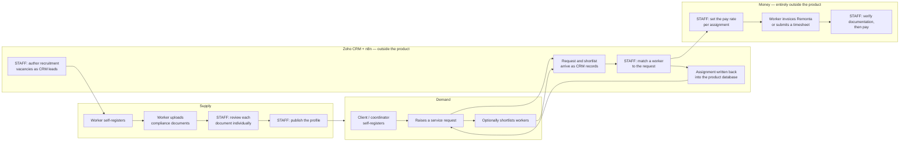

# Remonta — business plan skeleton

**Reverse-engineered from source at commit `72d698f` (branch `app/main`, 2026-08-27).**

A business plan cannot be derived from source code. What follows is a structured skeleton
in which every code-derivable section is filled and every other section is left as an
explicit, well-posed question. **No market size, price point, growth projection, competitor
name, customer count, revenue figure or headcount appears in this document**, because none
of those exists in the repository. The gaps are the point; they are collected in
§13, ordered by how much the answer would change the plan.

Section tags: **[FROM CODE]** — stated in the repository, cited. **[INFERRED]** — implied
by the code, with reasoning and confidence; a human must confirm. **[REQUIRES INPUT]** —
not derivable from source at all.

Companion documents: `docs/business-requirements.md` (what the system does, as numbered
requirements and rules) and `docs/architecture-audit.md` (technical risk). Working evidence
is in `.brd/`.

---

## 1. Executive summary [INFERRED]

**Confidence: high** on what the product is and who it serves; the reasoning is that the
schema, the role model, the document catalogue and the contract text all agree.

Remonta operates an Australian care-matching platform for disability and community support,
spanning NDIS, aged-care, insurance-funded and privately funded work
(`src/app/layout.tsx:34`; `prisma/auth-schema.prisma:519-525`). It serves three groups.
**Support workers** register themselves, build a client-facing profile, and upload the
identity, screening, training, qualification and insurance evidence their chosen service
lines require. **Remonta administrators** review every document individually and decide
whether to publish each worker. **Clients** — participants themselves, or family members
and representatives acting for them — and **funded support coordinators** register
participants and raise structured service requests describing what support is needed,
where, when, and under which funding arrangement.

The company is not a neutral intermediary. It is **a registered NDIS provider**
(`src/config/contractContent.ts:32`) that engages each worker either as an independent
contractor under an ABN or as a casual employee under a TFN, communicates the pay rate for
each assignment, receives the worker's invoice or timesheet, and pays the worker directly
(`src/config/contractContent.ts:22-24,219-220,281-296,301-302`;
`src/components/profile-building/sections/BankAccountSection.tsx:102`).

The software's role is narrower than the business's. It captures supply, captures demand,
enforces a compliance file, and makes workers discoverable. **It does not perform the
match.** The states that would represent a matched, active or completed engagement are
written into the database from outside this codebase — by the n8n automation layer that
sits between the product and Zoho CRM (`docs/business-requirements.md` FR-082, FR-083).
Remonta is therefore best described as **a staffed care-provider operation with a
self-service compliance and discovery front end**, not a marketplace.

Two facts a reader should carry into every other section. First, **development effectively
stopped in April 2026** — 429 of 443 commits precede it, all 443 by a single author
(`.brd/phase-8` §8.1). Second, **the schema has no migration history**, so the repository
cannot prove what is deployed (`docs/architecture-audit.md` DB-02); every finding below is
a finding about the code, which must be confirmed against production before it is acted on.

## 2. Problem statement [INFERRED]

**Confidence: high** on the shape, **medium** on the relative weighting. The reasoning:
the system automates exactly four manual processes and nothing else, and the engineering
effort in each — measured in commits and in rule complexity — indicates the ranking.

**2.1 The compliance file is the problem the business is actually solving.** A registered
NDIS provider must hold current evidence for every worker it engages across six categories
that the product names itself — essential checks, training modules, certifications and
qualifications, identity, insurances, and contracts
(`src/app/admin/compliance/[id]/page.tsx:70-99`) — and the requirement set differs by
service line: a cleaner and a registered nurse do not need the same file
(`docs/business-requirements.md` §13.6). Performed manually this is a spreadsheet, an email
thread and a shared drive per worker, with no way to answer "who is currently compliant?"
without opening every row. The system replaces it with a rule engine that derives each
worker's obligations from their selected services
(`api/worker/requirements/route.ts:16-90`), a self-service upload flow with a background
queue, and a per-document review queue with approve, reject-with-reason, reset and expiry
actions. This is the most heavily engineered subsystem in the product and **the only one
still being changed in August 2026** — the final four commits of the project's life are all
adjustments to which documents are required and where the training lives (`.brd/phase-8`
§8.4).

**2.2 Turning an unstructured enquiry into a comparable brief.** The service-request wizard
compels a named participant, at least one service line from a controlled catalogue, and a
location, then optionally captures scheduling frequency, preferred worker gender, special
requirements, the participant's health conditions, funding type and NDIS plan details
(`src/schema/serviceRequestSchema.ts:33-103`). The manual process replaced is a phone call
and free text. The whole brief is pushed to the CRM on creation and on every edit
(`api/client/service-request/route.ts:105-127`), which is the tell: the purpose is to
remove a data-entry and triage step for the staff who fulfil requests.

**2.3 Making a worker findable by geography and attribute.** Location is the very first
question asked at worker registration, before a name
(`src/app/registration/worker/page.tsx:293`), and distance search is implemented four
separate times (`.brd/phase-4` §4.10). The manual process replaced is a staff member
reading down a list asking "who do we have near Parramatta who speaks Mandarin and can do
hoist transfers?"

**2.4 Publishing vacancies without double entry.** Vacancies are authored as leads in Zoho
by staff and mirrored into a job board that workers see and apply to
(`docs/Zoho_Jobs_To_DB.md:27-32`). The manual process replaced is re-typing each role onto a
website.

**What remains manual, and therefore is not the problem being solved.** The system does not
match, schedule, roster, time-record, price, invoice, pay, or carry any message between a
client and a worker. INFERRED (high confidence): retaining the matching decision as human
judgement is deliberate rather than an omission — the `MATCHED` state exists in the
vocabulary, and a client's shortlist is *forwarded to staff* rather than acted on
(`api/client/service-request/[id]/select-worker/route.ts:18-31`).

## 3. Product and service description [FROM CODE]

The fullest section: what the software does today.

### 3.1 What a support worker gets
Self-service registration in four steps — location, personal details, service lines and
specialisations, photo with consent — with no invitation, no email verification and no
waitlist; the account is active immediately
(`src/lib/workers/workerRegistrationProcessor.ts:82-111`). A five-section onboarding
programme in a fixed order: **Personal Info → Mandatory → Trainings → My Services →
Additional Credentials** (`src/components/dashboard/Sidebar.tsx:147-178`). Sixteen
profile-building sections covering work history, education, languages, cultural background,
religion, interests, about-me, personality, LGBTQIA+ support, locations, preferences,
preferred hours, experience, NDIS screening and bank details. A requirements engine that
tells the worker exactly which documents they must supply, derived from their chosen
services. A document upload flow accepting PDF, JPEG, PNG, WebP and HEIC up to 50 MB each,
with a background queue so several uploads proceed at once. A 100-point identity check with
primary/secondary classification and the ability to reuse a document already held. An
election between ABN contractor and TFN casual-employee engagement, with the agreement
presented in full and generated as a PDF, and with the ABN or TFN number itself
deliberately not stored (`src/schema/workerProfileSchema.ts:171-183`). A two-part Code of
Conduct. A profile preview showing exactly what a client sees. A vacancy board with
apply/withdraw, and a completion gate that asks for experience, a fun fact, languages,
interests and an about-me before applying.

What a worker does **not** get: any ability to publish themselves, set a rate, see a
client, contact anyone, or learn the outcome of anything they submit.

### 3.2 What a client or coordinator gets
Self-service registration branching on a single question — *"Who is this account for?"* with
"I am the Client / Participant", "A person I'm assisting (e.g a friend or family member)",
and "I am a Support Coordinator / Representative"
(`src/components/forms/clientRegistration/Step1WhoIsCompleting.tsx`) — verified by an
emailed one-time code. Participant records holding date of birth, location, gender, health
conditions, funding type and relationship to the account holder. A multi-step
service-request builder: participant, services, where, when, funding and NDIS plan details.
Worker search by keyword, service line, and location with a radius, with a semantic
refinement that routes a service-shaped term against services and any other term against
bio, hobbies and personality (`api/client/workers/route.ts:274-286,299-337`). Full worker
profile views. A shortlist that is forwarded to Remonta staff. Request lifecycle controls:
edit while pending, cancel with a reason, reactivate, archive and hide.

### 3.3 What an administrator gets
A pending-verification queue and a verified-worker list. A per-worker compliance file
grouped into the six named categories, with every uploaded file accessible. Per-document
approve, reject-with-mandatory-reason, reset-to-review and set-expiry actions, with legal
transitions enforced server-side. A publish/unpublish switch. A contractor list with
advanced filters across age, gender, location, distance, language, and document type,
status and category. Editable contractor profiles and a PDF export. Account
suspension/reactivation. Sign-in-as-user impersonation with a single-use 60-second token,
audited on both sides. Shareable encrypted profile links for parties without an account.
Daily, weekly, worker-statistics and signed-agreement reports. Natural-language worker
search through an external AI webhook.

### 3.4 The catalogue — the product's shape
Recovered from git (`categories.json` at `428d725`, deleted 2025-12-04): **24 document
types**, of which 16 carry expiry dates; **8 reusable document sets**; **7 service
categories** with **22 specialisations**. The service lines are Support Worker, Support
Worker (High Intensity), Therapeutic Supports, Cleaning Services, Home and Yard
Maintenance, Nursing Services and Personal Trainer; live TypeScript config adds Home
Modifications and Fitness and Rehabilitation
(`src/config/serviceQualificationRequirements.ts:21-149`). Therapeutic Supports carries
thirteen specialisations, five of which require AHPRA registration: occupational therapist,
orthoptist, physiotherapist, podiatrist and psychologist. Support Worker carries a skill
taxonomy of eleven groups and eight named personal-care service offerings including hoist
and transfer, assist with medication, and toileting (`src/config/serviceOfferings.ts:19-64`).
The high-intensity list is the sharpest statement of clinical scope: complex bowel care,
enteral feeding, tracheostomy care, ventilation assistance, subcutaneous injections, seizure
management including midazolam, insulin support, and pressure and wound care
(`src/constants/index.ts`).

### 3.5 What is built but not working
The complete Partial / Dead / Phantom inventory is `docs/business-requirements.md` §13.
The four items with the largest commercial consequence:

1. **The verification gate does not gate what a client sees.** Neither the in-product
   worker search nor the public worker feed filters on `isPublished` or on verification
   status; the only search implementation that did is dead code
   (`docs/business-requirements.md` §13.1).
2. **The vacancy sync cannot run.** A serverless function HTTP-calls `localhost`
   (`docs/architecture-audit.md` API-07). Job listings are stale now, silently.
3. **Nothing is ever communicated to a worker.** No email, SMS or in-app notification
   exists for a document approval, a rejection, a publication, or an expiry
   (`docs/business-requirements.md` §10).
4. **Document expiry has no effect on anything.** Sixteen of twenty-four document types
   carry expiry dates; `EXPIRED` is never written by any code
   (`docs/business-requirements.md` BR-047).

## 4. Users and segments [FROM CODE / REQUIRES INPUT]

**[FROM CODE]** The system recognises exactly four human actors and no more
(`prisma/auth-schema.prisma:495-500`):

| Segment | How they enter | What distinguishes them in the data |
|---|---|---|
| Support worker | Self-service, 4 steps, active immediately | One of nine service lines; a location; a compliance file whose contents depend on the service line |
| Client — self-managed participant | Self-service; declares `completingFormAs: 'self'` | `isSelfManaged = true` on both profile and participant (`api/auth/register/client/route.ts:72,83`) |
| Client — representative | Self-service; declares `completingFormAs: 'client'` | A separate participant name; a `relationshipToClient` |
| Support coordinator | Self-service; declares `completingFormAs: 'coordinator'` | An optional `organization`; a `clientTypes` array |
| Administrator | CLI script only — no invite path exists | `UserRole.ADMIN` |

Two segment facts worth naming. **Clients and coordinators are functionally identical in
the software** — every demand-side route admits both interchangeably, and the coordinator
dashboard is a near-verbatim copy of the client one
(`docs/architecture-audit.md` STR-02). INFERRED (high confidence): the split exists for CRM
routing and reporting, not capability. And **funding type spans four regimes**, not one:
NDIS, aged care, insurance and private (`prisma/auth-schema.prisma:519-525`). The public
positioning matches — "NDIS, Aged Care & Community Services"
(`src/app/layout.tsx:34`) — but every compliance artefact in the catalogue is NDIS-specific.

Geography is **Australia only**: `en_AU` locale, an Australian postcode dataset compiled
into the source (`src/lib/data/australianPostcodes.ts`), Australian mobile-number
validation, the Australian Zoho data centre, and New South Wales as the governing law of
both agreements (`src/config/contractContent.ts:190-191`).

**[REQUIRES INPUT]** How many workers, clients, coordinators and participants exist; their
geographic distribution; which of the four funding regimes has actually been served; what
proportion of workers complete onboarding; how many clients arrived through the in-app
wizard versus the embedded Zoho form. **None of this is derivable** — the repository has no
access to the database. See questions O1, O2, F2, F3.

## 5. Value proposition per segment [INFERRED]

Drawn from the product's own copy and from the workflows. Confidence noted per segment.

**To a support worker — confidence: high.** *Complete a compliance file and a marketing
profile, consent to it being shown to clients, and Remonta will find you work and pay you.*
The copy is explicit at the two moments it matters. On the photo and consent step:
*"Upload a professional photo that clearly shows your face. This helps clients recognize
you"*; *"I understand and agree that my submitted profile information and photo will be
shared with potential clients to help them choose the right worker for their needs"*;
*"This is a necessary requirement to be considered for work opportunities"*
(`src/components/forms/workerRegistration/Step7Photos.tsx`). On bank details: *"To get you
paid as soon as possible, enter your bank details below so that Remonta can process
payments to you on behalf of your clients"*
(`src/components/profile-building/sections/BankAccountSection.tsx:102`). Note what is
*not* offered: no rate-setting, no client contact, no negotiation. The worker's side of the
deal is compliance and presentability in exchange for placement.

The barrier to entry is deliberately asymmetric: registration is four easy steps and grants
an active account immediately, while everything demanding — a 200-character bio, a
50-character fun fact, work history, education, seven mandatory documents, insurance
evidence — sits behind the login. INFERRED (high confidence): this is a considered funnel
decision, maximising sign-ups and deferring the drop-off. Its cost is that the point of
abandonment is invisible, because nothing is measured (`docs/architecture-audit.md` XC-01)
and nothing is sent (`docs/business-requirements.md` §10).

**To a client or self-managed participant — confidence: medium.** *Describe who needs
support and what they need, see who could provide it, and Remonta will arrange it.* This is
inferred from workflow rather than copy, because **there is no value-proposition copy inside
the application at all** — the root path redirects straight to `/login`
(`src/app/page.tsx:3-5`) and the marketing surface is a separate site. The specific promise
implied by the build is *reduced search effort and pre-checked workers*: the request wizard
asks structured questions so the client does not have to know how to brief a support need,
and the compliance system exists so the client does not have to verify anyone. The second
half of that promise is currently not delivered by the search
(`docs/business-requirements.md` §13.1).

**To a support coordinator — confidence: low.** The software gives a coordinator nothing a
client does not also have. INFERRED: the value is multi-participant management in one
account (`prisma/auth-schema.prisma:145`) plus a `clientTypes` declaration that presumably
routes them to the right Remonta staff. Whether coordinators experience this as valuable is
not derivable. See question F4.

**To Remonta's own operations — confidence: high.** *One compliance record per worker,
derived automatically per service line, reviewable in a queue; and every enquiry arriving
pre-structured and already in the CRM.* This is the value proposition the code is most
clearly optimised for.

## 6. Operating model [FROM CODE]

### 6.1 How work actually flows

### 6.2 Every step that requires human staff

Each is an operational scaling constraint, because each is per-unit work that grows with
volume. This list is the headcount model.

| # | Manual step | Unit of work | Evidence |
|---|---|---|---|
| **1** | **Review each compliance document individually** — approve, reject with a written reason, reset to review, or set an expiry date | **per document, per worker.** With 24 document types and 16 expiring ones, a Support Worker's file alone runs to roughly a dozen mandatory items | the five `api/admin/compliance/*` routes |
| **2** | **Decide whether to publish each worker profile** — the system validates nothing, so this is entirely human judgement | per worker, repeated whenever the file changes | `.../publish/route.ts:38-52` (BR-046) |
| **3** | **Communicate every compliance outcome** — there is no notification mechanism of any kind, so an approval, a rejection with its mandatory reason, and a publication must all be conveyed out of band | per decision, per worker | `docs/business-requirements.md` §10 |
| **4** | **Track document expiries** — `EXPIRED` is never written; nothing detects or warns | **per expiring document, per worker, forever** — the largest recurring manual load in the model | BR-047 |
| **5** | **Match a worker to each service request** in the CRM | per request | FR-083 |
| **6** | **Write the assignment and status back** into the product database | per request | FR-082 |
| **7** | **Author every recruitment vacancy** as a Zoho lead | per vacancy | `docs/Zoho_Jobs_To_DB.md:28` |
| **8** | **Set the pay rate for each assignment**, communicated to the worker before it starts, varying by role, qualifications, service type, funding source including NDIS price limits, location, time and complexity | **per assignment** | `src/config/contractContent.ts:282-291` (BR-103) |
| **9** | **Process each invoice or timesheet**, verifying documentation before payment; ABN contractors on a four-week processing cycle, TFN employees weekly | per invoice or timesheet | `src/config/contractContent.ts:126-127,301-303` |
| **10** | **Handle enquiries from the second intake channel** — the site header's "Find support" points at an embedded Zoho form that creates no product account | per enquiry from that channel | `src/app/registration/client/page.tsx:35-38`; `Header.tsx:22-23` |
| **11** | **Notify workers of shortlisting and assignment** — neither generates any message | per shortlist, per assignment | §10 of the BRD |
| **12** | **Create every administrator account** by running a script against the database | per staff hire | `scripts/create-admin-user.ts` |
| **13** | **Maintain the compliance catalogue directly in the database** — the seed file and the versioned catalogue were both deleted in December 2025, and the schema has no migration history | per rule change, unversioned and unreviewable | `.brd/phase-8` §8.3 |
| **14** | **Notice when anything breaks** — there is no logging, no metrics, no alerting and no error reporting | continuous | `docs/architecture-audit.md` XC-01 |
| **15** | **Manage client and coordinator records** — the admin screens for both are "coming soon" placeholders | per record | FR-117 |

**The scaling shape this implies.** Steps 1–4 scale with the **worker** count and with the
compliance calendar; steps 5, 6 and 11 scale with the **request** count; steps 8 and 9 scale
with the **assignment** count. Steps 3, 4 and 11 exist purely because features were not
built — they are the three places where a modest amount of engineering would remove
recurring headcount rather than add capability. Step 4 is the compounding one: expiry work
accumulates permanently, since every worker's police check, screening check, insurance
certificate and training certificate comes due again.

### 6.3 Where the business's data actually lives [FROM CODE]

Zoho CRM, not this application, is the system of record for the regulated and commercial
data. The CRM receives, per service request: the participant's name, date of birth, gender,
relationship to the client, funding type and **health conditions array**, plus the full
details blob containing scheduling preferences, preferred worker gender, special
requirements, NDIS management type, plan manager name, invoice email, **NDIS number** and
plan dates (`api/client/service-request/route.ts:107-127`;
`src/schema/serviceRequestSchema.ts:72-81`). Any question about retention, access control
or breach exposure for that data must be answered about Zoho.

The **n8n** automation layer is a second undocumented system of comparable importance: it
carries every outbound event and — INFERRED, high confidence — writes match, assignment and
completion state directly into production Postgres. One of its webhook URLs is hardcoded in
application source and cannot be rotated without a deploy
(`api/auth/register-async/route.ts:112`). **Sizing the engineering risk of this business
means sizing n8n too, and nobody reading this repository can.** See question T4.

## 7. Regulatory and compliance surface [FROM CODE]

Presented as evidence of obligations the business has assumed, not as a feature list.
**This is an incomplete picture by construction — it lists only what the code collects or
asserts. The full obligation set must be confirmed with a compliance advisor.**

### 7.1 What the business asserts about its own status
- **"The Company is a registered provider under the National Disability Insurance Scheme
  (NDIS)."** (`src/config/contractContent.ts:32`)
- Services introduced through the platform, where NDIS-funded or regulated, must be
  delivered in accordance with **the NDIS Practice Standards** and **the NDIS Code of
  Conduct** (`src/config/contractContent.ts:34-36`).
- Both worker agreements are governed by the law of **New South Wales**, with exclusive NSW
  jurisdiction (`src/config/contractContent.ts:190-191`).
- Casual employment is governed by the **Fair Work Act 2009 (Cth)**, with rates complying
  with any applicable Modern Award, **naming the SCHADS Award and the Cleaning Services
  Award** (`src/config/contractContent.ts:292-296`). Superannuation and PAYG withholding
  obligations are accepted for TFN workers (`:310-313`).
- Casual conversion rights under the Fair Work Act are acknowledged (`:328`).
- Code of Conduct breaches may require **mandatory reporting to the NDIS Quality and
  Safeguards Commission** (`src/config/codeOfConductContent.ts:47`).

### 7.2 Compliance artefacts the system collects and verifies
Each is evidence of an obligation. Recovered catalogue: 24 document types, 16 with expiry
dates (`categories.json` at `428d725`; `.brd/phase-4` §4.3).

| Category | Artefacts |
|---|---|
| **Worker screening** | NDIS Worker Screening Check; National Police Check; Working with Children Check |
| **Identity — 100-point check** | Passport, birth certificate (primary); driver's licence, Medicare card, utility bill, bank statement (secondary) |
| **Working rights** | Proof of right to work in Australia |
| **Mandatory training** | NDIS Worker Orientation Module ("Quality, Safety and You"); New Worker NDIS Induction Module; Supporting Effective Communication; Supporting Safe and Enjoyable Meals; Infection Control Training; First Aid & CPR |
| **Role-specific training** | Manual Handling; Medication; Behaviour Support |
| **Professional registration** | AHPRA registration; professional association membership |
| **Insurance** | Public Liability Insurance, minimum **$10 million**; Professional Indemnity Insurance; comprehensive/business-use vehicle insurance |
| **Qualifications** | Highest relevant qualification certificate; trade licence; resume/experience evidence |
| **Transport** | Driver's licence; vehicle registration; vehicle insurance — required conditionally, if the worker provides transport |
| **Contractual** | Code of Conduct acknowledgement (two parts); Contract of Agreement; ABN or TFN engagement election with signature |

Workers are directed to the regulator's own portal for training,
`https://training.ndiscommission.gov.au/`
(`src/components/requirements-setup/steps/Step4aNDISOrientation.tsx:61`) — Remonta collects
the evidence rather than delivering the training.

### 7.3 Regulated personal and health data the system holds
- **Participant health data**: a `conditions String[]` array, date of birth, gender and
  free-text support needs (`prisma/auth-schema.prisma:82-108`). Forwarded to Zoho on every
  request creation and edit.
- **NDIS number and plan-management details**, inside an unindexed JSON blob on the service
  request (`src/schema/serviceRequestSchema.ts:72-81`).
- **Worker identity documents**: passports, birth certificates, driver's licences, Medicare
  cards, bank statements.
- **Worker bank account details**: account name, bank, BSB, account number.
- **Worker date of birth, gender, cultural background, religion, languages, LGBTQIA+
  support and smoking status.**

### 7.4 Compliance-relevant gaps evidenced in the code
Stated as findings, for a compliance advisor to weigh. Each is cited in
`docs/business-requirements.md`.

| # | Finding | Reference |
|---|---|---|
| 1 | **No audit record exists for any compliance decision.** `src/app/api/admin/` contains exactly one audit write, and it is impersonation. No approval, rejection, reset, expiry change, publication or suspension is recorded anywhere. For a business whose control model is "an administrator checked this", there is no record that any administrator checked anything | FR-052 |
| 2 | **Document expiry has no effect.** 16 of 24 document types expire; `EXPIRED` is never written; no job and no read-time check exist. A worker with an expired police check remains listed and counted as compliant | BR-047 |
| 3 | **Publication validates nothing.** A worker can be published with zero approved documents | BR-046 |
| 4 | **Neither live worker search restricts results to published or verified workers** | §13.1 |
| 5 | **All identity documents are stored with public access**, and two code paths orphan files permanently — an orphan is a permanently reachable identity document whose URL appears in no database, so it cannot be found, audited or revoked | `docs/architecture-audit.md` XC-05 |
| 6 | **Three admin routes return a document's file URL before authenticating** | `docs/architecture-audit.md` API-01 |
| 7 | **Suspension takes up to 60 minutes to take effect**, because sign-in reads a cached user record. Suspension is the control used to remove a worker who has failed compliance | `docs/architecture-audit.md` XC-06 |
| 8 | **Participant health records survive account deletion as ownerless data** (`onDelete: SetNull`), and there is no retention policy for them, for audit logs, or for anything else | NFR-020 |
| 9 | **No contract version is recorded.** Both agreements are compiled into the front end and versioned only by git, so there is no record of which contract text a given worker accepted | `.brd/phase-1` §1.5 |
| 10 | **The NDIS participant number is not a first-class field** — it lives only in an optional JSON blob, so it is not queryable, not unique and not required | `.brd/phase-1` §1.7 |
| 11 | **Three conflicting statements of the compliance rule set** exist, and the one in force is whichever was loaded into a database with no migration history | §13.6 |
| 12 | **Live Zoho OAuth credentials, a refresh token, `SYNC_API_SECRET` and `CRON_SECRET` are committed in tracked source** at `docs/Zoho_Jobs_To_DB.md:41-57,388,447,457,722`. The `.env` files are correctly ignored; this document is not | NFR-018 |
| 13 | **There is no privacy policy, terms of use, or support contact anywhere in the application.** The "Access Denied" page tells the user to "contact support"; no contact route, address or link exists | `src/app/unauthorized/page.tsx:33` |
| 14 | **There is no user-facing account deletion or data export path** | FR-139 |

## 8. Technology summary [FROM CODE]

Drawn from `docs/architecture-audit.md`, restated in business terms.

**What it is.** A single Next.js 15 application on Vercel — 86 serverless API routes, 54
pages, about 87 000 lines of hand-written TypeScript — backed by one Neon Postgres database
(reached through two overlapping Prisma schemas), Upstash Redis for caching and rate
limiting, and Vercel Blob for documents. Seven external systems: Zoho CRM, n8n, Google
Geocoding, Nominatim/OpenStreetMap, Resend for email, Twilio for SMS, and five Zoho
service-request webhooks. Built and maintained by **one person** across 443 commits between
September 2025 and August 2026, with 97% of that work completed before April 2026.

**What it does well.** Every raw SQL statement is parameterised and there is no SQL
injection anywhere. Session cookies are correctly configured, with a `__Host-`-prefixed
strict-same-site CSRF cookie. The most operationally important route — the admin contractor
list — is the best-engineered code in the repository, with a correct two-pass distance
search, bounded pagination and a response cache. Ownership checks on participant and
service-request data are present and correct on every demand-side route. The requirements
engine that derives each worker's document obligations from their service selections is
genuine, well-factored domain logic. Impersonation is implemented carefully, with a
single-use 60-second token and audit records for both parties.

**Its headline constraints, in business language.** *The system currently has a hard
capacity ceiling of roughly four simultaneous document uploads from one worker.* The
database connection pool is set to one connection per instance, and the team has already hit
that limit and worked around it by removing the guarantee that multi-step writes complete
together — documented in code at `api/compliance/upload/route.ts:190-195`. The consequence
is that a partial failure now leaves inconsistent data with nothing to correct it. *Worker
search cannot use a database index*, so its cost grows in direct proportion to the number of
workers; at roughly ten times today's volume searches take seconds, and at a hundred times
they time out. *The client-facing distance search loads every worker in the search area into
memory before paginating*, so page one and page forty cost the same and a metropolitan
search will eventually run out of memory. *There is no way to observe any of this*: the
structured logger exists with every method body empty, there are no request identifiers, no
metrics, no tracing and no error reporting, and roughly twenty error handlers are empty — you
would learn about an outage from a user. *There is no test suite and no continuous
integration*, so nothing mechanical prevents a broken change reaching production; a
reference to a non-existent role value compiles and ships today. *There is no migration
history*, so the repository cannot tell you what schema is deployed.

**What it would cost to lift.** The audit sequences 35 remediation items across three
horizons, with dependencies. The eleven "immediate" items are each sized small and include
the two live security exposures. The near-term quarter of work — raising the connection
limit, establishing a migration baseline, adding search indexes, bounding the unbounded
queries, adding timeouts to all 33 outbound calls, and replacing fire-and-forget webhooks
with a durable outbox — is the set that removes the capacity ceiling. **Every estimate in
that roadmap must be read against a team of one, and against the fact that no work has
shipped since April 2026.** Precise cost in money and calendar time is not derivable from
source. See questions T1–T5.

## 9. Revenue model [REQUIRES INPUT]

**The search performed.** Exhaustive case-insensitive search across `src/`, `prisma/`,
`package.json` and `vercel.json` for: stripe, payment, invoice, billing, subscription,
commission, fee, payout, checkout, price, pricing, rate, hourly rate, GST, Xero, MYOB,
PayPal, Square. Every result is reported below.

**What was found — five things, and nothing else.**

1. **One dead pricing component.**
   `src/components/profile-building/sections/IndicativeRatesSection.tsx` is a complete form
   collecting weekday, Saturday, Sunday and public-holiday hourly rates with a `$` prefix
   and two-decimal steps, under the copy *"Enter your preferred hourly rates. These are
   indicative only and can be negotiated with participants."* Its save handler is an empty
   function body (`:20-22`), it has **zero consumers**, and **no rate column exists in
   either database schema.** This is the only pricing user interface in the product.

2. **Contract payment terms — the only binding commercial statements in the repository.**
   `src/config/contractContent.ts`, compiled into the front end and shown at
   `/dashboard/worker/contract/[type]`:
   - ABN contractors **invoice the Company**; invoices are subject to a **four-week
     processing period** from receipt of a valid, compliant invoice (`:126-127`); payment
     may be withheld where documentation is incomplete, compliance is unmet, or an audit or
     dispute is ongoing (`:136-140`); the contractor bears GST, income tax and
     superannuation (`:132-135`).
   - TFN casual employees are paid **weekly** against a valid timesheet (`:301-303`).
   - **Pay rates are communicated by Remonta before each assignment** and vary by role,
     qualifications, service type, **funding source including NDIS price limits**, and
     location, time and complexity (`:282-291`), complying with the Fair Work Act and any
     applicable Modern Award including the SCHADS Award and the Cleaning Services Award
     (`:292-296`).
   - **Twelve-month non-circumvention**: a contractor must not bypass the platform to work
     directly with a Remonta-introduced client (`:172-180`).

3. **Billing inputs collected and never used.** The service-request wizard captures NDIS
   management type, plan manager name, **invoice email**, CC email, **NDIS number** and plan
   start and end dates (`src/schema/serviceRequestSchema.ts:72-81`), surfaced in the UI as an
   "Invoice Email" field (`AddClientModal.tsx:602-612`). All of it is stored in an unindexed
   JSON blob and forwarded to Zoho. **No code reads it for any purpose.**

4. **An unbuilt priced-marketplace domain model.** `src/types/index.ts:32-58` declares
   `SupportWorker.hourlyRate`, `Client.planBudget`, `Client.ndisNumber` and
   `Match.matchScore`, plus `MatchStatus = 'PENDING' | 'ACCEPTED' | 'REJECTED' |
   'COMPLETED'`; `src/constants/index.ts` declares the NDIS plan budget categories
   `['Core Supports', 'Capacity Building', 'Capital Supports']`. **Every one of those
   identifiers has zero consumers outside its own file, and none has a database column.**

5. **A template footer link.** `src/components/ui/layout/Footer.tsx:6` contains a "Pricing"
   menu item with `href: '#'`, alongside "Features", "Analytics", "Privacy Policy" and
   "Terms of Use", all `'#'`. The component has **zero live mounts**. This is
   `create-next-app`-era placeholder markup and is **not** evidence that a pricing page
   exists.

### The finding

**The product as built has no monetisation mechanism.** There is no payment integration, no
invoicing, no subscription, no commission calculation, no fee schedule, no rate field, and
no price of any kind stored, computed or displayed. The commercial relationship is
documented entirely in two contract texts compiled into the front end and executed entirely
outside the software: Remonta communicates a rate per assignment, the worker invoices
Remonta or submits a timesheet, and Remonta pays them. **The margin between what the funding
source pays Remonta and what Remonta pays the worker is the business, and that margin exists
nowhere in this repository.** This is stated as a finding, not a criticism — the code is
consistent with a business that runs its commercials in Zoho and an accounting system, and
uses this application for compliance and discovery only.

One conflict worth resolving, because it points to a changed strategy rather than a defect:
the dead rates component says rates are set by the worker and *"negotiated with
participants"*; the shipped contract says rates are *"communicated prior to commencement of
the assignment"* by Remonta and constrained by Modern Awards and NDIS price limits. The
second is what shipped. Together with `docs/structure.md:1-2` — which frames the original
conception as *"a job portal like Upwork … real-time messaging, payments"* — the residue
suggests the product began as a priced, disintermediated marketplace and became a staffed
provider operation. **Nothing about revenue can be completed without answers to questions
F1, F6, F7 and FIN1–FIN5.**

## 10. Market, competition, sizing, pricing, go-to-market, financials, team, funding, roadmap [REQUIRES INPUT]

Each of these is **not derivable from source**. The questions that would let someone
complete each section are in §13, cross-referenced here.

| Section | Why it is not derivable | Questions that would complete it |
|---|---|---|
| **Market definition and size** | The repository states the served *categories* (NDIS, aged care, insurance-funded, private) and the served *geography* (Australia, `en_AU`, NSW governing law), and nothing about volume, value or addressable population | F2, F3, S1 |
| **Competition** | No competitor is named, referenced or linked anywhere in the repository. The absence of any rate-comparison, ranking or bidding feature says something about the intended shape of competition, but nothing about who the competitors are | F7, S3 |
| **Sizing and unit economics** | No rate, fee, margin, cost or volume figure exists anywhere in the code | FIN1–FIN5, O1, O5 |
| **Pricing** | §9. No price of any kind exists. The only pricing UI is dead, and the two conflicting pricing philosophies in the residue are unresolved | F1, F6, FIN1, FIN2 |
| **Go-to-market** | Partially inferable and deliberately not asserted: the repository shows two client-intake channels (an in-app wizard and an embedded Zoho form the site navigation actually points at), a worker funnel starting from vacancy links on the marketing site, and no referral, invite, affiliate or campaign-attribution mechanism of any kind. It shows nothing about channel performance | S1, S2, S4, O2 |
| **Financials** | Nothing financial is in the repository | FIN1–FIN6 |
| **Team** | Derivable only as a constraint, not a plan: all 443 commits are by one author, and administrator accounts can only be created by running a script | T5, O6, O7 |
| **Funding** | Nothing | FIN6 |
| **Roadmap** | Derivable only as archaeology: the last feature attempt was a second recruitment-application path, one commit, July 2026, unfinished; the last four commits of the project's life are all compliance-catalogue content edits; development stopped in April 2026. Whether that is a pause, a pivot or an end is the single most consequential unknown | F8, F9, T1 |

## 11. Risk register [FROM CODE / INFERRED]

Operational and product risks evidenced by the code. Technical risk is
cross-referenced to `docs/architecture-audit.md` rather than repeated. Severity is this
document's judgement of **business** impact, not technical severity.

### 11.1 Risks to the core value proposition

| # | Risk | Evidence | Severity |
|---|---|---|---|
| R1 | **The verification promise is not enforced where clients see it.** Neither the in-product worker search nor the public feed filters on publication or verification status; the only implementation that did is dead code. An unverified worker with a name and a bio is discoverable | BRD §13.1 | **Critical** — this is the proposition |
| R2 | **There is no record that any compliance check was ever performed.** No approval, rejection, reset, expiry change, publication or suspension is audited. In an NDIS audit, the system cannot evidence its own control | BRD FR-052 | **Critical** |
| R3 | **Expired credentials are invisible.** 16 of 24 document types expire; nothing detects, flags or acts on expiry. A worker with a lapsed police check stays listed and stays counted as compliant | BRD BR-047 | **Critical** |
| R4 | **Publication validates nothing.** A worker can be published with zero approved documents. The only safeguard is the individual administrator's diligence | BRD BR-046 | High |
| R5 | **Every identity document is publicly readable**, and two code paths orphan files permanently — an orphan is a reachable identity document whose URL appears in no database and therefore cannot be revoked | audit XC-05 | **Critical** |
| R6 | **Suspension — the control for removing a failed worker — takes up to an hour to bite** | audit XC-06 | High |
| R7 | **Three conflicting statements of the compliance rule set**, with the operative one held in a database that has no migration history and no seed file | BRD §13.6 | High |

### 11.2 Single points of failure in the business process

| # | Risk | Evidence | Severity |
|---|---|---|---|
| R8 | **The core transaction completes outside the codebase.** Match, assignment and completion are written into production Postgres by n8n, with no validation, no ownership check and no audit trail. If n8n stops, every request silently sits at pending and the product reports nothing wrong | BRD FR-082, FR-083 | **Critical** |
| R9 | **n8n is an undocumented, unversioned business-logic layer** with at least one URL hardcoded into application source. Nobody reading this repository can assess it | §6.3 | **Critical** |
| R10 | **Every CRM notification is fire-and-forget** — no timeout, no retry, no dead-letter queue, no detection. A dropped registration or service request is indistinguishable from a delivered one. The likely symptom is a customer who registered, submitted a request, and was never contacted | audit XC-02 | **Critical** |
| R11 | **The recruitment vacancy sync cannot run.** Job listings are stale right now, silently, and the cache TTL refills from the stale table so the board looks healthy | audit API-07 | High |
| R12 | **One person built and understands all of it.** 443 of 443 commits by a single author | `.brd/phase-8` | **Critical** |
| R13 | **Nothing is observable.** No logs with structure, no request ids, no metrics, no tracing, no error reporting, ~20 empty error handlers. Observability was deliberately removed in a single commit in December 2025 and never replaced. R1, R3, R10 and R11 are all currently undetectable | audit XC-01 | **Critical** |
| R14 | **An Upstash Redis incident removes caching and rate limiting simultaneously**, pushing every request onto the cold path with no limiter against a database pool of one. The failure direction is more load | audit API-06 | High |
| R15 | **A geocoding outage permanently hides every worker who registers during it** — coordinates are stored null, registration deliberately does not fail, nothing retries and nothing logs | `workerRegistrationProcessor.ts:69-76` | High |

### 11.3 Manual bottlenecks that scale with volume

| # | Risk | Evidence | Severity |
|---|---|---|---|
| R16 | **Per-document human review with no queue management.** Both administrator compliance queues have **no pagination parameter at all**, and one sorts on an unindexed column — they become unopenable as the worker base grows, before any staffing constraint bites | audit DB-05 | High |
| R17 | **Expiry tracking is unbounded recurring manual work** that accumulates permanently across every worker's screening checks, insurance certificates and training certificates | §6.2 step 4 | High |
| R18 | **Every compliance outcome must be communicated by hand**, including rejection reasons the system captures and never delivers | §6.2 step 3 | High |
| R19 | **Rate-setting, invoicing and payment are entirely manual** — per assignment and per invoice, with a four-week verification cycle for contractors and a weekly one for employees | §6.2 steps 8, 9 | Medium |
| R20 | **Two client-intake channels**, and the one the site navigation promotes creates no product account. Any measure of demand-side conversion is incomplete by construction | BRD FR-085 | Medium |

### 11.4 Product and funnel risks

| # | Risk | Evidence | Severity |
|---|---|---|---|
| R21 | **The worker onboarding funnel is long, demanding, and completely unmeasured and uncommunicated.** Five sections, dozens of steps, a 200-character bio, a 50-character fun fact, work history, education and around a dozen documents — with no reminder email, no progress nudge beyond an in-app highlight, and no analytics. Onboarding completion is the business's primary conversion metric and nothing observes it | BRD §10, BR-021, BR-022; audit XC-01 | **Critical** |
| R22 | **Onboarding progress is not trustworthy.** Concurrent section saves silently overwrite each other, which is why the read path recomputes completion from scratch on every request — making the highest-volume query in the system uncacheable by construction | audit DB-07, FE-01 | High |
| R23 | **Workers are never told anything.** Zero messages across the entire lifecycle other than a password reset on request | BRD §10 | High |
| R24 | **A job application has no outcome.** The status enum has exactly two values, pending and withdrawn. The recruitment funnel cannot be measured end to end inside the product | BRD FR-097 | Medium |
| R25 | **Coordinator registration silently discards the participant and service-need data its own documentation says it captures** | BRD FR-072 | Medium |
| R26 | **The four highest-credential service lines are the least built** — Therapeutic Supports, Home Modifications, Fitness and Rehabilitation and Personal Trainer have no skill taxonomy and no service offerings, while the two Support Worker lines have both | BRD FR-032 | Medium |
| R27 | **Registration copy and system behaviour disagree in three user-visible places**: the worker is told to check an email that is never sent; the verification email states 15 minutes' validity for a 10-minute code; Support Worker is advertised as requiring no qualifications while the catalogue mandates insurance and a Working with Children Check | BRD FR-010, FR-135, §13.6 | Medium |

### 11.5 Compliance-data and access risks

| # | Risk | Evidence | Severity |
|---|---|---|---|
| R28 | **A page titled "Admin access only" is open to the internet**, along with its data endpoint, exposing CRM-sourced contractor names, emails, phone numbers, cities, genders and photos | BRD §13.2 item 1 | **Critical** |
| R29 | **Three administrator routes return a worker's identity-document file URL before authenticating** | audit API-01 | **Critical** |
| R30 | **Live Zoho credentials, a refresh token and two internal API secrets are committed in tracked source** in `docs/Zoho_Jobs_To_DB.md`. The `.env` files are correctly ignored; this document is not | NFR-018 | **Critical** |
| R31 | **An unauthenticated endpoint can rewrite every non-mandatory compliance document name in the table**, unbounded, with no transaction | audit API-12 | High |
| R32 | **An unauthenticated 50 MB public file upload** exists on the company's domain | audit API-04 | High |
| R33 | **Participant health records survive account deletion as ownerless data**, with no retention policy for them, for audit logs, or for anything else | NFR-020 | High |
| R34 | **Any signed-in user can fire a CRM cancel or archive action against any service request id** — no ownership or role check | BRD FR-084 | High |
| R35 | **No privacy policy, terms of use, support contact, account-deletion path or data-export path exists anywhere in the application** | §7.4 items 13, 14 | High |
| R36 | **No contract version is recorded**, so there is no record of which agreement text a given worker accepted | §7.4 item 9 | Medium |

### 11.6 Strategic risk

| # | Risk | Evidence | Severity |
|---|---|---|---|
| R37 | **Development stopped in April 2026 and the reason is unknown.** 429 of 443 commits precede it; the last feature attempt was abandoned after one commit; the only work in the final four months was compliance-catalogue content editing. Until this is answered, no remediation plan can be sequenced — the choice is between a system to invest in and a system to freeze | `.brd/phase-8` §8.1, §8.4 | **Critical** |
| R38 | **The product has drifted from its original conception without the pivot being recorded.** The repository still contains an unbuilt priced-marketplace domain model, a provisioned-and-abandoned messaging stack, a provisioned-and-abandoned CMS, and a dead rates form. New contributors will read intent that no longer applies | BRD §13.4, §13.5 | Medium |
| R39 | **The compliance rule set was de-versioned in December 2025.** The catalogue file and its seeder were both deleted; the rules now exist only as production rows with no migration history, so they cannot be reviewed, diffed or reproduced | `.brd/phase-8` §8.3 | High |

---

## 12. Immediate observations for whoever picks this up next

Not a plan — the plan needs §13 answered first. But three things are true regardless of
what the answers turn out to be, and each is small.

1. **R30 is live right now.** Live Zoho OAuth credentials, a refresh token,
   `SYNC_API_SECRET` and `CRON_SECRET` are readable by anyone with repository access, in
   `docs/Zoho_Jobs_To_DB.md`. Rotating those secrets and purging them from the document
   costs an afternoon and does not depend on any business decision.
2. **R1, R28 and R29 are live exposures of regulated data**, each fixable in hours, and none
   of them requires knowing whether the product has a future.
3. **The recovered compliance catalogue should be put back under version control.** It is
   reproduced in `.brd/phase-4` §4.3 from git commit `428d725`. It is the business's core
   rule set and it currently exists only as unversioned production rows.

---

## 13. Questions for the business

Grouped by who can answer, ordered within each group by how much the answer would change
the plan. Each question is specific and answerable.

### For the founders / product leadership

| # | Question |
|---|---|
| **F1** | **Is the platform the contracting party, or the introducer?** The shipped contract has Remonta setting the rate, receiving the worker's invoice and paying them; the dead rates form had the worker setting a rate "negotiated with participants". Which is the intended model, and did it change? |
| **F2** | Which of the four funding regimes — NDIS, aged care, insurance, private — has the business actually served, and which are aspirational? Every compliance artefact in the catalogue is NDIS-specific. |
| **F3** | Is the business national or state-based? Both agreements name New South Wales as the exclusive jurisdiction; the postcode dataset and the search are national. |
| **F4** | Should support coordinators be able to do anything a client cannot? Today the software gives them nothing extra, and the two dashboards are duplicated code. |
| **F5** | **Which compliance rule set is authoritative?** Three conflict: the recovered catalogue makes $10M public liability insurance, a Working with Children Check and seven training modules mandatory for a plain Support Worker; the live TypeScript config makes everything optional for that line; and the registration copy tells applicants no qualifications are needed. |
| **F6** | Was worker-set pricing abandoned deliberately, or deferred? A complete rates UI, an `hourlyRate` type and a `planBudget` type all exist unbuilt. |
| **F7** | Was direct client–worker messaging abandoned deliberately? A full real-time stack and a chat UI kit were installed and never used, and the original architecture note names messaging as a core requirement. |
| **F8** | **Is the near-stop in development since April 2026 deliberate?** This determines whether the audit's remediation roadmap is worth executing at all. |
| **F9** | The most recent feature attempt — a second recruitment-application path posting straight to Zoho, July 2026, one commit — was it a deliberate move toward Zoho-native recruitment, or abandoned mid-flight? |
| **F10** | Was matching-by-participant-attribute dropped on purpose? The original vacancy model carried the participant's disability, behavioural, cultural, language, religion, age, gender and hobby attributes; the current one carries none of them. |
| **F11** | Are `ContractorProfile` and `WorkerProfile` the same people? A CRM-sourced contractor directory is live and unauthenticated, and nothing in the repository writes its table. |
| **F12** | Should a worker's own trade title be part of their self-service profile? An 18-role list exists unused, including Accommodation Provider, Employment Support Provider, Interpreter/Translator and Assistive Technology Provider — service lines the shipped catalogue never carried. |
| **F13** | What is a "service a worker offers" required to express? The structure was re-decided at least four times, leaving six hand-written SQL migration files and a dated backup table in the production schema. |
| **F14** | Which of "archived" and "deleted" is a real business state for a service request? The current implementation has six enum states plus a seventh hidden state stored inside a JSON field, and raw SQL in five page components to handle it. |

### For sales and marketing

| # | Question |
|---|---|
| **S1** | Which client-intake channel is the real one? The site header's "Find support" points at an embedded Zoho form that creates no product account; a full in-app registration wizard also exists. What share of clients arrives through each? |
| **S2** | How do workers actually find Remonta? The repository has no referral, invite, affiliate or campaign-attribution mechanism of any kind. A `zohoLeadId` is accepted at registration and never stored. |
| **S3** | What do clients compare Remonta against when choosing, and on what basis — price, availability, verification, or something else? Nothing in the product supports comparison on any axis except distance and attributes. |
| **S4** | The site header links `/support-coordinators` and `/services`, neither of which exists in this application. Do those pages exist on the marketing site, and is the coordinator segment marketed to separately? |
| **S5** | Is the "Care Matching Platform — NDIS, Aged Care & Community Services" positioning current, and is it the positioning used in market? |

### For compliance and legal

| # | Question |
|---|---|
| **C1** | **What audit evidence must Remonta be able to produce that a worker's documents were checked, by whom, and when?** Today no compliance decision is recorded anywhere. |
| **C2** | **What is the obligation when a worker's screening check, insurance certificate or training certificate expires?** The system captures 16 expiring document types and acts on none of them. |
| **C3** | Is it acceptable for identity documents — passports, birth certificates, Medicare cards, bank statements, police checks, NDIS screening clearances — to be served from unauthenticated public URLs, some of which are orphaned and cannot be revoked? |
| **C4** | What is the retention policy for participant health data, worker identity documents, and audit logs? None exists, and participant health records currently survive account deletion as ownerless data. |
| **C5** | Must Remonta be able to evidence which version of the contractor or casual-employment agreement a given worker accepted? No version is recorded. |
| **C6** | Does the business need the NDIS participant number as a first-class, queryable, validated field? It currently lives only inside an optional JSON blob on a service request. |
| **C7** | What are Zoho CRM's data-residency, access-control and retention arrangements? Participant health conditions, dates of birth, NDIS numbers and billing contacts are all pushed there, and it — not this application — is the system of record. |
| **C8** | Are the two worker agreements current, and has a lawyer reviewed the four-week payment processing period, the 12-month non-circumvention clause and the ABN/TFN election as implemented? |
| **C9** | Does the business require a privacy policy, terms of use, a support contact, an account-deletion path and a data-export path in the application? None exists. |
| **C10** | Is the SCHADS Award / Cleaning Services Award mapping in the casual agreement correct for every service line offered? |
| **C11** | Given that the code asserts Remonta is a registered NDIS provider, which NDIS Practice Standards apply to the *platform* itself as distinct from the workers, and are any of them evidenced by system controls? |

### For finance

| # | Question |
|---|---|
| **FIN1** | **How does Remonta earn revenue — a margin on the worker's rate, a placement fee, a subscription, a service charge, or a mix?** The product as built contains no monetisation mechanism at all. |
| **FIN2** | If it is a margin: is the rate charged to the funding source flat, tiered by service line, or set per assignment? And is the margin percentage or absolute? |
| **FIN3** | Who invoices the funding source — Remonta or the worker? The contract has the worker invoicing Remonta, and an "Invoice Email" and plan-manager fields are captured from the client and never used. |
| **FIN4** | What is the working-capital consequence of paying contractors on a four-week cycle and casual employees weekly, against the funding source's own payment terms? |
| **FIN5** | What does an administrator's compliance review cost per worker, and per document? This sizes every one of the fifteen manual steps in §6.2. |
| **FIN6** | What is the current funding position and runway, and does it assume further engineering? |

### For operations

| # | Question |
|---|---|
| **O1** | **How many workers, clients, coordinators, participants and service requests exist today, and how many are active?** This converts every "at ten times volume" statement in the architecture audit into a date. |
| **O2** | What proportion of registered workers complete onboarding, and where do they stop? Nothing measures this, and it is the primary conversion metric. |
| **O3** | **Is n8n writing match, assignment and completion state directly into the production database?** If so, what does it write, on what trigger, and who maintains it? This is business logic of comparable importance to the codebase and it is entirely undocumented here. |
| **O4** | Has the hourly vacancy sync ever run successfully in production? The code cannot work as written, and nothing would report the failure. |
| **O5** | How many service requests reach an assigned worker, and how long does matching take? The product records neither. |
| **O6** | How many administrators are there, and what is the current document-review throughput per person per day? |
| **O7** | Who maintains the system today, and who else can? All 443 commits are by one author. |
| **O8** | Are the five Zoho service-request webhook URLs, `N8N_WEBHOOK_URL`, `CRON_SECRET`, `NEXT_PUBLIC_BASE_URL` and `AI_SEARCH_WEBHOOK` set in the production environment? Each unset variable disables a feature silently. |
| **O9** | Is the deployed database schema the same as the repository's? There is no migration history, so this cannot be answered from source — and it determines whether §13.1's search finding is live in production. |
| **O10** | Is the `/remontaadmin/findsupport` contractor directory still in use, and is anything still syncing data into `contractor_profiles`? |
| **O11** | How are workers currently told that a document was approved or rejected, and how are rejection reasons conveyed? The system captures them and delivers nothing. |
| **O12** | Was the admin AI chat assistant disabled deliberately? It is complete and its mount is commented out. |
| **O13** | How many orphaned identity documents exist in blob storage today — files with no owning database row, permanently public and unrevocable? |
| **O14** | Who maintains the compliance catalogue, and how, now that the seed file and the versioned catalogue have both been deleted? |

### For engineering leadership

| # | Question |
|---|---|
| **T1** | Given the answer to F8, is the architecture audit's 35-item roadmap to be executed, partially executed, or shelved? |
| **T2** | What is the Neon plan, compute size and maximum connection count? This sets the safe ceiling for the single most important fix in the audit, and a code comment suggests the free tier. |
| **T3** | Does any continuous integration run outside the repository? There is none in it, and neither type errors nor lint errors can fail a build. |
| **T4** | Where does n8n live, who has access, how is it versioned and backed up, and what would restoring it involve? |
| **T5** | What engineering capacity is available, and is the bus factor of one acceptable as a standing condition? |

