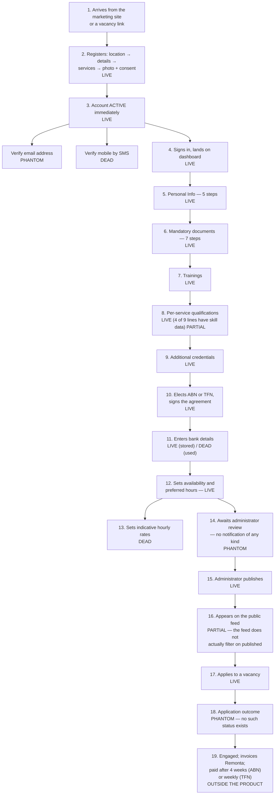
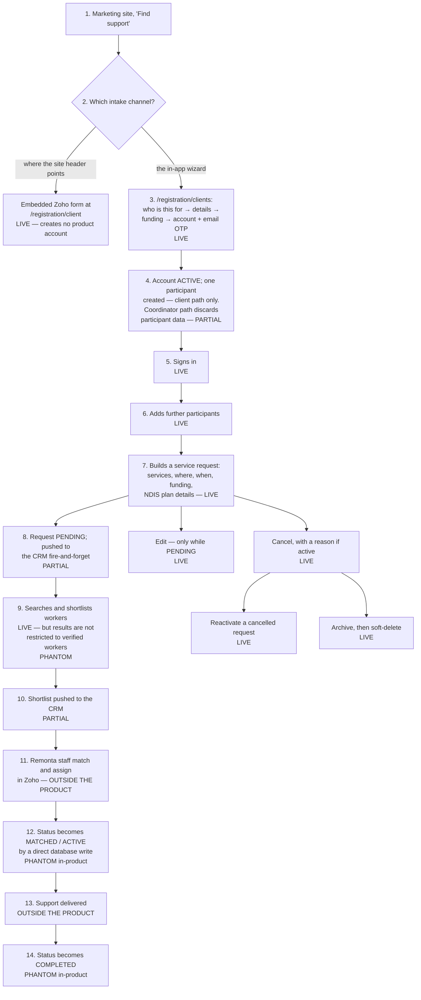
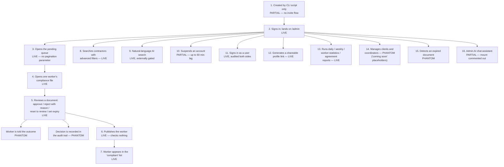
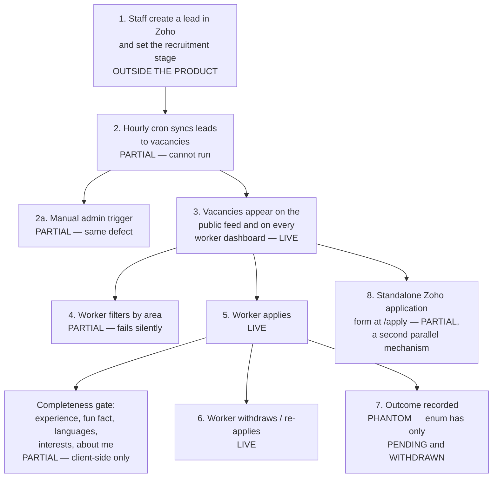
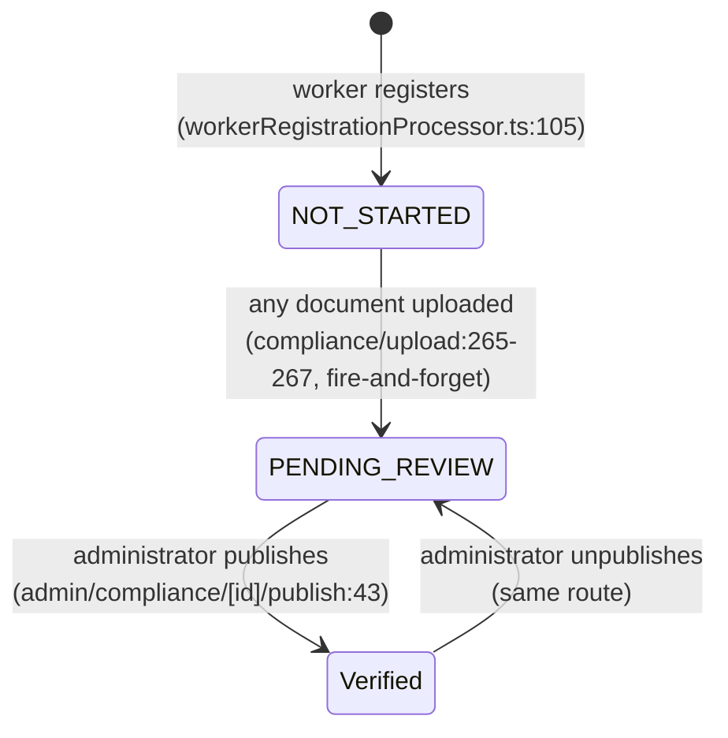
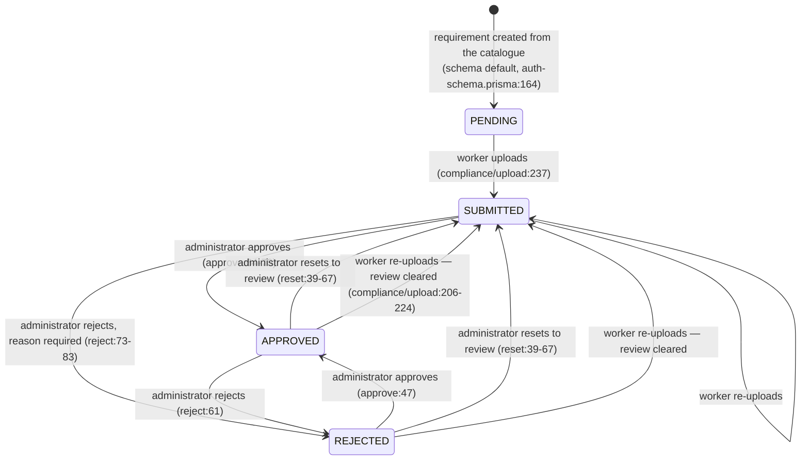
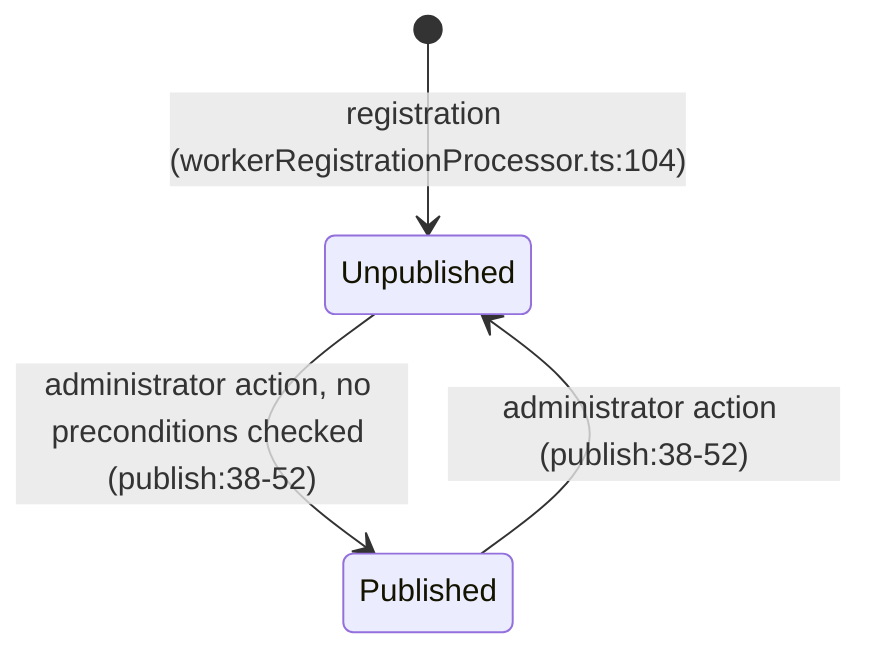
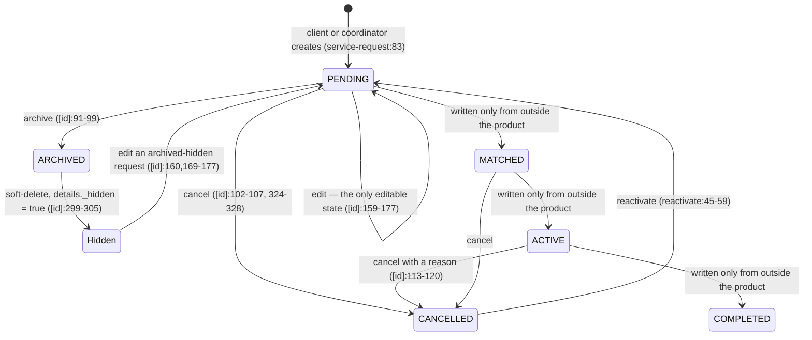
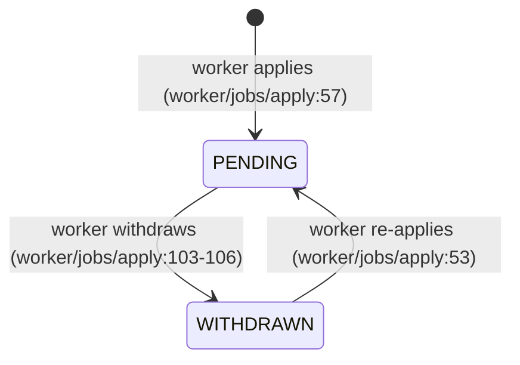
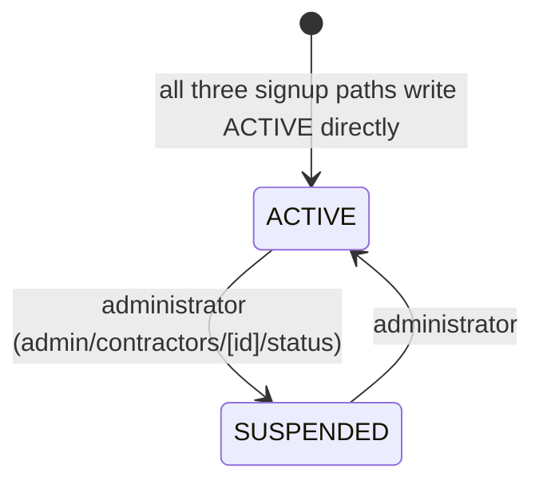

# Remonta — business requirements document

**Reverse-engineered from source at commit `72d698f` (branch `app/main`, 2026-08-27).**
Method: static read of the repository only — no database, no production environment, no
network calls, no access to the n8n automation layer or to Zoho CRM. Working notes and
per-phase evidence are in `.brd/`.

Every claim in this document is one of three kinds, and they are never mixed:

- **Derivable** — the code states it. Written plainly, with a `file:line` citation.
- **INFERRED** — the code implies it and a human must confirm. Labelled inline, with the
  reasoning and a confidence level.
- **Not derivable** — market, pricing, revenue, volumes, competitors, team, roadmap. **No
  such claim appears in this document.** Each is posed as a question in
  `docs/business-plan.md` § "Questions for the business".

Two structural cautions that affect how much weight any single finding can bear:
development effectively stopped in April 2026 (429 of 443 commits fall before it, `.brd/phase-8`),
and the schema is applied with `prisma db push` with no migration history, so **the
repository cannot prove what is deployed** (`prisma/migrations/` contains no Prisma
migrations; `package.json:11`). Where that matters, it is said.

---

## 1. Product summary

Remonta is an Australian care-matching platform for disability and community support,
covering NDIS, aged-care, insurance-funded and privately funded work
(`src/app/layout.tsx:34`; `prisma/auth-schema.prisma:519-525`). Support workers register
themselves, build a marketing profile, and upload the identity, screening, training,
qualification and insurance documents that their chosen service lines require; Remonta
administrators review each document individually and then decide whether to publish the
worker (`api/compliance/upload/route.ts`; the five `api/admin/compliance/*` routes). On the
other side, clients — participants themselves, or family members and representatives acting
for them — and funded support coordinators register participants and raise structured
service requests describing what support is needed, where, when and under which funding
arrangement (`api/client/service-request/route.ts`; `src/schema/serviceRequestSchema.ts`).
Both sides can search and shortlist workers, but the actual match, assignment and
completion of a request are performed by Remonta staff in Zoho CRM and written back into
the database from outside this application (`.brd/phase-3` §3.3). A third, smaller surface
mirrors Remonta's own recruitment vacancies out of Zoho so that workers can apply to them
(`docs/Zoho_Jobs_To_DB.md`; `prisma/auth-schema.prisma:349-407`).

The company is not a neutral intermediary. It is **a registered NDIS provider**
(`src/config/contractContent.ts:32`) that engages each worker either as an independent
contractor under an ABN or as a casual employee under a TFN, sets the pay rate per
assignment, receives the worker's invoice or timesheet, and pays the worker directly
(`src/config/contractContent.ts:22-24,219-220,281-296,301-302`;
`src/components/profile-building/sections/BankAccountSection.tsx:102`). The software is the
data-capture, compliance and discovery front end for that staffed operation.

## 2. The problem it solves — INFERRED

**Confidence: high** for the shape of the problem, **medium** for its relative weighting.
The reasoning is that the system automates exactly four manual processes and nothing else,
and the effort invested in each (measured in commits and in rule complexity) indicates
which mattered most.

**2.1 Collecting and tracking a large, per-person, per-service compliance file.**
A registered NDIS provider must hold, for every worker it engages, current evidence across
six named categories that the product itself labels: essential checks, training modules,
certifications and qualifications, identity, insurances, and contracts
(`src/app/admin/compliance/[id]/page.tsx:70-99`). What is required differs by service line
— a cleaner and a registered nurse do not need the same file (`.brd/phase-4` §4.3). Done
manually this is a spreadsheet, an email thread and a shared drive per worker. The system
replaces it with a rule engine that derives each worker's obligations from their chosen
services (`api/worker/requirements/route.ts:16-90`), a self-service upload flow, and a
per-document review queue. **This is the most heavily engineered part of the product** and
the only part still being maintained in August 2026 (`.brd/phase-8` §8.4). INFERRED: this
is the core problem the business is solving.

**2.2 Turning an unstructured support enquiry into a comparable, actionable brief.**
The service-request wizard forces a named participant, at least one service category from a
controlled catalogue, and a location, and then optionally captures scheduling frequency,
preferred worker gender, special requirements, participant health conditions, funding type
and NDIS plan details (`src/schema/serviceRequestSchema.ts:33-103`). Done manually this is
a phone call and free text. INFERRED (high confidence): the purpose is to make enquiries
triageable and to remove a data-entry step for the staff who fulfil them — which is why the
whole brief is pushed to the CRM on creation and on every edit
(`api/client/service-request/route.ts:105-127`).

**2.3 Making a verified worker discoverable by location and attribute.**
Location is the very first question asked at worker registration, before a name
(`src/app/registration/worker/page.tsx:293`), and distance search is implemented four times
over (`.brd/phase-4` §4.10). INFERRED (high confidence): the manual process replaced is a
staff member reading down a list asking "who do we have near Parramatta who speaks
Mandarin and can do hoist transfers?"

**2.4 Publishing recruitment vacancies without double entry.**
Vacancies are authored as leads in Zoho by staff and mirrored automatically into a job
board that workers see and apply to (`docs/Zoho_Jobs_To_DB.md:27-32`). The manual process
replaced is re-typing each role onto a website.

**What the system does not solve, and therefore what remains manual.** It does not match,
schedule, roster, time-record, price, invoice, pay, or carry any message between a client
and a worker. Each of those is either absent entirely or present only as an unbuilt type
(`.brd/phase-7` §7.7). INFERRED (high confidence): the matching decision is a deliberate
human judgement retained by Remonta staff, not an omission — the `MATCHED` state exists in
the vocabulary, and the shortlist a client submits is pushed to staff rather than acted on
(`api/client/service-request/[id]/select-worker/route.ts:18-31`).

## 3. Actors

**Support worker.** An individual offering paid disability or community support, engaged by
Remonta as an ABN contractor or a TFN casual employee. They enter entirely by self-service
in four steps and are `ACTIVE` immediately, with no email verification, no admin approval
and no waitlist (`src/lib/workers/workerRegistrationProcessor.ts:82-111`). Their reason to
be here is work: they complete a five-section onboarding programme — personal information,
mandatory documents, trainings, per-service qualifications, additional credentials
(`src/components/dashboard/Sidebar.tsx:147-178`) — in exchange for being shown to clients
and for access to Remonta's vacancy board. They consent, as a condition of participation,
to their profile and photo being shared with clients
(`src/components/forms/workerRegistration/Step7Photos.tsx`). They cannot publish
themselves, set a rate, see any client, or contact anyone.

**Client.** The person who arranges support — either the participant themselves
(self-managed) or a family member or representative acting for them. The distinction is put
to them as the first question at signup
(`src/components/forms/clientRegistration/Step1WhoIsCompleting.tsx`) and is recorded as
`isSelfManaged` on both their profile and the participant
(`api/auth/register/client/route.ts:72,83`). One participant is created with their account;
they can add more. Their reason to be here is to describe a support need and to see who
could meet it.

**Support coordinator.** A funded professional arranging support for several participants,
optionally within a named organisation, for stated `clientTypes`
(`prisma/auth-schema.prisma:65-80`). **Functionally identical to a client**: every
demand-side route admits both roles interchangeably, and the coordinator dashboard is a
near-verbatim copy of the client dashboard (`.brd/phase-2` §2.1; audit STR-02). INFERRED
(high confidence): the two roles exist to differentiate CRM routing and reporting, not
capability — nothing in the code gives a coordinator a power a client lacks.

**Administrator.** Remonta operations staff. There is **no self-service or invite path** —
an administrator can only be created by running `scripts/create-admin-user.ts` or
`scripts/promote-to-admin.ts` against the database. They are the only actor who can approve
a document, publish a worker, suspend an account, sign in as another user, generate a
shareable profile link, or run a report. They cannot create a service request, assign a
worker to one, create another administrator, or change anyone's role. A two-tier admin
model was intended and never built: four routes gate on a `SUPER_ADMIN` role that does not
exist in the enum (`.brd/phase-2` §2.1).

**Non-human actors.** A Vercel cron that should sync vacancies hourly and cannot
(`api/cron/sync-jobs/route.ts:14-22`); an internal secret-holder that can trigger the same
sync directly; **n8n**, which receives every registration and service-request event and —
inferred with high confidence — writes match and assignment state back into the production
database; Zoho CRM as the system of record for everything commercial; five Zoho
service-request webhooks; an external marketing site consuming an unauthenticated worker
feed; anonymous holders of an encrypted profile-share link; and the anonymous internet,
which can currently reach a 50 MB public file upload, an unauthenticated full-table rewrite,
a Twilio-spending SMS endpoint and the CRM contractor directory (`.brd/phase-2` §2.2).

## 4. Domain glossary

| Term | Plain-English meaning | Where it lives |
|---|---|---|
| **Worker** (admin-facing: *contractor*) | An individual offering paid disability or care support, engaged as an ABN contractor or TFN casual employee | `WorkerProfile`, `prisma/auth-schema.prisma:203` |
| **Client** | The account holder arranging support — the participant, or a family member/representative | `ClientProfile`, `:48` |
| **Support coordinator** | A funded professional arranging support for several participants, optionally under an organisation | `CoordinatorProfile`, `:65` |
| **Participant** | The person who receives the support. Distinct from the account holder | `Participant`, `:82` |
| **Administrator** | Remonta staff: verifies documents, publishes profiles, suspends accounts, impersonates, reports | `UserRole.ADMIN`, `:499` |
| **Service line** (schema: *category*) | One of the kinds of support a worker can offer | `Category`, `:277` |
| **Specialisation** (schema: *subcategory*) | A named specialism within a service line, sometimes tied to an external register such as AHPRA | `Subcategory`, `:287` |
| **Worker service** | The record that a given worker offers a given service line, with chosen specialisations | `WorkerService`, `:329` |
| **Skill** | A self-declared competency from a fixed taxonomy. Never verified | `src/config/serviceSkills.ts` |
| **Service offering** | A specific task a worker will perform (e.g. toileting). Support Worker lines only | `src/config/serviceOfferings.ts:19` |
| **Compliance document / requirement** | One document obligation for one worker, with a review status and optional expiry | `VerificationRequirement`, `:158` |
| **Document catalogue** | The master list of document types and which service lines require them | `Document` + `CategoryDocument` + `SubcategoryDocument`, `:262-327` |
| **Verification status** | The worker's overall compliance state | `WorkerProfile.verificationStatus`, `:233` |
| **Published** | Whether a worker is intended to appear to the demand side. Set only by an administrator | `WorkerProfile.isPublished`, `:232` |
| **Setup progress** | Which onboarding sections a worker has completed. Recomputed on every read because the stored value is not trusted | `WorkerProfile.setupProgress`, `:230` |
| **Service request** | A structured request for support for a named participant | `ServiceRequest`, `:528` |
| **Selected workers** | The shortlist a client or coordinator picked. An untyped string array | `ServiceRequest.selectedWorkers`, `:537` |
| **Assigned worker** | The worker actually engaged. Untyped JSON, written only from outside this application | `ServiceRequest.assignedWorker`, `:536` |
| **Job** | A recruitment vacancy mirrored from a Zoho lead. **Not** a marketplace listing | `Job`, `:349` |
| **Job application** | A worker's expression of interest in a vacancy. Can only be pending or withdrawn | `JobApplication`, `:392` |
| **Funding type** | Which payer regime funds the support: NDIS, aged care, insurance, private, other | `FundingType`, `:519` |
| **Worker engagement type** | Whether the worker is engaged under an ABN or a TFN, and whether they have signed. The number itself is deliberately not stored | `WorkerProfile.abn` JSON, `:229`; `src/schema/workerProfileSchema.ts:171-183` |
| **Impersonation** | An administrator signing in as another user via a single-use 60-second token | `api/admin/impersonate/route.ts` |
| **Share token** | An AES-256-GCM encrypted link letting someone view one worker's profile without an account | `src/lib/shareToken.ts` |

Terms used in the code that are **not** live domain concepts, and are excluded from this
glossary to prevent confusion: *contractor profile* (a separate, CRM-sourced model in the
legacy schema, `prisma/schema.prisma:11-54`); *match*, *hourly rate*, *plan budget*, *match
score* (unbuilt types, `src/types/index.ts:32-58`); *representative type* (an orphan enum
referenced by no model, `prisma/auth-schema.prisma:510-517`).

## 5. User journeys

Each step is marked **[Live]**, **[Partial]**, **[Dead]** or **[Phantom]**.

### 5.1 Worker — registration to being engaged

### 5.2 Client or coordinator — enquiry to delivered support

### 5.3 Administrator — verification and operations

### 5.4 Recruitment — Zoho lead to worker application

---

## 6. Functional requirements

Status per requirement: **Live** / **Partial** / **Dead** / **Phantom**, as defined in §5.

### 6.1 Worker registration (journey 5.1)

| ID | Requirement | Actor | Citation | Status |
|---|---|---|---|---|
| FR-001 | The system shall allow a support worker to create an account without invitation, in four steps: location, personal details, service lines and specialisations, and photo with consent. | Anon | `src/app/registration/worker/page.tsx:292-357` | Live |
| FR-002 | The system shall ask for the worker's location before any other information, and offer suburb autocomplete. | Anon | `:293`; `Step1Location.tsx` → `GET /api/suburbs` | Live |
| FR-003 | The system shall offer the service lines and specialisations from the live catalogue, falling back to a built-in list if the catalogue is unavailable. | Anon | `src/app/registration/worker/page.tsx:42` | Live |
| FR-004 | The system shall require the worker to consent to their profile and photo being shared with clients before the account is created. | Anon | `Step7Photos.tsx` | Live |
| FR-005 | The system shall verify a reCAPTCHA token on registration when one is supplied. | Anon | `api/auth/register-async/route.ts:57-65` | Partial — the check is skipped entirely if the field is absent |
| FR-006 | The system shall create the account as active, unpublished, with compliance not started and profile incomplete, and geocode the stated location. | Anon | `src/lib/workers/workerRegistrationProcessor.ts:82-111` | Live |
| FR-007 | The system shall record the worker's selected service lines as one record per line, with specialisations as arrays. | Anon | `workerRegistrationProcessor.ts:134-198` | Live |
| FR-008 | The system shall notify the CRM of every new worker registration. | System | `api/auth/register-async/route.ts:112-127` | Live — the destination URL is hardcoded in source |
| FR-009 | The system shall accept and forward a recruitment lead reference supplied at registration. | Anon | `api/auth/register-async/route.ts:52,124` | Partial — forwarded but never stored, so attribution exists only in n8n |
| FR-010 | The system shall verify a worker's email address before activating the account. | — | `AccountStatus.PENDING_VERIFICATION` (`prisma/auth-schema.prisma:460`) never written; `POST /api/auth/verify-email` does not exist though `src/app/auth/verify-email/page.tsx:39` calls it; `sendWelcomeEmail` (`src/lib/email.ts:186`) has zero callers | Phantom — and `api/auth/register-async/route.ts:135` tells the worker to check their email |
| FR-011 | The system shall verify a worker's mobile number by SMS at registration. | — | `Step7Verification.tsx` not mounted; `src/hooks/usePhoneVerification.ts` zero consumers; the two `/api/sms/*` routes use separate in-module stores | Dead |
| FR-012 | The legacy worker-registration endpoint shall create an account. | — | `api/auth/register/route.ts:150` reads an undeclared variable `photos`, never destructured at `:82-99`; every call throws and returns HTTP 500. Zero UI callers | Dead and broken |

### 6.2 Worker onboarding (journey 5.1)

| ID | Requirement | Actor | Citation | Status |
|---|---|---|---|---|
| FR-020 | The system shall guide the worker through account setup in five steps: name, profile photo, bio, address, other personal information. | Worker | `src/config/accountSetupSteps.ts:21-27` | Live |
| FR-021 | The system shall let the worker record work history, education, languages, cultural background, religion, interests, about-me, personality, LGBTQIA+ support, locations, preferences, preferred hours, experience and NDIS screening. | Worker | `src/components/profile-building/sections/` | Live |
| FR-022 | The system shall let the worker record indicative hourly rates for weekdays, Saturdays, Sundays and public holidays. | — | `IndicativeRatesSection.tsx:20-22` — `handleSave` is empty; zero consumers; no rate column in either schema | Dead |
| FR-023 | The system shall derive each worker's document obligations from their selected service lines and specialisations, grouped into base compliance, trainings, qualifications, insurance and transport. | Worker | `api/worker/requirements/route.ts:16-90` | Live |
| FR-024 | The system shall require the Code of Conduct, in two parts, of every worker regardless of service line. | Worker | `api/worker/requirements/route.ts:23-26`; `src/config/codeOfConductContent.ts` | Live |
| FR-025 | The system shall guide the worker through mandatory documents in order: worker screening, police check, working with children, NDIS Worker Orientation, NDIS training, infection control, other requirements. | Worker | `src/config/mandatoryRequirementsSetupSteps.ts:27-70` | Live |
| FR-026 | The system shall accept document uploads of PDF, JPEG, PNG, WebP or HEIC up to 50 MB, streamed to storage. | Worker | `api/compliance/upload/route.ts:78-88,131-140,176` | Live |
| FR-027 | The system shall allow several documents to be uploaded concurrently without blocking the wizard. | Worker | `src/lib/backgroundUploadQueue.ts` | Live |
| FR-028 | The system shall collect a 100-point identity document set, classifying each document as primary, secondary or working-rights evidence, and shall allow a document already held to be reused as a reference. | Worker | `api/compliance/upload/route.ts:51-76`; `api/worker/identity-documents/copy-reference` | Live |
| FR-029 | The system shall let the worker elect an ABN or TFN engagement and record their signature, storing the engagement type and signature flag but **not** the ABN or TFN itself. | Worker | `src/schema/workerProfileSchema.ts:171-183` and its comment at `:172` | Live |
| FR-030 | The system shall present the applicable contractor or casual-employment agreement and generate it as a PDF. | Worker | `src/config/contractContent.ts`; `/dashboard/worker/contract/[type]`; `src/components/contracts/ContractPage.tsx` | Live |
| FR-031 | The system shall collect the worker's bank account details for payment by Remonta. | Worker | `src/schema/workerProfileSchema.ts:198-216`; `BankAccountSection.tsx:102` | Partial — stored as an unencrypted JSON blob (`prisma/auth-schema.prisma:431`) and **read by no code for any purpose** |
| FR-032 | The system shall let the worker declare skills and specific service offerings within each service line. | Worker | `src/config/serviceSkills.ts:22,370,637,842`; `src/config/serviceOfferings.ts:73-83` | Partial — skill taxonomies exist for 4 of 9 service lines; offerings exist only for the two Support Worker lines |
| FR-033 | The system shall let the worker upload a vehicle photo and additional certificates. | Worker | `api/upload/vehicle-photo`, `api/upload/certificates` | Live |
| FR-034 | The system shall track onboarding completion across five sections and show a completion percentage. | Worker | `src/components/dashboard/Sidebar.tsx:100,139-145` | Partial — recomputed on every read because the stored value races itself (audit FE-01, DB-07) |
| FR-035 | The system shall let the worker preview their profile as a client would see it. | Worker | `/dashboard/worker/profile-preview`; `src/services/worker/profilePreview.service.ts` | Live |
| FR-036 | The system shall issue a client-side upload token for direct-to-storage uploads. | — | `POST /api/blob/upload-token` — zero callers | Dead |

### 6.3 Compliance verification (journey 5.3)

| ID | Requirement | Actor | Citation | Status |
|---|---|---|---|---|
| FR-040 | The system shall present administrators with a queue of workers awaiting review. | Admin | `GET /api/admin/compliance/pending` | Partial — no pagination parameter exists (audit DB-05) |
| FR-041 | The system shall list workers whose compliance has been verified, defined as those whose profile is published. | Admin | `api/admin/compliance/compliant/route.ts:16-19` | Partial — no pagination; sorted on an unindexed column |
| FR-042 | The system shall show an administrator every document a worker has uploaded, grouped into essential checks, modules, certifications, identity, insurances and contracts, with each file accessible. | Admin | `GET /api/admin/compliance/[id]`; `src/app/admin/compliance/[id]/page.tsx:70-99` | Live |
| FR-043 | The system shall allow an administrator to approve a submitted or previously rejected document. | Admin | `.../approve/route.ts:47-70` | Partial — authorisation runs **after** the record, including the document file URL, has been read and returned (audit API-01) |
| FR-044 | The system shall require a written reason when an administrator rejects a document. | Admin | `.../reject/route.ts:28-31,79-84` | Partial — same authorisation-ordering defect |
| FR-045 | The system shall allow an administrator to reset a reviewed document back to review, appending a timestamped note naming the administrator. | Admin | `.../reset/route.ts:39-67` | Partial — same authorisation-ordering defect |
| FR-046 | The system shall allow an administrator to set or clear a document's expiry date. | Admin | `.../update-expiry/route.ts:29-46` | Live |
| FR-047 | The system shall allow an administrator to publish or unpublish a worker profile. | Admin | `.../publish/route.ts:38-52` | Live — but it validates nothing (see BR-046) and writes a verification status value that is not a member of the defined vocabulary |
| FR-048 | The system shall reset a document's review when the worker replaces the file. | Worker | `api/compliance/upload/route.ts:206-224` | Live |
| FR-049 | The system shall set the worker's overall status to pending review when any document is uploaded. | System | `api/compliance/upload/route.ts:265-267` | Partial — fire-and-forget after the response; may be lost (audit XC-02) |
| FR-050 | The system shall mark a document expired when its expiry date passes. | — | `RequirementStatus.EXPIRED` (`prisma/auth-schema.prisma:492`) is never written by any code; no scheduled job and no read-time check exist; 16 of 24 catalogue document types carry expiry dates | **Phantom** |
| FR-051 | The system shall notify a worker when a document is approved, rejected or about to expire. | — | No email, SMS or in-app notification exists for any compliance outcome (`.brd/phase-5` §5.1) | **Phantom** |
| FR-052 | The system shall record every verification decision in the audit trail. | — | `src/app/api/admin/` contains exactly one file that writes an audit log, and it is impersonation. No approve, reject, reset, expiry-change, publish or suspend action is audited | **Phantom** |
| FR-053 | The system shall support approving or rejecting a worker's whole profile with an audit record. | — | `src/lib/verification.ts:120-200` writes four columns that do not exist on `WorkerProfile`; its only importer `/api/admin/verification` has zero UI callers | Dead and non-functional |
| FR-054 | The system shall prevent duplicate rows for the same document type on the same worker. | — | `(workerProfileId, requirementType)` is a plain index, not a unique constraint (`prisma/auth-schema.prisma:186`); the upsert is a find-then-create race (audit DB-07) | **Phantom** |

### 6.4 Worker discovery (journey 5.2)

| ID | Requirement | Actor | Citation | Status |
|---|---|---|---|---|
| FR-060 | The system shall let a client or coordinator search workers by keyword, service line, and location with a radius. | Client, Coordinator | `GET /api/client/workers`; `/dashboard/*/find-worker` | Live |
| FR-061 | The system shall route a search term that names a service or specialisation only against services and qualifications, and any other term only against bio, hobbies and personality, requiring every term to match. | Client, Coordinator | `api/client/workers/route.ts:274-286,299-337,374-382` | Live |
| FR-062 | The system shall restrict search results to workers an administrator has published. | — | `buildWhereClause` (`api/client/workers/route.ts:352-396`) filters on account status and non-empty names only, plus a non-null bio on default browse. `isPublished` and `verificationStatus` appear nowhere in it | **Phantom** — see §12.1 |
| FR-063 | The system shall provide an unauthenticated worker feed for the external marketing site, returning only published workers. | Anon | `GET /api/public/workers`; `buildWhereClause` at `:109-122` filters on account status only. The **only** occurrence of `isPublished` in the file is a docblock comment at `:291` | **Phantom** for the published restriction; the feed itself is Live and has no auth and no rate limit (audit XC-04) |
| FR-064 | The system shall cache search results and honour the requested radius. | System | `api/client/workers/route.ts:130-144` vs `:157-158,517-518` | Partial — the cache key omits the radius, so a 5 km and a 100 km search share one entry (audit API-11) |
| FR-065 | The system shall show a client or coordinator a worker's full profile. | Client, Coordinator | `/workers/[id]/profile`; `src/components/profile/WorkerProfileView.tsx` | Live |
| FR-066 | The system shall let an administrator generate an encrypted link that shows one worker's profile to someone without an account. | Admin → Anon | `POST /api/share/generate`; `/share/profile/[token]`; `src/lib/shareToken.ts` | Live — the encryption key has a hardcoded fallback in source (audit API-03) |
| FR-067 | The system shall provide a searchable directory of CRM-sourced contractors to administrators. | **Anon** | `/remontaadmin/findsupport` (titled "Admin access only", `page.tsx:5-6`), not in the middleware matcher, no session check; `GET /api/contractors` has rate limiting and no auth; `GET /api/contractors/[id]` has neither | Partial — live and unauthenticated; nothing in the repository writes `contractor_profiles`, so the data source is external |
| FR-068 | The system shall provide a "workers by area" directory. | — | `ContractorsbyArea` (`prisma/schema.prisma:56-66`) — zero references in `src/` | Dead |

### 6.5 Service requests (journey 5.2)

| ID | Requirement | Actor | Citation | Status |
|---|---|---|---|---|
| FR-070 | The system shall let a client or coordinator create and edit participants. | Client, Coordinator | `api/client/participants`, `.../[id]` | Live |
| FR-071 | The system shall create one participant alongside a client's account at registration. | Anon | `api/auth/register/client/route.ts:76-88` | Live |
| FR-072 | The system shall create a participant and initial service request alongside a coordinator's account at registration. | — | The route's docblock says so (`api/auth/register/coordinator/route.ts:4-7,18-23`) but the validating schema declares none of those fields (`src/schema/registrationSchema.ts:56-75`), so they are stripped and only the user and profile are created (`:104-126`) | **Phantom** — coordinator-supplied participant and service data is silently discarded |
| FR-073 | The system shall let a client or coordinator raise a service request against a participant they own, capturing services, location, schedule, worker preferences and funding details. | Client, Coordinator | `POST /api/client/service-request:60-88`; `src/schema/serviceRequestSchema.ts:33-103` | Live |
| FR-074 | The system shall capture NDIS plan details — management type, plan manager, invoice email, CC email, NDIS number, plan dates. | Client, Coordinator | `src/schema/serviceRequestSchema.ts:72-81`; `AddClientModal.tsx:602-612` | Partial — captured, stored in an unindexed JSON blob, forwarded to the CRM, and **read by no code** |
| FR-075 | The system shall notify the CRM when a request is created and on every edit, including the participant's health conditions. | System | `api/client/service-request/route.ts:105-127`; `.../[id]/route.ts:224-262` | Partial — fire-and-forget, no timeout, no retry, no dead-letter (audit XC-02) |
| FR-076 | The system shall allow a request to be edited only while it is pending. | Client, Coordinator | `.../[id]/route.ts:159-166` | Live |
| FR-077 | The system shall let a client or coordinator shortlist workers on a request, and remove one. | Client, Coordinator | `.../select-worker/route.ts` | Live |
| FR-078 | The system shall notify the CRM when a shortlist is confirmed or an entry removed. | System | `.../select-worker/route.ts:18-31` | Partial — fire-and-forget |
| FR-079 | The system shall let a request be cancelled, requiring a reason when the request was active, and shall clear the shortlist. | Client, Coordinator | `.../[id]/route.ts:102-133,324-328` | Live |
| FR-080 | The system shall let a cancelled request be reactivated to pending. | Client, Coordinator | `.../reactivate/route.ts:45-59` | Live |
| FR-081 | The system shall let a request be archived, and an archived request hidden, without deleting any data. | Client, Coordinator | `.../[id]/route.ts:91-99,299-315` | Live |
| FR-082 | The system shall record which worker was assigned to a request, and link the request to its CRM record. | — | `ServiceRequest.assignedWorker` and `zohoRecordId` are read in 12 places and **written in none** | **Phantom in-product** — written by n8n directly to the database |
| FR-083 | The system shall progress a request through matched, active and completed states. | — | `MATCHED`, `ACTIVE` and `COMPLETED` are never written by product code, yet are read by the dashboards (`dashboard/client/manage-request/page.tsx:34`; `supportcoordinators/completed/page.tsx:57`) | **Phantom in-product** |
| FR-084 | The system shall restrict CRM cancel and archive actions to the owner of the request. | — | `.../action-behook`: `action-webhook/route.ts:6-27` requires a session but performs **no ownership and no role check**, and will fire against any request id | **Phantom** |
| FR-085 | The system shall accept new client enquiries through an embedded Zoho referral and service-request form. | Anon | `src/app/registration/client/page.tsx:35-38`, linked from `Header.tsx:22-23` | Live — a parallel intake channel that creates no product account |

### 6.6 Recruitment (journey 5.4)

| ID | Requirement | Actor | Citation | Status |
|---|---|---|---|---|
| FR-090 | The system shall mirror Zoho recruitment leads into vacancies hourly, and deactivate vacancies whose lead has left the recruitment stage. | Cron | `vercel.json:3-8`; `api/sync-jobs/route.ts:106-115` | **Partial — cannot run.** `api/cron/sync-jobs/route.ts:15-22` HTTP-calls `localhost` from a serverless function; `CRON_SECRET` and `NEXT_PUBLIC_BASE_URL` are set in neither env file (audit API-07) |
| FR-091 | The system shall let an administrator trigger the vacancy sync manually. | Secret holder | `POST /api/refresh-jobs:24-27` | Partial — identical `localhost` defect |
| FR-092 | The system shall identify a vacancy by its Zoho record id so that re-syncing updates rather than duplicates, and shall never delete a vacancy. | System | `prisma/auth-schema.prisma:351`; `docs/Zoho_Jobs_To_DB.md:735,737` | Live |
| FR-093 | The system shall publish active vacancies without authentication and show them on every worker dashboard. | Anon, Worker | `GET /api/jobs`; `NewsSliderAsync.tsx:16-30` | Live — the dashboard query is unbounded and ships the whole table to every worker on every render (audit DB-05) |
| FR-094 | The system shall let a worker filter vacancies by area. | Worker | `NewsSlider.tsx:101` → `GET /api/geocode` | Partial — the geocode failure path returns a null state, so the filter stops working silently (audit XC-03) |
| FR-095 | The system shall let a worker apply to an active vacancy, hold at most one application per vacancy, withdraw, and re-apply. | Worker | `api/worker/jobs/apply/route.ts:17-106`; `prisma/auth-schema.prisma:402` | Live |
| FR-096 | The system shall require a worker to have completed experience, fun fact, languages, interests and about-me before applying, exempting Cleaning and Yard Maintenance. | Worker | `src/utils/profileSections.ts:30-41,6`; `ApplyModal.tsx:93-95` | Partial — **client-side only**; the API applies no completeness, publication or verification check |
| FR-097 | The system shall record the outcome of an application. | — | `JobApplicationStatus` has exactly two values, `PENDING` and `WITHDRAWN` (`prisma/auth-schema.prisma:409-412`) | **Phantom** |
| FR-098 | The system shall let a worker submit a recruitment application directly to Zoho against a recruitment reference, without storing it. | Worker | `/apply?recruitmentId=…`; `POST /api/apply` | Partial — returns HTTP 500 if `APPLY_WEBHOOK_URL` is unset; one commit, 2026-07-09, never revisited; a second mechanism parallel to FR-095 |
| FR-099 | The system shall expose Zoho leads over an internal endpoint. | — | `GET /api/zoho/leads` — zero in-repo callers | Dead |

### 6.7 Administration and reporting (journey 5.3)

| ID | Requirement | Actor | Citation | Status |
|---|---|---|---|---|
| FR-110 | The system shall let an administrator list and filter workers by age, gender, location, distance, language, and document type, status and category. | Admin | `GET /api/admin/contractors` | Live |
| FR-111 | The system shall let an administrator view and edit a worker's profile, and export it as a PDF. | Admin | `/admin/contractors/[id]`; `GET/PATCH /api/admin/contractors/[id]`; `.../pdf` | Live |
| FR-112 | The system shall let an administrator suspend and reactivate an account. | Admin | `PATCH /api/admin/contractors/[id]/status` | Partial — the login cache is not invalidated, so a suspended user keeps signing in for up to 60 minutes (audit XC-06) |
| FR-113 | The system shall let an administrator sign in as any active user, and return to their own session, recording both events for both parties. | Admin | `api/admin/impersonate/route.ts:61-110,137-213` | Live |
| FR-114 | The system shall produce daily, weekly, worker-statistics and signed-agreement reports. | Admin | `GET /api/admin/reports/{daily,weekly,worker-statistics,agreement/[type]}` | Live — worker-statistics performs 34 sequential counts today, growing by ~52 a year (audit §7) |
| FR-115 | The system shall let an administrator search workers in natural language. | Admin | `admin/manage/page.tsx:114-160` → `POST /api/admin/ai-search` | Live, wholly dependent on `AI_SEARCH_WEBHOOK`; returns HTTP 500 if unset |
| FR-116 | The system shall provide an AI assistant to administrators. | — | `AdminChatbot.tsx` and `FloatingChatbot.tsx` are complete; the mount is commented out at `src/app/admin/layout.tsx:57`; the endpoint falls back to the placeholder URL `https://your-n8n-instance.com/webhook/chat` (`api/admin/chat/route.ts:26`) | Partial — deliberately disabled |
| FR-117 | The system shall let an administrator manage client and support-coordinator records. | — | Both nav items exist (`AdminSidebar.tsx:24-33`) and both render "coming soon" (`admin/manage/page.tsx:69-97`) | **Phantom** |
| FR-118 | The system shall let an administrator create another administrator or change a user's role. | — | No route, no UI. Only `scripts/create-admin-user.ts` and `scripts/promote-to-admin.ts`. `AuditAction.ROLE_CHANGE` never written | **Phantom** |
| FR-119 | The system shall bulk-correct non-mandatory compliance document names. | — | `POST /api/admin/fix-qualifications` — **no authentication**, zero callers, one update per row with no bound (audit API-12) | Dead |

### 6.8 Account and access (all journeys)

| ID | Requirement | Actor | Citation | Status |
|---|---|---|---|---|
| FR-130 | The system shall authenticate users by email and password, issuing a 24-hour session or a 7-day session if "remember me" is chosen. | All | `src/lib/auth.config.ts:75-158,198` | Live |
| FR-131 | The system shall lock an account for 30 seconds after three consecutive failed sign-ins. | All | `src/lib/auth.config.ts:120-129` | Partial — the counter is a non-atomic read-modify-write, so parallel attempts all read the same value (audit DB-07) |
| FR-132 | The system shall refuse sign-in to a non-active account. | All | `src/lib/auth.config.ts:140` | Partial — reads a user record cached for up to 60 minutes (audit XC-06) |
| FR-133 | The system shall send a password-reset link valid for one hour, and shall respond identically whether or not the account exists. | All | `api/auth/forgot-password/route.ts:66-101` | Live |
| FR-134 | The system shall let a user set an initial password from an invitation link. | All | `POST /api/auth/setup-password`; `/setup-password` | Live |
| FR-135 | The system shall verify a client's or coordinator's email address with a one-time code before creating the account. | Anon | `POST /api/auth/send-otp`, `/verify-otp`; `Step5AccountSetup.tsx:71,136` | Partial — the verification is stateless and the signing token is returned to the caller, so the code can be brute-forced offline; no rate limit; no attempt counter (audit API-03). The email states 15 minutes' validity (`src/lib/email.ts:73`) while the code is issued for 10 (`api/auth/send-otp/route.ts:43`) |
| FR-136 | The system shall let a visitor check whether an email address is already registered. | Anon | `POST /api/auth/check-email` | Live — no auth, no rate limit; an account-enumeration oracle |
| FR-137 | The system shall let a coordinator maintain their own profile. | Coordinator | `GET/PATCH /api/coordinator/profile` | Live |
| FR-138 | The system shall let a client maintain their own profile. | Client | `/dashboard/client/account` exists; there is **no** client profile API route | Partial |
| FR-139 | The system shall let a user delete their account or export their data. | — | No route, no UI. `Participant.userId onDelete: SetNull` (`prisma/auth-schema.prisma:101`) shows deletion was contemplated and would leave ownerless participant health records | **Phantom** |

### 6.9 Platform surface

| ID | Requirement | Citation | Status |
|---|---|---|---|
| FR-150 | The application root shall direct visitors to sign in. | `src/app/page.tsx:3-5` | Live |
| FR-151 | The system shall serve newsroom articles. | `/api/articles` and `/api/articles/[slug]` are bare 301 redirects to `www.remontaservices.com.au/newsroom` | Partial — a redirect shim |
| FR-152 | The system shall manage content through a headless CMS. | `NEXT_PUBLIC_SANITY_PROJECT_ID` and `NEXT_PUBLIC_SANITY_DATASET` are set; `cdn.sanity.io` is allow-listed in `next.config.ts`; no Sanity client is installed | **Phantom** |
| FR-153 | The system shall let clients and workers exchange messages in real time. | Six `PUSHER_*` env vars; `pusher` and `pusher-js` installed with 0 imports; `@chatscope/chat-ui-kit-react` installed with 0 imports; `docs/structure.md:2` names messaging as a core requirement | **Phantom** |
| FR-154 | The site header shall link to support-coordinator and services pages. | `Header.tsx:32-38` links `/support-coordinators` and `/services` — neither page exists in this application | Partial |
| FR-155 | The system shall emit structured logs with correlation ids. | `src/lib/logger.ts:54-78` — every method body empty, zero importers (audit XC-01) | Dead |

---

## 7. Business rules

Enforcement point: **C** = client (browser) only · **S** = server · **C+S** = both ·
**None** = declared somewhere but enforced nowhere. Rules marked **C** or **None** are
product risks and are consolidated in §12.

### Identity and access

| ID | Rule | Enforcement | Citation |
|---|---|---|---|
| BR-001 | A person holds exactly one role; an account cannot be both a worker and a client. | S (schema) | `prisma/auth-schema.prisma:129,142-144` |
| BR-002 | A client or coordinator password must be at least 8 characters with an uppercase letter, a lowercase letter and a digit. | C+S | `src/schema/registrationSchema.ts:25-29` |
| BR-003 | A worker password need only be present. | S | `api/auth/register-async/route.ts:68-73`; `workerRegistrationProcessor.ts:38-40` |
| BR-004 | A client or coordinator mobile must be a valid Australian mobile number. | C+S | `src/schema/registrationSchema.ts:14-23` |
| BR-005 | A worker mobile need only be present. | S | `workerRegistrationProcessor.ts:42-44` |
| BR-006 | Email addresses are stored lower-cased and trimmed and are unique across all accounts. | S | `src/schema/registrationSchema.ts:31-34`; `prisma/auth-schema.prisma:127` |
| BR-007 | A client or coordinator must affirmatively agree to the terms to register. | C+S | `src/schema/registrationSchema.ts:69-71,111-113` |
| BR-008 | A worker must consent to their profile and photo being shared with clients; this is a condition of participation, not an option. | C+S | `Step7Photos.tsx` |
| BR-009 | Three consecutive failed sign-ins lock an account for 30 seconds; an expired lock resets the counter. | S | `src/lib/auth.config.ts:102-129` |
| BR-010 | A non-active account cannot sign in. | S | `src/lib/auth.config.ts:140` — via a cache up to 60 minutes stale |
| BR-011 | A password-reset link expires after one hour. | S | `api/auth/forgot-password/route.ts:79` |
| BR-012 | A forgotten-password request does not reveal whether the account exists. | S | `api/auth/forgot-password/route.ts:66-71` |
| BR-013 | An email-availability check and the OTP send endpoint **do** reveal whether an account exists. | S | `POST /api/auth/check-email`; `api/auth/send-otp/route.ts:34-39` (409 vs 200) |
| BR-014 | An administrator may impersonate only an active account; the token is single-use and expires in 60 seconds; both parties are audited at start and end. | S | `api/admin/impersonate/route.ts:61-110,178-213` |
| BR-015 | A worker may read only their own profile. | S | `api/worker/profile/[userId]/route.ts:78` |
| BR-016 | A client or coordinator may act only on participants and requests they own. | S | `api/client/service-request/route.ts:73-75`; `.../[id]/route.ts:155-157` |
| BR-017 | An administrator can only be created by running a script against the database. | S | `scripts/create-admin-user.ts`, `scripts/promote-to-admin.ts`; no route exists |

### Worker profile content

| ID | Rule | Enforcement | Citation |
|---|---|---|---|
| BR-020 | First and last name are required, at most 50 characters each, letters, spaces, hyphens and apostrophes only. | C+S | `src/schema/workerProfileSchema.ts:9-25` |
| BR-021 | A bio must be between 200 and 2 000 characters, counted after trimming. | C+S | `:64-71` |
| BR-022 | A "fun fact about you" must be between 50 and 1 000 characters, and at least one unique service must be selected. | C+S | `:384-392` |
| BR-023 | A worker must be at least 18 and no more than 120 years old, with a date of birth not in the future. | C+S | `:115-153` |
| BR-024 | Gender is required and limited to "Male" or "Female". | C+S | `:154-157` |
| BR-025 | Personality is required and limited to "Outgoing and engaging" or "Calm and relaxed"; non-smoker and pet-friendly are required booleans. | C+S | `:413-423` |
| BR-026 | City, state and a 3-or-4-digit postal code are required; street address is optional. | C+S | `:80-91` |
| BR-027 | A worker has one main photo and at most two additional photos. | C+S | `:49-51` |
| BR-028 | At least one work-history entry is required; an end date is mandatory unless currently working. | C+S | `:229-261` |
| BR-029 | At least one education entry is required; an end date is mandatory unless currently studying. | C+S | `:279-311` |
| BR-030 | A worker elects an ABN or TFN engagement and records a signature; the ABN or TFN number itself is not stored. | C+S | `:171-183` |
| BR-031 | Bank details require an account name and bank name of at most 100 characters, a 6-digit BSB stored without a dash, a 6-to-10-digit account number, and an acknowledgement tick. | C+S | `:198-216` |
| BR-032 | A worker offers at most one record per service line. | S (schema) | `prisma/auth-schema.prisma:341` |
| BR-033 | A worker's date of birth is stored as text and filtered lexicographically for the admin age filter — correct only while every value is exactly `YYYY-MM-DD`, which nothing enforces. | S | `prisma/auth-schema.prisma:215`; `api/admin/contractors/route.ts:181-186` |

### Compliance

| ID | Rule | Enforcement | Citation |
|---|---|---|---|
| BR-040 | A worker's required documents are derived from their selected service lines and specialisations. | S | `api/worker/requirements/route.ts:16-90` |
| BR-041 | The Code of Conduct, in two parts, is required of every worker regardless of service line. | S | `api/worker/requirements/route.ts:23-26` |
| BR-042 | Uploads are limited to PDF, JPEG, PNG, WebP and HEIC/HEIF, at most 50 MB each. | S | `api/compliance/upload/route.ts:78-88,131-140` |
| BR-043 | Identity documents are classified as primary or secondary evidence under the Australian 100-point structure: passport and birth certificate are primary; driver's licence, Medicare card, utility bill and bank statement are secondary. | S | `api/compliance/upload/route.ts:51-60` |
| BR-044 | Mandatory for every worker: 100 points of identity, an ABN or TFN election, NDIS Worker Screening Check, National Police Check, Working with Children Check, proof of working rights, and the Code of Conduct. | S | `api/compliance/upload/route.ts:53-74` |
| BR-045 | Replacing a document resets its review: status returns to submitted and the approval date, rejection date, rejection reason and reviewer are cleared. | S | `api/compliance/upload/route.ts:206-224` |
| BR-046 | Publishing a worker validates nothing. No document need be approved, no required set complete, no expiry current. Publication is solely the administrator's judgement. | S | `.../publish/route.ts:38-52` |
| BR-047 | A document's expiry date has no effect on anything. | **None** | `RequirementStatus.EXPIRED` is never written; the admin UI only renders a past date in red (`src/app/admin/compliance/[id]/page.tsx:409`) |
| BR-048 | Nothing prevents two rows for the same document type on the same worker. | **None** | `prisma/auth-schema.prisma:186` is an index, not a unique constraint |
| BR-049 | Deleting an identity document removes the database row and leaves the file publicly reachable. | S | `api/worker/identity-documents/route.ts:172-178` (deletion commented out) |
| BR-050 | Approve is legal only from submitted or rejected; reject only from submitted or approved; reset only from approved or rejected. | S | `approve:47-52`; `reject:60-65`; `reset:39-45` |
| BR-051 | A rejection must carry a written reason. | S | `.../reject/route.ts:28-31` |
| BR-052 | Resetting a document appends a timestamped note naming the administrator. | S | `.../reset/route.ts:63-65` |

### Search and visibility

| ID | Rule | Enforcement | Citation |
|---|---|---|---|
| BR-060 | A worker appears in the in-product search only if their account is active and both names are non-empty. | S | `api/client/workers/route.ts:352-357` |
| BR-061 | On a default browse with no search term, only workers who have written a bio are listed. | S | `api/client/workers/route.ts:359-364` |
| BR-062 | A search page returns at most 50 workers. | S | `api/client/workers/route.ts:151-154` |
| BR-063 | Publication and verification status do not restrict search visibility on any live route. | **None** | §12.1 |
| BR-064 | The public feed's search radius is uncapped. | **None** | `api/public/workers/route.ts:201-203` |
| BR-065 | The CRM contractor directory returns at most 100 records per request. | S | `api/contractors/route.ts:16` |

### Service requests

| ID | Rule | Enforcement | Citation |
|---|---|---|---|
| BR-070 | A request must name an existing participant belonging to the requester, at least one service line, and a location. | C+S | `src/schema/serviceRequestSchema.ts:97-103`; `api/client/service-request/route.ts:66-75` |
| BR-071 | A new request starts pending with an empty shortlist. | S | `api/client/service-request/route.ts:83-84` |
| BR-072 | Only a pending request may be edited; an archived-and-hidden request is restored to pending first. | S | `.../[id]/route.ts:159-177` |
| BR-073 | Cancelling clears the shortlist. | S | `.../[id]/route.ts:105,326` |
| BR-074 | A completed or cancelled request cannot be cancelled again. | S | `.../[id]/route.ts:317-322` |
| BR-075 | Only a cancelled request may be reactivated, and reactivation clears the shortlist. | S | `.../reactivate/route.ts:45-59` |
| BR-076 | Nothing is ever physically deleted; an archived request is hidden by a flag inside its own details. | S | `.../[id]/route.ts:299-305` |
| BR-077 | Cancelling with a reason notifies the CRM through the active-cancellation channel; cancelling without one uses the cancel/archive channel. | S | `.../[id]/route.ts:113-129` |
| BR-078 | Scheduling frequency is one of one-time, weekly, fortnightly, monthly, ongoing, as-needed. | C+S | `src/schema/serviceRequestSchema.ts:63` |
| BR-079 | Funding type is one of NDIS, aged care, insurance, private, other. | C+S | `src/schema/serviceRequestSchema.ts:38,84` |
| BR-080 | Every NDIS plan detail, including the NDIS number, is optional. | C+S | `src/schema/serviceRequestSchema.ts:72-81` |
| BR-081 | A client may set their own pending request's status directly to matched, active or completed. | S (unintended) | `src/schema/serviceRequestSchema.ts:117` + `.../[id]/route.ts:211` |
| BR-082 | Any signed-in user may fire a CRM cancel or archive action against any request id. | S (unintended) | `.../action-webhook/route.ts:6-27` |

### Recruitment

| ID | Rule | Enforcement | Citation |
|---|---|---|---|
| BR-090 | A vacancy exists only while its Zoho lead is in the recruitment stage; leaving the stage flags it inactive and it is never deleted. | S | `api/sync-jobs/route.ts:106-115`; `docs/Zoho_Jobs_To_DB.md:737` |
| BR-091 | A vacancy is keyed on its Zoho record id, so re-syncing updates rather than duplicates. | S | `prisma/auth-schema.prisma:351` |
| BR-092 | A worker holds at most one application per vacancy; re-applying after withdrawal returns it to pending. | S | `prisma/auth-schema.prisma:402`; `api/worker/jobs/apply/route.ts:50-60` |
| BR-093 | A worker cannot apply to an inactive vacancy, nor withdraw twice. | S | `api/worker/jobs/apply/route.ts:45-47,98-100` |
| BR-094 | A worker must have completed experience, fun fact, languages, interests and about-me before applying, unless their service is Cleaning or Yard Maintenance. | **C only** | `src/utils/profileSections.ts:30-41,6`; `ApplyModal.tsx:93-95` |
| BR-095 | Applying requires neither a verified nor a published profile. | S | `api/worker/jobs/apply/route.ts` — no such check |
| BR-096 | Only one sync may run at a time. | S | `api/sync-jobs/route.ts:20-21,43-50` — per-instance only; a timeout strands the flag permanently |

### Commercial terms (stated in contract text, enforced outside the software)

| ID | Rule | Enforcement | Citation |
|---|---|---|---|
| BR-100 | An ABN contractor invoices Remonta; invoices are subject to a four-week processing period from receipt of a valid, compliant invoice. | None (contract text only) | `src/config/contractContent.ts:126-127` |
| BR-101 | Payment may be withheld where documentation is incomplete or inaccurate, compliance obligations are unmet, or an audit or dispute is ongoing. | None | `src/config/contractContent.ts:136-140` |
| BR-102 | A TFN casual employee is paid weekly against a valid timesheet submitted by the cut-off; late timesheets move to the next cycle. | None | `src/config/contractContent.ts:301-303` |
| BR-103 | The pay rate for each assignment is communicated by Remonta before the assignment starts and varies by role, qualifications, service type, funding source (including NDIS price limits), location, time and complexity. | None | `src/config/contractContent.ts:282-291` |
| BR-104 | Pay rates comply with the Fair Work Act 2009 and any applicable Modern Award, including the SCHADS Award and the Cleaning Services Award. | None | `src/config/contractContent.ts:292-296` |
| BR-105 | For 12 months after termination a contractor must not bypass the platform to work directly with a Remonta-introduced client, nor solicit Remonta clients, contractors or staff. | None | `src/config/contractContent.ts:172-180` |
| BR-106 | Either party may terminate the contractor agreement on 14 days' notice; Remonta may terminate immediately for a material breach, a failed compliance or audit requirement, a risk to clients, or misconduct. | None | `src/config/contractContent.ts:67-73` |
| BR-107 | Casual employment may be terminated at any time by either party without notice. | None | `src/config/contractContent.ts:~404` |
| BR-108 | Both agreements are governed by the law of New South Wales, with exclusive NSW jurisdiction. | None | `src/config/contractContent.ts:190-191` and the TFN equivalent |
| BR-109 | A contractor must maintain current public liability and professional indemnity insurance, and evidence of an active ABN, NDIS Worker Screening Check, Working with Children Check, National Police Check, qualifications and First Aid/CPR where applicable. | Partly S (the catalogue collects most of these) | `src/config/contractContent.ts:98-108` |
| BR-110 | A breach of the Code of Conduct may result in disciplinary action, termination, and mandatory reporting to the NDIS Quality and Safeguards Commission; failure to meet reporting obligations may delay payment. | None | `src/config/codeOfConductContent.ts:47,182` |

**There is no pricing, fee, commission or rate rule anywhere in the software.** §12.4.

---

## 8. State machines

### 8.1 Worker verification status

Three of the five declared states — `IN_PROGRESS`, `APPROVED`, `REJECTED`
(`prisma/auth-schema.prisma:502-508`) — are never written by live code. The state actually
written on publication is the string `'Verified'`, **which is not a member of the enum**;
the column is a plain `String` (`:233`) so it is accepted silently. `APPROVED` is written
only by the dead `src/lib/verification.ts:125` and read only by the dead
`src/lib/feature-access.ts:76,114` and `src/lib/worker-search.ts`. **In practice the
worker's overall verification state is a two-value flag mirroring publication, and no live
code branches on it.**

### 8.2 Compliance document status

`EXPIRED` (`prisma/auth-schema.prisma:492`) has **no inbound transition from any code**.
**No transition has any side effect** — no notification to the worker (FR-051), no audit
record (FR-052).

### 8.3 Worker publication

Publication gates the administrator's own "compliant workers" list and is the *intended*
gate on the public feed. It gates **neither** the in-product client search **nor** the
public feed's actual query (§12.1).

### 8.4 Service request status

### 8.5 Job application status

The enum has exactly two values. There is no accepted, shortlisted or rejected state.

### 8.6 Account status

`LOCKED` and `PENDING_VERIFICATION` (`prisma/auth-schema.prisma:456-461`) are never
written. Temporary lockout uses the separate `accountLockedUntil` timestamp. Suspension
takes up to 60 minutes to take effect (BR-010).

---

## 9. Permissions matrix

**A** = allowed · **A(own)** = own records only · **—** = no code path ·
**⚠** = allowed although the UI or the route's location implies otherwise.

| Operation | Anon | Worker | Client | Coordinator | Admin | Cron/secret |
|---|---|---|---|---|---|---|
| Create own account | A | A | A | A | — (script only) | — |
| Edit own profile | — | A(own) | A(own) | A(own) | — | — |
| Upload a compliance document | — | A(own) | ⚠ A | ⚠ A | — | — |
| Read a worker's compliance document record | ⚠ A | A(own) | — | — | A | — |
| Approve / reject / reset a document | — | — | — | — | A | — |
| Set a document's expiry date | — | — | — | — | A | — |
| Publish a worker profile | — | — | — | — | A | — |
| Suspend / reactivate an account | — | — | — | — | A | — |
| Search workers (in-product) | — | — | A | A | A | — |
| Search workers (public feed) | A | A | A | A | A | — |
| Search the CRM contractor directory | ⚠ A | A | A | A | A | — |
| View a worker's full profile | A (share link) | — | A | A | A | — |
| Create / edit a participant | — | — | A(own) | A(own) | — | — |
| Create / edit a service request | — | — | A(own) | A(own) | — | — |
| Shortlist workers on a request | — | — | A(own) | A(own) | — | — |
| Assign a worker to a request | — | — | — | — | — | A (n8n, direct DB write) |
| Cancel / archive / reactivate a request | — | — | A(own) | A(own) | — | A |
| Fire a CRM cancel/archive action on any request | — | ⚠ A | ⚠ A | ⚠ A | ⚠ A | — |
| List active vacancies | A | A | A | A | A | — |
| Apply to / withdraw from a vacancy | — | A | — | — | — | — |
| Submit a recruitment application to Zoho | — | A | — | — | — | — |
| Impersonate a user | — | — | — | — | A | — |
| Generate a profile share link | — | — | — | — | A | — |
| Natural-language worker search | — | — | — | — | A | — |
| Run reports | — | — | — | — | A | — |
| Trigger the vacancy sync | — | — | — | — | — | A |
| Read per-instance sync state | ⚠ A | A | A | A | A | A |
| Rewrite all non-mandatory document names | ⚠ A | ⚠ A | ⚠ A | ⚠ A | A | — |
| Upload an arbitrary 50 MB public file | ⚠ A | A | A | A | A | — |
| Send an SMS or an OTP email | ⚠ A | A | A | A | A | — |

Route-level evidence for every cell is in `.brd/phase-2` §2.5, which lists the gate applied
by each of the 86 API routes. The six places where the UI's intention and the API's actual
rule disagree are set out in `.brd/phase-2` §2.4 and summarised in §12.2 below.

---

## 10. Communications map

The complete inventory. Three email templates, one SMS path, and **no in-app notification
mechanism of any kind** — no notification model, no notification route, no bell component.

| # | Message | Trigger | Recipient | Status |
|---|---|---|---|---|
| M1 | "Your Remonta verification code" — a 6-digit code | `POST /api/auth/send-otp` | Client or coordinator registering | **Live**, client/coordinator path only (`Step5AccountSetup.tsx:71`). No worker equivalent. The email says 15 minutes; the code lasts 10 (`src/lib/email.ts:73` vs `api/auth/send-otp/route.ts:43`) |
| M2 | "Reset your Remonta password" — a reset link | `POST /api/auth/forgot-password` | Any user | **Live** (`api/auth/forgot-password/route.ts:100`) |
| M3 | "Welcome to Remonta! 🎉" / "🎉 Email Verified!" | none | — | **Dead** — `sendWelcomeEmail` has zero callers (`src/lib/email.ts:186`) |
| M4 | SMS mobile verification code | `POST /api/sms/send-verification` | Registering worker | **Dead** — not mounted; the send and verify endpoints use separate in-module stores; the code is generated with `Math.random()` |

**Machine notifications, by contrast, are extensive.** The CRM is told about: every worker
registration (`api/auth/register-async/route.ts:112`), every client and coordinator
registration (`register/client/route.ts:108`; `register/coordinator/route.ts:163`), every
service request created and edited **including the participant's date of birth, gender,
funding type and health conditions** (`api/client/service-request/route.ts:105-127`;
`.../[id]/route.ts:238-256`), every shortlist confirmation and removal
(`.../select-worker/route.ts:18-31`), every cancellation with its stated reason
(`.../[id]/route.ts:114-120`), every archive (`.../action-webhook/route.ts:22-26`), and
every recruitment application (`api/apply/route.ts:51-64`). All are fire-and-forget with no
timeout, no retry and no dead-letter queue (audit XC-02).

### Silent stages — journey points with no communication at all

Ranked by likely business impact:

1. **A document is approved or rejected.** A rejection reason is mandatory
   (`.../reject/route.ts:28-31`) and is **never delivered to the person who must act on
   it.** The highest-value missing message in the system.
2. **A profile is published.** The moment a worker becomes employable is invisible to them.
3. **A document expires.** Sixteen of the twenty-four catalogue document types carry an
   expiry date; nothing detects expiry and nothing warns anyone (BR-047).
4. **Onboarding is abandoned.** Five sections, dozens of steps, a 200-character bio and a
   50-character fun fact stand between registration and being listed, with no reminder of
   any kind. The only nudge is an in-app highlight below 80 % completion
   (`Sidebar.tsx:100`).
5. **A worker is shortlisted.** Pushed to the CRM; the worker is never told.
6. **An application outcome.** No status exists to express one (FR-097).
7. **A service request is created.** No confirmation, no expected timeframe.
8. **A worker is assigned.** The client discovers it by revisiting the dashboard.
9. **An account is suspended.** Discovered at the next sign-in attempt, up to 60 minutes
   later.
10. **Worker registration completes.** The API response promises an email that is never
    sent (`api/auth/register-async/route.ts:135`).
11. **A password is changed.** No confirmation; `AuditAction.PASSWORD_CHANGE` never
    written.

---

## 11. External dependencies, in business terms

| System | Business process it performs | If it stops |
|---|---|---|
| **Zoho CRM** | System of record for everything commercial: authors recruitment vacancies, receives every registration and service request, and is where staff perform the actual match | Vacancy listings freeze silently; no lead or request reaches the people who act on it; and because fulfilment state is written back from the CRM, requests never progress past pending |
| **n8n** | The automation layer between the product and Zoho for every outbound flow, and — INFERRED, high confidence — the writer of match, assignment and completion state directly into the production database | The business stops. Registrations and requests are captured but nobody is told; matches are never written back; admin AI search fails. One of its URLs is **hardcoded in application source** (`api/auth/register-async/route.ts:112`) and cannot be rotated without a deploy |
| **Resend** | Sends exactly two things: a signup verification code and a password-reset link | Nobody can recover an account; client and coordinator registration is blocked at the OTP step. Worker registration is unaffected |
| **Twilio** | Nothing. The mobile-verification feature it exists for is dead | No user-visible change. One cost line and one abuse vector disappear (both `/api/sms/*` routes are unauthenticated and unrate-limited) |
| **Google Geocoding** | Converts a worker's suburb and a client's search location into coordinates — this is what makes "find support near me" work | A worker registering during an outage is stored with null coordinates and is **permanently invisible to distance search**, with no retry and nothing logged; registration deliberately does not fail (`workerRegistrationProcessor.ts:69-76`) |
| **Nominatim / OpenStreetMap** | Resolves the worker dashboard's job-area filter | The filter silently stops working. The endpoint is unauthenticated and sends a hardcoded Remonta User-Agent, so an abuse spike gets Remonta banned by OpenStreetMap (audit XC-03) |
| **Vercel Blob** | Stores every identity, screening, training, qualification and insurance document, plus profile and vehicle photos | No worker can be onboarded and no administrator can verify anyone. The material risk is not availability but access: every file is written with public access, and two code paths orphan files permanently (audit XC-05) |
| **Upstash Redis** | Keeps the product responsive and rate-limits ten endpoints | Caching **and** rate limiting fail together, pushing every request onto the cold path with no limiter against a database connection pool of one. An Upstash incident is a plausible total-outage event (audit API-06) |
| **Sanity CMS** | Nothing — provisioned, never built. Content lives on the marketing site | No change |
| **Pusher** | Nothing — provisioned, never built | No change |
| **Neon Postgres / Vercel** | The platform | See the architecture audit |

---

## 12. Non-functional requirements

Only requirements actually evidenced in the repository. **No availability, latency,
throughput or recovery target exists anywhere in the codebase**, and none is asserted here.

| ID | Requirement | Citation |
|---|---|---|
| NFR-001 | A compliance document may be at most 50 MB. | `api/compliance/upload/route.ts:88` |
| NFR-002 | Permitted document formats are PDF, JPEG, PNG, WebP, HEIC and HEIF. | `api/compliance/upload/route.ts:78-86` |
| NFR-003 | A worker may upload at most 20 documents per minute, rate-limited by user id. | `api/compliance/upload/route.ts:103` |
| NFR-004 | Registration, password reset and password setup are rate-limited by a strict IP-based limiter. | `api/auth/register-async/route.ts:27`; `api/auth/forgot-password/route.ts:17` |
| NFR-005 | Worker search, service requests and the contractor directory are rate-limited to 100 requests per minute per IP. | `api/client/workers/route.ts:593-600` |
| NFR-006 | Rate limiting reaches 10 of 86 API routes, is keyed on a client-influenceable header, and fails open silently when Redis is unreachable. | audit API-06 |
| NFR-007 | Upload functions have a 30-second execution budget; no other function has an explicit one. | `vercel.json:14-17` |
| NFR-008 | Server-action request bodies may be up to 50 MB; **no route handler enforces any body limit**. | `next.config.ts:21-24`; audit API-10 |
| NFR-009 | Cache lifetimes: worker profile 300 s, onboarding completion 60 s, search results 300 s, geocodes 3 600 s, the active-vacancy list 7 200 s, a user's login record 3 600 s. | `src/lib/redis.ts:29-38`; `api/client/workers/route.ts:660-666` |
| NFR-010 | Dashboard pages are never cached: `force-dynamic`, `revalidate: 0`, and `no-store, no-cache, must-revalidate, private` on all of `/dashboard/*`. | `src/app/dashboard/worker/page.tsx:23-24`; `next.config.ts:82-86` |
| NFR-011 | Passwords are hashed with bcrypt — cost 12 in one module and cost 10 in another. | `src/lib/password.ts:15`; `src/services/user/account.service.ts:187` |
| NFR-012 | Session cookies are HTTP-only, secure in production, `sameSite: lax`, with a `__Secure-` prefix; the CSRF cookie uses `__Host-` with `sameSite: strict`. | `src/lib/auth.config.ts:260-296` |
| NFR-013 | `X-Frame-Options: DENY`, `X-Content-Type-Options: nosniff` and `Referrer-Policy: strict-origin-when-cross-origin` apply to `/dashboard/*` **only** — not to `/admin/*`, not to `/api/*`, not to public pages. There is no Content-Security-Policy and no Strict-Transport-Security anywhere. | `next.config.ts:78-98`; audit XC-09 |
| NFR-014 | Sessions are stateless JWTs, so signing in performs no database read. | `src/lib/auth.config.ts:250` |
| NFR-015 | Images are served as AVIF or WebP with a 30-day minimum cache; roughly half of image rendering bypasses that pipeline. | `next.config.ts:26-70`; audit FE-06 |
| NFR-016 | All uploaded files are written with public access. | `src/lib/blobStorage.ts:18,101`; `api/compliance/upload/route.ts:177` |
| NFR-017 | Every raw SQL site uses parameterised tagged templates; `$queryRawUnsafe` and `$executeRawUnsafe` appear nowhere. **No SQL injection.** | audit DB-09 |
| NFR-018 | No secret is committed in `.env*`, and git history shows none was ever tracked. **However, `docs/Zoho_Jobs_To_DB.md:41-57,388,447,457,722` commits live Zoho OAuth credentials, a refresh token, `SYNC_API_SECRET` and `CRON_SECRET` in tracked source.** | `.gitignore:29-30`; audit XC-08 |
| NFR-019 | The database connection pool is limited to one connection per instance, with a 30-second pool timeout; interactive transactions were removed as a consequence. | `src/lib/auth-prisma.ts:26-33`; `api/compliance/upload/route.ts:188-197` |
| NFR-020 | There is **no data retention policy**. Audit logs, inactive vacancies, and participant health records all grow without bound; participant records survive account deletion as ownerless health data. | `prisma/auth-schema.prisma:32-46,82-108,101`; audit DB-08 |
| NFR-021 | There is **no observability**: the structured logger's method bodies are empty and nothing imports it; there are 110 unstructured `console.error` calls, no request ids, no metrics, no tracing and no error reporting. | `src/lib/logger.ts:54-78`; audit XC-01 |
| NFR-022 | There are **zero unit, integration or end-to-end tests**, and no CI. The only testing asset is four k6 load scripts, all four of which target the same endpoint and require a session token pasted by hand. | audit XC-07 |
| NFR-023 | Neither TypeScript errors nor lint errors can fail a build; there is no pre-commit hook. | `next.config.ts:4-9`; audit §3 |
| NFR-024 | The database schema is applied with `prisma db push`. There are no Prisma migrations, no history and no rollback path. | `package.json:11`; audit DB-02 |
| NFR-025 | The system is single-region Australian, single-locale `en_AU`. | `src/app/layout.tsx:50`; `src/lib/data/australianPostcodes.ts` |

---

## 13. What is built but not working

The consolidated Partial / Dead / Phantom inventory, in full.

### 13.1 The verification gate does not gate anything a client sees

`WorkerProfile.isPublished` is described throughout the system as the control that makes a
worker visible, and an administrator's publish action is its only writer. **Of the three
live worker searches, none filters on it:**

| Route | Consumer | Filters actually applied | `isPublished`? |
|---|---|---|---|
| `GET /api/client/workers` | The client and coordinator find-worker screens | account active, non-empty names, non-null bio on default browse only (`:352-364`) | **No** |
| `GET /api/public/workers` | The external marketing site | account active only (`:109-113`) | **No** — despite the docblock at `:291` claiming otherwise |
| `GET /api/admin/contractors` | Admin console | account active (`:404`) | No — correct for an admin view |
| `src/lib/worker-search.ts` | **nothing** | `verificationStatus = 'APPROVED'` (`:95,284,316,350`) | Implicitly yes — and it is dead code |

Stated plainly: **an unverified worker who has entered a name and a bio is discoverable by
clients and coordinators inside the product, and by anyone at all through the public feed.**
The only implementation that enforced the rule is the one nothing calls. Because the
repository cannot prove what is deployed (NFR-024), this must be confirmed against
production before it is acted on — but the repository is unambiguous.

### 13.2 Six places where the UI's rule and the API's rule differ

1. **The "admin only" contractor directory is open to the internet.**
   `/remontaadmin/findsupport` is titled "Find Support - Admin | Remonta Services … Admin
   access only" (`page.tsx:5-6`), is not in the middleware matcher (`middleware.ts:65-69`),
   and performs no session check. `GET /api/contractors` has rate limiting and no
   authentication; `GET /api/contractors/[id]` has neither. Anyone with the URL can page
   through CRM-sourced contractor names, emails, phone numbers, cities, genders and photos.
2. **A worker's identity documents can be read before any authentication runs.** Three of
   the five admin compliance mutation routes read and return the document record —
   including the public file URL of a passport, birth certificate, police check or NDIS
   screening check — before calling the role check
   (`approve/route.ts:25-46` vs `:57`; `reject/route.ts:36,52` vs `:68`;
   `reset/route.ts:25,41` vs `:48`). Audit API-01.
3. **Authorisation failures return HTTP 500 on roughly eighteen admin routes**, because the
   role helpers throw into a generic catch (`src/lib/auth.ts:70-90`). A permission denial
   is indistinguishable from an outage, and one route decides authorisation by
   string-matching an error message (`api/admin/users/route.ts:109`).
4. **The middleware protects a coordinator path that does not exist.**
   `middleware.ts:41-46` checks the coordinator role on `/dashboard/coordinator`; the real
   path is `/dashboard/supportcoordinators` (`src/types/auth.ts:97`). Seven of the nine
   coordinator pages re-check the role themselves; the two
   `request-service/edit/[participantId]` pages are client components with no server-side
   guard.
5. **Compliance document upload is open to any authenticated user**, not only workers
   (`api/compliance/upload/route.ts:96-99` — session check only).
6. **A one-off data migration sits under `/api/admin/` with no authentication.**
   `POST /api/admin/fix-qualifications` rewrites every non-mandatory compliance document
   name in the table, one update per row, unbounded (audit API-12). `/api/*` is never
   covered by middleware.

### 13.3 Partial — built but gated, incomplete, or unreachable

| Item | Why it is Partial |
|---|---|
| **The hourly vacancy sync** (FR-090, FR-091) | HTTP-calls `localhost` from a serverless function; `CRON_SECRET` and `NEXT_PUBLIC_BASE_URL` set in neither env file. Job listings are stale right now, silently |
| **Every CRM webhook** (FR-008, FR-075, FR-078) | Fire-and-forget, no timeout, no retry, no dead-letter. A dropped registration or request looks identical to a delivered one |
| **The admin AI chat assistant** (FR-116) | Complete component; mount commented out at `src/app/admin/layout.tsx:57`; endpoint falls back to a placeholder URL |
| **Admin AI search** (FR-115) | Fully implemented but returns HTTP 500 unless `AI_SEARCH_WEBHOOK` is set. The component is confusingly named `SearchByAIPlaceholder` |
| **Account suspension** (FR-112) | Takes up to 60 minutes to take effect because the login path reads a cached user record |
| **Account lockout** (FR-131) | Non-atomic counter; parallel attempts all read the same value, defeating it |
| **Email OTP verification** (FR-135) | Stateless; the signing token is handed to the client, so the code can be brute-forced offline. No rate limit, no attempt counter. The stated expiry does not match the actual expiry |
| **The apply-completeness gate** (FR-096) | Client-side only |
| **Search radius correctness** (FR-064) | The cache key omits the radius, so different radii share a result — and the bug gets worse as the cache hit rate rises |
| **Coordinator registration** (FR-072) | Silently discards the participant and service-need data its own docblock says it captures |
| **The bank account** (FR-031) | Collected, stored unencrypted, read by nothing |
| **NDIS plan and invoicing details** (FR-074) | Collected, forwarded to the CRM, read by nothing |
| **Skills and service offerings** (FR-032) | Present for 4 of 9 service lines; offerings for 2 |
| **The standalone recruitment application** (FR-098) | One commit, July 2026, never revisited; a second mechanism parallel to the first |
| **Onboarding completion tracking** (FR-034) | Recomputed on every read because the stored value races itself; the direct cause of the highest-volume query in the system |
| **The client profile screen** (FR-138) | A page with no API behind it |
| **The site header** (FR-154) | Links two pages that do not exist |
| **Newsroom articles** (FR-151) | A pair of 301 redirects |
| **The CRM contractor directory** (FR-067) | Live, unauthenticated, and nothing in the repository writes its table |
| **The public worker feed** (FR-063) | Live with no auth, no rate limit, an uncapped radius, and no published filter |

### 13.4 Dead — code exists, nothing calls it

| Item | Evidence |
|---|---|
| **`POST /api/auth/register`** — the original worker registration endpoint | References an undeclared variable at `route.ts:150`; every call throws and returns 500. Zero UI callers |
| **`src/lib/verification.ts` + `/api/admin/verification`** — the whole-profile verification workflow | Writes four columns that do not exist on `WorkerProfile`; zero UI callers. The abandoned first design of verification |
| **`src/lib/feature-access.ts`** | Zero references. The only module that would have gated features on approved verification |
| **`src/lib/worker-search.ts`** | Zero callers. The only search that filtered on verification status |
| **`src/lib/logger.ts`** | Every method body empty; zero importers. Emptied deliberately by commit `7c488d3`, 2025-12-10 |
| **`invalidateCachePattern`** | An exported function with an empty body — callers get a resolved promise and no invalidation |
| **`IndicativeRatesSection.tsx`** — worker hourly rates | Complete form, empty `handleSave`, zero consumers, no database column. The only pricing UI in the product |
| **`POST /api/blob/upload-token`** | Zero callers |
| **`GET /api/zoho/leads`** | Zero in-repo callers |
| **`POST /api/admin/fix-qualifications`** | Zero callers, no authentication |
| **`/api/sms/send-verification` + `/api/sms/verify-code`** | Feature not mounted; the two routes use separate in-module stores; both remain unauthenticated and spend Twilio credit |
| **`Step7Verification.tsx`**, `src/hooks/usePhoneVerification.ts`, `src/utils/phoneVerificationUtils.ts` | Zero consumers |
| **`sendWelcomeEmail`** | Zero callers |
| **`ContractorsbyArea`** | Zero references in `src/` |
| **`Footer.tsx`** | Zero live mounts. Its "Pricing", "Privacy Policy" and "Terms of Use" links are `href: '#'` template placeholders — **not** evidence that those pages exist |
| **`sessions` and `accounts` tables** | Can never be written: sessions are JWTs and no adapter is installed |
| **`worker_services_backup_20260108`** | A dated backup table declared in the production schema |
| **`src/types/index.ts`** — `Match`, `MatchStatus`, `hourlyRate`, `planBudget`, `matchScore`; **`src/constants/index.ts`** — `NDIS_CATEGORIES`, `SUPPORT_TYPES`, `MATCH_STATUS`, `TITLE_ROLE_OPTIONS` | Zero consumers outside their own files |
| **`/dashboard/worker/contract/[type]`'s sibling dead components**, `src/providers/QueryProvider.tsx`, `src/lib/cache-invalidation.ts` | Zero references (audit STR-03) |

### 13.5 Phantom — provisioned or declared, never built

| Item | Evidence of intent |
|---|---|
| **Client–worker messaging** | Six `PUSHER_*` env vars; `pusher` + `pusher-js` + `@chatscope/chat-ui-kit-react` installed with 0 imports; `docs/structure.md:2` names real-time messaging as a core requirement |
| **Payments and pricing** | `SupportWorker.hourlyRate`, `Client.planBudget`, `Match.matchScore`, `NDIS_CATEGORIES`, a complete dead rates form, an "Invoice Email" field, an NDIS number and plan dates captured and unused. **No payment, invoicing, billing, subscription, commission or fee code exists anywhere** |
| **Automatic document expiry** | `RequirementStatus.EXPIRED` declared and never written; 16 of 24 document types carry expiry dates |
| **Any notification to a worker about a compliance outcome** | No email, SMS or in-app mechanism for approval, rejection, publication or expiry |
| **An audit trail for compliance decisions** | `AuditAction` declares 14 actions; 7 are written; **none of the seven is a compliance decision**. `src/app/api/admin/` contains exactly one audit write, and it is impersonation |
| **Email verification of an account** | `PENDING_VERIFICATION` never written; `POST /api/auth/verify-email` does not exist though a page calls it; `/auth/resend-verification` does not exist though a page links to it; the welcome email is dead — yet the worker is told to check their email |
| **Application outcomes** | `JobApplicationStatus` has two values: pending and withdrawn |
| **Worker matching and assignment in-product** | `MATCHED`, `ACTIVE`, `COMPLETED`, `assignedWorker` and `zohoRecordId` are read in 12 places and written in none |
| **A two-tier admin model** | Four routes gate on `SUPER_ADMIN`; the role does not exist in the enum |
| **Admin management of clients and coordinators** | Two nav items rendering "coming soon" placeholders |
| **Admin account creation and role change** | No route, no UI; `ROLE_CHANGE` never written |
| **Account deletion and data export** | No route, no UI; the schema's `SetNull` on participants shows it was contemplated |
| **A headless CMS** | Two Sanity env vars set, `cdn.sanity.io` allow-listed, no client installed |
| **A recorded NDIS participant number on the participant** | Captured only inside a service request's optional JSON blob; `Participant` has no such field. `data.json` at the repo root shows a designed participant record with `ndisNumber`, `planManager` and `emergencyContact` — none of which exists in the schema |
| **Uniqueness of a worker's document rows** | A plain index where a unique constraint is needed |
| **Duplicate-participant or duplicate-request protection** | No unique constraint, no check |
| **A privacy policy, terms of use, or any support contact** | The "Access Denied" page says "Please contact support" (`src/app/unauthorized/page.tsx:33`); there is no contact route, address or link anywhere in the application |

### 13.6 Two contradictory compliance rule sets

The authoritative document catalogue was committed as `categories.json` on 2025-11-28
(`428d725`) and **deleted on 2025-12-04** (`184aeb9`), along with its seeder
`prisma/seed.ts` (deleted 2025-12-11, `828ad7b`). Recovered from git, it declares 24
document types (16 with expiry dates), 8 reusable document sets, and 7 service categories
with 22 specialisations, and it makes **public liability insurance of at least $10 million,
a Working with Children Check and seven training modules mandatory for a plain Support
Worker.**

`src/config/serviceDocumentRequirements.ts:28-45`, which is live TypeScript, says a Support
Worker's qualification certificate and other training are both **optional** and lists no
mandatory documents at all. It also declares **nine** service lines including Home
Modifications and Fitness and Rehabilitation, which the catalogue does not have. And the
registration copy shown to applicants says of Support Worker: *"You don't need any previous
experience or qualifications."*

**Three statements of the same business rule, in conflict, and the one in force is whichever
was loaded into a production database that has no migration history.** Reproducing the
recovered catalogue is in `.brd/phase-4` §4.3. Reconciling the three is question F5 in
`docs/business-plan.md`.

### 13.7 Correction to the architecture audit

Two findings in `docs/architecture-audit.md` need adjustment, both in the business's favour:

- **XC-02 concludes that "registrations reach the CRM only if `N8N_WEBHOOK_URL` is set in
  Vercel."** That is true of the dead legacy route. The **live** registration endpoint
  hardcodes its n8n URL in application source
  (`api/auth/register-async/route.ts:112`), so registrations do reach the CRM regardless of
  environment configuration. The trade-off is that the URL cannot be rotated without a
  deploy.
- **XC-02 states the `AuditAction` enum's 14 values are used for only 3 actions.** Seven of
  fourteen are written: login success, login failure, password-reset request,
  password-reset success, profile update, and impersonation start and end. The material
  gap is not coverage of the enum but **which decisions go unrecorded** — no compliance
  approval, rejection, reset, expiry change, publication or suspension is audited anywhere.
